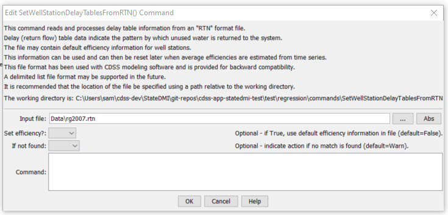

# StateDMI / Command / SetWellStationDelayTablesFromRTN #

* [Overview](#overview)
* [Command Editor](#command-editor)
* [Command Syntax](#command-syntax)
* [Examples](#examples)
* [Troubleshooting](#troubleshooting)
* [See Also](#see-also)

-------------------------

## Overview ##

The `SetWellStationDelayTablesFromRTN` command (for StateMod)
sets delay table data in existing well stations using information in an RTN format file,
which is a format that has been used in CDSS StateMod modeling.

## Command Editor ##

The following dialog is used to edit the command and illustrates the command syntax.

**<p style="text-align: center;">

</p>**

**<p style="text-align: center;">
`SetWellStationDelayTablesFromRTN` Command Editor (<a href="../SetWellStationDelayTablesFromRTN.png">see also the full-size image</a>)
</p>**

## Command Syntax ##

The command syntax is as follows:

```text
SetWellStationDelayTablesFromRTN(Parameter="Value",...)
```
**<p style="text-align: center;">
Command Parameters
</p>**

| **Parameter**&nbsp;&nbsp;&nbsp;&nbsp;&nbsp;&nbsp;&nbsp;&nbsp;&nbsp;&nbsp;&nbsp;&nbsp; | **Description** | **Default**&nbsp;&nbsp;&nbsp;&nbsp;&nbsp;&nbsp;&nbsp;&nbsp;&nbsp;&nbsp; |
| --------------|-----------------|----------------- |
| `InputFile`<br>**required** | The name of the RTN file to process.  Specify an absolute path or a path relative to the working directory. | None – must be specified. |
| `SetEfficiency` | Indicates whether the default efficiency value in the file should be used. | `False` |
| `IfNotFound` | Used for error handling, one of the following:<ul><li>`Fail` – generate a failure message if the ID is not matched</li><li>`Ignore` – ignore (don’t add and don’t generate a message) if the ID is not matched</li><li>`Warn` – generate a warning message if the ID is not matched</li></ul> | `Warn` |

## Examples ##

See the [automated tests](https://github.com/OpenCDSS/cdss-app-statedmi-test/tree/master/test/regression/commands/SetWellStationDelayTablesFromRTN).

A sample RTN file is shown below:

```
200511         2             75            1
              200742         1             1
              200742         99            2
200742         2             75            1
              200787         1             1
              200787         99            2
200752         2             75            1
              20ADW07        1             1
              20ADW07        99            2
```

The first line contains the station identifier, number of return flow locations, default efficiency for the station,
and the default delay table to use for the return.
For the number of return flow locations, the following lines indicate the identifier for the station to receive the return,
the percentage of the return to receive, and the delay table for the return.

## Troubleshooting ##

[See the main troubleshooting documentation](../../troubleshooting/troubleshooting.md)

## See Also ##

* [`SetWellStationDelayTablesFromNetwork`](../SetWellStationDelayTablesFromNetwork/SetWellStationDelayTablesFromNetwork.md) command
