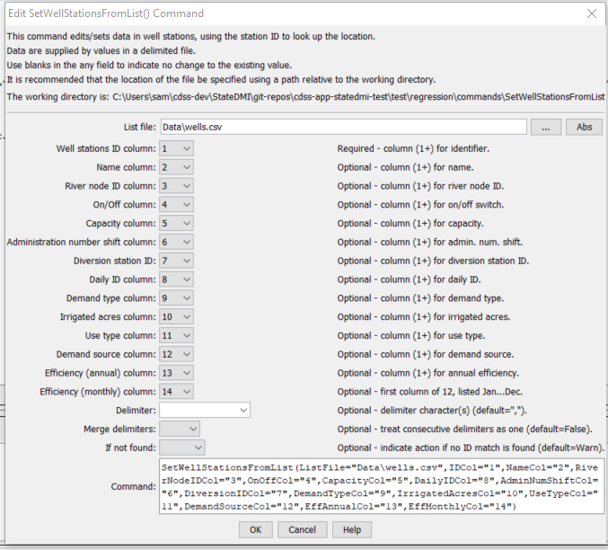

# StateDMI / Command / SetWellStationsFromList #

* [Overview](#overview)
* [Command Editor](#command-editor)
* [Command Syntax](#command-syntax)
* [Examples](#examples)
* [Troubleshooting](#troubleshooting)
* [See Also](#see-also)

-------------------------

## Overview ##

The `SetWellStationsFromList` command (for StateMod)
sets data in existing well stations (it currently will not add a station – use
[`ReadWellStationsFromList`](../ReadWellStationsFromList/ReadWellStationsFromList.md)).

## Command Editor ##

The following dialog is used to edit the command and illustrates the command syntax.

**<p style="text-align: center;">

</p>**

**<p style="text-align: center;">
`SetWellStationsFromList` Command Editor (<a href="../SetWellStationsFromList.png">see also the full-size image</a>)
</p>**

## Command Syntax ##

The command syntax is as follows:

```text
SetWellStationsFromList(Parameter="Value",...)
```
**<p style="text-align: center;">
Command Parameters
</p>**

| **Parameter**&nbsp;&nbsp;&nbsp;&nbsp;&nbsp;&nbsp;&nbsp;&nbsp;&nbsp;&nbsp;&nbsp;&nbsp;&nbsp;&nbsp;&nbsp;&nbsp;&nbsp;&nbsp;&nbsp;&nbsp; | **Description** | **Default**&nbsp;&nbsp;&nbsp;&nbsp;&nbsp;&nbsp;&nbsp;&nbsp;&nbsp;&nbsp;&nbsp;&nbsp;&nbsp;&nbsp;&nbsp;&nbsp;&nbsp;&nbsp;&nbsp;&nbsp; |
| --------------|-----------------|----------------- |
| `ListFile`<br>**required** | The name of the delimited input file to read.  Strings that include delimiter characters can be surrounded by double quotes in the list file.  Lines starting with # are treated as comments. | None – must be specified. |
| `IDCol` | The column number (1+) containing the well station identifiers. | If not specified, the original value will remain. |
| `NameCol` | The column number (1+) containing the well station names. | If not specified, the original value will remain. |
| `RiverNodeIDCol` | The column number (1+) containing the river node identifiers. | If not specified, the original value will remain. |
| `OnOffCol` | The column number (1+) containing the on/off switch. | If not specified, the original value will remain. |
| `CapacityCol` | The column number (1+) containing the capacity. | If not specified, the original value will remain. |
| `AdminNumShiftCol` | The column number (1+) containing the administration number shift value. | If not specified, the original value will remain. |
| `DiversionIDCol` | The column number (1+) containing the associated diversion identifier. | If not specified, the original value will remain. |
| `DailyIDCol` | The column number (1+) containing the daily identifier. | If not specified, the original value will remain. |
| `DemandTypeCol` | The column number (1+) containing the demand type. | If not specified, the original value will remain. |
| `IrrigatedAcresCol` | The column number (1+) containing the irrigated acres. | If not specified, the original value will remain. |
| `UseTypeCol` | The column number (1+) containing the use type. | If not specified, the original value will remain. |
| `DemandSourceCol` | The column number (1+) containing the demand source. | If not specified, the original value will remain. |
| `EffAnnualCol` | The column number (1+) containing the annual efficiency.  If the annual efficiency is specified, each monthly efficiency will be set to the annual value. | If not specified, the original value will remain.
| `EffMonthlyCol` | The column number (1+) containing the monthly efficiency for January.  The efficiencies for other months should be specified in columns that follow.  The annual efficiency is set to the average of the monthly efficiencies.  The efficiencies in the list file must be listed January to December as percent (0 to 100). The order of the values in the StateMod well stations will be according to the output year type set by [`SetOutputYearType`](../SetOutputYearType/SetOutputYearType.md), or calendar by default. | If not specified, the original values will remain. |
| `Delim` | The character(s) that delimits columns, or one of the literal words:<ul><li>`Space`</li><li>`Tab`</li><li>`Whitespace` – spaces and tabs.</li></ul> | , (comma) |
| `MergeDelim` | If True, then treat consecutive delimiter characters as one delimiter.  If False, separate columns will result. | `False` |
| `IfNotFound` | Used for error handling, one of the following:<ul><li>`Fail` – generate a failure message if the ID is not matched</li><li>`Ignore` – ignore (don’t add and don’t generate a message) if the ID is not matched</li><li>`Warn` – generate a warning message if the ID is not matched</li></ul> | `Warn` |

## Examples ##

See the [automated tests](https://github.com/OpenCDSS/cdss-app-statedmi-test/tree/master/test/regression/commands/SetWellStationsFromList).

The following example illustrates how to create well stations from a list file and then
set the efficiencies (in this case from a StateCU output file) from another list.
The full data line is trimmed of whitespace before processing and data in columns are automatically trimmed of whitespace after parsing.

```
StartLog(LogFile="commands.StateDMI.log")
ReadWellStationsFromList(ListFile="rgdssall.csv",IDCol="1")
SetWellStationsFromList(ListFile="rg2004.wef",IDCol="1",EffMonthlyCol="2",Delim="Space",MergeDelim=True,IfNotFound=Warn)
WriteWellStationsToStateMod(OutputFile="rgdssall.dds")
```

## Troubleshooting ##

## See Also ##

* [`FillWellStation`](../FillWellStation/FillWellStation.md) command
* [`ReadWellStationsFromList`](../ReadWellStationsFromList/ReadWellStationsFromList.md) command
* [`SetOutputYearType`](../SetOutputYearType/SetOutputYearType.md) command
* [`SetWellStation`](../SetWellStation/SetWellStation.md) command
* [`SetWellStationAreaToCropPatternTS`](../SetWellStationAreaToCropPatternTS/SetWellStationAreaToCropPatternTS.md) command
* [`SetWellStationCapacitiesFromTS`](../SetWellStationCapacitiesFromTS/SetWellStationCapacitiesFromTS.md) command
* [`SetWellStationCapacityToWellRights`](../SetWellStationCapacityToWellRights/SetWellStationCapacityToWellRights.md) command
