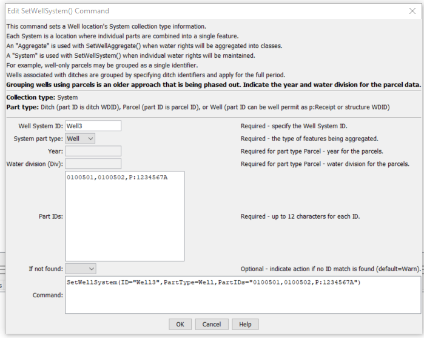

# StateDMI / Command / SetWellSystem #

* [Overview](#overview)
* [Command Editor](#command-editor)
* [Command Syntax](#command-syntax)
* [Examples](#examples)
* [Troubleshooting](#troubleshooting)
* [See Also](#see-also)

-------------------------

## Overview ##

The `SetWellSystem` command (for StateCU and StateMod) sets well system part identifier data
for:

* a CU Location that corresponds to a location with well supply
* or StateMod well station

Well systems are specified using a list of part identifiers as follows:

* **Part type is Ditch**
	+ The collection includes wells that are associated with a list of ditches,
	identified using ditch water district identifiers (WDIDs).  The list of ditches is used for the full period.
* **Part type is Parcel**
	+ The collection includes wells that are associated with a list of parcels.
	+ The division and year must be specified in the command because well to parcel relationships are determined for specific years.
	**This approach was used in the past for all basins but is being phased out and is currently only used for Rio Grande.
	It may also be phased out for the Rio Grande.**
* **Part type is Well**
	+ The collection includes wells identified by well WDID or well permit “receipt”.
	+ Receipts should be specified with a leading `P:` (e.g., `P:1234567A`)
	in which case the leading `P:` will be stripped and the remainder used for the receipt during processing.
	+ The internal part ID type will be set to WDID or Receipt, as appropriate.
	**This approach is being phased in and is preferred.**

To facilitate processing, it is often best to use list files to specific aggregates
(see the [`SetWellSystemFromList`](../SetWellSystemFromList/SetWellSystemFromList.md) command).
Systems by convention have their water rights fully represented in output.
To aggregate water rights at a location, use an aggregate
(see the similar [`SetWellAggregate`](../SetWellAggregate/SetWellAggregate.md) and
[`SetWellAggregateFromList`](../SetWellAggregateFromList/SetWellAggregateFromList.md) commands).
See also the [StateDMI Introduction](../../introduction/introduction.md) chapter,
which provides additional information about aggregates and other modeling conventions.
System information should be specified after well locations are defined and before their
use in other processing, such as reading data from HydroBase.

Well parcel data are queried in bulk when first requested and are cached to
speed later processing.  One level of caching is water district,
which is available for all wells.
The water district can be determined from a WDID but
well receipts require querying to match the receipt and then use the matching WD.
This step is performed when a system is defined so that later data access can use the WD.

## Command Editor ##

The following dialog is used to edit the command and illustrates the command syntax.

**<p style="text-align: center;">

</p>**

**<p style="text-align: center;">
`SetWellSystem` Command Editor (<a href="../SetWellSystem.png">see also the full-size image</a>)
</p>**

## Command Syntax ##

The command syntax is as follows:

```text
SetWellSystem(Parameter="Value",...)
```
**<p style="text-align: center;">
Command Parameters
</p>**

| **Parameter**&nbsp;&nbsp;&nbsp;&nbsp;&nbsp;&nbsp;&nbsp;&nbsp;&nbsp;&nbsp;&nbsp;&nbsp; | **Description** | **Default**&nbsp;&nbsp;&nbsp;&nbsp;&nbsp;&nbsp;&nbsp;&nbsp;&nbsp;&nbsp; |
| --------------|-----------------|----------------- |
| `ID` <br>**required** | The well identifier to associate with the collection of individual wells. | None – must be specified. |
| `PartType` <br>**required** | Indicate the type of features being aggregated and specified by `PartIDs`, one of:<ul><li>`Ditch` – the `PartIDs` (ditch WDIDs) indicate ditch service areas supplemented by wells.</li><li>`Parcel` – the `PartIDs` (parcel numbers from GIS processing) indicate parcels irrigated by wells, with no surface water supply.</li><li>`Well` – the `PartIDs` indicate wells (WDIDs or permit receipts), with no surface water supply.  Include `P:` at the start of receipt identifiers.</li></ul> | None – must be specified. |
| `Year` | The year defining the parcels. | Required when `PartType` is Parcel because parcel identifiers from well matching are specific to the data year. |
| `Div` | Water division for the parcels in the system. | Required when `PartType` is `Parcel` because parcels require the division. |
| `PartIDs` | The list of part identifiers to comprise the system. | None – must be specified. |
| `IfNotFound` | Used for error handling, one of the following:<ul><li>`Fail` – generate a failure message if the identifier is not matched</li><li>`Ignore` – ignore (don’t add and don’t generate a message) if the identifier is not matched</li><li>`Warn` – generate a warning message if the identifier is not matched</li></ul> | `Warn` |

## Examples ##

See the [automated tests](https://github.com/OpenCDSS/cdss-app-statedmi-test/tree/master/test/regression/commands/SetDiversionSystem).

## Troubleshooting ##

## See Also ##

* [`SetWellAggregate`](../SetWellAggregate/SetWellAggregate.md) command
* [`SetWellSystemFromList`](../SetWellSystemFromList/SetWellSystemFromList.md) command
