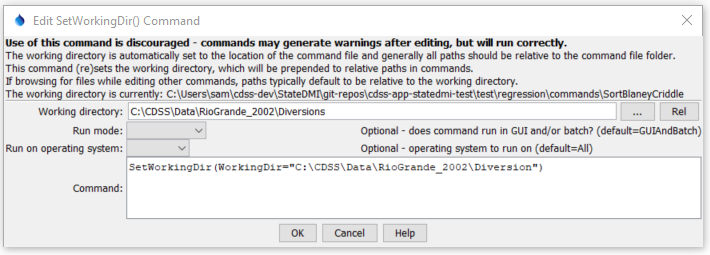

# StateDMI / Command / SetWorkingDir #

* [Overview](#overview)
* [Command Editor](#command-editor)
* [Command Syntax](#command-syntax)
* [Examples](#examples)
* [Troubleshooting](#troubleshooting)
* [See Also](#see-also)

-------------------------

## Overview ##

The `SetWorkingDir` command
is used to define the working directory for a set of commands.
The working directory, when set properly, can greatly simplify commands files
because relative file paths can be used for input and output.
The working directory is normally set in one of the following ways,
with the current setting being defined by the most recent item that has occurred:

1. The startup directory for the StateDMI program,
2. The directory where a commands file was opened,
3. The directory where a commands file was saved,
4. The directory specified by a `SetWorkingDir` command,
5. The directory specified by ***File / Set Working Directory***.

In most cases, a `SetWorkingDir` command is not needed.
However, for complicated command files, it may be necessary to change the working directory from one directory to another.
Setting the working directory to an absolute path causes all relative paths for input and output files to be appended to the working directory

## Command Editor ##

The following dialog is used to edit the command and illustrates the command syntax.

**<p style="text-align: center;">

</p>**

**<p style="text-align: center;">
`SetWorkingDir` Command Editor (<a href="../SetWorkingDir.png">see also the full-size image</a>)
</p>**

## Command Syntax ##

The command syntax is as follows:

```text
SetWorkingDir(Parameter="Value",...)
```
**<p style="text-align: center;">
Command Parameters
</p>**

| **Parameter**&nbsp;&nbsp;&nbsp;&nbsp;&nbsp;&nbsp;&nbsp;&nbsp;&nbsp;&nbsp;&nbsp;&nbsp; | **Description** | **Default**&nbsp;&nbsp;&nbsp;&nbsp;&nbsp;&nbsp;&nbsp;&nbsp;&nbsp;&nbsp; |
| --------------|-----------------|----------------- |
| `WorkingDir`<br>**required** | Working directory for the software, with which relative paths are converted into absolute paths. | None – must be specified. |

## Examples ##

See the [automated tests](https://github.com/OpenCDSS/cdss-app-statedmi-test/tree/master/test/regression/commands/SetWorkingDir).

## Troubleshooting ##

[See the main troubleshooting documentation](../../troubleshooting/troubleshooting.md)

## See Also ##

There are no additional related commands.