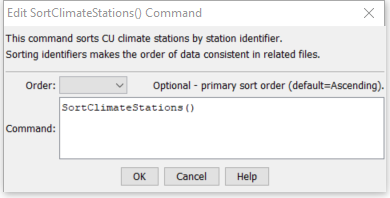

# StateDMI / Command / SortClimateStations #

* [Overview](#overview)
* [Command Editor](#command-editor)
* [Command Syntax](#command-syntax)
* [Examples](#examples)
* [Troubleshooting](#troubleshooting)
* [See Also](#see-also)

-------------------------

## Overview ##

The `SortClimateStations` command (for StateCU)
sorts the climate stations using the station identifiers.

## Command Editor ##

The following dialog is used to edit the command and illustrates the command syntax.

**<p style="text-align: center;">

</p>**

**<p style="text-align: center;">
`SortClimateStations` Command Editor (<a href="../SortClimateStations.png">see also the full-size image</a>)
</p>**

## Command Syntax ##

The command syntax is as follows:

```text
SortClimateStations(Parameter="Value",...)
```
**<p style="text-align: center;">
Command Parameters
</p>**

| **Parameter**&nbsp;&nbsp;&nbsp;&nbsp;&nbsp;&nbsp;&nbsp;&nbsp;&nbsp;&nbsp;&nbsp;&nbsp; | **Description** | **Default**&nbsp;&nbsp;&nbsp;&nbsp;&nbsp;&nbsp;&nbsp;&nbsp;&nbsp;&nbsp; |
| --------------|-----------------|----------------- |
| `Order` | Indicate the sort order.  Currently only` Ascending` is supported. | `Ascending` |

## Examples ##

See the [automated tests](https://github.com/OpenCDSS/cdss-app-statedmi-test/tree/master/test/regression/commands/SortClimateStations).

The following example command file illustrates how climate stations can be defined, sorted, and written to a StateCU file:

```
ReadClimateStationsFromList(ListFile="climsta.lst",IDCol=1)
FillClimateStationsFromHydroBase(ID="*")
SetClimateStation(ID="3016",Region2="14080106",IfNotFound=Warn)
SetClimateStation(ID="1018",Region2="14040106",IfNotFound=Warn)
SetClimateStation(ID="1928",Elevation=6440,IfNotFound=Warn)
SetClimateStation(ID="0484",Region1="MOFFAT",IfNotFound=Add)
SortClimateStations()
WriteClimateStationsToStateCU(OutputFile="COclim2006.cli")
```

## Troubleshooting ##

[See the main troubleshooting documentation](../../troubleshooting/troubleshooting.md)

## See Also ##

There are no additional related commands.