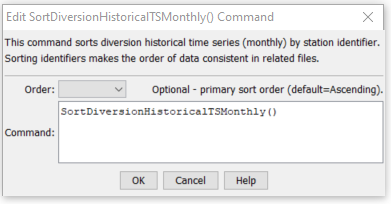

# StateDMI / Command / SortDiversionHistoricalTSMonthly #

* [Overview](#overview)
* [Command Editor](#command-editor)
* [Command Syntax](#command-syntax)
* [Examples](#examples)
* [Troubleshooting](#troubleshooting)
* [See Also](#see-also)

-------------------------

## Overview ##

The `SortDiversionHistoricalTSMonthly` command (for StateMod)
command sorts the diversion historical time series (monthly) in alphabetical order,
using the time series identifier (typically by the location since the location will vary between time series).
This command is useful if time series have been added during processing and
therefore the time series order no longer agrees with the diversion station order.

## Command Editor ##

The following dialog is used to edit the command and illustrates the command syntax.

**<p style="text-align: center;">

</p>**

**<p style="text-align: center;">
`SortDiversionHistoricalTSMonthly` Command Editor (<a href="../SortDiversionHistoricalTSMonthly.png">see also the full-size image</a>)
</p>**

## Command Syntax ##

The command syntax is as follows:

```text
SortDiversionHistoricalTSMonthly(Parameter="Value",...)
```
**<p style="text-align: center;">
Command Parameters
</p>**

| **Parameter**&nbsp;&nbsp;&nbsp;&nbsp;&nbsp;&nbsp;&nbsp;&nbsp;&nbsp;&nbsp;&nbsp;&nbsp; | **Description** | **Default**&nbsp;&nbsp;&nbsp;&nbsp;&nbsp;&nbsp;&nbsp;&nbsp;&nbsp;&nbsp; |
| --------------|-----------------|----------------- |
| `Order` | Indicate the order for the sort.  Currently only `Ascending` is supported.  The older `Alphabetical` is automatically converted to `Ascending`. | `Ascending` |

## Examples ##

See the [automated tests](https://github.com/OpenCDSS/cdss-app-statedmi-test/tree/master/test/regression/commands/SortDiversionHistoricalTSMonthly).

## Troubleshooting ##

## See Also ##
