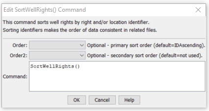

# StateDMI / Command / SortWellRights #

* [Overview](#overview)
* [Command Editor](#command-editor)
* [Command Syntax](#command-syntax)
* [Examples](#examples)
* [Troubleshooting](#troubleshooting)
* [See Also](#see-also)

-------------------------

## Overview ##

The `SortWellRights` command (for StateMod)
sorts the well rights.  This is useful to enforce consistency between files and simplify file comparison.

## Command Editor ##

The following dialog is used to edit the command and illustrates the command syntax.

**<p style="text-align: center;">

</p>**

**<p style="text-align: center;">
`SortWellRights` Command Editor (<a href="../SortWellRights.png">see also the full-size image</a>)
</p>**

## Command Syntax ##

The command syntax is as follows:

```text
SortWellRights(Parameter="Value",...)
```
**<p style="text-align: center;">
Command Parameters
</p>**

| **Parameter**&nbsp;&nbsp;&nbsp;&nbsp;&nbsp;&nbsp;&nbsp;&nbsp;&nbsp;&nbsp;&nbsp;&nbsp; | **Description** | **Default**&nbsp;&nbsp;&nbsp;&nbsp;&nbsp;&nbsp;&nbsp;&nbsp;&nbsp;&nbsp; |
| --------------|-----------------|----------------- |
| `Order` | Indicate the primary sort order, one of:<ul><li>`IDAscending`</li><li>`LocationIDAscending` (typically specified)</li><li>`IDAscending`</li></ul> |
| `Order2` | Indicate the secondary sort order, one of:<ul><li>`IDAscending` (typically specified)</li><li>`LocationIDAscending`</li></ul> | None – must be specified.  Typically `IDAscending` is specified. |

## Examples ##

See the [automated tests](https://github.com/OpenCDSS/cdss-app-statedmi-test/tree/master/test/regression/commands/SortWellRights).

## Troubleshooting ##

## See Also ##
