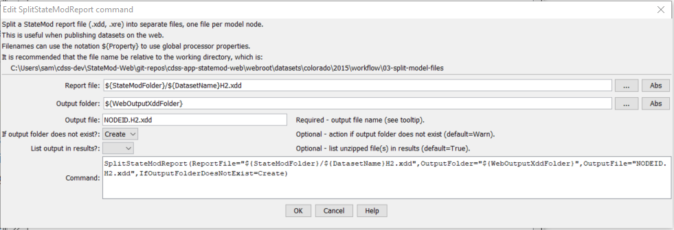

# StateDMI / Command / SplitStateModReport #

* [Overview](#overview)
* [Command Editor](#command-editor)
* [Command Syntax](#command-syntax)
* [Examples](#examples)
* [Troubleshooting](#troubleshooting)
* [See Also](#see-also)

-------------------------

## Overview ##

The `SplitStateModReport` command
splits a StateMod report file into separate files for each model node identifier.
This output can be used to publish datasets on the web,
so that reports are of manageable size and load quickly in a web browser.

## Command Editor ##

The following dialog is used to edit the command and illustrates the command syntax.

**<p style="text-align: center;">

</p>**

**<p style="text-align: center;">
`SplitStateModReport` Command Editor (<a href="../SplitStateModReport.png">see also the full-size image</a>)
</p>**

## Command Syntax ##

The command syntax is as follows:

```text
SplitStateModReport(Parameter="Value",...)
```
**<p style="text-align: center;">
Command Parameters
</p>**

| **Parameter**&nbsp;&nbsp;&nbsp;&nbsp;&nbsp;&nbsp;&nbsp;&nbsp;&nbsp;&nbsp;&nbsp;&nbsp;&nbsp;&nbsp;&nbsp;&nbsp;&nbsp;&nbsp;&nbsp;&nbsp;&nbsp;&nbsp;&nbsp;&nbsp;&nbsp;&nbsp;&nbsp;&nbsp;&nbsp;&nbsp;&nbsp;&nbsp;&nbsp;&nbsp;&nbsp;&nbsp;&nbsp;&nbsp; | **Description** | **Default**&nbsp;&nbsp;&nbsp;&nbsp;&nbsp;&nbsp;&nbsp;&nbsp;&nbsp;&nbsp; |
| --------------|-----------------|----------------- |
| `ReportFile`<br>**required** | The relative or absolute path to the report file. `${Property}` syntax is recognized. | None – must be specified. |
| `OutputFolder`<br>**required** | The relative or absolute path to the report file. `${Property}` syntax is recognized. | None – must be specified. |
| `OutputFile`<br>**required** | The output file name pattern.  Use `NODEID` to indicate the station node ID, which will be replaced with the actual node identifier in the output file name.  `${Property}` syntax is recognized. | None – must be specified. |
| `IfOutputFolderDoesNotExist` | Action to take if the output folder does not exist:<ul><li>`Create` - create the folder and if necessary any parent folders</li><li>`Warn` - generate a warning message and do not continue running the command</li><li>`Fail` - generate a failure message and do not continue running the command</li></ul> | `Warn` |
| `ListInResults` | Whether to list output files in the TSTool ***Results*** area. This can lead to a large number of files being listed, but does allow the files to be selected from TSTool for viewing. | `True` |

## Examples ##

See the [automated tests](https://github.com/OpenCDSS/cdss-app-statedmi-test/tree/master/test/regression/commands/SplitStateModReport).

## Troubleshooting ##

## See Also ##

