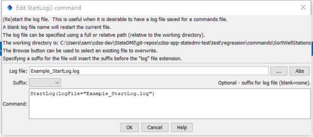

# StateDMI / Command / StartLog #

* [Overview](#overview)
* [Command Editor](#command-editor)
* [Command Syntax](#command-syntax)
* [Examples](#examples)
* [Troubleshooting](#troubleshooting)
* [See Also](#see-also)

-------------------------

## Overview ##

The `StartLog` command
(re)starts the log file.  It is useful to insert this command as the first command in a command file,
in order to persistently record the results of processing.
A useful standard is to name the log file the same as the command file, with an additional `.log` extension,
and this convention is enforced by default.  A date or date/time can optionally be added to the log file name.

## Command Editor ##

The following dialog is used to edit the command and illustrates the command syntax.

**<p style="text-align: center;">

</p>**

**<p style="text-align: center;">
`StartLog` Command Editor (<a href="../StartLog.png">see also the full-size image</a>)
</p>**

## Command Syntax ##

The command syntax is as follows:

```text
StartLog(Parameter="Value",...)
```
**<p style="text-align: center;">
Command Parameters
</p>**

| **Parameter**&nbsp;&nbsp;&nbsp;&nbsp;&nbsp;&nbsp;&nbsp;&nbsp;&nbsp;&nbsp;&nbsp;&nbsp; | **Description** | **Default**&nbsp;&nbsp;&nbsp;&nbsp;&nbsp;&nbsp;&nbsp;&nbsp;&nbsp;&nbsp; |
| --------------|-----------------|----------------- |
| `LogFile` | The name of the log file to write surrounded by double quotes.  The extension of `.log` will automatically be added, if not specified. | If not specified, the existing file will be restarted. |
| `Suffix` | Indicates that a suffix will be added before the `.log` extension, one of:<ul><li>`Date` – add a date suffix of the form `YYYYMMDD`.</li><li>`DateTime` – add a date/time suffix of the form `YYYYMMDD_HHMMSS`.</li></ul><br>This is useful for automatically archiving logs corresponding to commands files, to allow checking the output at a later time.  However, generating date/time stamped log files can increase the amount of disk space that is used. | Do not add the suffix. |

## Examples ##

See the [automated tests](https://github.com/OpenCDSS/cdss-app-statedmi-test/tree/master/test/regression/commands/StartLog).

## Troubleshooting ##

## See Also ##

* [`SetDebugLevel`](../SetDebugLevel/SetDebugLevel.md) command
* [`SetWarningLevel`](../SetWarningLevel/SetWarningLevel.md) command
