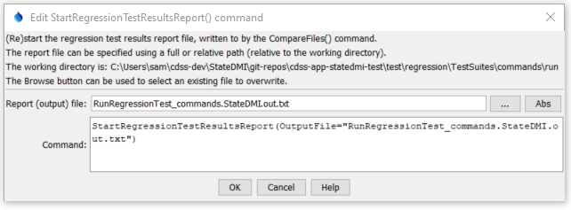

# StateDMI / Command / StartRegressionTestResultsReport #

* [Overview](#overview)
* [Command Editor](#command-editor)
* [Command Syntax](#command-syntax)
* [Examples](#examples)
* [Troubleshooting](#troubleshooting)
* [See Also](#see-also)

-------------------------

## Overview ##

The `StartRegressionTestResultsReport` command
starts a report file to be written to as regression tests are run.
The [`CreateRegressionTestCommandFile`](../CreateRegressionTestCommandFile/CreateRegressionTestCommandFile.md)
automatically inserts this command.  The
[`CompareFiles`](../CompareFiles/CompareFiles.md)
command will write to this file if it is available.

## Command Editor ##

The following dialog is used to edit the command and illustrates the command syntax.

**<p style="text-align: center;">

</p>**

**<p style="text-align: center;">
`StartRegressionTestResultsReport` Command Editor (<a href="../StartRegressionTestResultsReport.png">see also the full-size image</a>)
</p>**

## Command Syntax ##

The command syntax is as follows:

```text
StartRegressionTestResultsReport(Parameter="Value",...)
```
**<p style="text-align: center;">
Command Parameters
</p>**

| **Parameter**&nbsp;&nbsp;&nbsp;&nbsp;&nbsp;&nbsp;&nbsp;&nbsp;&nbsp;&nbsp;&nbsp;&nbsp; | **Description** | **Default**&nbsp;&nbsp;&nbsp;&nbsp;&nbsp;&nbsp;&nbsp;&nbsp;&nbsp;&nbsp; |
| --------------|-----------------|----------------- |
| `OutputFile`<br>**required** | The name of the report file, enclosed in double quotes if the file contains spaces or other special characters.  A path relative to the command file can be specified. | None – must be specified. |

## Examples ##

See the [automated tests](https://github.com/OpenCDSS/cdss-app-statedmi-test/tree/master/test/regression/commands/StartRegressionTestResultsReport).

See the [`RunCommands`](../RunCommands/RunCommands.md) documentation for how to set up a regression test.
The following command file illustrates how to start the results report:

```
StartRegressionTestResultsReport(OutputFile="RunRegressionTest_commands_general.StateDMI.out.txt")
...
RunCommands(InputFile="..\..\..\commands\ReadClimateStationsFromList\Test_ReadClimateStationsFromList.StateDMI")
...
```

Each of the above command files should produce expected time series results, without warnings.
If any command file unexpectedly produces a warning, a warning will also be visible in StateDMI.
The issue can then be evaluated to determine whether a software or configuration change is necessary.

## Troubleshooting ##

## See Also ##

* [`CreateRegressionTestCommandFile`](../CreateRegressionTestCommandFile/CreateRegressionTestCommandFile.md) command
* [`CompareFiles`](../CompareFiles/CompareFiles.md) command
