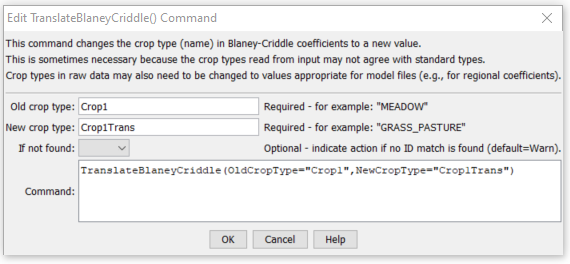

# StateDMI / Command / TranslateBlaneyCriddle #

* [Overview](#overview)
* [Command Editor](#command-editor)
* [Command Syntax](#command-syntax)
* [Examples](#examples)
* [Troubleshooting](#troubleshooting)
* [See Also](#see-also)

-------------------------

## Overview ##

The `TranslateBlaneyCriddle` command (for StateCU)
command translates Blaney-Criddle data.  In particular, it converts one crop type to another.  Primary uses of the command are:

1. A data source may use one variant of the crop type (e.g.,
`ORCHARD W/O COVER` but the rest of a StateCU data set uses another type (e.g., `ORCHARD_WO_COVER`).
In this case the command is used simply to change the spelling of a crop type.
2. The raw crop data may need to be adjusted to reflect differences in crops, for modeling purposes.
For example, the original data may identify pasture (e.g., `GRASS_PASTURE`)
but for modeling the crop type is set to a different value (e.g., `GRASS_PASTURE_HA`) for high altitude coefficients.
The following example illustrates a command of this type.

## Command Editor ##

The following dialog is used to edit the command and illustrates the command syntax.

**<p style="text-align: center;">

</p>**

**<p style="text-align: center;">
`TranslateBlaneyCriddle` Command Editor (<a href="../TranslateBlaneyCriddle.png">see also the full-size image</a>)
</p>**

## Command Syntax ##

The command syntax is as follows:

```text
TranslateBlaneyCriddle(Parameter="Value",...)
```
**<p style="text-align: center;">
Command Parameters
</p>**

| **Parameter**&nbsp;&nbsp;&nbsp;&nbsp;&nbsp;&nbsp;&nbsp;&nbsp;&nbsp;&nbsp;&nbsp;&nbsp; | **Description** | **Default**&nbsp;&nbsp;&nbsp;&nbsp;&nbsp;&nbsp;&nbsp;&nbsp;&nbsp;&nbsp; |
| --------------|-----------------|----------------- |
| `OldCropType`<br>**required** | A single crop type identifier to match.  This crop type will be replaced with the value for `NewCropType`. | None – must be specified. |
| `NewCropType` | The new crop type to use. | None – must be specified. |

## Examples ##

See the [automated tests](https://github.com/OpenCDSS/cdss-app-statedmi-test/tree/master/test/regression/commands/TranslateBlaneyCriddle).

The following simple example illustrates how to translate a crop type:
```
ReadBlaneyCriddleFromHydroBase(BlaneyCriddleMethod="BLANEY-CRIDDLE_TR-21")
TranslateBlaneyCriddle(OldCropType="GRASS_PASTURE.TR21",NewCropType="GRASS_PASTURE")
```

## Troubleshooting ##

[See the main troubleshooting documentation](../../troubleshooting/troubleshooting.md)

## See Also ##

There are no additional related commands.