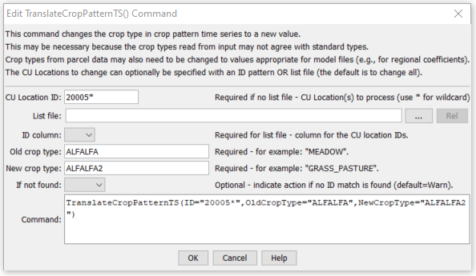

# StateDMI / Command / TranslateCropPatternTS #

* [Overview](#overview)
* [Command Editor](#command-editor)
* [Command Syntax](#command-syntax)
* [Examples](#examples)
* [Troubleshooting](#troubleshooting)
* [See Also](#see-also)

-------------------------

## Overview ##

The `TranslateCropPatternTS` command (for StateCU)
command translates crop pattern time series data.
In particular, it converts one crop type to another.  Primary uses of the command are:

1. A data source may be using one variant of the crop type (e.g., `ORCHARD W/O COVER` but
the rest of a StateCU data set uses another type (e.g., `ORCHARD_WO_COVER`).
In this case the command is used simply to change the spelling of a crop type.
2. The raw crop data may need to be adjusted to reflect differences in crops, for modeling purposes.
For example, the original data may identify pasture (e.g., `ALFALFA`) but for
modeling the crop type is set to a different value (e.g., `ALFALFA.CCRG`) for high altitude coefficients.
The following example illustrates a command of this type,
using a list file to provide location identifiers at which crop types should be adjusted for the
high-altitude crop coefficients (by translating to a different crop type).

If the new crop name is the same as an existing crop name, the time series will be combined to give new totals for the crop.

## Command Editor ##

The following dialog is used to edit the command and illustrates the command syntax.

**<p style="text-align: center;">

</p>**

**<p style="text-align: center;">
`TranslateCropPatternTS` Command Editor (<a href="../TranslateCropPatternTS.png">see also the full-size image</a>)
</p>**

## Command Syntax ##

The command syntax is as follows:

```text
TranslateCropPatternTS(Parameter="Value",...)
```
**<p style="text-align: center;">
Command Parameters
</p>**

| **Parameter**&nbsp;&nbsp;&nbsp;&nbsp;&nbsp;&nbsp;&nbsp;&nbsp;&nbsp;&nbsp;&nbsp;&nbsp; | **Description** | **Default**&nbsp;&nbsp;&nbsp;&nbsp;&nbsp;&nbsp;&nbsp;&nbsp;&nbsp;&nbsp; |
| --------------|-----------------|----------------- |
| `ID`<br>**required** | A single CU Location identifier to match or a pattern using wildcards (e.g., `20*`). | None – must be specified. |
| `ListFile` | The name of an input file to read, surrounded by double quotes. | If not specified, crop patterns for all locations will be processed. |
| `IDCol` | If ListFile is specified, this parameter specifies the column number (1+) containing the CU Location identifiers. | None – must be specified. |
| `OldCropType`<br>**required** | A single crop type identifier to match.  This crop type will be replaced with the value for `NewCropType`. | None – must be specified. |
| `NewCropType`<br>**required** | The new crop type to use. | None – must be specified. |
| `IfNotFound` | Used for error handling, one of the following:<ul><li>`Fail` – generate a failure message if the ID is not matched</li><li>`Ignore` – ignore (don’t add and don’t generate a message) if the ID is not matched</li><li>`Warn` – generate a warning message if the ID is not matched</li></ul> | `Warn` |

## Examples ##

See the [automated tests](https://github.com/OpenCDSS/cdss-app-statedmi-test/tree/master/test/regression/commands/TranslateCropPatternTS).

The following command file illustrates how to create a crop pattern time series file:

```
# Step 1 - Set output period and read CU locations
SetOutputPeriod(OutputStart="1950",OutputEnd="2006")
ReadCULocationsFromStateCU(InputFile="..\StateCU\cm2006.str")
# Step 2 - Read SW aggregates
SetDiversionSystemFromList(ListFile="colorado_divsys.csv",IDCol=1,NameCol=2,PartIDsCol=3,PartsListedHow=InRow)
SetDiversionAggregateFromList(ListFile="colorado_agg.csv",IDCol=1,NameCol=2,PartIDsCol=3,PartsListedHow=InRow)
# Step 3 - Create *.cds file form and read acreage/crops from HydroBase
CreateCropPatternTSForCULocations(ID="*",Units="ACRE")
ReadCropPatternTSFromHydroBase(ID="*")
# Step 4 - Need to translate crops out of HB to include TR21 suffix
# Translate all crops from HB to include .TR21 suffix
TranslateCropPatternTS(ID="*",OldCropType="GRASS_PASTURE",NewCropType="GRASS_PASTURE.TR21")
TranslateCropPatternTS(ID="*",OldCropType="CORN_GRAIN",NewCropType="CORN_GRAIN.TR21")
TranslateCropPatternTS(ID="*",OldCropType="ALFALFA",NewCropType="ALFALFA.TR21")
...similar commands omitted...
# Step 5 - Translate crop names
# use high-altitude coefficients for structures with more than 50% of
# irrigated acreage above 6500 feet
TranslateCropPatternTS(ListFile="cm2005_HA.lst",IDCol=1,OldCropType="GRASS_PASTURE.TR21",NewCropType="GRASS_PASTURE.DWHA")
# Step 6 - Fill Acreage
#      Fill SW structure acreage backword from 1999 to 1950
#      Fill acreage forward for all structures from 2000 to 2006
FillCropPatternTSRepeat(ID="*",CropType="*",FillStart=1950,FillEnd=1993,FillDirection=Backward)
FillCropPatternTSRepeat(ID="*",CropType="*",FillStart=1993,FillEnd=1999,FillDirection=Forward)
FillCropPatternTSRepeat(ID="*",CropType="*",FillStart=2000,FillEnd=2006,FillDirection=Forward)
# Step 7 - Write final *.cds file
WriteCropPatternTSToStateCU(OutputFile="..\StateCU\cm2006.cds",WriteCropArea=True,WriteHow=OverwriteFile)
# Check the results
CheckCropPatternTS(ID="*")
WriteCheckFile(OutputFile="cm2006.cds.StateDMI.check.html")
```

## Troubleshooting ##

[See the main troubleshooting documentation](../../troubleshooting/troubleshooting.md)

## See Also ##
[`RemoveCropPatternTS`](../RemoveCropPatternTS/RemoveCropPatternTS.md) command
