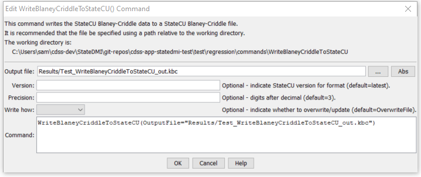

# StateDMI / Command / WriteBlaneyCriddleToStateCU #

* [Overview](#overview)
* [Command Editor](#command-editor)
* [Command Syntax](#command-syntax)
* [Examples](#examples)
* [Troubleshooting](#troubleshooting)
* [See Also](#see-also)

-------------------------

## Overview ##

The `WriteBlaneyCriddleToStateCU` command (for StateCU)
writes Blaney-Criddle crop coefficients that have been defined to a StateCU Blaney-Criddle crop coefficients file.

## Command Editor ##

The following dialog is used to edit the command and illustrates the command syntax.

**<p style="text-align: center;">

</p>**

**<p style="text-align: center;">
`WriteBlaneyCriddleToStateCU` Command Editor (<a href="../WriteBlaneyCriddleToStateCU.png">see also the full-size image</a>)
</p>**

## Command Syntax ##

The command syntax is as follows:

```text
WriteBlaneyCriddleToStateCU(Parameter="Value",...)
```
**<p style="text-align: center;">
Command Parameters
</p>**

| **Parameter**&nbsp;&nbsp;&nbsp;&nbsp;&nbsp;&nbsp;&nbsp;&nbsp;&nbsp;&nbsp;&nbsp;&nbsp; | **Description** | **Default**&nbsp;&nbsp;&nbsp;&nbsp;&nbsp;&nbsp;&nbsp;&nbsp;&nbsp;&nbsp; |
| --------------|-----------------|----------------- |
| `OutputFile`<br>**required** | The name of the output file to write, surrounded by double quotes. | None – must be specified. |
| `Version` | The StateCU version, indicating the version of the file format to write. | Write the most current version format. |
| `Precision` | The number of digits after the decimal for curve values, used for backward compatibility with older file versions. | `3` |
| `WriteHow` | `OverwriteFile` if the file should be overwritten or `UpdateFile` if the file should be updated, resulting in the previous header being carried forward. | `OverwriteFile` |

## Examples ##

See the [automated tests](https://github.com/OpenCDSS/cdss-app-statedmi-tree/tree/master/test/regression/commands/WriteBlaneyCriddleToStateCU).

The following example command file illustrates how to read Blaney-Criddle coefficients from HydroBase, sort the data, create a StateCU file, and check the results:

```
StartLog(LogFile="Crops_KBC.StateDMI.log")
#
# StateDMI commands to create the Rio Grande Blaney-Criddle coefficients File
#
# History:
#
# 2004-03-16 Steven A. Malers, RTi  Initial version using StateDMI.
# 2007-04-23 SAM, RTi               Update for Rio Grande Phase 5.
#
# Step 1 - read data from HydroBase
#
# Read the general Blaney-Criddle coefficients first and then override with Rio Grande
# data.
ReadBlaneyCriddleFromHydroBase(BlaneyCriddleMethod="BLANEY-CRIDDLE_TR-21")
ReadBlaneyCriddleFromHydroBase(BlaneyCriddleMethod="BLANEY-CRIDDLE_RIO_GRANDE")
#
# Step 3 - write the file
#
SortBlaneyCriddle(Order=Ascending)
WriteBlaneyCriddleToStateCU(OutputFile="rg2007.kbc")
#
# Check the results
#
CheckBlaneyCriddle(ID="*")
WriteCheckFile(OutputFile="rg2007.kbc.check.html")
```

## Troubleshooting ##

## See Also ##

* [`ReadBlaneyCriddleFromList`](../ReadBlaneyCriddleFromList/ReadBlaneyCriddleFromList.md) command
* [`WriteBlaneyCriddleToStateCU`](../WriteBlaneyCriddleToStateCU/WriteBlaneyCriddleToStateCU.md) command
