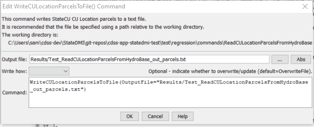

# StateDMI / Command / WriteCULocationParcelsToFile #

* [Overview](#overview)
* [Command Editor](#command-editor)
* [Command Syntax](#command-syntax)
* [Examples](#examples)
* [Troubleshooting](#troubleshooting)
* [See Also](#see-also)

-------------------------

## Overview ##

**This command is under development.**

The `WriteCULocationParcelsToFile` command (for StateCU) writes parcels and related supply data to a text file report.

The parcel and water supply data model is created using the
[`ReadCULocationParcelsFromHydroBase`](../ReadCULocationParcelsFromHydroBase/ReadCULocationParcelsFromHydroBase.md) command.
The following is an example of the report file, for explicit diversion (`DIV`), commingled supply (`D&W`),
groundwater-only supply (`WEL`).

```
#> ***************************************************************************************************
#>  StateDMI CU Location Parcel File - this is a diagnostics report
#>  - this report shows the relationships between a parcel and supplies for the parcel.
#>  - the underlying data can be used for *.cds, *.ipy, and *.wer files.
#>
#>  Model ID - StateCU location and node type
#>  --------------------------------------------------------------------------------------------------
#>  LocId        :  CU Location ID surface water data
#>  LocType      :  Location type (DIV, D&W, or WEL)
#>
#>  Parcel Data - GIS loaded into HydroBase
#>  --------------------------------------------------------------------------------------------------
#>  Year         :  Calendar year for parcel
#>  Crop         :  Crop type for parcel (1 crop per parcel)
#>  ParcelArea   :  Parcel area for crop
#>  Units        :  Area units
#>  IrrigMeth    :  Irrigation method
#>  ParcelId     :  Parcel identifier
#>
#>  Whether or not the row of data is included - need to expand this to indicate how included or not
#>  --------------------------------------------------------------------------------------------------
#>  DataSrc      :  Data source (typically from HydroBase but may enable user-supplied data).
#>                  HB-PUTS = HydroBase ParcelUseTS/Structure
#>                  HB-WTP = HydroBase Well to Parcel
#>  CDS?         :  Indicates whether the parcel is included in CDS file acreage.
#>                  CDS:YES = include in CDS area for the location
#>                  CDS:NO = do not include - for GW supply in D&W, will be included in the Div node acreage
#>
#>  SW Collection Data - surface water aggregate/system data
#>  --------------------------------------------------------------------------------------------------
#>  SWPartType   :  Surface water supply part type (only is allowed Ditch).
#>  SWPartIdType :  Surface water supply part ID type (only WDID is allowed).
#>
#>  SW Supply Data - portion of parcel acreage associated with surface water supply
#>  --------------------------------------------------------------------------------------------------
#>  %Irrig       :  Percent of ParcelArea (from above) that is irrigated by the ditch.
#>  SWIrrigArea  :  ParcelArea * %Irrig.
#>
#>  GW Collection Data - groundwater aggregate/system data
#>  --------------------------------------------------------------------------------------------------
#>  GWPartType   :  Water supply part type (Well or Parcel, the latter being phased out).
#>                  WellInDitch = indicates a collection of ditches, with associated wells determined automatically.
#>                  Well = indicates a collection of wells specified using well identifiers.
#>                  Parcel = indicates a collection of wells specified using parcel identifiers.
#>  GWPartIdType :  Water supply part ID type (WDID or RECEIPT).
#>                  If GWPartType=Well, WDID or RECEIPT.
#>                  If GWPartType=Parcel, Parcel.
#>  WDID         :  WDID of part if GWPartIdType=WDID.
#>  Receipt      :  Receipt of part if GWPartIdType=RECEIPT.
#>
#>  GW Supply Data - portion of parcel acreage associated with groundwater supply
#>  --------------------------------------------------------------------------------------------------
#>  #Wells       :  Number of wells that are associated with ParcelId.
#>  GWIrrigArea  :  ParcelArea/#Wells, zero if area is already assigned to surface water ID for D&W node.
#>
#>----- Model Id ----|----------------------------- Parcel Data --------------------------||                 ||---- SW Collection Data ----|- SW Suppply Data -|------------- GW Collection Data ----------|-- GW Supply Data -|
#>  LocId     LocType|Year        Crop          ParcelArea Units IrrigMeth    ParcelId    || DataSrc    CDS? ||SWPartType SWPartIdType WDID| %Irrig SWIrrigArea| GWPartType  GWPartIdType   WDID   Receipt | #Wells|GWIrrigArea|
#>b--------exb------exb--exb------------------exb--------exb--exb--------exb-------------exb--------exb------exb--------exb------exb------exb------exb--------exb----------exb--------exb------exb--------exb------exb--------e
#>EndHeader
#>
6600502      ???      2010 ALFALFA                  15.586 acre FLOOD             26619927 HB-PUTS
                                                                                           HB-PUTS    CDS:YES  Ditch      WDID     6600502     1.000     15.586
6600502      ???      2015 GRASS_PASTURE            11.392 acre FLOOD             26620536 HB-PUTS
                                                                                           HB-PUTS    CDS:YES  Ditch      WDID     6600502     1.000     11.392
6600502      ???      2015 ALFALFA                  13.199 acre FLOOD             26620537 HB-PUTS
                                                                                           HB-PUTS    CDS:YES  Ditch      WDID     6600502     1.000     13.199
6700607D     ???      2010 ALFALFA                  87.422 acre FLOOD             26707716 HB-PUTS   
                                                                                           HB-PUTS    CDS:YES  Ditch      WDID     6700607     1.000     87.422
6700607D     ???      2010 ALFALFA                  77.348 acre FLOOD             26707742 HB-PUTS   
                                                                                           HB-PUTS    CDS:YES  Ditch      WDID     6705697     1.000     77.348
                                                                                           HB-WTP     CDS:NO                                                    WellInDitch                      9092798           0     77.348
                                                                                           HB-WTP     CDS:NO                                                    WellInDitch                      9093415           0     77.348
67AWA015     ???      2010 WHEAT_FALL              182.165 acre SPRINKLER         26710393 HB-WTP    
                                                                                           HB-WTP     CDS:YES                                                   Well         WDID       6705103                    5     36.433
                                                                                           HB-WTP     CDS:YES                                                   Well         WDID       6705104                    5     36.433
                                                                                           HB-WTP     CDS:YES                                                   Well         WDID       6705105                    5     36.433
                                                                                           HB-WTP     CDS:YES                                                   Well         WDID       6705106                    5     36.433
                                                                                           HB-WTP     CDS:YES                                                   Well         WDID       6705109                    5     36.433
```

## Command Editor ##

The following dialog is used to edit the command and illustrates the command syntax.

**<p style="text-align: center;">

</p>**

**<p style="text-align: center;">
`WriteCULocationParcelsToFile` Command Editor (<a href="../WriteCULocationParcelsToFile.png">see also the full-size image</a>)
</p>**

## Command Syntax ##

The command syntax is as follows:

```text
WriteCULocationParcelsToFile(Parameter="Value",...)
```
**<p style="text-align: center;">
Command Parameters
</p>**

| **Parameter**&nbsp;&nbsp;&nbsp;&nbsp;&nbsp;&nbsp;&nbsp;&nbsp;&nbsp;&nbsp;&nbsp;&nbsp; | **Description** | **Default**&nbsp;&nbsp;&nbsp;&nbsp;&nbsp;&nbsp;&nbsp;&nbsp;&nbsp;&nbsp;&nbsp;&nbsp;&nbsp;&nbsp;&nbsp;&nbsp; |
| --------------|-----------------|----------------- |
| `OutputFile`<br>**required** | The name of the output file to write. | None – must be specified. |
| `WriteHow` | `OverwriteFile` if the file should be overwritten or `UpdateFile` if the file should be updated, resulting in the previous header being carried forward. | `OverwriteFile` |

## Examples ##

See the [automated tests](https://github.com/OpenCDSS/cdss-app-statedmi-test/tree/master/test/regression/commands/WriteCULocationParcelsToFile).

## Troubleshooting ##

## See Also ##

* [`ReadCULocationParcelsFromHydroBase`](../ReadCULocationParcelsFromHydroBase/ReadCULocationParcelsFromHydroBase.md) command
