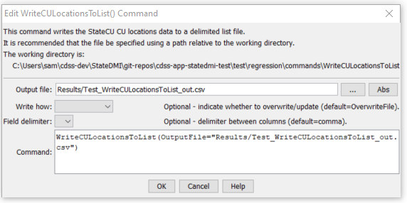

# StateDMI / Command / WriteCULocationsToList #

* [Overview](#overview)
* [Command Editor](#command-editor)
* [Command Syntax](#command-syntax)
* [Examples](#examples)
* [Troubleshooting](#troubleshooting)
* [See Also](#see-also)

-------------------------

## Overview ##

The `WriteCULocationsToList` command (for StateCU)
writes CU Locations data to a delimited (list) file.
The command uses the specified filename to determine the names of several files to write, as shown below:

* `cm2006.csv` – name specified with `OutputFile` parameter, used for main CU Location data
* `cm2006_ClimateStations.csv` – list of climate stations for the CU Location
* `cm2006_Collections.csv` – list of collection data (aggregate and systems parts) for the CU Location


## Command Editor ##

The following dialog is used to edit the command and illustrates the command syntax.

**<p style="text-align: center;">

</p>**

**<p style="text-align: center;">
`WriteCULocationsToList` Command Editor (<a href="../WriteCULocationsToList.png">see also the full-size image</a>)
</p>**

## Command Syntax ##

The command syntax is as follows:

```text
WriteCULocationsToList(Parameter="Value",...)
```
**<p style="text-align: center;">
Command Parameters
</p>**

| **Parameter**&nbsp;&nbsp;&nbsp;&nbsp;&nbsp;&nbsp;&nbsp;&nbsp;&nbsp;&nbsp;&nbsp;&nbsp; | **Description** | **Default**&nbsp;&nbsp;&nbsp;&nbsp;&nbsp;&nbsp;&nbsp;&nbsp;&nbsp;&nbsp;&nbsp;&nbsp;&nbsp;&nbsp;&nbsp;&nbsp; |
| --------------|-----------------|----------------- |
| `OutputFile`<br>**required** | The name of the output file to write. | None – must be specified. |
| `WriteHow` | `OverwriteFile` if the file should be overwritten or `UpdateFile` if the file should be updated, resulting in the previous header being carried forward. | `OverwriteFile` |
| `Delimiter` | The delimiter character to use between columns. | `,` (comma) |

## Examples ##

See the [automated tests](https://github.com/OpenDSS/cdss-app-statedmi-test/tree/master/test/regression/commands/WriteCULocationsToList).

The following example illustrates how to process CU Locations data from HydroBase, starting with a list of station identifiers, and creating a full list of data:

```
ReadCULocationsFromList(ListFile="list.csv")
FillCULocationsFromHydroBase(ID="*",CULocType="Structure",Region1Type="County",Region2Type="HUC")
WriteCULocationsToList(OutputFile="test2.lst")
```

## Troubleshooting ##

## See Also ##

* [`ReadCULocationsFromList`](../ReadCULocationsFromList/ReadCULocationsFromList.md) command
* [`ReadCULocationsFromStateCU`](../ReadCULocationsFromStateCU/ReadCULocationsFromStateCU.md) command
* [`WriteCULocationsToStateCU`](../WriteCULocationsToStateCU/WriteCULocationsToStateCU.md) command
