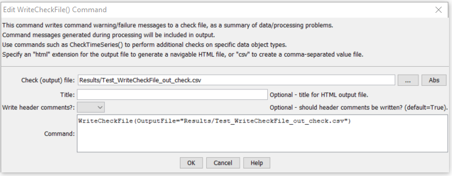

# StateDMI / Command / WriteCheckFile #

* [Overview](#overview)
* [Command Editor](#command-editor)
* [Command Syntax](#command-syntax)
* [Examples](#examples)
* [Troubleshooting](#troubleshooting)
* [See Also](#see-also)

-------------------------

## Overview ##

The `WriteCheckFile` summarizes the results of command processing warning/failure messages in a “check file”.
This file is useful for reviewing results and for quality control.
The check file is essentially a persistent record of any problems that occurred during processing,
whereas a full log file contains a sequential list of processing.
Multiple check commands can be used as appropriate and one or more check files can be written.

## Command Editor ##

The following dialog is used to edit the command and illustrates the command syntax.

**<p style="text-align: center;">

</p>**

**<p style="text-align: center;">
`WriteCheckFile` Command Editor (<a href="../WriteCheckFile.png">see also the full-size image</a>)
</p>**

## Command Syntax ##

The command syntax is as follows:

```text
WriteCheckFile(Parameter="Value",...)
```
**<p style="text-align: center;">
Command Parameters
</p>**

| **Parameter**&nbsp;&nbsp;&nbsp;&nbsp;&nbsp;&nbsp;&nbsp;&nbsp;&nbsp;&nbsp;&nbsp;&nbsp; | **Description** | **Default**&nbsp;&nbsp;&nbsp;&nbsp;&nbsp;&nbsp;&nbsp;&nbsp;&nbsp;&nbsp; |
| --------------|-----------------|----------------- |
| `OutputFile`<br>**required** | The name of the check file to create, enclosed in double quotes if the file contains spaces or other special characters.  A path relative to the command file containing this command can be specified.<br><br>Specify a filename with `.html` extension to generate an HTML file or `.csv` to generate a comma-separated value file suitable for use with Excel.  The HTML file will contain more information and include navigation links. | None – must be specified. |
| `Title` | A title that will be shown in the output file.  This is recommended to provide context for results because the default title uses the command file name. | Auto-generated and includes command file name. |

## Examples ##

See the [automated tests](https://github.com/OpenCDSS/cdss-app-statedmi-test/tree/master/test/regression/commands/WriteCheckFile).

## Troubleshooting ##

## See Also ##

* [`CheckBlaneyCriddle`](../CheckBlaneyCriddle/CheckBlaneyCriddle.md) command
* [`CheckClimateStations`](../CheckClimateStations/CheckClimateStations.md) command
* [`CheckCropCharacteristics`](../CheckCropCharacteristics/CheckCropCharacteristics.md) command
* [`CheckCropPatternTS`](../CheckCropPatternTS/CheckCropPatternTS.md) command
* [`CheckCULocations`](../CheckCULocations/CheckCULocations.md) command
* [`CheckDiversionDemandTSMonthly`](../CheckDiversionDemandTSMonthly/CheckDiversionDemandTSMonthly.md) command
* [`CheckDiversionHistoricalTSMonthly`](../CheckDiversionHistoricalTSMonthly/CheckDiversionHistoricalTSMonthly.md) command
* [`CheckDiversionRighs`](../CheckDiversionRighs/CheckDiversionRighs.md) command
* [`CheckDiversionStations`](../CheckDiversionStations/CheckDiversionStations.md) command
* [`CheckInstreamFlowDemandTSAverageMonthly`](../CheckInstreamFlowDemandTSAverageMonthly/CheckInstreamFlowDemandTSAverageMonthly.md) command
* [`CheckInstreamFlowRights`](../CheckInstreamFlowRights/CheckInstreamFlowRights.md) command
* [`CheckInstreamFlowStations`](../CheckInstreamFlowStations/CheckInstreamFlowStations.md) command
* [`CheckIrrigationPracticeTS`](../CheckIrrigationPracticeTS/CheckIrrigationPracticeTS.md) command
* [`CheckPenmanMonteith`](../CheckPenmanMonteith/CheckPenmanMonteith.md) command
* [`CheckReservoirRights`](../CheckReservoirRights/CheckReservoirRights.md) command
* [`CheckReservoirStations`](../CheckReservoirStations/CheckReservoirStations.md) command
* [`CheckRiverNetwork`](../CheckRiverNetwork/CheckRiverNetwork.md) command
* [`CheckStreamEstimateStationCoefficients`](../CheckStreamEstimateStationCoefficients/CheckStreamEstimateStationCoefficients.md) command
* [`CheckSteramGageStations`](../CheckStreamGageStations/CheckStreamGageStations.md) command
* [`CheckWellDemandTSMonthly`](../CheckWellDemandTSMonthly/CheckWellDemandTSMonthly.md) command
* [`CheckWellHistoricalPumpingTSMonthly`](../CheckWellHistoricalPumpingTSMonthly/CheckWellHistoricalPumpingTSMonthly.md) command
* [`CheckWellRights`](../CheckWellRights/CheckWellRights.md) command
* [`CheckWellStations`](../CheckWellStations/CheckWellStations.md) command
