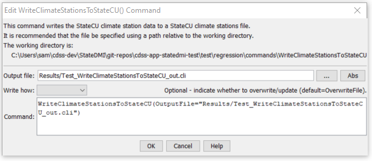

# StateDMI / Command / WriteClimateStationsToStateCU #

* [Overview](#overview)
* [Command Editor](#command-editor)
* [Command Syntax](#command-syntax)
* [Examples](#examples)
* [Troubleshooting](#troubleshooting)
* [See Also](#see-also)

-------------------------

## Overview ##

The `WriteClimateStationsToStateCU` command (for StateCU)
writes climate stations that have been defined to a StateCU climate stations file.

## Command Editor ##

The following dialog is used to edit the command and illustrates the command syntax.

**<p style="text-align: center;">

</p>**

**<p style="text-align: center;">
`WriteClimateStationsToStateCU` Command Editor (<a href="../WriteClimateStationsToStateCU.png">see also the full-size image</a>)
</p>**

## Command Syntax ##

The command syntax is as follows:

```text
WriteClimateStationsToStateCU(Parameter="Value",...)
```
**<p style="text-align: center;">
Command Parameters
</p>**

| **Parameter**&nbsp;&nbsp;&nbsp;&nbsp;&nbsp;&nbsp;&nbsp;&nbsp;&nbsp;&nbsp;&nbsp;&nbsp; | **Description** | **Default**&nbsp;&nbsp;&nbsp;&nbsp;&nbsp;&nbsp;&nbsp;&nbsp;&nbsp;&nbsp;&nbsp;&nbsp;&nbsp;&nbsp;&nbsp;&nbsp; |
| --------------|-----------------|----------------- |
| `OutputFile`<br>**required** | The name of the output file to write, surrounded by double quotes. | None – must be specified. |
| `WriteHow` | `OverwriteFile` if the file should be overwritten or `UpdateFile` if the file should be updated, resulting in the previous header being carried forward. | `OverwriteFile` |

## Examples ##

See the [automated tests](https://github.com/OpenCDSS/cdss-app-statedmi-test/tree/master/test/regression/commands/WriteClimateStationsToStateCU).

The following example command file illustrates how climate stations can be defined and written to a StateCU file:

```
ReadClimateStationsFromList(ListFile="climsta.lst",IDCol=1)
FillClimateStationsFromHydroBase(ID="*")
SetClimateStation(ID="3016",Region2="14080106",IfNotFound=Warn)
SetClimateStation(ID="1018",Region2="14040106",IfNotFound=Warn)
SetClimateStation(ID="1928",Elevation=6440,IfNotFound=Warn)
SetClimateStation(ID="0484",Region1="MOFFAT",IfNotFound=Add)
WriteClimateStationsToStateCU(OutputFile="COclim2006.cli")
```

## Troubleshooting ##

## See Also ##

* [`ReadClimateStationsFromList`](../ReadClimateStationsFromList/ReadClimateStationsFromList.md) command
* [`ReadClimateStationsFromStateCU`](../ReadClimateStationsFromStateCU/ReadClimateStationsFromStateCU.md) command
* [`WriteClimateStationsToList`](../WriteClimateStationsToList/WriteClimateStationsToList.md) command
