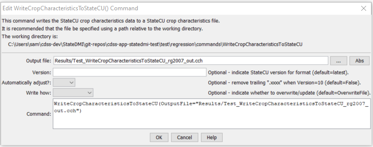

# StateDMI / Command / WriteCropCharacteristicsToStateCU #

* [Overview](#overview)
* [Command Editor](#command-editor)
* [Command Syntax](#command-syntax)
* [Examples](#examples)
* [Troubleshooting](#troubleshooting)
* [See Also](#see-also)

-------------------------

## Overview ##

The `WriteCropCharacteristicsToStateCU` command (for StateCU)
writes crop characteristics data to a StateCU climate crop characteristics file.

## Command Editor ##

The following dialog is used to edit the command and illustrates the command syntax.

**<p style="text-align: center;">

</p>**

**<p style="text-align: center;">
`WriteCropCharacteristicsToStateCU` Command Editor (<a href="../WriteCropCharacteristicsToStateCU.png">see also the full-size image</a>)
</p>**

## Command Syntax ##

The command syntax is as follows:

```text
WriteCropCharacteristicsToStateCU(Parameter="Value",...)
```
**<p style="text-align: center;">
Command Parameters
</p>**

| **Parameter**&nbsp;&nbsp;&nbsp;&nbsp;&nbsp;&nbsp;&nbsp;&nbsp;&nbsp;&nbsp;&nbsp;&nbsp; | **Description** | **Default**&nbsp;&nbsp;&nbsp;&nbsp;&nbsp;&nbsp;&nbsp;&nbsp;&nbsp;&nbsp;&nbsp;&nbsp;&nbsp;&nbsp;&nbsp;&nbsp; |
| --------------|-----------------|----------------- |
| `OutputFile`<br>**required** | The name of the output file to write, surrounded by double quotes. | None – must be specified. |
| `Version` | Indicate whether output should be formatted for a specific version of StateCU file. | Write the most current version. |
| `AutoAdjust` | Automatically adjust the crop names by removing trailing `.XXX` characters (the period and any trailing characters).  This may be needed because current modeling procedures use a longer crop name (e.g., `ALFALFA.TR21`) whereas older procedures simply used ALFALFA.  The conversion is necessary to allow comparison with older files. | `False` |
| `WriteHow` | `OverwriteFile` if the file should be overwritten or `UpdateFile` if the file should be updated, resulting in the previous header being carried forward. | `OverwriteFile` |

## Examples ##

See the [automated tests](https://github.com/OpenCDSS/cdss-app-statedmi-test/tree/master/test/regression/commands/WriteCropCharacteristicsToStateCU).

The following example illustrates how to create a StateCU crop characteristics file with data from HydroBase:

```
StartLog(LogFile="Crops_CCH.StateDMI.log")
#
# StateDMI commands to create the Rio Grande Crop Characteristics File
#
# History:
#
# 2004-03-16 Steven A. Malers, RTi  Initial version using StateDMI.
# 2007-04-22 SAM, RTi               Use new directory structure, current
#                                   software and HydroBase.
#
# Step 1 - read data from HydroBase
#
# Read the general TR-21 characteristics first and then override with Rio Grande
# data.
ReadCropCharacteristicsFromHydroBase(CUMethod="BLANEY-CRIDDLE_TR-21")
ReadCropCharacteristicsFromHydroBase(CUMethod="BLANEY-CRIDDLE_RIO_GRANDE")
#
# Step 2 - adjust crop characteristics if needed
#    No resets are needed.
#
# Step 3 - write the file
#
WriteCropCharacteristicsToStateCU(OutputFile="rg2007.cch")
#
# Check the results
#
CheckCropCharacteristics(ID="*")
WriteCheckFile(OutputFile="rg2007.cch.check.html")
```

## Troubleshooting ##

## See Also ##

* [`ReadCropCharactersiticsFromStateCU`](../ReadCropCharactersiticsFromStateCU/ReadCropCharactersiticsFromStateCU.md) command
* [`WriteCropCharacteristicsToList`](../WriteCropCharacteristicsToList/WriteCropCharacteristicsToList.md) command
