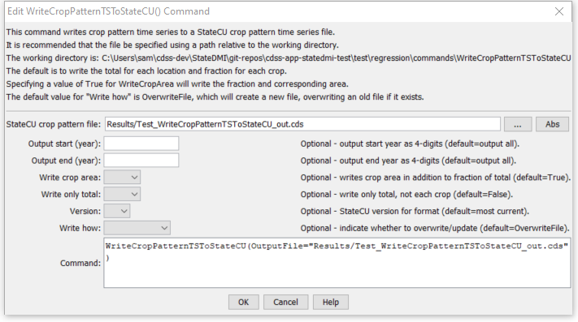

# StateDMI / Command / WriteCropPatternTSToStateCU #

* [Overview](#overview)
* [Command Editor](#command-editor)
* [Command Syntax](#command-syntax)
* [Examples](#examples)
* [Troubleshooting](#troubleshooting)
* [See Also](#see-also)

-------------------------

## Overview ##

The `WriteCropPatternTSToStateCU` command (for StateCU)
writes crop pattern time series to the StateCU crop pattern file.
A number of parameters are available to control the format and content of output.

## Command Editor ##

The following dialog is used to edit the command and illustrates the command syntax.

**<p style="text-align: center;">

</p>**

**<p style="text-align: center;">
`WriteCropPatternTSToStateCU` Command Editor (<a href="../WriteCropPatternTSToStateCU.png">see also the full-size image</a>)
</p>**

## Command Syntax ##

The command syntax is as follows:

```text
WriteCropPatternTSToStateCU(Parameter="Value",...)
```
**<p style="text-align: center;">
Command Parameters
</p>**

| **Parameter**&nbsp;&nbsp;&nbsp;&nbsp;&nbsp;&nbsp;&nbsp;&nbsp;&nbsp;&nbsp;&nbsp;&nbsp; | **Description** | **Default**&nbsp;&nbsp;&nbsp;&nbsp;&nbsp;&nbsp;&nbsp;&nbsp;&nbsp;&nbsp;&nbsp;&nbsp;&nbsp;&nbsp;&nbsp;&nbsp; |
| --------------|-----------------|----------------- |
| `OutputFile`<br>**required** | The name of the output file to write, surrounded by double quotes. | None – must be specified. |
| `OutputStart` | The starting year for output. | Write the full period. |
| `OutputEnd` | The ending year for output. | Write the full period. |
| `WriteCropArea` | If specified as `True`, the crop area for each crop will be written in addition to the percentage of the total area.  This is being phased in as a feature of StateCU and this parameter may be removed in the future. | `True` |
| `WriteOnlyTotal` | If specified as `True`, only the total for the location will be written.  This is useful if it is desired to generate an annual total time series file. | `False` |
| `Version` | Indicate the StateCU version file format.  An older version format may need to be written when modifying older data sets or comparing current and previous data sets. | Write the must current StateCU version’s format. |
| `WriteHow` | `OverwriteFile` if the file should be overwritten or `UpdateFile` if the file should be updated, resulting in the previous header being carried forward. | `OverwriteFile` |

## Examples ##

See the [automated tests](https://github.com/OpenCDSS/cdss-app-statedmi-test/tree/master/test/regression/commands/WriteCropPatternTSToStateCU).

## Troubleshooting ##

## See Also ##

* [`ReadCropPatternTSFromHydroBase`](../ReadCropPatternTSFromHydroBase/ReadCropPatternTSFromHydroBase.md) command
* [`ReadCropPatternTSFromStateCU`](../ReadCropPatternTSFromStateCU/ReadCropPatternTSFromStateCU.md) command
* [`WriteCropPatternTSToDateValue`](../WriteCropPatternTSToDateValue/WriteCropPatternTSToDateValue.md) command
