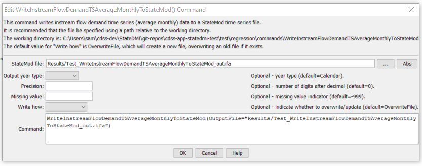

# StateDMI / Command / WriteInstreamFlowDemandTSAverageMonthlyToStateMod #

* [Overview](#overview)
* [Command Editor](#command-editor)
* [Command Syntax](#command-syntax)
* [Examples](#examples)
* [Troubleshooting](#troubleshooting)
* [See Also](#see-also)

-------------------------

## Overview ##

The `WriteInstreamFlowDemandTSAverageMonthlyToStateMod` command (for StateMod)
command writes instream flow demand time series (average monthly) that have been
defined to a StateMod instream flow demand time series (average monthly) file.

## Command Editor ##

The following dialog is used to edit the command and illustrates the command syntax.

**<p style="text-align: center;">

</p>**

**<p style="text-align: center;">
`WriteInstreamFlowDemandTSAverageMonthlyToStateMod` Command Editor (<a href="../WriteInstreamFlowDemandTSAverageMonthlyToStateMod.png">see also the full-size image</a>)
</p>**

## Command Syntax ##

The command syntax is as follows:

```text
WriteInstreamFlowDemandTSAverageMonthlyToStateMod(Parameter="Value",...)
```
**<p style="text-align: center;">
Command Parameters
</p>**

| **Parameter**&nbsp;&nbsp;&nbsp;&nbsp;&nbsp;&nbsp;&nbsp;&nbsp;&nbsp;&nbsp;&nbsp;&nbsp; | **Description** | **Default**&nbsp;&nbsp;&nbsp;&nbsp;&nbsp;&nbsp;&nbsp;&nbsp;&nbsp;&nbsp;&nbsp;&nbsp;&nbsp;&nbsp;&nbsp;&nbsp; |
| --------------|-----------------|----------------- |
| `OutputFile`<br>**required** | The name of the output file to write, surrounded by double quotes. | None – must be specified. |
| `OutputYearType` | The output year type for the StateMod file. | `Calendar` |
| `Precision` | The number of digits after the decimal point for output values. | `0` |
| `MissingValue` | The value to use in output for missing data. | `-999` |
| `WriteHow` | `OverwriteFile` if the file should be overwritten or `UpdateFile` if the file should be updated, resulting in the previous header being carried forward. | `OverwriteFile` |

## Examples ##

See the [automated tests](https://github.com/OpenCDSS/cdss-app-statedmi-test/tree/master/test/regression/commands/WriteInstreamFlowDemandTSAverageMonthlyToStateMod).

## Troubleshooting ##

[See the main troubleshooting documentation](../../troubleshooting/troubleshooting.md)

## See Also ##

* [`ReadInstreamFlowDemandTSAverageMonthlyFromStateMod`](../ReadInstreamFlowDemandTSAverageMonthlyFromStateMod/ReadInstreamFlowDemandTSAverageMonthlyFromStateMod.md) command
