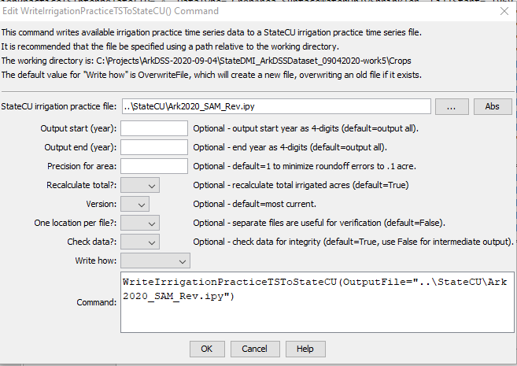

# StateDMI / Command / WriteIrrigationPracticeTSToStateCU #

* [Overview](#overview)
* [Command Editor](#command-editor)
* [Command Syntax](#command-syntax)
* [Examples](#examples)
* [Troubleshooting](#troubleshooting)
* [See Also](#see-also)

-------------------------

## Overview ##

The `WriteIrrigationPracticeTSToStateCU` command (for StateCU)
writes irrigation practice time series to a StateCU crop pattern file.

## Command Editor ##

The following dialog is used to edit the command and illustrates the command syntax.

**<p style="text-align: center;">

</p>**

**<p style="text-align: center;">
`WriteIrrigationPracticeTSToStateCU` Command Editor (<a href="../WriteIrrigationPracticeTSToStateCU.png">see also the full-size image</a>)
</p>**

## Command Syntax ##

The command syntax is as follows:

```text
WriteIrrigationPracticeTSToStateCU(Parameter="Value",...)
```
**<p style="text-align: center;">
Command Parameters
</p>**

| **Parameter**&nbsp;&nbsp;&nbsp;&nbsp;&nbsp;&nbsp;&nbsp;&nbsp;&nbsp;&nbsp;&nbsp;&nbsp;&nbsp;&nbsp;&nbsp;&nbsp;&nbsp;&nbsp;&nbsp;&nbsp; | **Description** | **Default**&nbsp;&nbsp;&nbsp;&nbsp;&nbsp;&nbsp;&nbsp;&nbsp;&nbsp;&nbsp;&nbsp;&nbsp;&nbsp;&nbsp;&nbsp;&nbsp; |
| --------------|-----------------|----------------- |
| `OutputFile`<br>**required** | The name of the output file to write, surrounded by double quotes. | None – must be specified. |
| `OutputStart` | Starting year for output. | Write all years. |
| `OutputEnd` | Ending year for output. | Write all years. |
| `PrecisionForArea` | The number of digits after the decimal point for area values. | `1` |
| `Version` | Indicate the StateCU version, to control the file format.  It is sometimes necessary to write an older version to compare data sets or update an old data set. | Write the most current format. |
| `OneLocationPerFile` | Useful for troubleshooting and verification.  If True, then each location is written to a separate file. | `False` |
| `CheckData` | Check the data for integrity (do values add up).  Set to False if processing preliminary data. | `True` |
| `WriteHow` | `OverwriteFile` if the file should be overwritten or `UpdateFile` if the file should be updated, resulting in the previous header being carried forward. | `OverwriteFile` |

## Examples ##

See the [automated tests](https://github.com/OpenCDSS/cdss-app-statedmi-test/tree/master/test/regression/commands/WriteIrrigationPracticeTSToStateCU).

## Troubleshooting ##

[See the main troubleshooting documentation](../../troubleshooting/troubleshooting.md)

## See Also ##

* [`ReadIrrigationPracticeTSFromStateCU`](../ReadIrrigationPracticeTSFromStateCU/ReadIrrigationPracticeTSFromStateCU.md) command
* [`WriteIrrigationPracticeTSToDateValue`](../WriteIrrigationPracticeTSToDateValue/WriteIrrigationPracticeTSToDateValue.md) command
