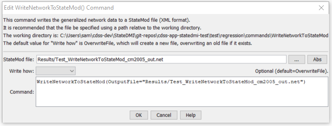

# StateDMI / Command / WriteNetworkToStateMod #

* [Overview](#overview)
* [Command Editor](#command-editor)
* [Command Syntax](#command-syntax)
* [Examples](#examples)
* [Troubleshooting](#troubleshooting)
* [See Also](#see-also)

-------------------------

## Overview ##

The `WriteNetworkToStateMod` command (for StateMod)
writes the generalized network to a StateMod XML network file.

## Command Editor ##

The following dialog is used to edit the command and illustrates the command syntax.

**<p style="text-align: center;">

</p>**

**<p style="text-align: center;">
`WriteNetworkToStateMod` Command Editor (<a href="../WriteNetworkToStateMod.png">see also the full-size image</a>)
</p>**

## Command Syntax ##

The command syntax is as follows:

```text
WriteNetworkToStateMod(Parameter="Value",...)
```
**<p style="text-align: center;">
Command Parameters
</p>**

| **Parameter**&nbsp;&nbsp;&nbsp;&nbsp;&nbsp;&nbsp;&nbsp;&nbsp;&nbsp;&nbsp;&nbsp;&nbsp; | **Description** | **Default**&nbsp;&nbsp;&nbsp;&nbsp;&nbsp;&nbsp;&nbsp;&nbsp;&nbsp;&nbsp;&nbsp;&nbsp;&nbsp;&nbsp;&nbsp;&nbsp; |
| --------------|-----------------|----------------- |
| `OutputFile` | The name of the output file to write, surrounded by double quotes. | None – must be specified. |
| `WriteHow` | `OverwriteFile` if the file should be overwritten or `UpdateFile` if the file should be updated, resulting in the previous header being carried forward. | `OverwriteFile` |

## Examples ##

See the [automated tests](https://github.com/OpenCDSS/cdss-app-statedmi-test/tree/master/test/regression/commands/WriteNetworkToStateMod).

The following example command file illustrates how the command might be used:

```
# Create a generalized XML network from individual StateMod files
# Read the network, which contains upstream to downstream connectivity but does
# not indicate node types
ReadRiverNetworkFromStateMod(InputFile=cm2005.rin)
# Read the stations, which imply the node types
ReadRiverStreamGageStationsFromStateMod(InputFile=cm2005.ris)
ReadRiverDiversionStationsFromStateMod(InputFile=cm2005.dds)
ReadRiverReservoirStationsFromStateMod(InputFile=cm2005.res)
ReadRiverInstreamFlowStationsFromStateMod(InputFile=cm2005.ifs)
ReadRiverWellStationsFromStateMod(InputFile=cm2005.wes)
# To be developed...
#ReadRiverPlanStationsFromStateMod()
ReadRiverStreamEstimateStationsFromStateMod(InputFile=cm2005.ris)
# Now create the generalized network, using the connectivity and node types
CreateNetworkFromRiverNetwork()
# Fill in node names and locations from HydroBase, if any is still missing
FillNetworkFromHydroBase()
# Write the generalized network
WriteNetworkToStateMod(OutputFile="cm2005.net")
# Check for errors (the following is not yet implemented)
#CheckNetwork()
WriteCheckFile(OutputFile="cm2005.net.check.html")
```

## Troubleshooting ##

[See the main troubleshooting documentation](../../troubleshooting/troubleshooting.md)

## See Also ##

* [`ReadIrrigationPracticeTSFromStateCU`](../ReadIrrigationPracticeTSFromStateCU/ReadIrrigationPracticeTSFromStateCU.md) command
* [`WriteIrrigationPracticeTSToDateValue`](../WriteIrrigationPracticeTSToDateValue/WriteIrrigationPracticeTSToDateValue.md) command
