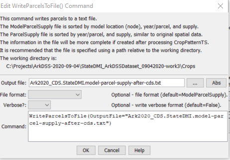

# StateDMI / Command / WriteParcelsToFile #

* [Overview](#overview)
	+ [Parcel Supply Format](#parcel-supply-format)
	+ [Model Parcel Supply Format](#model-parcel-supply-format)
* [Command Editor](#command-editor)
* [Command Syntax](#command-syntax)
* [Examples](#examples)
* [Troubleshooting](#troubleshooting)
* [See Also](#see-also)

-------------------------

## Overview ##

The `WriteParcelsToFile` command (for StateCU and StateMod) writes parcels and related supply data text file report.
The report files are large and detailed and are useful to verify dataset configuration and troubleshoot errors.
If warnings are shown for the command, search the file for `ERROR` to find specific errors.

The model location, parcel and water supply data model is created using the
[`ReadParcelsFromHydroBase`](../ReadParcelsFromHydroBase/ReadParcelsFromHydroBase.md) command.

### Parcel Supply Format ###

The following is an example of the `ParcelSupply` report format, which is organized from parcel perspective.
The data should closely match the original irrigated lands assessment spatial data.

```
#> ***************************************************************************************************
#>  StateDMI Parcel / Supply File - this is a diagnostics report
#>  - this report lists each parcel and supplies for the parcel sorted by:
#>      year
#>      division
#>      district
#>      parcel ID
#>  - the parcel data should match orginal GIS irrigated land and supply data
#>  - model data reflect model location identifiers and collections
#>
#>  Parcel Data - GIS loaded into HydroBase, sorted by Year, Div, Dist, ParcelId
#>  --------------------------------------------------------------------------------------------------
#>  Year         :  Calendar year for parcel
#>  Div          :  Water division
#>  Dist         :  Water district - may be zero depending on how parcel data are read
#>                    Current HydroBase design includes WD in digits 2-3 of the parcel ID
#>  ParcelId     :  Parcel identifier
#>  Crop         :  Crop type for parcel (1 crop per parcel)
#>  ParcelArea   :  Parcel area for crop
#>  Units        :  Area units
#>  IrrigMethod  :  Irrigation method
#>
#>  SW Supply Data - portion of parcel acreage associated with surface water supply
#>  --------------------------------------------------------------------------------------------------
#>  WDID         :  Water district identifier for the ditch.
#>  #Ditch       :  Number of ditches that are associated with the parcel.
#>  SWFrac       :  1/#Ditch = fraction of ParcelArea (from above) that is irrigated by the ditch (0.0 to 1.0).
#>  SWFracHB     :  SWFrac from HydroBase, should match SWFrac.
#>  SWIrrigArea  :  ParcelArea * %Irrig = area irrigated by surface water supply for this ditch.
#>  HBError      :  Indicates whether the SWFrac computed from data is different than SWFracHB from HydroBase
#>                   ERROR - indicates that not all supplies in HydroBase parcel data are being modeled
#>                           due to different number of ditches associated with the parcel.
#>                           Checks are made to precision of 1 digit.
#>                           The CheckParcels() command can be used to check to a specified precision.
#>                           These errors need to be fixed to ensure the integrity of the dataset.
#>                   Blank indicates that model dataset and HydroBase data agree.
#>
#>  GW Supply Data - portion of parcel acreage associated with groundwater supply
#>  --------------------------------------------------------------------------------------------------
#>  IdType       :  Water supply part ID type (WDID or RECEIPT).
#>  WDID         :  WDID for supply well.
#>  RECEIPT      :  Well permit receipt.
#>  #Wells       :  Number of wells that are associated with ParcelId.
#>  GWFrac       :  1/#Wells = fraction of ParcelArea (from above) that is irrigated by the ditch (0.0 to 1.0).
#>                    - not in original data (calculated when loaded into HydroBase).
#>  GWIrrigArea  :  ParcelArea/#Wells, zero if area is already assigned to surface water ID for D&W node.
#>
#>----------------------------------- Parcel Data ------------------------------|-------------------- SW Suppply ---------------------|----------------------- GW Supply Data ---------------------|
#>                                                                      Irrig   |                                                     |                                                            |
#>Year  Div Dist   ParcelId              Crop         ParcelArea Units  Method  |    WDID   #Ditch SWFrac SWFracHB SWIrrigArea HBError|  ID Type     WDID       Receipt   #Wells GWFrac GWIrrigArea|
#>b--exb--exb--exb-------------exb------------------exb--------exb--exb--------exb--------exb----exb----exb------exb---------exb-----exb--------exb--------exb----------exb----exb----exb---------ex
#>EndHeader
#>
  1954    2   10        21010947 GRASS_PASTURE            64.634 acre FLOOD     
                                                                                 1000736         1  1.000    1.000      64.634        
  1954    2   10        21010948 GRASS_PASTURE             5.162 acre FLOOD     
                                                                                 1000567         1  1.000    1.000       5.162        
                                                                                                                                                  1005401    9079999           4  0.250       1.290
                                                                                                                                                  1005402    9080000           4  0.250       1.290
                                                                                                                                                  1005403    9080001           4  0.250       1.290
                                                                                                                                                  1005628    9080514           4  0.250       1.290
  2015    2   67        26723268 ALFALFA                  16.738 acre FLOOD     
                                                                                                                                       Receipt               0076564           1  1.000      16.738
  2015    2   67        26723269 GRASS_PASTURE             0.900 acre FLOOD     
                                                                                                                                       Receipt               9080470           1  1.000       0.900
  2015    2   67        26723672 WHEAT_FALL                6.015 acre FLOOD     
                                                                                                                                       WDID       6706324                      1  1.000       6.015
```

### Model Parcel Supply Format ###

The following is an example of the `ModelParcelSupply` report format, which is organized from model perspective.
The CDS information is only complete after running the
[`ReadCropPatternTSFromParcels`](../ReadCropPatternTSFromParcels/ReadCropPatternTSFromParcels.md) command.

```
#HeaderRevision 0
#
# File generated by...
# program:      StateDMI 5.00.07.dev (2021-01-31)
# user:         sam
# date:         Mon Feb 01 01:04:36 America/Denver 2021
# host:         RoaringFork
# directory:    C:\Projects\ArkDSS-2020-09-04\StateDMI_ArkDSSDataset_09042020-work3\Crops
# command line: StateDMI
#  -home test\operational\CDSS
#------------------------------------------------
#>
#> ***************************************************************************************************
#>  StateDMI Model / Parcel / Supply File - this is a diagnostics report
#>  - this report shows the relationships between a parcel and supplies for the parcel
#>  - the parcel data should match orginal GIS irrigated land and supply data
#>  - model data reflect model location identifiers and collections
#>  - the parcel/supply data can be used for *.cds, *.ipy, and *.wer files
#>
#>  Model ID - StateCU location and node type
#>  --------------------------------------------------------------------------------------------------
#>  LocId          :  CU Location ID surface water data
#>  LocType        :  Location type
#>                    - for StateMod, corresponds to network node type
#>                    - for StateCU, determined from supply for parcels
#>                    DIV - diversion
#>                    D&W - diversion & well
#>                    WEL - well
#>                    UNK - unknown, such as StateCU climate station dataset
#>  CollectionType :  Used if multiple data objects are combined under one model identifier
#>                    Single - single node (no collection)
#>                    Aggregate - aggregate physical properties (capacity, etc.) and water rights into classes
#>                    System - aggregate physical properties (capacity, etc.), maintain water rights
#>
#>  Parcel Data - GIS loaded into HydroBase
#>  --------------------------------------------------------------------------------------------------
#>  Year         :  Calendar year for parcel
#>  ParcelId     :  Parcel identifier
#>  Div          :  Water division (irrigated lands assessments are typically performed for a division)
#>  Dist         :  Water district
#>  Crop         :  Crop type for parcel (1 crop per parcel)
#>  ParcelArea   :  Parcel area for crop
#>  Units        :  Area units
#>  IrrigMeth    :  Irrigation method
#>
#>  Data Source/Use - whether or not the row of data is included in the CDS file
#>  --------------------------------------------------------------------------------------------------
#>  Include in CDS :  Indicates whether the parcel is included in CDS file acreage for the LocId.
#>                    This will only be set after running 'ReadCropPatternTSFromParcels' command.
#>                    CDS:YES = include parcel area in CDS file based on irrigated acreage parcel assignment
#>                    - YES if a parcel with surface water supply - area for parcel is always included
#>                    - YES if a parcel with only groundwater supply and model node is a WEL
#>                    - a parcel can have CDS:YES for surface water supplies or groundwater supplies, but not both
#>                    CDS:NO = do not include parcel area in CDS file based on irrigated acreage parcel assignment
#>                    - NO if GW supply but parcel also has surface water supply
#>                      - if GW only suppply WEL node, a D&W model node will include the area
#>                    CDS:ERR = error determining whether to include parcel area in CDS FILE (input error)
#>                    CDS:UNK = unknown whether to include parcel area in CDS FILE (should not happen)
#>                    - will have this value until crop pattern time series are processed by
#>                      ReadCropPatternTSFromParcels or SetCropPatternTSFromParcels commands for location
#>  DataSrc        :  Data source for the supply data
#>                    - typically from HydroBase but may enable user-supplied data
#>                    - may in the future be read directly from GIS or other files
#>                    HB-PUTS = HydroBase ParcelUseTS/Structure from vw_CDSS_ParcelUseTSStructureToParcel (diversions)
#>                    HB-WTP = HydroBase Well/Parcel from vw_CDSS_WellsWellToParcel (wells)
#>                    SET = data are provided with SetParcelSurfaceWaterSupply() or SetParcelGroundWaterSupply() commands
#>  CDS LocId      :  The StateCU location (or StateMod) ID where the parcel area is counted for CDS file. 
#>                    - DIV or D&W identifier if parcel has surface water supply. 
#>                    - WEL identifier if parcel has groundwater supply only. 
#>                    - ??? if the parcel has not been associated with a model location via ReadCropPatternTSFromParcels, 
#>                      such as when SetCropPatternTS*() commands are used to assign data at the end of processing.
#>  CDS LocId Type :  Type node type for CDS LocId, to confirm data processing. 
#>                    - should match the model node location type
#>                    - ??? if the parcel has not been associated with a model location via ReadCropPatternTSFromParcels, 
#>                      such as when SetCropPatternTS*() commands are used to assign data at the end of processing.
#>  LocId has Set  :  Whether LocId has a SetCropPatternTS*() command - will override any parcel data in this file in output. 
#>                 :  - will override any parcel data in this file in output. 
#>                 :  - if CDS:UNK, LocId CDS data may be set by one or more StateDMI set commands. 
#>
#>  SW Collection Data - surface water aggregate/system data
#>  --------------------------------------------------------------------------------------------------
#>  SW Collect WDID :  The WDID of the diversion collection part.
#>                     - If a WEL, blank (see the LocId for the location WDID).
#>                     - If a D&W, the collection part ID, mus be a WDID.
#>
#>  SW Supply Data - portion of parcel acreage associated with surface water supply
#>  --------------------------------------------------------------------------------------------------
#>  #Dit         :  Number of ditches that are associated with the parcel.
#>  WDID         :  Surface water supply ditch WDID.
#>  Irrig Frac   :  1/#Ditch = fraction of ParcelArea (from above) that is irrigated by the ditch (0.0 to 1.0).
#>  Irrig FracHB :  SWFrac from HydroBase, should match SWFrac.
#>  Irrig Area   :  ParcelArea * %Irrig = area irrigated by surface water supply for this ditch.
#>  HBError      :  Indicates whether the SWFrac computed from data is different than SWFracHB from HydroBase
#>                   ERROR - indicates that not all supplies in HydroBase parcel data are being modeled
#>                           due to different number of ditches associated with the parcel.
#>                           Checks are made to precision of 1 digit.
#>                           The CheckParcels() command can be used to check to a specified precision.
#>                           These errors need to be fixed to ensure the integrity of the dataset.
#>                   Blank indicates that model dataset and HydroBase data agree.
#>
#>  GW Collection Data - groundwater aggregate/system data
#>    - the collection part ID (WDID or receipt) is the same as the parcel supply ID
#>  --------------------------------------------------------------------------------------------------
#>  GWPart Type  :  Water supply part type (Well or Parcel, the latter being phased out).
#>                  WellInDitch = indicates a collection of ditches (D&W)
#>                  - associated wells are determined automatically based well -> parcel -> ditch relationship.
#>                  - the assoicated ditch is either the locId if single ditch or see previous SW supply line.
#>                  Well = indicates a collection of wells (WEL) specified using well identifiers.
#>                  Parcel = indicates a collection of wells (WEL) specified using parcel identifiers.
#>  GWPart IdType:  Water supply part ID type (WDID or RECEIPT).
#>                  If GWPartType=Well:
#>                     WDID - supply well has a WDID
#>                     RECEIPT - supply well has a well permit receipt for identifier.
#>                  If GWPartType=Parcel:
#>                     Parcel - parcel identifier, THIS APPROACH IS BEING PHASED OUT
#>  WDID         :  WDID for part if GWPartIdType=WDID.
#>  Receipt      :  Receipt for part if GWPartIdType=RECEIPT.
#>
#>  GW Supply Data - portion of parcel acreage associated with groundwater supply
#>  --------------------------------------------------------------------------------------------------
#>  #Wells       :  Number of wells that are associated with ParcelId.
#>  Irrig Frac   :  1/#Wells = fraction of ParcelArea (from above) that is irrigated by the well (0.0 to 1.0).
#>  D&W Frac     :  Same as D&W Irrig Frac, applied when well supply is supplemental to ditch.
#>  Irrig Area   :  ParcelArea * Irrig Frac (* D&W Frac), zero if parcel has surface water supply for D&W node.
#>
#>-------- Model Id ---------|------------------------------- Parcel Data -----------------------------||----------- Data Source/Use ------------- ||            Collections use WDID Parts              |          WEL Collection Part ID is the same as GW Supply ID       |
#>                           |                                                                         || Include                    CDS     LocId || SW     |-------------- SW Supply Data -------------|----------- GW Collection Data ---------|----- GW Supply Data -----|
#>           Loc  Collection |       Parcel                                    Parcel          Irrig   || in               CDS       LocId   has   || Collect|#     Ditch  Irrig Irrig   Irrig           |   GWPart    GWPart    Well     Well    |#    Irrig D&W     Irrig  |
#>  LocId    Type Type       |Year   ID        Div Dist        Crop            Area     Units  Method  || CDS?    DataSrc  LocId     Type    Set   || WDID   |Dit   WDID   Frac  FracHB  Area     HBError|    Type     IdType    WDID     Receipt |Well Frac  Frac    Area   |
#>b--------exb--exb---------exb--exb--------exb--exb--exb------------------exb--------exb--exb--------exb------exb------exb----------exb--exb------exb------exb-exb------exb---exb---exb--------exb-----exb----------exb-----exb------exb--------exb--exb---exb---exb-------ex
#>EndHeader
#>
1000504      DIV  Single      1975 21012133      2   10 GRASS_PASTURE            39.303 acre FLOOD                                                  
                                                                                                        CDS:YES  HB-PUTS  1000504      DIV                      1 1000504  1.000 1.000     39.303        
1000504      DIV  Single      1998 21012719      2   10 GRASS_PASTURE            26.166 acre FLOOD                                                  
                                                                                                        CDS:YES  HB-PUTS  1000504      DIV                      1 1000504  1.000 1.000     26.166        
1000504      DIV  Single      2015 21023167      2   10 GRASS_PASTURE            22.138 acre FLOOD                                                  
                                                                                                        CDS:YES  HB-PUTS  1000504      DIV                      1 1000504  1.000 1.000     22.138        
1000567      D&W  Single      1954 21010941      2   10 GRASS_PASTURE            55.117 acre FLOOD                                                  
                                                                                                        CDS:YES  HB-PUTS  1000567      D&W                      1 1000567  1.000 1.000     55.117        
                                                                                                        CDS:NO   HB-WTP                                                                                   WellInDitch          1005638  9080344       2 0.500 1.000    27.558
                                                                                                        CDS:NO   HB-WTP                                                                                   WellInDitch          1005639  9080345       2 0.500 1.000    27.558
1000567      D&W  Single      1954 21010942      2   10 GRASS_PASTURE            20.477 acre FLOOD                                                  
                                                                                                        CDS:YES  HB-PUTS  1000567      D&W                      1 1000567  1.000 1.000     20.477        
                                                                                                        CDS:NO   HB-WTP                                                                                   WellInDitch          1005638  9080344       2 0.500 1.000    10.239
                                                                                                        CDS:NO   HB-WTP                                                                                   WellInDitch          1005639  9080345       2 0.500 1.000    10.239
```

## Command Editor ##

The following dialog is used to edit the command and illustrates the command syntax.

**<p style="text-align: center;">

</p>**

**<p style="text-align: center;">
`WriteParcelsToFile` Command Editor (<a href="../WriteParcelsToFile.png">see also the full-size image</a>)
</p>**

## Command Syntax ##

The command syntax is as follows:

```text
WriteParcelsToFile(Parameter="Value",...)
```
**<p style="text-align: center;">
Command Parameters
</p>**

| **Parameter**&nbsp;&nbsp;&nbsp;&nbsp;&nbsp;&nbsp;&nbsp;&nbsp;&nbsp;&nbsp;&nbsp;&nbsp; | **Description** | **Default**&nbsp;&nbsp;&nbsp;&nbsp;&nbsp;&nbsp;&nbsp;&nbsp;&nbsp;&nbsp;&nbsp;&nbsp;&nbsp;&nbsp;&nbsp;&nbsp; |
| --------------|-----------------|----------------- |
| `OutputFile`<br>**required** | The name of the output file to write. | None – must be specified. |
| `FileFormat` | Output file format:<ul><li>`ModelParcelSupply` - output file contains model location, parcel, and supply data</li><li>`ParcelSupply` - output file contains parcel and supply data</li></ul> | `ModelParcelSupply` |
| `Verbose` | Whether the report should be in verbose format. `True` will show all supplies for groundwater only parcels whereas `False` will only show groundwater (well) supplies. Verbose format provides additional information that is useful for troubleshooting. | `False` |

## Examples ##

See the [automated tests](https://github.com/OpenCDSS/cdss-app-statedmi-test/tree/master/test/regression/commands/WriteParcelsToFile).

## Troubleshooting ##

## See Also ##

* [`CheckParcels`](../CheckParcels/CheckParcels.md) command
* [`ReadParcelsFromHydroBase`](../ReadParcelsFromHydroBase/ReadParcelsFromHydroBase.md) command
* [`ReadCropPatternTSFromParcels`](../ReadCropPatternTSFromParcels/ReadCropPatternTSFromParcels.md) command
* [`ReadIrrigationPracticeTSFromParcels`](../ReadIrrigationPracticeTSFromParcels/ReadIrrigationPracticeTSFromParcels.md) command
