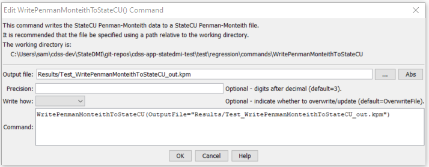

# StateDMI / Command / WritePenmanMonteithToStateCU #

* [Overview](#overview)
* [Command Editor](#command-editor)
* [Command Syntax](#command-syntax)
* [Examples](#examples)
* [Troubleshooting](#troubleshooting)
* [See Also](#see-also)

-------------------------

## Overview ##

The `WritePenmanMonteithToStateCU` command (for StateCU)
writes Penman-Monteith crop coefficients that have been defined to a StateCU Penman-Monteith crop coefficients file.

## Command Editor ##

The following dialog is used to edit the command and illustrates the command syntax.

**<p style="text-align: center;">

</p>**

**<p style="text-align: center;">
`WritePenmanMonteithToStateCU` Command Editor (<a href="../WritePenmanMonteithToStateCU.png">see also the full-size image</a>)
</p>**

## Command Syntax ##

The command syntax is as follows:

```text
WritePenmanMonteithToStateCU(Parameter="Value",...)
```
**<p style="text-align: center;">
Command Parameters
</p>**

| **Parameter**&nbsp;&nbsp;&nbsp;&nbsp;&nbsp;&nbsp;&nbsp;&nbsp;&nbsp;&nbsp;&nbsp;&nbsp; | **Description** | **Default**&nbsp;&nbsp;&nbsp;&nbsp;&nbsp;&nbsp;&nbsp;&nbsp;&nbsp;&nbsp;&nbsp;&nbsp;&nbsp;&nbsp;&nbsp;&nbsp; |
| --------------|-----------------|----------------- |
| `OutputFile`<br>**required** | The name of the output file to write, surrounded by double quotes. | None – must be specified. |
| `Precision` | The number of digits after the decimal for curve values, used for backward compatibility with older file versions. | `3`  |
| `WriteHow` | `OverwriteFile` if the file should be overwritten or `UpdateFile` if the file should be updated, resulting in the previous header being carried forward. | `OverwriteFile` |

## Examples ##

See the [automated tests](https://github.com/OpenCDSS/cdss-app-statedmi-test/tree/master/test/regression/commands/WritePenmanMonteithToStateCU).

The following example command file illustrates how to read Penman-Monteith coefficients from HydroBase, sort the data, create a StateCU file, and check the results:

```
StartLog(LogFile="Crops_KPM.StateDMI.log")
#
# StateDMI commands to create the Penman-Monteith crop coefficients file
#
# Step 1 - read data from HydroBase
#
# Read the general ASCE standardized coefficients
ReadPenmanMonteithFromHydroBase(PenmanMonteithMethod="PENMAN-MONTEITH_ALFALFA")
#
# Step 3 - write the file
#
SortPenmanMonteith()
WritePenmanMonteithToStateCU(OutputFile="rg2007.kpm")
#
# Check the results
#
CheckPenmanMonteith(ID="*")
WriteCheckFile(OutputFile="Crops_KPM.StateDMI.check.html")
```

## Troubleshooting ##

## See Also ##

* [`ReadPenmanMonteithFromStateCU`](../ReadPenmanMonteithFromStateCU/ReadPenmanMonteithFromStateCU.md) command
* [`WritePenmanMonteithToList`](../WritePenmanMonteithToList/WritePenmanMonteithToList.md) command
