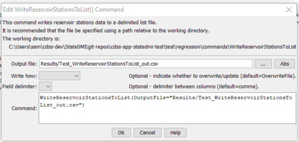

# StateDMI / Command / WriteReservoirStationsToList #

* [Overview](#overview)
* [Command Editor](#command-editor)
* [Command Syntax](#command-syntax)
* [Examples](#examples)
* [Troubleshooting](#troubleshooting)
* [See Also](#see-also)

-------------------------

## Overview ##

The `WriteReservoirStationsToList` command (for StateMod)
writes reservoir stations data to a delimited file.
In addition to the main station file,
files with suffixes `_Collections`, `_Accounts`, `_ContentAreaSeepage`, `_EvapStations`, and `_PrecipStations` are written, containing secondary station information.

## Command Editor ##

The following dialog is used to edit the command and illustrates the command syntax.

**<p style="text-align: center;">

</p>**

**<p style="text-align: center;">
`WriteReservoirStationsToList` Command Editor (<a href="../WriteReservoirStationsToList.png">see also the full-size image</a>)
</p>**

## Command Syntax ##

The command syntax is as follows:

```text
WriteReservoirStationsToList(Parameter="Value",...)
```
**<p style="text-align: center;">
Command Parameters
</p>**

| **Parameter**&nbsp;&nbsp;&nbsp;&nbsp;&nbsp;&nbsp;&nbsp;&nbsp;&nbsp;&nbsp;&nbsp;&nbsp; | **Description** | **Default**&nbsp;&nbsp;&nbsp;&nbsp;&nbsp;&nbsp;&nbsp;&nbsp;&nbsp;&nbsp;&nbsp;&nbsp;&nbsp;&nbsp;&nbsp;&nbsp; |
| --------------|-----------------|----------------- |
| `OutputFile`<br>**required** | The name of the output file to write, surrounded by double quotes. | None – must be specified. |
| `WriteHow` | `OverwriteFile` if the file should be overwritten or `UpdateFile` if the file should be updated, resulting in the previous header being carried forward. | `OverwriteFile` |
| `Delimiter` | The delimiter character to use between columns. | `,` (comma) |

## Examples ##

See the [automated tests](https://github.com/OpenCDSS/cdss-app-statedmi-test/tree/master/test/regression/commands/WriteReservoirStationsToList).

The following example illustrates how to create a list of diversion stations from a network file:

```
ReadReservoirStationsFromNetwork(InputFile="rg2007.net")
WriteReservoirStationsToList(OutputFile="rg2007.csv")
```

## Troubleshooting ##

## See Also ##

* [`ReadReservoirStationsFromStateMod`](../ReadReservoirStationsFromStateMod/ReadReservoirStationsFromStateMod.md) command
* [`WriteReservoirStationsToStateMod`](../WriteReservoirStationsToStateMod/WriteReservoirStationsToStateMod.md) command
