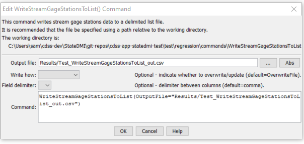

# StateDMI / Command / WriteStreamGageStationsToList #

* [Overview](#overview)
* [Command Editor](#command-editor)
* [Command Syntax](#command-syntax)
* [Examples](#examples)
* [Troubleshooting](#troubleshooting)
* [See Also](#see-also)

-------------------------

## Overview ##

The `WriteStreamGageStationsToList` command (for StateMod)
writes stream gage stations data to a delimited file.

## Command Editor ##

The following dialog is used to edit the command and illustrates the command syntax.

**<p style="text-align: center;">

</p>**

**<p style="text-align: center;">
`WriteStreamGageStationsToList` Command Editor (<a href="../WriteStreamGageStationsToList.png">see also the full-size image</a>)
</p>**

## Command Syntax ##

The command syntax is as follows:

```text
WriteStreamGageStationsToList(Parameter="Value",...)
```
**<p style="text-align: center;">
Command Parameters
</p>**

| **Parameter**&nbsp;&nbsp;&nbsp;&nbsp;&nbsp;&nbsp;&nbsp;&nbsp;&nbsp;&nbsp;&nbsp;&nbsp; | **Description** | **Default**&nbsp;&nbsp;&nbsp;&nbsp;&nbsp;&nbsp;&nbsp;&nbsp;&nbsp;&nbsp;&nbsp;&nbsp;&nbsp;&nbsp;&nbsp;&nbsp; |
| --------------|-----------------|----------------- |
| `OutputFile`<br>**required** | The name of the output file to write, surrounded by double quotes. | None – must be specified. |
| `WriteHow` | `OverwriteFile` if the file should be overwritten or `UpdateFile` if the file should be updated, resulting in the previous header being carried forward. | `OverwriteFile` |
| `Delimiter` | The delimiter character to use between columns. | `,` (comma) |

## Examples ##

See the [automated tests](https://github.com/OpenCDSS/cdss-app-statedmi-test/tree/master/test/regression/commands/WriteStreamGageStationsToList).

The following example illustrates how to create a list of stream gage stations from a network file:

```
ReadStreamGageStationsFromNetwork(InputFile="cm2005.net")
WriteStreamGageStationsToList(OutputFile="cm2005.ris.csv")
```

## Troubleshooting ##

## See Also ##

* [`ReadStreamGageStationsFromStateMoc`](../ReadStreamGageStationsFromStateMod/ReadStreamGageStationsFromStateMod.md) command
* [`WriteStreamGageStationsToStateMod`](../WriteStreamGageStationsToStateMod/WriteStreamGageStationsToStateMod.md) command
