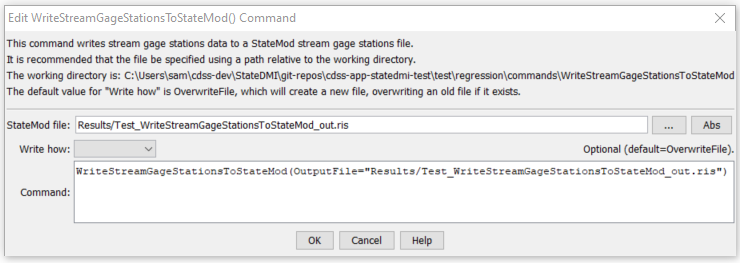

# StateDMI / Command / WriteStreamGageStationsToStateMod #

* [Overview](#overview)
* [Command Editor](#command-editor)
* [Command Syntax](#command-syntax)
* [Examples](#examples)
* [Troubleshooting](#troubleshooting)
* [See Also](#see-also)

-------------------------

## Overview ##

The `WriteStreamGageStationsToStateMod` command (for StateMod)
writes stream gage stations that have been defined to a StateMod stream gage stations file.

## Command Editor ##

The following dialog is used to edit the command and illustrates the command syntax.

**<p style="text-align: center;">

</p>**

**<p style="text-align: center;">
`WriteStreamGageStationsToStateMod` Command Editor (<a href="../WriteStreamGageStationsToStateMod.png">see also the full-size image</a>)
</p>**

## Command Syntax ##

The command syntax is as follows:

```text
WriteStreamGageStationsToStateMod(Parameter="Value",...)
```
**<p style="text-align: center;">
Command Parameters
</p>**

| **Parameter**&nbsp;&nbsp;&nbsp;&nbsp;&nbsp;&nbsp;&nbsp;&nbsp;&nbsp;&nbsp;&nbsp;&nbsp; | **Description** | **Default**&nbsp;&nbsp;&nbsp;&nbsp;&nbsp;&nbsp;&nbsp;&nbsp;&nbsp;&nbsp;&nbsp;&nbsp;&nbsp;&nbsp;&nbsp;&nbsp; |
| --------------|-----------------|----------------- |
| `OutputFile`<br>**required** | The name of the output file to write, surrounded by double quotes. | None – must be specified. |
| `WriteHow` | `OverwriteFile` if the file should be overwritten or `UpdateFile` if the file should be updated, resulting in the previous header being carried forward. | `OverwriteFile` |

## Examples ##

See the [automated tests](https://github.com/OpenCDSS/cdss-app-statedmi-test/tree/master/test/regression/commands/WriteStreamGageStationsToStateMod).

The following example command file illustrates the commands used to read stream gage stations from the network and create a StateMod file:

```
StartLog(LogFile="ris.commands.StateDMI.log")
# ris.commands.StateDMI
#
# StateDMI command file to create streamflow station file for the Colorado River
#
#  Step 1 - read streamgages and baseflows ids from the network file
#
ReadStreamGageStationsFromNetwork(InputFile="..\Network\cm2005.net",IncludeStreamEstimateStations="True")
#
#  Step 2 - read baseflow nodes names from HydroBase,
#           fill in missing names from the network file
#
FillStreamGageStationsFromHydroBase(ID="*",NameFormat=StationName,CheckStructures=True)
FillStreamGageStationsFromNetwork(ID="*",NameFormat="StationName")
#
#  Step 3 - set streamgage station to use to disaggregate monthly baseflows to daily
#
#  add set daily pattern gages for WD 36
SetStreamGageStation(ID="36*",DailyID="09047500",IfNotFound=Warn)
...many similar commands omitted...
#
#  Step 4 - create streamflow station file
#
WriteStreamGageStationsToStateMod(OutputFile="..\StateMod\cm2005.ris")
#
# Check the results
CheckStreamGageStations(ID="*")
WriteCheckFile(OutputFile="ris.commands.StateDMI.check.html")
```

## Troubleshooting ##

## See Also ##

* [`ReadStreamGageStationsFromStateMoc`](../ReadStreamGageStationsFromStateMod/ReadStreamGageStationsFromStateMod.md) command
* [`WriteStreamGageStationsToList`](../WriteStreamGageStationsToList/WriteStreamGageStationsToList.md) command
