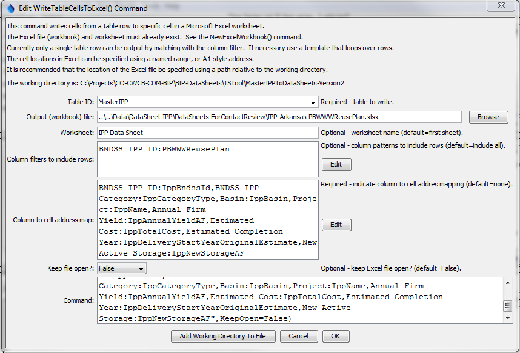

# StateDMI / Command / WriteTableCellsToExcel #

* [Overview](#overview)
* [Command Editor](#command-editor)
* [Command Syntax](#command-syntax)
* [Examples](#examples)
* [Troubleshooting](#troubleshooting)
* [See Also](#see-also)

-------------------------

## Overview ##

The `WriteTableCellsToExcel` command writes table row cells to a Microsoft Excel worksheet’s cells.
Currently cells from a single table row can be output.
The command is designed to populate named ranges in the Excel file,
for example to pre-populate a data-entry form.
Use this command in a template to iterate through rows in a table matched with separate Excel output files.

StateDMI uses the [Apache POI software](http://poi.apache.org) to read/write the
Excel file and consequently functionality is constrained by the features of that software package.

## Command Editor ##

The following dialog is used to edit the command and illustrates the syntax of the command.

**<p style="text-align: center;">

</p>**

**<p style="text-align: center;">
`WriteTableCellsToExcel` Command Editor (<a href="../WriteTableCellsToExcel.png">See also the full-size image</a>)
</p>**

## Command Syntax ##

The command syntax is as follows:

```text
WriteTableCellsToExcel(Parameter="Value",...)
```
**<p style="text-align: center;">
Command Parameters
</p>**

|**Parameter**&nbsp;&nbsp;&nbsp;&nbsp;&nbsp;&nbsp;&nbsp;&nbsp;&nbsp;&nbsp;&nbsp;&nbsp;&nbsp;&nbsp;&nbsp;&nbsp;&nbsp;&nbsp;&nbsp;&nbsp;&nbsp;&nbsp;&nbsp;&nbsp;&nbsp;|**Description**|**Default**&nbsp;&nbsp;&nbsp;&nbsp;&nbsp;&nbsp;&nbsp;&nbsp;&nbsp;&nbsp;&nbsp;&nbsp;&nbsp;&nbsp;&nbsp;&nbsp;&nbsp;&nbsp;&nbsp;&nbsp;&nbsp;&nbsp;&nbsp;&nbsp;&nbsp;&nbsp;&nbsp;|
|--------------|-----------------|-----------------|
|`TableID`<br>**required**|Identifier for table to write.|None – must be specified.|
|`ColumnIncludeFilters`|Indicate table column names and pattern to use to include rows, in order to match a single table row to output.  The format of the parameter is:<br>`ColumnName1:Pattern1,`<br>`ColumnName2:Pattern2,...`<br>where patterns can contain `*` to match a substring.  For example, if used with a template to loop through table rows, use to match a unique identifier value in a column.|Include all rows (which will generate an error if the number of rows is not equal to one)|
|`ColumnCellMap`<br>**required**|Indicate how to map table column names to Excel addresses.  The format of the parameter is:<br>`ColumnName1:ExcelAddress1,`<br>`ColumnName2:ExcelAddress2,...`<br>where the Excel addresses can be specified using `A1` notation, or named range.  The column names cannot be repeated.|None – must be specified.|
|`OutputFile`<br>**required**|The name of the Excel workbook file (`*.xls` or `*.xlsx`) to write, as an absolute path or relative to the command file location.  The Excel file must exist.  Use an [`NewExcelWorkbook`](../NewExcelWorkbook/NewExcelWorkbook) command to create an excel file if necessary.|None – must be specified.|
|`Worksheet`|The name of the worksheet in the workbook to write.  If the worksheet does not exist it will be created.|Write to the first worksheet.|
|`KeepOpen`|Indicate whether to keep the Excel file open (`True`) or close after creating (`False`).  Keeping the file open will increase performance because later commands will not need to reread the workbook.  Make sure to close the file in the last command that writes to the Excel file.|`False`|

## Examples ##

See the [automated tests](https://github.com/OpenCDSS/cdss-app-tstool-test/tree/master/test/regression/commands/general/WriteTableCellsToExcel).

## Troubleshooting ##

[See the main troubleshooting documentation](../../troubleshooting/troubleshooting.md)

## See Also ##

* [`NewExcelWorkbook`](../NewExcelWorkbook/NewExcelWorkbook) command
* [`ReadTableCellsFromExcel`](../ReadTableCellsFromExcel/ReadTableCellsFromExcel) command
