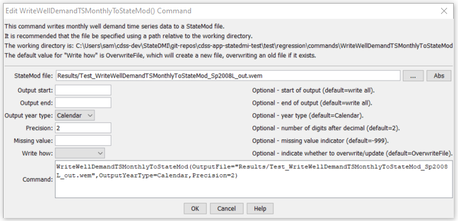

# StateDMI / Command / WriteWellDemandTSMonthlyToStateMod #

* [Overview](#overview)
* [Command Editor](#command-editor)
* [Command Syntax](#command-syntax)
* [Examples](#examples)
* [Troubleshooting](#troubleshooting)
* [See Also](#see-also)

-------------------------

## Overview ##

The `WriteWellDemandTSMonthlyToStateMod` command (for StateMod)
writes well demand time series (monthly) to a StateMod well demand time series file.

## Command Editor ##

The following dialog is used to edit the command and illustrates the command syntax.

**<p style="text-align: center;">

</p>**

**<p style="text-align: center;">
`WriteWellDemandTSMonthlyToStateMod` Command Editor (<a href="../WriteWellDemandTSMonthlyToStateMod.png">see also the full-size image</a>)
</p>**

## Command Syntax ##

The command syntax is as follows:

```text
WriteWellDemandTSMonthlyToStateMod(Parameter="Value",...)
```
**<p style="text-align: center;">
Command Parameters
</p>**

| **Parameter**&nbsp;&nbsp;&nbsp;&nbsp;&nbsp;&nbsp;&nbsp;&nbsp;&nbsp;&nbsp;&nbsp;&nbsp; | **Description** | **Default**&nbsp;&nbsp;&nbsp;&nbsp;&nbsp;&nbsp;&nbsp;&nbsp;&nbsp;&nbsp;&nbsp;&nbsp;&nbsp;&nbsp;&nbsp;&nbsp; |
| --------------|-----------------|----------------- |
| `OutputFile` | The name of the output file to write, surrounded by double quotes. | None – must be specified. |
| `OutputStart` | The start date to write, using format `YYYY-MM` or `MM/YYYY` | Full period will be written. |
| `OutputEnd` | The end date to write, using format `YYYY-MM` or `MM/YYYY`. | Full period will be written. |
| `OutputYearType` | The output year type to write, one of:<ul><li>`Calendar` – January to December.</li><li>`NovToOct` – November to October.</li><li>`Water` – October to September.</li></ul> | Calendar, or the value set by the previous [`SetOutputYearType`](../SetOutputYearType/SetOutputYearType.md) command. |
| `Precision` | The number of digits after the decimal to write. | `2` |
| `MissingValue` | The value to write for missing data. | `-999` |
| `WriteHow` | `OverwriteFile` if the file should be overwritten or `UpdateFile` if the file should be updated, resulting in the previous header being carried forward. | `OverwriteFile` |

## Examples ##

See the [automated tests](https://github.com/OpenCDSS/cdss-app-statedmi-test/tree/master/test/regression/commands/WriteWellDemandTSMonthlyToStateMod).

## Troubleshooting ##

[See the main troubleshooting documentation](../../troubleshooting/troubleshooting.md)

## See Also ##

* [`ReadWellDemandTSMonthlyFromStateMod`](../ReadWellDemandTSMonthlyFromStateMod/ReadWellDemandTSMonthlyFromStateMod.md) command
* [`SetOutputYearType`](../SetOutputYearType/SetOutputYearType.md) command
