# StateDMI / Getting Started #

This chapter provides an overview of the StateDMI graphical user interface (GUI),
also referred to as user interface (UI).
The StateDMI UI has the following main purposes:

1. Provide an organized list of menus to facilitate configuration of command lists (workflows) to create StateCU and StateMod data files.
2. Manage and run command workflows.
3. Provide general reusable tools to process StateCU and StateMod data.
4. Display and edit the model network used to define the connectivity of locations used in StateCU and StateMod datasets.
5. Display the results of command workflow processing.
6. Provide automation and quality control tools to streamline dataset creation.

The remainder of this chapter provides an overview of the UI, generally in the order of the interface features and menus.
Menu items are listed in alphabetical order or by functional order (i.e., in the order that model files should typically be created).

* [Starting StateDMI](#starting-statedmi)
* [Select HydroBase Dialog](#select-hydrobase-dialog)
* [Main Interface](#main-interface)
* [File Menu - Main Input and Output Control](#file-menu-main-input-and-output-control)
* [Edit Menu - Editing Commands](#edit-menu-editing-commands)
* [View Menu - Enable/Disable Display Features](#view-menu-enabledisable-display-features)
* [Commands Menu - Insert Commands for Processing Data Components](#commands-menu-insert-commands-for-processing-data-components)
* [Run Menu - Running Commands](#run-menu-running-commands)
* [Results Menu - View Dataset and Command Results](#results-menu-view-dataset-and-command-results)
* [Tools Menu](#tools-menu)
* [Help Menu](#help-menu)

------------------

##  Starting StateDMI ##

StateDMI can be started on Windows using ***Start / CDSS / StateDMI-Version***.
The menus vary slightly depending on the operating system version.

To process a command file in batch mode, use a command line similar to the following:

```
statedmi –commands commands.statedmi
```

It is customary to name command files with a `.statedmi` file extension
(the mixed-case `.StateDMI` file extension was used prior to version 5.00.00.
It may be necessary to specify a full (absolute) path to the command file when
running in batch mode in order for StateDMI to fully understand the working directory.

StateDMI provides features for StateCU and StateMod datasets, but not both at the same time.
Start StateDMI for the appropriate model as shown in the next section,
or use the ***File / Switch to StateMod*** or ***File / witch to StateCU*** menus.
If data files from one model are used by the other,
StateDMI will provide appropriate features for both models for the specific data files.

## Select HydroBase Dialog ##

A HydroBase database selector will be displayed at startup
because one of the main input sources for StateDMI is the State of Colorado’s HydroBase database.
A HydroBase database can also be selected from the ***File / Open / HydroBase...*** menu.

**<p style="text-align: center;">
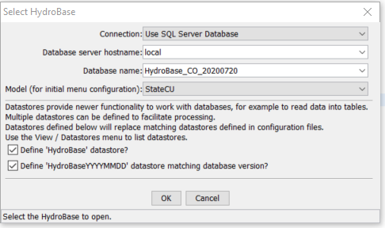
</p>**

**<p style="text-align: center;">
Select HydroBase Database Dialog
</p>**

HydroBase is available on DVD from the Division of Water Resources.
Future software updates may allow StateDMI to access the database over the internet.
In 2005 the Microsoft Access version of HydroBase was phased out in favor
of MSDE (did not allow a single database to contain all State data),
which has subsequently been replaced with SQL Server Express
(allows the full Colorado database to be distributed).

If there is access to a SQL Server HydroBase server,
select ***Use SQL Server Database***,
in which case the database hostname is automatically determined from a
predefined list – type in a new name if appropriate.
The login can be canceled,
in which case HydroBase features will be disabled but you will be able to work with other data sources.

If a previous HydroBase connection has been made, then ***Cancel*** reverts to that connection.

See also the [Installation and Configuration Appendix](../appendix-install/install.md)
for information about the CDSS configuration file, which can be used to set HydroBase selection defaults.

## Main Interface ##

The StateDMI main interface is divided into the following areas:

* ***Title Bar*** (top)
* ***Menu Bar*** (below title)
* ***Tool Bar*** (below menu bar)
* ***Commands*** list (middle)
* ***Results*** (below commands)
* ***Status Message*** areas (bottom)
* ***Map*** (under development, as separate window)
* ***Model Network*** (as a separate window)

After starting the software, the main interface will be blank, as shown in the following figure:

**<p style="text-align: center;">
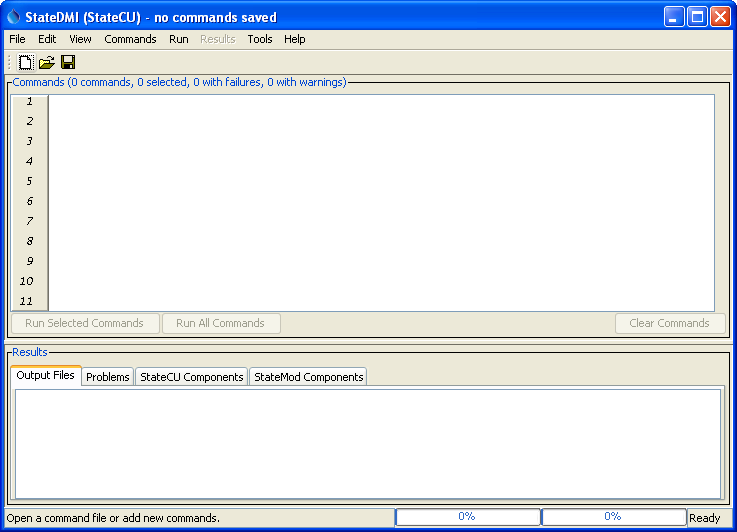
</p>**

**<p style="text-align: center;">
StateDMI Interface after Startup (<a href="../Main0.png">see also the full-size image</a>)
</p>**

At this point, new commands can be added to the ***Commands*** list using the ***Commands*** menu,
or an existing command file can be opened (***File / Open / Command File***).
Commands, once visible, can be edited and run.
After opening a command file,
the interface will appear similar to the following (the title bar displays the name
of the command file and the ***Commands*** area title displays the status of the current commands list).

**<p style="text-align: center;">
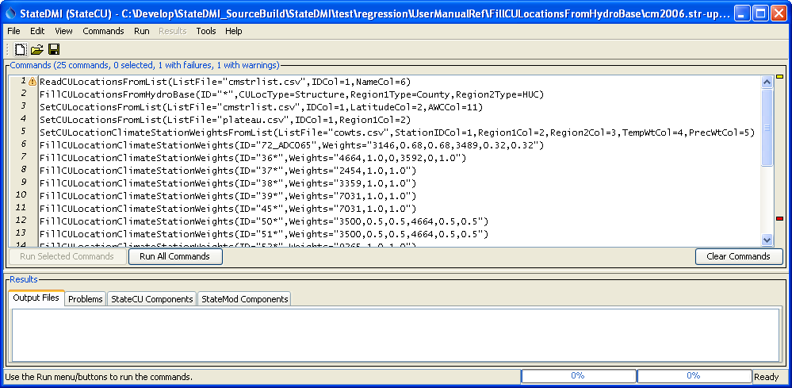
</p>**

**<p style="text-align: center;">
StateDMI Interface after Loading a Commands File (<a href="../Main1.png">see also the full-size image</a>)
</p>**

After loading the command file,
StateDMI executes an initialization phase where each command is checked for basic errors.
In the above example, a warning (yellow marker) and failure (red marker) are shown because
the indicated commands reference files or folders that do not exist.
These issues will need to be addressed before a complete run can occur.
The following sections summarize the main GUI features.

### Title Bar ###

The title bar at the top of the StateDMI interface indicates whether StateCU or StateMod commands are being edited,
indicates the name of the command file, and whether changes to commands have been made.

**<p style="text-align: center;">

</p>**

**<p style="text-align: center;">
StateDMI Title Bar (<a href="../Main_Title.png">see also the full-size image</a>)
</p>**

### Menu Bar ###

The menu bar provides access to all the StateDMI features.
StateDMI menus are generally consistent with standard Windows software and are summarized below.
Each menu is described in detail starting with
[***File Menu - Main Input and Output Control***](#file-menu-main-input-and-output-control) section.

| **Menu** | **Description** |
| -- | -- |
| ***File*** | Open and save datasets and commands files, select databases, select whether StateCU or StateMod files are being processed.  See the [File Menu](#file-menu-main-input-and-output-control) section. |
| ***Edit*** | Cut/copy/paste and delete commands.  See the [Edit Menu](#edit-menu-editing-commands) section. |
| ***View*** | Toggle visual components (e.g., map, network) on/off.  See the [View Menu](#view-menu-enabledisable-display-features) section. |
| ***Commands*** | Insert and edit commands to generate StateCU and StateMod model files.  The sub-menus are specific to the model, although some general commands are present for each model’s menus.  See the [Commands Menu](#commands-menu-insert-commands-for-processing-data-components) section. |
| ***Run*** | Run commands to produce model output files and other data products.  See the [Run Menu](#run-menu-running-commands) section.  Users typically use the run buttons at the bottom of the ***Commands*** area. |
| ***Results*** | Display the results of processing commands.  The menus are currently disabled.  Instead, the overall results are typically written to model files and can be viewed as files or in tabular format by selecting a component at the bottom of the main window.  See the [Results Menu](#results-menu-view-dataset-and-command-results) section. |
| ***Tools*** | Display diagnostics.  See the [Tools Menu](#tools-menu) section. |
| ***Help*** | Display program version and support information.  See the [Help Menu](#help-menu) section. |

### Tool Bar ###

The tool bar provides graphical shortcuts to facilitate common actions:

**<p style="text-align: center;">
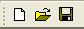
</p>**

**<p style="text-align: center;">
StateDMI Tool Bar (<a href="../Main_Toolbar.png">see also the full-size image</a>)
</p>**

The following tools are available in the toolbar:

| **Tool Icon** | **Description** |
| -- | -- |
|  | Open a new blank command file.  If changes to the current command file have occurred, the user is given the option of saving the current file.  This is the same as ***File / New / Command File***. |
| 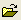 | Open an existing command file.  If changes to the current command file have occurred, the user is given the option of saving the current file.  This is the same as ***File / Open / Command File***. |
| 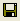 | Save changes to the current command file.  This is the same as ***File / Save…Command File***. |

### Commands List ###

The ***Commands*** list occupies the middle part of the main interface and
contains commands that can be processed to create StateCU and StateMod data files.

**<p style="text-align: center;">
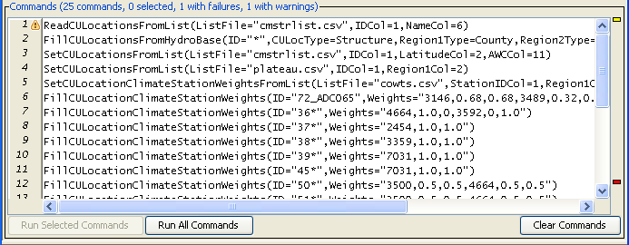
</p>**

**<p style="text-align: center;">
Commands List (<a href="../Main_Commands.png">see also the full-size image</a>)
</p>**

The title for the ***Commands*** list indicates the number of commands,
the number of commands selected from, and whether any commands have failures or warnings.
Some interface features (e.g., editing, inserting new commands) operate on selected commands.
The ***Commands*** list behaves according to Windows conventions:

* Single-click to select one item.
* Ctrl-single-click to additionally select an item.
* Shift-single-click to select everything between the previous selection and the current selection.
* Double-click to display the command editor for the selected command.

Right-clicking over the ***Commands*** list displays a pop-up menu with useful command manipulation choices,
some of which are further described in following sections
(e.g., edit menu choices are discussed in the [Edit Menu](#edit-menu-editing-commands) section.
A summary of the pop-up menu choices is as follows:

| **Menu Choice** | **Description** |
| -- | -- |
| ***Show Command Status (Success/Warning/Failure)*** | Displays a summary of problems encountered with the command, and recommendations for correcting the problems. |
| ***Edit*** | Edit the selected command using an edit dialog, which provides error checks and formats the commands.  Double-clicking on a command will also display the command editor. |
| ***Cut*** | Cut the selected commands for pasting. |
| ***Copy*** | Copy the selected commands for pasting. |
| ***Paste (After Selected)*** | Paste commands that have been cut/copied, pasted after the selected row. |
| ***Delete*** | Delete the selected commands (currently the same as ***Cut***). |
| ***Find commands(s) using substring…*** | Find commands in the command list using a substring.  This displays a dialog to enter the substring; press ***Enter*** and then the right-click in the found items list to go to or select found items. |
| ***Find command using line number…*** | Find a command using a line number.  This is useful when correcting a command that generated an error during processing. |
| ***Select All*** | Select all the commands. |
| ***Deselect All*** | Deselect all the commands.  This is useful when inserting commands at the end of the list. |
| ***Convert Selected Commands to # Comments*** | Convert selected commands to # comments. |
| ***Convert Selected Commands from # Comments*** | Convert # comments to commands. |
| ***Run All Commands (create all output)*** | Run all commands and create output (e.g., files).  This is equivalent to using the ***Run All Commands*** in the ***Commands*** list area. |
| ***Run All Commands (ignore output commands)*** | Run all commands but skip any output commands.  This is useful for testing data processing steps but final output is not yet needed. |
| ***Run Selected Commands (create all output)*** | Run selected commands and create output (e.g., files).  This is equivalent to using the ***Run Selected Commands*** in the ***Commands*** list area. |
| ***Run Selected Commands (ignore output commands)*** | Run selected commands but skip any output commands.  This is useful for testing data processing steps but final output is not yet needed. |
| ***Cancel Command Processing*** | If commands are currently being processed, this allows the processing to be cancelled.  The current command being processed will finish before action is taken. |

Commands are numbered to simplify editing.
The command list also includes left and right gutters to display graphics that help with error handling.
The following figure illustrates a command workflow with errors.

**<p style="text-align: center;">
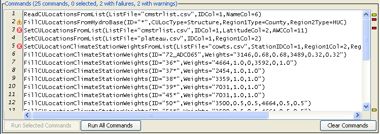
</p>**

**<p style="text-align: center;">
Command List Illustrating Error (<a href="../Main_Commands_Error.png">see also the full-size image</a>)
</p>**

The following error handling features are available:

* Clicking on the left gutter will hide and un-hide the gutter.
* The graphic in the left gutter indicates the severity of a problem (see below for full explanation).
* The colored box on the right indicates the severity of a problem and,
when clicked on, positions the visible list of commands to display the command corresponding to the problem.
* Commands have three phases:  1) initialization, 2) discovery, 3) run.
Initialization occurs when reading a command file or adding a new command.
The discover phase is executed only for commands that generate information for other commands needed during editing,
such as lists of identifiers (discovery is not often used in StateDMI but is used extensively in the TSTool software).
The run phase is when commands are processed to generate results.
* Positioning the mouse over a graphic in the left or right gutter will show a popup message with the problem information.
The popup is only visible for a few seconds so use the right-click popup menu
***Show Command Status (Success/Warning/Failure)*** for a dialog that does not automatically disappear.
See also the ***Results*** area ***Problems*** tab.

The meaning of the gutter symbols is described in the following table.

**<p style="text-align: center;">
Command List Error Handling Graphics
</p>**

| **Command List Left Gutter Graphic** | **Description** |
| -- | -- |
| No graphic | Command is successful (a warning or failure has not been detected).
|  | The status is unknown, typically because the status will not be known until a command runs.
|  | The command has a problem that has been classified as non-fatal.  For example, a command to fill data may be used but results in no data being filled.  In general, commands with warnings need to be fixed unless work is preliminary.
|  | The command has failed, meaning that output is likely incomplete.  A problem summary and recommendation to fix the problem are available in the status information.  Commands with failures generally need to be fixed.  Software support should be contacted if the fix is not evident.

### Results ###

The ***Results*** area shows the results of processing commands.

**<p style="text-align: center;">
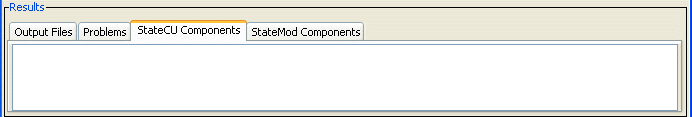
</p>**

**<p style="text-align: center;">
StateDMI Results Area (<a href="../Main_Results_Choices.png">see also the full-size image</a>)
</p>**

Results can generally be displayed as output files and a component table,
and a summary of problems is also provided.  See below for more information.

#### Results – Output Files ####

The main purpose of StateDMI is to prepare dataset files with command workflows.
The resulting model files may be long, complex, and difficult to review.
However, an experienced user may simply want to scroll through the StateDMI
output files and visually scan the data for completeness and accuracy.
To facilitate this approach, the list of files created during commands processing is
displayed and can be selected from the ***Output Files*** tab in the ***Results*** area.
Selecting an output file causes an appropriate software tool to open based on file extension.
Additional files can be selected if desired, with each being displayed in a separate `Notepad` window.
Currently, only files created during processing are listed (additional input files are not listed).

#### Results – Problems ####

The ***Problems*** tab in the results area displays a summary of problems from all commands.

**<p style="text-align: center;">
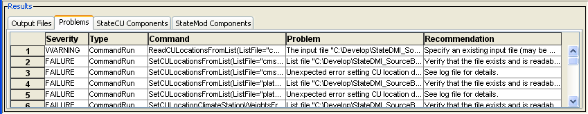
</p>**

**<p style="text-align: center;">
StateDMI Results - Problems (<a href="../Main_Results_Problems.png">see also the full-size image</a>)
</p>**

This summary may be easier to use than individually displaying the status for each command with a problem.
In the future, functionality may be enabled to click on a row and select the offending command in the command list.
See also the `Check*` commands and the [`WriteCheckFile`](../command-ref/WriteCheckFile/WriteCheckFile.md) command,
which will create a check file in CSV and HTML format.

#### Results – StateCU and StateMod Components ####

Another option for viewing data is to display tabular records of the results, by dataset component.
To do so, select from the lists in the ***StateCU Components*** and ***StateMod Components*** tabs.
For most command files, only one list will have choices but in some cases both lists may have choices.
StateDMI internally manages data for each model.
After making a selection, a simple tabular display will be shown, as in the following figure.
The columns are typically shown in the order listed in the model documentation, in order to agree with model file output.

**<p style="text-align: center;">
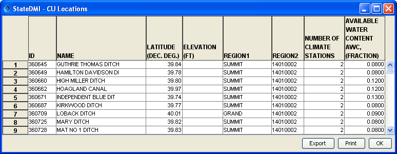
</p>**

**<p style="text-align: center;">
Example Tabular Results Display (<a href="../Main_Results_CULocations.png">see also the full-size image</a>)
</p>**

The data shown in the table can be viewed, copied to other applications, saved to a file, and printed.
Printing may not provide the best representation of the data, especially if the table is very wide.
Consequently, the file representation of results (in the ***Output Files*** tab)
may be more appropriate for printing.
Columns can be sorted by right clicking on a column heading and picking the sort order.
Note that some output files may correspond to multiple components.
This occurs when a file has a complex structure that cannot easily be flattened into a single table.

#### Status Message Areas ####

The title bar and status message areas provide useful information about the current state of the interface and command list.

**<p style="text-align: center;">
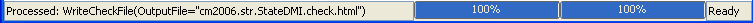
</p>**

**<p style="text-align: center;">
Status Message Area (<a href="../Main_Status.png">see also the full-size image</a>)
</p>**

The status message area at the bottom of the StateDMI interface is split into three parts:

1. The left-most part is used to display general messages.
For example, if commands are being run, this area indicates the command that is being processed.
2. The second part shows two progress bars that are updated when processing commands.
The left progress bar shows the overall progress in the command file (percent of commands that have been processed).
The right progress bar shows the progress within the command – this capability is only enabled in some commands that take longer to run.
3. The right-most status field provides a one-word status indicating when you should wait.
The command processor is implemented as a separate thread in the program.
Consequently, when commands are being processed, the application does not totally freeze while work occurs.
Because it is possible to perform other tasks while the commands are being processed,
an hourglass cursor is not used during processing and instead the progress meter
and the one-word status should be used to know if commands are currently being processed.

#### Map (Under Development) ####

The map interface uses a general mapping component available in other CDSS software.
See the GeoView Mapping Tools Appendix in the TSTool software documentation for more information.
The map interface is not currently integrated with StateDMI commands but is
used to provide a reference of features that may be modeled with StateCU and StateMod.
To display a map, use the ***File / Show Map*** menu described below.
Then select a GeoView project file (`.gvp`).
For example, select the same project file used by the StateMod GUI.
The use of the map interface is being evaluated.

## File Menu - Main Input and Output Control ##

The File menu provides standard input and output features as described below.

**<p style="text-align: center;">
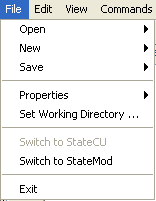
</p>**

**<p style="text-align: center;">
File Menu (<a href="../Menu_File.png">see also the full-size image</a>)
</p>**

### File / Open Menu ###

The ***File / Open*** menu allows opening input sources.

**<p style="text-align: center;">
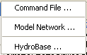
</p>**

**<p style="text-align: center;">
File…Open Menu (<a href="../Menu_File_Open.png">see also the full-size image</a>)
</p>**

The ***File / Open…Command File*** menu allows an existing command file to be opened.
A new command file can be started using the ***File / New / Command File*** menu item or corresponding tool on the tool bar.

The ***File / Open…Model Network*** allows a model network to be viewed and saved (see
[Updating an old Makenet Network to New Format](#updating-an-old-makenet-network-to-new-format) section and later).

The ***File / Open / HydroBase*** menu opens a connection the HydroBase database
(see [Select HydroBase Dialog](#select-hydrobase-dialog)).

### File / New ###

The ***File / New*** menu allows creation of a new command file and model network
(see [Updating an old Makenet Network to New Format](#updating-an-old-makenet-network-to-new-format) section and later
for more information about the network).

**<p style="text-align: center;">
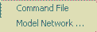
</p>**

**<p style="text-align: center;">
File / New Menu
(<a href="../Menu_File_New.png">see also the full-size image</a>)
</p>**

### File / Save ###

The ***File / Save*** menu saves the contents of the ***Commands*** list.

**<p style="text-align: center;">
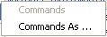
</p>**

**<p style="text-align: center;">
File / Save Menu (<a href="../Menu_File_Save.png">see also the full-size image</a>)
</p>**

If a new command file has been started, a prompt will be shown to specify a file name to save.
The commands can also be saved to a new file.

### File / Properties ###

The ***File / Properties / HydroBase*** menu displays the following dialog,
which is available if a HydroBase connection has been made.
The properties show HydroBase database information,
including the database that is being used, database version,
and the water districts that are in the database being queried.
The water districts are determined from the structure table in HydroBase.
The information that is shown is consistent with that shown by other State of Colorado tools and is useful for troubleshooting.

**<p style="text-align: center;">
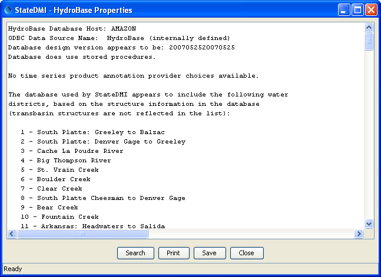
</p>**

**<p style="text-align: center;">
HydroBase Properties (<a href="../Menu_File_HydroBaseProperties.png">see also the full-size image</a>)
</p>**

### File / Set Working Directory ###

The ***File / Set Working Directory*** menu item displays a file chooser
dialog that allows you to select the working directory.
The working directory, when set properly,
can greatly simplify command files because relative file paths can be used for input and output.
The working directory is normally set in one of the following ways,
with the current setting being defined by the most recent item that has occurred:

1. The startup directory for the StateDMI program,
2. The directory where a command file was opened,
3. The directory where a command file was saved,
4. The directory specified by a [`SetWorkingDir`](../command-ref/SetWorkingDir/SetWorkingDir.md) command,
5. The directory specified by ***File / Set Working Directory***.

The menu item is provided to allow the working directory to be set before a command
file has been saved (or opened) and it typically eliminates the need for
[`SetWorkingDir`](../command-ref/SetWorkingDir/SetWorkingDir.md) commands in command files.

### File / Switch to StateCU and File / Switch to StateMod ###

The ***File / Switch to StateCU*** menu switches the StateDMI interface to operate on a StateCU dataset.
The ***File / Switch to StateMod*** menu switches the StateDMI interface to operate on a StateMod dataset.
These menus are necessary because StateDMI is designed to only show one model’s features at a time.
A noticeable change in behavior is that the ***Commands*** menu choices will reflect commands for the active model.

### File…Exit ###

The ***File / Exit*** menu exits StateDMI, which displays a confirmatione prompted to confirm the exit.
If you have edited the command list you will be prompted to save the commands.

## Edit Menu - Editing Commands ##

The ***Edit*** menu can be used to edit the ***Commands*** list.  Specific edit features are described below.
Right clicking over the ***Commands*** list provides a popup menu with many choices described below.

**<p style="text-align: center;">
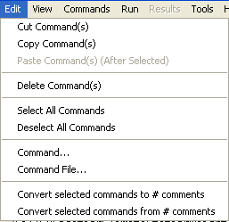
</p>**

**<p style="text-align: center;">
Edit Menu (<a href="../Menu_Edit.png">see also the full-size image</a>)
</p>**

### Cut/Copy/Paste/Delete ###

The ***Edit / Cut and Edit / Copy*** menu items are enabled if there are items in the ***Commands*** list.
Cut deletes the selected item(s) from the ***Commands*** list and saves its information in memory.
Copy just saves the information in memory.
After ***Cut*** or ***Copy*** is executed, select an item in the ***Commands*** list and use Paste (see below).
Currently, these features do not allow interaction with other applications.
However, ***Ctrl-c*** and ***Ctrl-v*** do work with many text entry fields in StateDMI.

***Paste*** is enabled if one or more items from the ***Commands*** list has been cut or copied.
To paste the item, select an item in the ***Commands*** list and press ***Edit / Paste Command(s) (After Selected)***.
The new item will be added after the selected item(s).
To insert at the front of the list, you must paste after the first item,
and then cut and paste the first item to reverse the order.

The ***Delete*** menu item currently works exactly like the ***Cut*** menu item.

### Select All/Deselect All Commands ###

The ***Edit / Select All Commands*** and ***Edit / Deselect All Commands*** menu
items are enabled if there are items in the ***Commands*** list.
Use these menus to facilitate editing.
Refer to the ***Commands*** list title to see how many commands are currently selected.

### Edit Command ###

The ***Edit / Command...*** menu can be used to edit an individual command.
StateDMI will determine the command that is being edited and will display
the editor dialog for that command, performing data checks.
This feature is also accessible by right clicking on the ***Commands*** list and selecting the ***Edit Command...*** menu item
and by double-clicking on a command in the ***Commands*** list.

### Edit Command File ###

The ***Edit / Command File*** menu choice can be used to edit a commands file using Notepad.
Currently, there is no way to change the editor.
The command file must be re-read into StateDMI after using the editor
in order for StateDMI to recognize the commands in the file.

### Convert Selected Commands To/From Comments ###

The ***Edit / Convert selected commands to # comments*** menu item can be used to toggle selected
commands in the ***Commands*** list to comments (lines that begin with `#`).
This is useful when temporarily disabling commands, rather than deleting them.

The ***Edit…Convert selected commands from # comments*** menu can be used to toggle selected
commands in the ***Commands*** list from comments back to active commands.
This is useful when re-enabling commands that were temporarily disabled.

Multi-line `/* */` comment notation can be inserted using the ***Commands…General – Comments***  menu item.

## View Menu - Enable/Disable Display Features ##

The ***View*** menu enables and disables important StateDMI display features.

**<p style="text-align: center;">
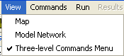
</p>**

**<p style="text-align: center;">
View Menu (<a href="../Menu_View.png">see also the full-size image</a>)
</p>**

The ***View...Map*** menu item can be used to display a map.
Currently this feature is under development.
Use the file selector dialog to open a GeoView project file (`.gvp`).
See the GeoView Mapping Tools Appendix in the TSTool documentation for more information about mapping tools.
Map features are envisioned to be enhanced in future software releases.
GeoView project files are available for StateView and StateMod datasets and can be selected to display in StateDMI.

The ***View…Model Network*** menu item displays a StateMod model network and allows edits to the network.
A model network represents the rivers and model nodes in a diagram,
where the geographical representation of rivers have been straightened and oriented to facilitate presentation of the network.
StateDMI commands can then extract station lists from the network for processing into data files.
See the [StateMod Model Network Editor](#statemod-model-network-editor) section for more information.

The ***Three-level Commands Menu*** option allows switching the command menu format.
This option is available primarily for developers and the default setting should not normally be changed.

### Updating an old Makenet Network to New Format ###

**This section may be moved given that Makenet networks should have been updated for each basin.**

Previously, the Makenet program was used to process a model network and produce StateMod model files.
The disadvantage of this approach was that the network file needed to be manually edited
(there was no graphical user interface) and the format of the file sometimes resulted in errors.
StateDMI understands how to read the old Makenet network file;
consequently, the older files should be updated to the new convention to
take advantage of new features and simplify maintenance.
To update an old Makenet file to the new format:

1. If necessary, for an existing dataset, rename the old `*.net` file to another name (e.g., `XXX_orig.net`).
In many cases, StateDMI will be used to create an updated dataset and
therefore a rename is unnecessary because old and new files are in different directories.
2. Select the ***File / Open / Model Network*** menu item and select the old Makenet `*.net` file.
3. The StateDMI software will read the Makenet network file and display the network in a diagram window.
During this process, a number of pieces of information are lost,
including stream labels (now drawn with annotations),
and page size (now setup as a layout).
See the next section for information about editing the network.
Also during this step, adjustments to the network are made.
For example, blank nodes are removed since they are no longer needed.
Confluence nodes are explicitly represented in the network because they are needed for visualization.
Some node types like `Import` are converted to `Other` – all node types in the network now
correspond to a station type in StateMod datasets.
The coordinates that are used after this step are those defined in the Makenet file – it is envisioned
that the coordinates could be scaled to physical coordinates like UTM to allow overlaying spatial data layers.
4. After the network is displayed, use the ***Save XML Network File*** tool in the network editor
to save the representation to a new network file.
The file name can adhere to the same naming convention as before (use `*.net`).
5. To modify the network, use the features described in the [StateMod Model Network Editor](#statemod-model-network-editor) section.

Below is an example from a new generalized network file.
The file format is XML (eXtensible Markup Language),
which is free format and allows new properties to be added as needed.
Although the file can be modified with an editor,
the graphical network editor should be used in most cases in order to enforce data conventions.
The following example serves as the documentation for the network
file format and the format is described in the comments at the top of the file.

```
<!--
#>
#>  StateMod XML Network File
#>
#>  File generated by...
#>  program:      StateDMI 3.08.00 (2009-06-10)
#>  user:         rrb
#>  date:         Mon Jun 15 17:37:05 MDT 2009
#>  host:         DWRDENRRBXPPC2
#>  directory:    D:\Cdss\Data\Sp2008L\StreamSW
#>  command line: StateDMI
#>
#> The StateMod XML network file is a generalized representation
#> of the StateMod network.  It includes some of the information
#> in the StateMod river network file (*.rin) but also includes
#> spatial layout information needed to produce a diagram of the
#> network.  The XML includes top-level properties for the
#> network, and data elements for each node in the network.
#> Each network node is represented as a single XML element
#> Node properties are stored as property = "value".
#>
#> Node connections are specified by either a
#>      <DownstreamNode ID = "Node ID"/>
#> or
#>      <UpstreamNode ID = "Node ID"/>
#> tag.  There may be more than one upstream node, but at most
#> one downstream node.
#>
#> The XML network is typically created in one of three ways:
#>
#> 1) An old "makenet" (*.net) file is read and converted to
#> XML (e.g., in StateDMI).  In this case, some internal
#> identifiers (e.g., for confluence nodes) will be defaulted in
#> order to have unique identifiers, and the coordinates will be
#> those from the Makenet file, in order to preserve the diagram
#> appearance from in the original Makenet file.
#>
#> 2) A StateMod river network file (*.rin) file is converted to
#> XML (e.g., by StateDMI).  In this case, confluence nodes will
#> not be present and StateDMI can be used to set the coordinates
#> to actual physical coordinates (e.g., UTM).  The coordinates
#> in the diagram will need to be repositioned to match a
#> straight-line representation, if such a representation is
#> desired.
#>
#> 3) A new network is created entirely within the StateDMI or
#> StateModGUI interface.  In this case, the positioning of nodes
#> can occur as each node is defined in the network, or can occur
#> at the end.
#>
#> Once a generalized XML network is available, StateDMI can be
#> used to create StateMod station files.  The node type and the
#> "IsNaturalFlow" property are used to determine lists of
#> stations for various files.
#>
#> The following properties are used in this file.  Elements are
#> indicated in <angle brackets> with element properties listed
#> below each element.
#>
#> NOTE:
#>
#> If any of the following have an ampersand (&), greater than (>)
#> or less than (<) in them, these values MUST be escaped (see
#> below):
#>    - Page Layout ID
#>    - Node ID
#>    - Downstream Node ID
#>    - Upstream Node ID
#>    - Link Upstream Node ID
#>    - Link Downstream Node ID
#>    - Annotation Text
#>
#> The escape values are the following.  These are automatically
#> inserted by the network-saving software, if the characters are
#> inserted when editing a network programmatically, but if the
#> network is edited by hand they must be inserted manually.
#>
#>    &   ->   &amp;
#>    >   ->   &gt;
#>    <   ->   &lt;
#>
#> <StateMod_Network>     Indicates the bounds of network
#>                        definition
#>
#>    XMin                The minimum X coordinate used to
#>                        display the network, determined from
#>                        node coordinates.
#>
#>    YMin                The minimum Y coordinate used to
#>                        display the network, determined from
#>                        node coordinates.
#>
#>    XMax                The maximum X coordinate used to
#>                        display the network, determined from
#>                        node coordinates.
#>
#>    YMax                The maximum Y coordinate used to
#>                        display the network, determined from
#>                        node coordinates.
#>
#>    LegendX             The X coordinate of the lower-left point
#>                        of the legend.
#>
#>    LegendY             The Y coordinate of the lower-left point
#>                        of the legend.
#>
#>    <PageLayout>        Indicates properties for a page layout,
#>                        resulting in a reasonable representation
#>                        of the network in hard copy.  One or
#>                        more page layouts may be provided in
#>                        order to support printing on various
#>                        sizes of paper.
#>
#>       IsDefault        Indicates whether the page layout is the
#>                        one that should be loaded automatically
#>                        when the network is first displayed.
#>                        Only one PageLayout should have
#>                        this with a value of "True".
#>                        Recognized values are:
#>                           True
#>                           False
#>
#>       PaperSize        Indicates the paper size for a page
#>                        layout.  Recognized values are:
#>                           11x17     - 11x17 inches
#>                           A         - 8.5x11 inches
#>                           B         - 11x17 inches
#>                           C         - 17x22 inches
#>                           D         - 22x34 inches
#>                           E         - 34x44 inches
#>                           Executive - 7.5x10 inches
#>                           Legal     - 8.5x14 inches
#>                           Letter    - 8.5x11 inches
#>
#>       PageOrientation  Indicates the orientation of the printed
#>                        page.  Recognized values are:
#>                           Landscape
#>                           Portrait
#>
#>       NodeLabelFontSize Indicates the size (in points) of the
#>                        font used for node labels.
#>
#>       NodeSize         Indicates the size (in points) of the
#>                        symbol used to represent a node.
#>
#>    <Node>              Data element for a node in the network.
#>
#>       ID               Identifier for the node, matching the
#>                        label on the diagram and the identifier
#>                        in the StateMod files.  It is assumed
#>                        that the station identifier and river
#>                        node identifier are the same.  The
#>                        identifier usually matches a State of
#>                        Colorado WDID, USGS gage ID, or other
#>                        standard identifier that can be queried.
#>                        Aggregate or "other" nodes use
#>                        identifiers as per modeling procedures.
#>
#>       Area             The natural flow contributing area.
#>
#>       AlternateX       The physical coordinates for the node,
#>       AlternateY       typically the UTM coordinate taken from
#>                        HydroBase or another data source.
#>
#>       Description      A description/name for the node,
#>                        typically taken from HydroBase or
#>                        another data source.
#>
#>       IsNaturalFlow    If "true", then the node is a location
#>                        where stream flows will be estimated
#>                        (and a station will be listed in the
#>                        StateMod stream estimate station file).
#>                        This property replaces the old IsBaseflow property.
#>
#>       IsImport         If "true", then the node is an import
#>                        node, indicating that water will be
#>                        introduced into the stream network at
#>                        the node.  This is commonly used to
#>                        represent transbasin diversions.  This
#>                        property is only used to indicate how
#>                        the node should be displayed in the
#>                        network diagram.
#>
#>       LabelPosition    The position of the node label, relative
#>                        to the node symbol.  Recognized values
#>                        are:
#>                           AboveCenter
#>                           UpperRight
#>                           Right
#>                           LowerRight
#>                           BelowCenter
#>                           LowerLeft
#>                           Left
#>                           UpperLeft
#>                           Center
#>
#>       Precipitation    The natural flow contributing area precipitation .
#>
#>       Type             The node type.  This information is used
#>                        by software like StateDMI to extract
#>                        lists of nodes, for data processing.
#>                        Recognized values are:
#>                           Confluence
#>                           Diversion
#>                           Diversion and Well
#>                           End
#>                           Instream Flow
#>                           Other
#>                           Reservoir
#>                           Streamflow
#>                           Well
#>                           XConfluence
#>
#>       X                The coordinates used to display the node
#>       Y                in the diagram.  These coordinates may
#>                        match the physical coordinates exactly,
#>                        may be interpolated from the coordinates
#>                        of neighboring nodes, or may be the
#>                        result of an edit.
#>
#>       <DownstreamNode> Information about nodes downstream
#>                        from the current node.  This information
#>                        is used to connect the nodes in the
#>                        network and is equivalent to the
#>                        StateMod river network file (*.rin)
#>                        "cstadn" data.  Currently only one
#>                        downstream node is allowed.
#>
#>          ID            Identifier for the node downstream from
#>                        the current node.
#>
#>       <UpstreamNode>   Information about nodes upstream from the
#>                        current node.  Repeat for all nodes
#>                        upstream of the current node.
#>
#>          ID            Identifier for the node upstream from
#>                        the current node.
#>
#>    <Annotation>        Data element for a network annotation.
#>
#>          FontName      The name of the font in which the
#>                        annotation is drawn.  Recognized values
#>                        are:
#>                           Arial
#>                           Courier
#>                           Helvetica
#>
#>          FontSize      The size of the font in which the
#>                        annotation is drawn.
#>
#>          FontStyle     The style of the font in which the
#>                        annotation is drawn.  Recognized values
#>                        are:
#>                           Plain
#>                           Italic
#>                           Bold
#>                           BoldItalic
#>
#>          Point         The point at which to draw the
#>                        annotation.  The value of "Point"
#>                        must be two numeric values separated by
#>                        a single comma.  E.g:
#>                           Point="77.44,9.0"
#>
#>          ShapeType     The type of shape of the annotation.
#>                        The only recognized value is:
#>                           Text
#>
#>          Text          The text to be drawn on the network.
#>
#>          TextPosition  The position the text will be drawn,
#>                        relative to the "Point" value.
#>                        Recognized values are:
#>                           AboveCenter
#>                           UpperRight
#>                           Right
#>                           LowerRight
#>                           BelowCenter
#>                           LowerLeft
#>                           Left
#>                           UpperLeft
#>                           Center
#>
#>    <Link>              Data element for a network link.
#>
#>          FromNodeID    The ID of the node from which the link
#>                        is drawn.
#>
#>          LineStyle     The style in which the link line is
#>                        drawn.  The only recognized value is:
#>                           Dashed
#>
#>          ShapeType     The type of shape being drawn.  The only
#>                        recognized value is:
#>                           Link
#>
#>          ToNodeID      The ID of the node to which the link
#>                        is drawn.
#>
#>
#> EndHeader
-->
<StateMod_Network
    XMin = "-550.000000"
    YMin = "-425.000000"
    XMax = "1650.000000"
    YMax = "1275.000000"
    LegendX = "1274.000000"
    LegendY = "-63.000000">
    <PageLayout ID = "Page Layout #1"
        IsDefault = "true"
        PaperSize = "E"
        PageOrientation = "Landscape"
        NodeLabelFontSize = "12"
        NodeSize = "14"/>
    <PageLayout ID = "Page Layout #2"
        IsDefault = "False"
        PaperSize = "D"
        PageOrientation = "Landscape"
        NodeLabelFontSize = "10"
        NodeSize = "20"/>
    <PageLayout ID = "Page Layout #3"
        IsDefault = "False"
        PaperSize = "B"
        PageOrientation = "Portrait"
        NodeLabelFontSize = "10"
        NodeSize = "14"/>
    <PageLayout ID = "Page Layout #4"
        IsDefault = "False"
        PaperSize = "C"
        PageOrientation = "Landscape"
        NodeLabelFontSize = "10"
        NodeSize = "20"/>
    <PageLayout ID = "Page Layout #5"
        IsDefault = "False"
        PaperSize = "D"
        PageOrientation = "Landscape"
        NodeLabelFontSize = "10"
        NodeSize = "20"/>
    <Node ID = "64_AWP003"
         AlternateX = "-999.0"
         AlternateY = "-999.0"
         Description = ""
         IsBaseflow = "false"
         IsNaturalFlow = "false"
         IsImport = "false"
         LabelPosition = "AboveCenter"
         Type = "Well"
         X = "1523.958333"
         Y = "565.291667">
        <DownstreamNode ID = "06764000"/>
    </Node>

    <Node ID = "64_AWP002"
         AlternateX = "-999.0"
         AlternateY = "-999.0"
         Description = ""
         IsBaseflow = "false"
         IsNaturalFlow = "false"
         IsImport = "false"
         LabelPosition = "BelowCenter"
         Type = "Well"
         X = "1527.083333"
         Y = "380.916667">
        <DownstreamNode ID = "64_AWP004"/>
    </Node>

    <Node ID = "64_AWP004"
         AlternateX = "-999.0"
         AlternateY = "-999.0"
         Description = ""
         IsBaseflow = "false"
         IsNaturalFlow = "false"
         IsImport = "false"
         LabelPosition = "AboveCenter"
         Type = "Well"
         X = "1526.562500"
         Y = "413.208333">
        <DownstreamNode ID = "64_AWP005"/>
        <UpstreamNode ID = "64_AWP002"/>
    </Node>

... many nodes omitted ...

    <Node ID = "END"
         AlternateX = "-999.0"
         AlternateY = "-999.0"
         Description = ""
         IsBaseflow = "false"
         IsNaturalFlow = "false"
         IsImport = "false"
         LabelPosition = "AboveCenter"
         Type = "End"
         X = "1600.000000"
         Y = "524.041667">
        <UpstreamNode ID = "6499999"/>
    </Node>

    <Annotation
         ShapeType="Text"
         Text="SPDSS Lower South Platte River Basin Water Resources Planning Model"
         Point="594.431373,1053.161477"
         TextPosition="Center"
         FontName="Helvetica"
         FontStyle="Plain"
         FontSize="72"/>

... many annotations omitted ...

    <Link
         ShapeType="Link"
         LineStyle="Dashed"
         FromNodeID="0100513"
         ToNodeID="Jackson_I"/>

... many links omitted ...

</StateMod_Network>
```

### Manually Creating a New StateMod Generalized Network ###

If a new model dataset is being prepared (or a network for an existing dataset cannot be created in an automated way),
a generalized network can be manually created using the following steps.
In this process, each node must be added to the network.

1. Before creating the network in StateDMI, it is useful to have an idea of the general layout of the network,
where the streams in the dataset follow the general geographical orientation.
If the river basin runs north south, then a portrait page orientation should be used.
If the basin runs east/west, then a landscape page orientation should be used.
2. After StateDMI has started, use the ***File / New / Model Network*** menu item.
A network editor window will be shown, with only a page outline, legend, and end node.
3. The network editor requires that a page size and orientation be specified
see the [StateMod Model Network Editor](#statemod-model-network-editor) section for information about ***Page Properties***.
To start, pick a page layout that will be used for editing and hardcopy review.
If the network has many nodes, it may be necessary to pick a page size for a plotter (if a plotter is available).
If the network has only a few nodes, then 8.5x11 or 11x17 page size may be sufficient.
4. Add a node by right clicking on the end node and selecting Add Upstream Node.
Repeat as many times as necessary to complete the network.
During this process, it may be necessary to change the printed
node and font sizes appropriate for the hardcopy network.
See also other network editor features described in the
[StateMod Model Network Editor](#statemod-model-network-editor) section, which may be used to position nodes.
5. Use the Save As XML tool at the top of the network editor to save the network file.
This file can then be used by StateDMI commands and can be opened later with
***File / Open / Model Network***.

The above procedure initializes a StateMod generalized network.
Once created, the network editor features can be used to change the network.

### Automatically Creating a New StateMod Generalized Network ###

Features to automate creation of a network have been tested during StateDMI development.
However, various technical issues still remain and these features are not available for production work.
The basic procedure is envisioned to use the following steps:

1. Determine a list of stations to be modeled (e.g., from HydroBase).
2. Query location coordinates (e.g., latitude/longitude or UTM) and
upstream/downstream relationships (e.g., from HydroBase and/or NHD [National Hydrography Dataset])
and create a network based on physical coordinates (stored in the “alternate coordinates” in the network file).
3. As appropriate, utilize existing and new network editor features to adjust the
network diagram to be more readable and suitable for modeling.
For example, separate nodes that may be too close together to read labels.
The network node coordinates will therefore reflect user edits,
but the original “alternate” coordinates will still be available and could be used to draw a geographical representation of the network.

Use of NHD may facilitate referencing diversion, reservoir, stream gages, and other locations to rivers,
thus allowing automated determination of upstream to downstream relationships.
However, this information is currently available in CDSS only on a limited basis
and therefore the automated creation of the network has not been possible.

### Creating a New StateMod Generalized Network from an Existing StateMod River Network File ###

If an existing StateMod dataset has no corresponding Makenet `*.net` file,
it is possible to create a generalized network file from the StateMod river network file (`*.rin`).
However, StateDMI features to do so have been tested only during development and technical issues remain.
The basic procedure is envisioned to use the following steps:

1. Read the list of stations to be modeled from the StateMod `*.rin` river network file.
This supplies upstream/downstream relationships but does not provide coordinates for the network.
2. Query location coordinates (e.g., latitude/longitude or UTM) from HydroBase
and create a network based on physical coordinates (stored in the “alternate coordinates” in the network file).
Interpolate missing coordinates.
3. As appropriate, utilize existing and new network editor features to adjust
the network diagram to be more readable and suitable for modeling.
For example, separate nodes that may be too close together to read labels.

The above capabilities are available on a limited basis with current StateDMI commands.
However, all technical issues have not been resolved and therefore these features are currently not utilized in production.

### StateMod Model Network Editor ###

The ***View / Model Network*** menu item displays the editor window for the StateMod generalized model network (`*.net`).
This editor is available in StateDMI to make adjustments to the model network before file generation.
It is also available in the StateMod GUI, for small adjustments to the dataset.
It is envisioned that the network editor will continue to be used with StateDMI
for configuration model networks and be used to a lesser extent in the StateMod GUI for editing.
It is also envisioned that additional tools will be added to the
network editor to allow for more targeted use in StateDMI, and StateMod GUI,
for example to display the return flow locations, and to display the stations that are referenced in an operating rule.

To use the network editor to adjust an existing model network, use the following basic steps:

1. Select the ***View…Model Network*** menu item and select the network (`*.net`) file to be edited.
2. The network file will be read and displayed in the editor window (see below).
3. Use the editor to add, delete, or move stations (nodes), or change the information associated with the nodes.
Also add annotations for stream names and main titles (see below for more information).
4. Use the ***Save XML Network File*** tool to resave the file.
This file can then be used with `ReadXXXStationsFromNetwork` commands when processing data.
5. Repeat any of the steps, as necessary.

Several issues must currently be considered when using the network editor:

1. When the XML file is written, the header contains the last command file that is run.
If these commands contain strings that are prohibited in XML,
errors may occur when the network file is read for processing.
In particular, lines of dashes `-----` are prohibited, even in comments in the commands file.
StateDMI will try to remove offending text when writing the XML file, but additional cases may arise.
The workaround is to edit the XML file and remove the commands from the header.
2. It is envisioned that an integrated approach can be taken where the network that is
opened can be used in modeling without supplying a file name for the network file.
Therefore, some commands will process the in memory network if it has been opened.
This approach is being evaluated.
However, if a command reads a network file during processing and the network display is open,
the network display is not currently automatically refreshed.
Although it is envisioned that the visual representation of the network is fully integrated with commands processing,
keeping the steps separate at this time is probably wise, to avoid confusion.
In other words, edit the network interactively and save the result, and then specify the file name in commands.

The following figure shows the network editor after a network file has been read and displayed:

**<p style="text-align: center;">
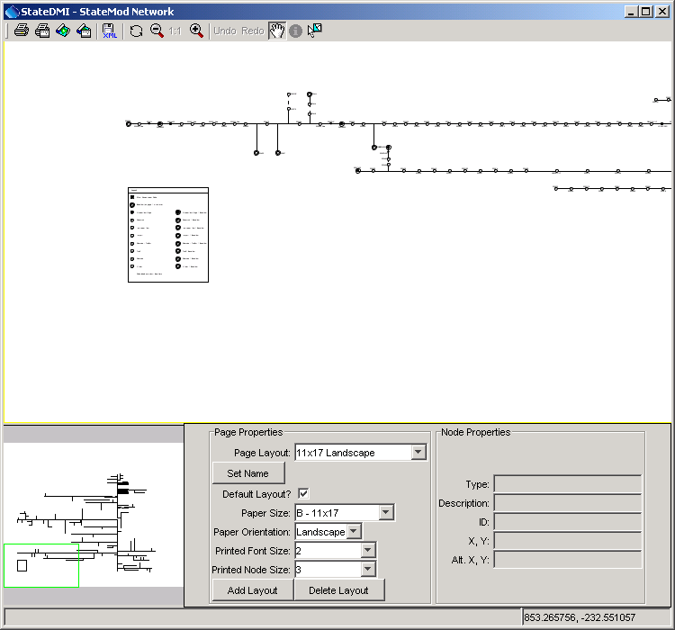
</p>**

**<p style="text-align: center;">
Network Editor (<a href="../NetworkEditor.png">see also the full-size image</a>)
</p>**

The network editor consists of the following areas:

* Tools (top) – initiate actions (e.g., printing), switch mode, edit tools
* Main canvas (middle) – area where editing occurs
* Overview/reference window (lower left) – indicates the current view as a subset of the total network
* Page properties (lower middle) – the settings used for the network display, if printed
* Node properties (lower right) – the properties of the node that was last selected.

#### Tools ####

The tools that are available include the following:

| **Tool Icon** | **Description** |
| -- | -- |
| 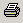 | Print the entire network using the selected layout (page size, orientation, etc.)  This is useful for generation of final products. |
|  | Print the visible network using letter-sized paper.  This is useful for troubleshooting or reviewing specific parts of the network. |
| 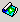 | Save the entire network to an image file. |
| 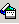 | Save the visible network extent to an image file.  This is useful for creating inserts for documents. |
| 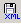 | Save the network to the XML file. |
| 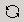 | Refresh the network (redraw). |
|  | Zoom out by 50%, based on the current extent. |
| 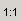 | Reset the scale to match the layout. |
|  | Zoom in by 50%, based on the current extent. |
| 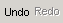 | If a node position has changed, allow it to be undone (or redone). |
| 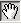 | Pan the visible extent of the network – currently this is the default when clicking on other than a node. |
|  | Information tool – currently unused.  It is envisioned that this tool could be enabled to show model-related data from a dataset. |
| 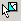 | Select a feature – currently this is the default when clicking on a node. |

#### Main Canvas ####

The main canvas displays the network for the current scale and location.
Use the tools to scroll, pan, or zoom to a specific region.

To move an existing node, select it with the mouse and drag to the new location.
Use the ***Undo/Redo*** tool if necessary to discard a change.

See sections below for information about adding/moving/deleting nodes and other actions.

Right-clicking on the canvas (not near a node), displays the following menu:

**<p style="text-align: center;">
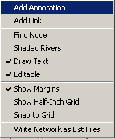
</p>**

**<p style="text-align: center;">
Network Editor Popup Menu (<a href="../NetworkEditor_Popup.png">see also the full-size image</a>)
</p>**

NetworkEditor_Popup

The actions for the menu items are described in the following table.

**<p style="text-align: center;">
Network Editor Popup Menu Items
</p>**

| **Menu Item** | **Action** |
|--|--|
| ***Add Annotation*** | Add an annotation at the point where the mouse was clicked.  See the [Adding/Deleting/Changing Annotations](#addingdeletingchanging-annotations) section below. |
| ***Add Link*** | Add a link between nodes.  See the [Adding/Deleting Links](#addingdeleting-links) section below. |
| ***Find Node*** | Display the following dialog, listing all nodes in the network.<br>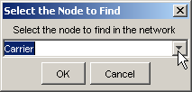<br>After selecting a node and pressing ***OK***, the network will scroll so that the selected node is in the center of the network window. |
| ***Shaded Rivers*** | If selected, shade the rivers based on stream order.  This is useful to emphasize upstream to downstream progression. |
| ***Draw Text*** | If selected, draw text labels on the network.  Text can be turned off if only the lines need to be printed. |
| ***Editable*** | If selected, the network is editable.  If it is important to protect a network from editing, the network can be made non-editable.  Editing actions will then be prohibited in the session. |
| ***Show Margins*** | If selected, the page margins are shown, representing an approximate boundary within which drawing should be limited.  It is recommended that network features not extend into the margins. |
| ***Show Half-Inch Grid*** | If selected, a grid of lines will be drawn at half-inch intervals.  This is useful for layout purposes. |
| ***Snap to Grid*** | If selected, nodes will be restricted to being positioned on grid lines. |
| ***Write Network as List Files*** | Prompt for a base file name and then write delimited list files for each station type, to be used as lists of stations with commands files.  Each file is listed in order of upstream to downstream.  This recognizes that it can be more generic to use list files with StateDMI processing, rather than reading from the network itself.  This approach is being evaluated as list files are used.  Issues to be resolved include:<ol><li>`DIV` and `D&W` nodes both exist in the network and are written as separate lists.  Therefore two commands may be needed when processing the lists.</li><li>Stream gages (`FLO` nodes) are written as one list and baseflow stations (`FLO` and other stations where baseflow is `True`) are written as separate lists.  Users must decide which list to use.</li></ol> |

#### Overview/Reference Window ####

The overview window indicates the current extent of the network in the main canvas.

**<p style="text-align: center;">
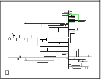
</p>**

**<p style="text-align: center;">
Network Editor Overview (<a href="../NetworkEditor_Overview.png">see also the full-size image</a>)
</p>**

Click anywhere in the overview window to center the main canvas view on that point.
Or, drag the overview window extent box to a new location to reposition the network in the main canvas.

#### Page Properties ####

The page properties can be set for multiple layouts using the ***Page Properties*** settings.

**<p style="text-align: center;">
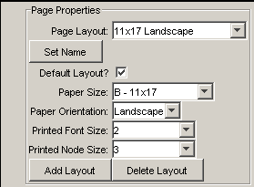
</p>**

**<p style="text-align: center;">
Network Editor Page Properties(<a href="../NetworkEditor_PageProperties.png">see also the full-size image</a>)
</p>**

Because one of the primary products related to the network is a printed network diagram,
the network is configured as a document.
Therefore, the graphics and text on the diagram are scaled
(unlike some map and graph displays where the text point size is constant even when the data scale changes).

Modelers responsible for datasets should define one or more layouts
for the network to allow printing on common page sizes.
Often, there is so much detail on the network that a hard copy can only be printed on large paper sizes.
However, more unreadable versions may be appropriate for review.
Once layouts are defined, only minor changes should be required.
It is recommended that the ***Page Layout*** name include the page size and orientation.

Network editing should typically occur using the page layout that will be used in production printouts.
Differences in the relative dimensions of page sizes can cause some scaling in output when switching between layouts.

#### Node Properties ####

The node properties area in the network editor shows the node properties for the most recently selected node.

**<p style="text-align: center;">
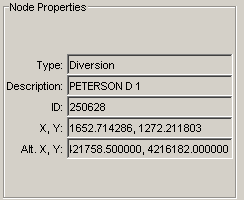
</p>**

**<p style="text-align: center;">
Network Editor Node Properties (<a href="../NetworkEditor_NodeProperties.png">see also the full-size image</a>)
</p>**

This is useful when scanning network node information.  See the next section for information about changing node properties.

#### Adding/Deleting/Changing a Node ####

To add a node, select a node, right click, and press ***Add Upstream Node***.
The following dialog is then used to enter information about the new node (see below for information about changing node properties).

**<p style="text-align: center;">
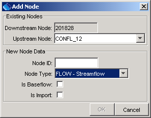
</p>**

**<p style="text-align: center;">
Add Node Dialog (<a href="../NetworkEditor_Popup_AddNode.png">see also the full-size image</a>)
</p>**

To delete a node, select a node, right-click, and press ***Delete Node***.
Currently you are not given the chance to cancel and the ***Undo/Redo*** tool does not apply.

A node is moved by selecting the node on the network and dragging to a new location.
To move multiple nodes draw a box around nodes and then move the group.
Node properties for an existing node are edited by selecting a node in the network,
right clicking, and pressing the ***Properties*** menu item, which will display a dialog similar to the following:

**<p style="text-align: center;">
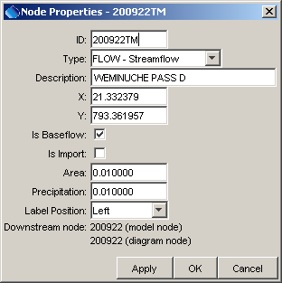
</p>**

**<p style="text-align: center;">
Node Properties Dialog (<a href="../NetworkEditor_Popup_NodeProperties.png">see also the full-size image</a>)
</p>**

The node types correspond either to StateMod station types or to node types needed for visualization (e.g., confluences),
which are not transferred to StateMod files.
Although the Makenet software allowed `Import` and `Baseflow` node types,
these types are no longer supported.
Instead, node types correspond to StateMod station types, with the `Other` node type used where needed.
The ***Is Baseflow*** check indicates that ***Area*** and ***Precipitation*** information are
available for the node – these data are used when processing stream estimate stations.

#### Adding/Deleting/Changing Annotations ####

Annotations are text labels that can be drawn on the network.
They are typically used for title, author, revision date, stream names, etc., using font sizes appropriate for the information.

To add an annotation, right-click at a point of interest (not near a node)
and select the ***Add Annotation*** menu item, which will display the following dialog:

**<p style="text-align: center;">

</p>**

**<p style="text-align: center;">
Add Annotation (<a href="../NetworkEditor_Popup_AddAnnotation.png">see also the full-size image</a>)
</p>**

Pressing ***OK*** displays the annotation text centered at the point where the mouse was clicked.
Once an annotation is added, it can be moved and its properties can be set
by right clicking on the annotation anchor point and pressing ***Properties***:

**<p style="text-align: center;">
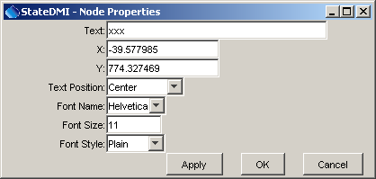
</p>**

**<p style="text-align: center;">
Annotation Properties (<a href="../NetworkEditor_Popup_AnnotationProperties.png">see also the full-size image</a>)
</p>**

An annotation can be moved by selecting the annotation and dragging it to the new location.

An annotation can be deleted by right clicking on the annotation and pressing the ***Delete Annotation*** menu item.

#### Adding/Deleting Links ####

Links are dashed lines between nodes,
typically used to represent an operational relationship between nodes (e.g., to represent carrier ditches).
Annotations can be placed next to links to describe the link.

To add a link, right-click on the network (not near a node) and use the ***Add Link*** menu item.  The following dialog will be shown:

**<p style="text-align: center;">
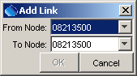
</p>**

**<p style="text-align: center;">
Add Link (<a href="../NetworkEditor_Popup_AddLink.png">see also the full-size image</a>)
</p>**

After selecting nodes and pressing ***OK***, the link will be drawn between the nodes as a straight dashed line.

To delete the link, select one of the nodes involved in the link, right-click and select ***Delete Link***.
If the node is involved in more than one link, a list of links will be shown.

#### Printing the Network ####

To print the entire network, use the  tool and follow the procedure described below.
To save the visible network as an image, use the  tool and follow the procedure described below.
Note that when printing, curved graphics are drawn using a technique called “anti-aliasing,”
where curves are created by using shades of gray.
This may result in graphics that are difficult to read for some page sizes.

When the print tools are used, several dialogs are shown, as required by the Java and Microsoft environments.
Although options are available in various dialogs, the following approach is recommended (improvements are being evaluated):

1. After selecting one of the tools mentioned above, a Java Page Setup dialog will be shown (this should be the same regardless of Windows version):<br>
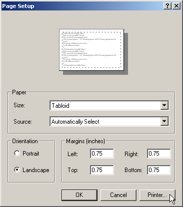<br>
Select the printer of interest by using the ***Printer...*** button, as discussed in the next item.
2. A Windows ***Page Setup*** dialog will be shown:<br>
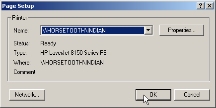<br>
Pick a printer that can handle the page size specified in the current network editor page layout and press ***OK***.
3. In the original dialog, select the paper size to match the current network layout and press ***OK***:
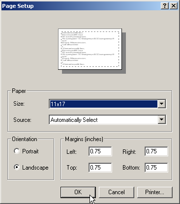
4. A Windows Print dialog will be shown:
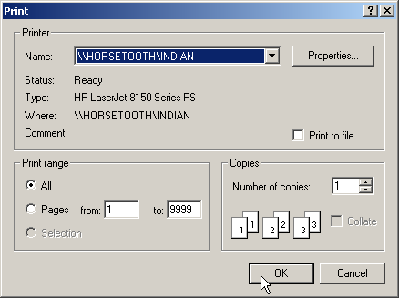<br>
DO NOT change the printer settings.  Simply press ***OK*** to finish printing.

#### Saving the Network as an Image ####

To save the entire network as an image,
use the   tool and select an image file.
To save the visible network as an image, use the  tool and select an image file.

## Commands Menu - Insert Commands for Processing Data Components ##

The ***Commands*** menu lists groups of related commands that can be used to process model data.
The contents of the ***Commands*** menu will be appropriate for each model.
For example, the top level menu for StateCU is as follows:

**<p style="text-align: center;">

</p>**

**<p style="text-align: center;">
Commands Menu for StateCU (<a href="../Menu_Commands_StateCU.png">see also the full-size image</a>)
</p>**

The general guidelines for data and menus are:

* Components are grouped according to physical data and identify a primary component for each group,
which will supply the identifiers and names for individual data objects.
For example, for Climate Stations Data, StateCU has a climate stations file,
which has identifiers and names for climate stations.
This component is the primary component in the “Climate Stations Data” group.
The secondary components are time series data at each station.
* As much as possible, groups and components are listed according to dependency and processing order.
For example, for StateCU, the CU Locations Data includes files that use crop types.
The definitions of crop types are stored in a separate file.
Because the CU Locations files use the crop types, and therefore depend on their definitions,
crop data are listed before CU Locations data.
The recommended order is not required; however, it provides some structure to creating a dataset.

In some cases, selecting a data component menu will display a dialog indicating that the files
for that component cannot be prepared with StateDMI and instead should be prepared with TSTool,
a spreadsheet, or some other software.
The intent of the StateDMI menus is to show all data components in order to
help the user create a complete dataset; however, other software may be required.

The sub-menus for a data component provide specific commands for the file that is being processed.
Each sub-menu lists commands that can be inserted into the ***Commands*** list,
which can then be processed to produce output.  For example, the menu for ***Climate Stations*** is:

**<p style="text-align: center;">
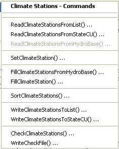
</p>**

**<p style="text-align: center;">
Commands / Climate Stations Data…Climate Stations Menu
(<a href="../Menu_Commands_ClimateStations.png">see also the full-size image</a>)
</p>**

The menus for a specific data component typically include commands to read the list of objects,
set additional information, fill missing data,
perform calculations (if appropriate), write output, and check the data.

To edit an existing command, select the command in the ***Commands*** list and then
use the right-click ***Edit*** menu or the ***Edit / Command*** menu (or double-click on the command).
This will display a command editor specific to the command, with access to documentation for the command.

To insert a new command at the end of the ***Commands*** list:

1. Make sure that no commands are selected in the ***Commands*** list
(see the title above the ***Commands*** list, which indicates if commands are selected).
2. Select the appropriate command menu and edit the command.
After pressing OK in the command dialog, the command will be inserted at the end of the ***Commands*** list.

To insert a new command before an existing command in the ***Commands*** list:

1. Select the command in the ***Commands*** list to insert before.
2. Select the appropriate command menu and edit the command.
After pressing ***OK*** in the command dialog,
the command will be inserted before the first selected command in the ***Commands*** list.

The [Creating StateCU Dataset Files](../statecu/statecu.md) and
[Creating StateMod Dataset Files](../statemod/statemod.md) chapters
discuss the sequence of commands that can be used to create model files.
The [Commands Reference](../command-ref/overview.md) describes each command and the dialog that is used to edit the command.

### General Commands ###

General commands are listed under the ***Commands / General – ...*** menus and can be used with any model.

**<p style="text-align: center;">
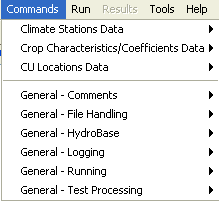
</p>**

**<p style="text-align: center;">
Commands / General Menu (<a href="../Menu_Commands_General.png">see also the full-size image</a>)
</p>**

Single-line comments in commands files start with the `#` character and can be used to document commands.
Multi-line comments start with the `/*` characters and end with `*/` (a convention used in C, C++, C#, Java,
and other programming languages).
Multi-line comments are useful for commenting out blocks of commands.
The following dialog is used to edit one or more `#` comment lines:

**<p style="text-align: center;">
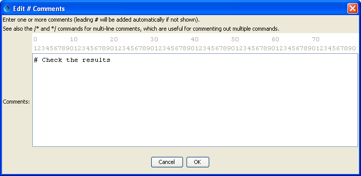
</p>**

**<p style="text-align: center;">
`#` Comment Dialog (<a href="../c_comment.png">see also the full-size image</a>)
</p>**

A menu choice is also available to insert a `#@readOnly` comment – this will alert StateDMI to
warn the user if they try to save the file.
This special comment is useful for protecting command files that should not be edited.

#### General Commands – File Handling ####

File handling commands are useful for testing and other data management tasks.

The [`MergeListFileColumns`](../command-ref/MergeListFileColumns/MergeListFileColumns.md)
command is useful when processing list files.
For example, the StateView software can be used to export a list of structures,
were the identifiers use separate WD and ID columns.
These columns can then be merged to produce a single WDID column, which can be processed by StateDMI to create model files.

#### General Commands – HydroBase ####

The [`OpenHydroBase`](../command-ref/OpenHydroBase/OpenHydroBase.md) command programmatically
opens a connection to a HydroBase database.
This is useful if data from two databases need to be combined
(open a connection, read data, open a new connection, read from the second database).

#### General Commands – Logging ####

The [`StartLog`](../command-ref/StartLog/StartLog.md) command can be used to start a log file,
which records processing steps and is useful in troubleshooting.
Saving a specific log file also allows a comparison of data processing at different times.
It is recommended that log files have the same name as the command file,
with an optional date/time and the additional file extension `*.log`.

The [`SetDebugLevel`](../command-ref/SetDebugLevel/SetDebugLevel.md) and
[`SetWarningLevel`](../command-ref/SetWarningLevel/SetWarningLevel.md) commands are usually only used in troubleshooting.

#### General Commands – Running ####

The [`RunCommands`](../command-ref/RunCommands/RunCommands.md) command can be used to run one command file within another.
This is useful for automated testing.

The [`RunProgram`](../command-ref/RunProgram/RunProgram.md) and
[`RunPython`](../command-ref/RunPython/RunPython.md) commands are used to run external programs.

The [`Exit`](../command-ref/Exit/Exit.md) command is useful for skipping over the last commands in a workflow,
without having to comment them out.

The [`SetWorkingDir`](../command-ref/SetWorkingDir/SetWorkingDir.md) command is generally
not used but is provided for backward compatibility.

#### General Commands – Test Processing ####

Test processing commands are used to validate the StateDMI software and standard workflow processes.
See the [Quality Control](../quality-control/quality-control.md) chapter for more information.

## Run Menu - Running Commands ##

The ***Run*** menu processes the commands in the ***Commands*** list.
Menu items similar to the following are also available in a popup menu by right clicking on the ***Commands*** list.

**<p style="text-align: center;">
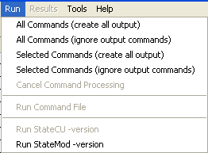
</p>**

**<p style="text-align: center;">
Run Menu (<a href="../Menu_Run.png">see also the full-size image</a>)
</p>**

The ***Run / All Commands (create all output)*** menu will process the commands in the ***Commands*** list and create output if appropriate.
For example, the `Write*` commands will write the data objects that are in memory to files.

The ***Run / All Commands (ignore output commands)*** menu will process the commands in the ***Commands*** list,
ignoring commands that generate output products.
This is useful when testing data processing commands and the (usually) slow write commands can be skipped.

The ***Run / Selected Commands (create all output)*** and ***Run…Selected Commands (create all output)***
menus are similar to the above; however, only commands that are selected will be run.

The ***Run / Cancel Command Processing*** menu item is enabled if commands are currently being processed.
Use this menu item to cancel processing (e.g., if the commands result in excessive output or processing time).
Processing will stop after the currently running command finishes.

The ***Run / Command File*** choice will run a commands file without making the results available in the interface.
This feature is not yet implemented.

The ***Run / StateCU -version*** menu runs the StateCU model in order to display its version.
This is useful when troubleshooting problems.
This menu item is currently disabled because the StateCU model does not have a version option.

The ***Run / StateMod -version*** menu runs the StateMod model in order to display its version.
This is useful when troubleshooting problems.
However, it relies on StateMod being in the `PATH`, which may not be the case.

Select the ***Help…About*** menu to determine the version of StateCU and StateMod that was used when developing StateDMI.
Changes to the model file formats for other versions may not be recognized in StateDMI.

## Results Menu - View Dataset and Command Results ##

The ***Results*** menu is currently disabled.
It is envisioned as a way to view dataset components from a dataset or commands processing.

The alternative is to select results in ***Results*** area in the bottom of the main window, which provides access to all results.

## Tools Menu ##

The ***Tools*** menu lists tools that perform useful tasks.
Some of the menu items have been added to help during development.

**<p style="text-align: center;">
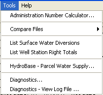
</p>**

**<p style="text-align: center;">
Tools Menu (<a href="../Menu_Tools.png">see also the full-size image</a>)
</p>**

The ***Tools / Administration Number Calculator…***  menu can be used to convert between
the State of Colorado’s administration numbers and appropriation dates.
Administration numbers are used by StateMod to determine the seniority of water rights.

The ***Tools / Compare Files***  menu provides tools for comparing files, in particular used by developers during testing.

The ***Tools / List Surface Water Diversions*** tool can be used to list diversions
from a StateMod diversion stations file that ONLY have surface water supply.

The ***Tools / List Well Station Right Totals*** tool can be used to list well station right totals by station.
The ***Tools / Merge List File Columns*** tool can be used to interactively
select a delimited file and merge one or more columns to create a new column.
This is useful, for example, when merging the WD and ID columns from StateView exports,
to create a WDID column in a list file that is used with modeling.
See also the companion [`MergeListFileColumns`](../command-ref/MergeListFileColumns/MergeListFileColumns.md) command.
As of StateDMI version 5.0.0, commands are available to process tables.

The ***Tools / Diagnostics*** menu displays the diagnostics interface,
which is used to set message levels and view messages as StateDMI processes data.
This is useful for tracking data problems, which result in warnings in display and analysis routines.
Specify the level of detail for messages printed to various output locations by changing the values in the diagnostics window.
Higher levels result in more output and slower performance.

**<p style="text-align: center;">
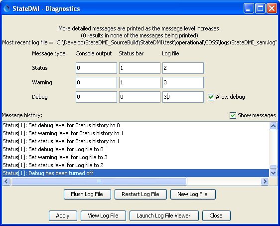
</p>**

**<p style="text-align: center;">
Diagnostics (<a href="../Diagnostics.png">see also the full-size image</a>)
</p>**

Review the messages in the status bar at the bottom of the main window if output is not as expected.
For more information, consult the log file or use the log file viewer (see next section),
which contains these messages as well as more detailed information.
The startup log file is named `StateDMI_USER.log` and is created in the logs directory
under the StateDMI installation directory.
The user name is consistent with your system login.
The ***View Log File*** and ***Launch Log File Viewer*** buttons will be enabled if the log file has been created.
The former will display the log file in a new window, as described below.
The latter will display the log file in Notepad.

Selecting the ***View Log File*** button in the ***Tools / Diagnostics***  tool or
selecting the ***Tools / Diagnostics – View Log File*** menu will display the message log file viewer window:

**<p style="text-align: center;">
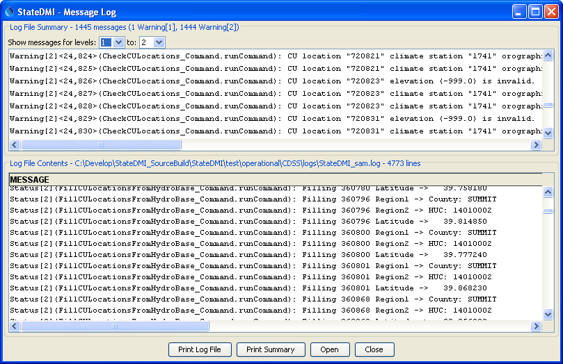
</p>**

**<p style="text-align: center;">
Log File Viewer Window (<a href="../DiagnosticsViewer.png">see also the full-size image</a>)
</p>**

The log file viewer provides a summary of important warning messages in the top of the window.
Selecting a message and right clicking provides options to go to the message
in the main log file (bottom of the window) or go to the command in the main window.

The log file is useful for reviewing the detailed sequential steps of processing.
However, the status information and check file output created by the
[`WriteCheckFile`](../command-ref/WriteCheckFile/WriteCheckfile.md)
command are generally easier to use when troubleshooting workflow processing.

## Help Menu ##

The help menu displays the StateDMI version and support information.

**<p style="text-align: center;">
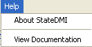
</p>**

**<p style="text-align: center;">
Help Menu (<a href="../Menu_Help.png">see also the full-size image</a>)
</p>**

The ***Help / About StateDMI*** menu displays the program version number,
as shown in the following figure.  Indicate the version number when reporting problems or suggestions.

**<p style="text-align: center;">

</p>**

**<p style="text-align: center;">
Help / About StateDMI Dialog (<a href="../Menu_Help_About.png">see also the full-size image</a>)
</p>**

If ***Tools / Diagnostics*** has been used to turn on debugging,
then the above dialog will include a button labeled ***Show Software/System Details***,
which can be used to display information about the computer and StateDMI software.
This information may be requested during troubleshooting.

The ***Help / View Documentation*** menu displays the software documentation in a web browser.
Use the navigable table of contents to jump to a specific section.
