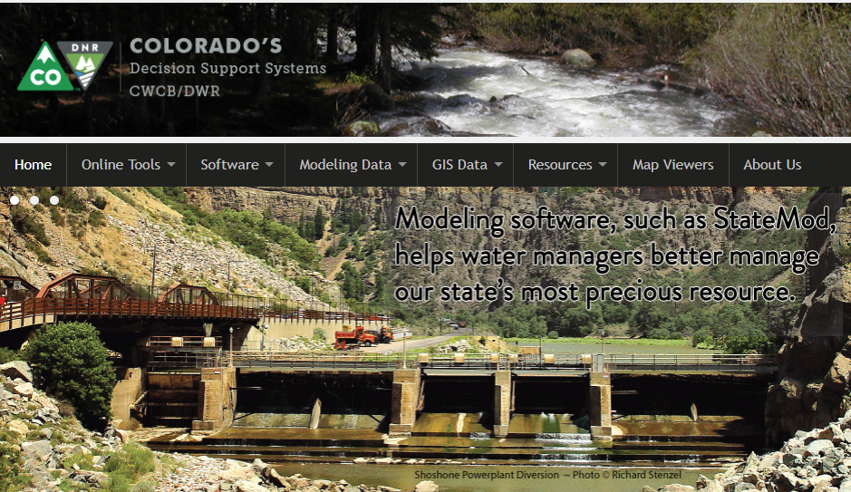

# CDSS / StateDMI #

This documentation provides resources to learn how to use
[Colorado's Decision Support Systems (CDSS)](http://cdss.state.co.us/Pages/CDSSHome.aspx) StateDMI software,
which automates processing data for StateCU and StateMod datasets.
StateDMI can also be used to implement general workflows that process State of Colorado HydroBase and other data.
This documentation is generally referred to as the **"User Documentation"** in contrast to
**"Developer Documentation"**, which is relevant to software developers.

* [How to Use this Documentation](#how-to-use-this-documentation)
* [Acknowledgements](#acknowledgements)
* [Colorado's Decision Support Systems](#colorados-decision-support-systems)
* [About the Open Water Foundation](#about-the-open-water-foundation)
* [License](#license)
* [Source Repository on GitHub](#source-repository-on-github)
* [Release Notes](#release-notes) - **this documentation is for StateDMI version 5.00.07**

----------------

## How to Use this Documentation ##

The documentation is organized in order of information and tasks necessary to install and use the StateDMI software.
Chapters (web pages) are provided for major topics related to software use and application.
References are provided for StateDMI [commands](command-ref/overview.md) and [datastores](datastore-ref/overview.md).

Use the navigation menu provided on the left side of the page to navigate the documentation sections within the full document.
Use the navigation menu provided on the right side of the page to navigate the documentation sections with a page.
The navigation menus may not be displayed if the web browser window is narrow or if viewing on a mobile device,
in which case look for a menu icon to access the menus.
Use the search feature to find documentation matching the search words.

## Acknowledgements

StateDMI has been developed by the Open Water Foundation (OWF) with significant
funding provided by the Colorado Water Conservation Board (CWCB)
in coordination with the Division of Water Resources (DWR),
as part of Colorado’s Decision Support Systems (CDSS).

StateDMI software users are encouraged to provide feedback using the
[GitHub Issues page](https://github.com/OpenCDSS/cdss-app-statedmi-main/issues).

Feedback specific to CDSS functionality
can also be provided using the [CDSS email address](mailto:DNR_OpenCDSS@state.co.us).

### Software Components

The following components are used in StateDMI and require or request attribution:

* [Material Theme icons](https://material.io/icons/) - these icons are used in documentation
* More information will be added here as the open source license is finalized.

## Colorado's Decision Support Systems ##

Colorado's Decision Support Systems (CDSS, [cdss.state.co.us](http://cdss.state.co.us))
has been developed to answer important questions about Colorado's water resources.
CDSS efforts are led by the [Colorado Water Conservation Board (CWCB)](http://cwcb.state.co.us)
and [Colorado Division of Water Resources (DWR)](http://water.state.co.us).

CDSS has been under development since 1994, with progress occurring via a series of basin
decision support systems (DSS), starting with the Colorado River DSS (CRDSS).
Other focused DSS were also developed, such as the CWCB's Instream Flow DSS.
Each DSS resulted in enhancements to the core CDSS tools,
which are envisioned as a general platform of data and tools to help with water supply planning.

The StateDMI software was developed in CDSS to process data
from Colorado's HydroBase database into into StateCU and StateMod model data files.

In late 2016, the Open Water Foundation began the effort to move StateDMI and other CDSS software to open source licensing
and establish open source software projects, referred to as "OpenCDSS".
The OpenCDSS project is resulting in a significant evolution in how CDSS software development occurs,
such as implementing version control with Git/GitHub and modernizing the development environment and documentation.
See the [OpenCDSS Website](http://opencdss.state.co.us/opencdss/) for more information.

## About the Open Water Foundation ##

The [Open Water Foundation](http://openwaterfoundation.org) is a nonprofit social enterprise that focuses
on developing and supporting open source software for water resources,
so that organizations can make better decisions about water.
OWF also works to advance open data tools and implementation.
OWF staff have been the primary StateDMI developers on State of Colorado and other projects.

## License ##

This StateDMI documentation is licensed using the
[Creative Commons Attribution International 4.0 (CC BY 4.0) license](https://creativecommons.org/licenses/by/4.0/).

The StateDMI software is licensed using the GPL 3 license (see the
[StateDMI software repository](https://github.com/OpenCDSS/cdss-app-statedmi-main)).

## Source Repository on GitHub ##

The source files for this documentation are maintained in a GitHub repository:
[cdss-app-statedmi-doc-user](https://github.com/OpenCDSS/cdss-app-statedmi-doc-user).

This user documentation is currently maintained in a repository that is separate from StateDMI code
in order to avoid confusion with the legacy documentation and to facilitate updates.

## Release Notes ##

See the [release notes](appendix-release-notes/release-notes.md) section of this documentation for information about StateDMI software changes.
