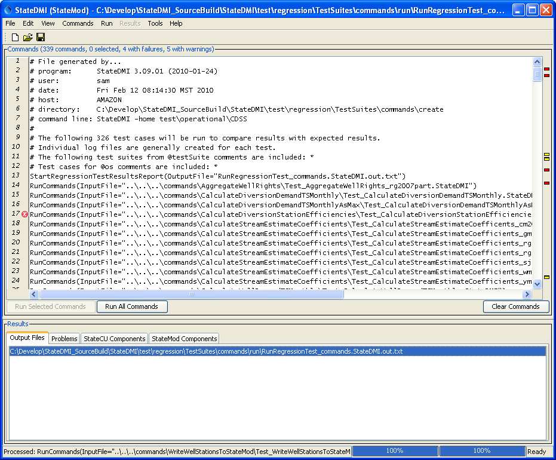

# StateDMI / Quality Control #

This chapter discusses how StateDMI software is quality-controlled and how to use StateDMI
to perform quality control of data, processes, and other software.
Similar capabilities are built into the TSTool software.

* [Quality Control for StateDMI Software](#quality-control-for-statedmi-software)
	+ [Writing a Single Test Case](#writing-a-single-test-case)
	+ [Creating and Running a Test Suite](#creating-and-running-a-test-suite)
	+ [Controlling Tests with Special Comments](#controlling-tests-with-special-comments)
	+ [Verifying StateDMI Software Using a Full Dataset](#verifying-statedmi-software-using-a-full-dataset)
* [Using StateDMI and TSTool to Quality Control Data and Processes](#using-statedmi-and-tstool-to-quality-control-data-and-processes)

-----

## Quality Control for StateDMI Software ##

StateDMI software provides many data processing commands.
Each command typically provides multiple parameters.
The combination of commands and parameters coupled with potential data changes and user errors
can make it difficult to confirm that StateDMI software is performing as expected.
In particular, it would be very time consuming and expensive to manually check software functionality every time a change is made.
These are the same challenges faced by any software tool, including spreadsheets, and models.
To address this quality control concern, a testing framework has been built into StateDMI to allow the software to test itself.
Test cases can be defined for each command, with test cases for various combinations of parameters.
The suite of all the test cases can then be run to confirm that the version of StateDMI does generate expected results.
This approach performs regression testing using the test framework and utilizes
StateDMI’s error-handling features to provide visual feedback during testing.

Test cases are developed by software developers as new features are implemented,
according to the following documentation.
However, users can also develop test cases and this is encouraged to ensure
that all combinations of parameters and input data are tested.
Users who provide verified test data and results prior to new development can facilitate the new development.

See the [`cdss-app-statedmi-test`](https://github.com/OpenCDSS/cdss-app-statedmi-test)
GitHub repository with tests.
Command documentation links to specific folders in the repository.
See the ***Examples*** section for each command's documentation.

### Writing a Single Test Case ###

The following example illustrates a single test case.
Such test cases are implemented for each StateDMI command.

```
StartLog(LogFile="Results/Test_SetDiversionStation.StateDMI.log")
# Test setting diversion stations with a couple of generated stations
# If appropriate, use special comments here to control the test.
RemoveFile(InputFile="Results\Test_SetDiversionStation_out.csv")
RemoveFile(InputFile="Results\Test_SetDiversionStation_out_ReturnFlows.csv")
RemoveFile(InputFile="Results\Test_SetDiversionStation_out_Collections.csv")
SetDiversionStation(ID="2000505",Name="Diversion 1",RiverNodeID="ID",OnOff=1,Capacity=101,ReplaceResOption=0,DailyID="ID",UserName="User1",DemandType=1,IrrigatedAcres=1001,UseType=1,DemandSource=1,EffMonthly="60,61,62,63,64,65,66,67,68,69,70,71",Returns="ret11,75,101;ret12,25,102",IfNotFound=Add)
SetDiversionStation(ID="2000631",Name="Diversion 2",RiverNodeID="ID",OnOff=1,Capacity=102,ReplaceResOption=1,DailyID="ID",UserName="user2",DemandType=1,IrrigatedAcres=1002,UseType=1,DemandSource=1,EffMonthly="70,71,72,73,74,75,76,77,78,79,80,81",Returns="ret21,75,21;ret22,25,22",IfNotFound=Add)
# Uncomment the following command to regenerate the expected results.
# WriteDiversionStationsToList(OutputFile="ExpectedResults/Test_SetDiversionStation_out.csv")
WriteDiversionStationsToList(OutputFile="Results/Test_SetDiversionStation_out.csv")
CompareFiles(InputFile1="ExpectedResults/Test_SetDiversionStation_out.csv",InputFile2="Results/Test_SetDiversionStation_out.csv",WarnIfDifferent=True)
CompareFiles(InputFile1="ExpectedResults/Test_SetDiversionStation_out_ReturnFlows.csv",InputFile2="Results/Test_SetDiversionStation_out_ReturnFlows.csv",WarnIfDifferent=True)
CompareFiles(InputFile1="ExpectedResults/Test_SetDiversionStation_out_Collections.csv",InputFile2="Results/Test_SetDiversionStation_out_Collections.csv",WarnIfDifferent=True)
```

**<p style="text-align: center;">
Example Test Case Command File
</p>**

The purpose of the test case command file is to regenerate results and then compare
the results to previously generated and verified expected results.
The example illustrates the basic steps that should be included in any test case:

1. **Start a log file to store the results of the specific test case**.
The previous log file will be closed and the new log file will be used until it is closed.
The log file is not crucial to the test but helps with troubleshooting if necessary
(for example if evaluating the test case output when run in a test suite, as explained later in this chapter).
Placing the [`StartLog`](../command-ref/StartLog/StartLog.md) command at the top of the command
file ensures that comments are also included in the new log file.
2. **Use commends to document and control the test.**
	1. **Use comments to describe the test.**
	Comments should be used to specifically describe the test.
	This is particular important if multiple variations on tests are implemented
	and the file name does not clearly indicate how tests differ.
	2. **Use special comments to control handling of the test**.
	For example, comments can be used to indicate which version of StateDMI software
	and HydroBase database are required to run the command file.
	It may be necessary to create similar versions of tests that are compatible with different
	versions of software and database.
	See the [Controlling Tests with Special Comments](#controlling-tests-with-special-comments) section.
3. **Remove the results that are to be generated by the test**.
This is necessary because if the software fails and old results match expected results,
it may appear that the command was successful.
The [RemoveFile(`IfNotFound=Ignore`)](../command-ref/RemoveFile/RemoveFile.md)
command parameter is useful because someone who is running the tests
for the first time may not have previous results to remove.
Test developers should use `IfNotFound=Warn` when setting up the test to confirm that the
results being removed match the name that is actually generated in a later command, and then switch to `IfNotFound=Ignore`.
Note that some testing approaches advocate cleaning up the test (removing tests results) before moving on to the next test.
However, leaving output files simplifies troubleshooting the test when there are failures.
4. **Generate or read test data**.
	1. Using synthetic data is a useful technique because it allows full control over the initial
	data and minimizes the number of files associated with the test.
	Synthetic in-memory data are often appropriate for simple tests and also exercise commands used to create the data.
	The [`SetDiversionStation`](../command-ref/SetDiversionStation/SetDiversionStation.md) command is used in the example to create a diversion station.
	2. If the test requires more complicated data, then files can be read.
	For example, create a separate command file that generates the test synthetic data.
	However, this should only be used if necessary, for example using TSTool to create time series files
	that are unable to be created with StateDMI commands.
	3. If the test is for commands that read data from HydroBase,
	then HydroBase version should be handled if necessary, such as with `#@require` special comment.
5. **Process the data using the command being tested**.
In the example, the [`SetDiversionStation`](../command-ref/SetDiversionStation/SetDiversionStation.md) command itself is being tested.
In many cases, a single command can be used in this step.
However, in some cases, it is necessary to use multiple commands (e.g., define diversion stations and then test a fill command).
Using more than one command is OK as long as each command is sufficiently
tested with appropriate test cases to ensure that a false pass does not occur.
6. **Write the results**.  The resulting data objects are written to a standard format.
Comma-separated value files are useful for general testing because they
are simple and the format will not change over time.
Note that two write commands are used in the example – one writes the expected
results and the other writes the results from the current test.
The expected results should only be written when the creator of the test has confirmed that it contains verified values.
In the example, the command to write expected results is commented out because the results were previously generated.
Commands to test writing a specific file format (e.g., StateMod time series file) might read an original file,
write a new file, and compare the original and new output files (see next step).
7. **Compare the expected results and the current results**.
The example uses the [`CompareFiles`](../command-ref/CompareFiles/CompareFiles.md) command
to compare the CSV files (also called "list" files) generated for the expected and current results.
This command omits comment lines in the comparison because file headers often change due to dynamic comments with date/time.
If the software is functioning as expected, the data lines in the file will exactly match.
The example illustrates that if the files are different,
a warning will be generated because of the `WarnIfDifferent=True` parameter.
Options for comparing results include:
	1. Compare the new results with the expected results (or original data file)
	using the [`CompareFiles`](../command-ref/CompareFiles/CompareFiles.md) command.
	For example, if the test case is to verify that a certain file format is properly read,
	then there will generally also be a corresponding write command.
	The test case can then consist of a command to read the file,
	a command to write the results, and a comparison command to compare the two files.
	2. Specific comparison commands.
	Comparison may fail, for example, if the “total” column in
	StateMod time series files has roundoff due to minor variations in input data.
	If this is an issue, then specific commands can be used,
	such as [`CompareCropPatternTSFiles`](../command-ref/CompareCropPatternTSFiles/CompareCropPatternTSFiles.md).
	Additional commands can be implemented as necessary to minimize comparison issues for testing.
	2. Use the `CompareTimeSeries` command to compare time series.
	**This command is not implemented in StateDMI but is available in TSTool – it may be implemented in StateDMI in the future.**

If the test case example command file is opened and run in StateDMI,
it will produce diversion station results, the log file, and the output files.
If the expected and current results are the same, no errors will be indicated.
However, if the files are different, a warning indicator will be shown in the command list area of the main window next to the
[`CompareFiles`](../command-ref/CompareFiles/CompareFiles.md) command.
The command also provides a ***Visual Diff*** button that will show visual difference between files to troubleshoot issues.

General guidelines for defining test cases are as follows.
Following these conventions will allow the test cases to be incorporated into the full test suite used by software developers.

* Define the test case in a folder matching the command name (e.g.,
[`SetDiversionStation`](../command-ref/SetDiversionStation/SetDiversionStation.md)).
* Name the command file with prefix `Test_` (historical) or `test-` (new convention), extension `.statedmi`,
and use the following guidelines, in combination if appropriate:
	+ For the default case (default command parameter values) use the filename pattern `Test_CommandName.StateDMI`.
	+ If there is a reason to define a test for a specific dataset or input,
	add additional information to the filename, for example:  `Test_CommandName_cm2006.StateDMI`
	+ If defining a test for legacy syntax (meaning that the current software will support running old commands),
	name the command file as follows (and use the `#@readOnly` comment annotation described in
	[Controlling Tests with Special Comments](#controlling-tests-with-special-comments) isection):  `Test_CommandName_Legacy.StateDMI`
	+ If defining a test for parameter values other than the default values,
	use a command file name similar to the following,
	where the parameters are listed at the end of the file name body:  `Test_CommandName_Param1=Value1,Param2=Value2.StateDMI`<br>
	Although this can result in very long names, the explicit naming clarifies the purpose of the test.
	If this becomes cumbersome, just indicate that a parameter is being tested, for example:  `Test_CommandName_OutputPeriod.StateDMI`
* Add a short comment to the top of the test case explaining the test.
* If many test cases are being defined for a command, consider including a spreadsheet
or document in the test folder to describe the tests in more detail.
Additional tests that cannot initially be implemented due to lack of resources
can be documented as placeholders for future implementation.
* Use as little data as possible to perform the test – long time series or big input files cause tests
to run longer and take up more space in the repository that is used for revision control.
Even though hundreds or thousands of tests may ultimately be defined,
it is important to be able to run them in a short time to facilitate testing.
* If possible, test only one command in the test – more complicated testing is described in
the [Verifying StateDMI Software Using a Full Dataset](#verifying-statedmi-software-using-a-full-dataset) section.
If multiple commands are needed, make absolutely sure that prerequisite commands are functioning properly (make sure that they have tests).
* If an input file is needed, place it in a folder named `Data`,
if necessary copying the same input from another command – this may require additional disk space
but ensures that each command can stand alone.
An exception to this is if the input data are very large,
in which case data should be stored with one command and be used by other commands.
* Write the expected results to a folder named `ExpectedResults`.
* Write the generated results and other dynamic content, including log file, to a folder named `Results`.
When using a revision control system, the files in this folder should be excluded from the repository because they are dynamic.
* (Recommended) When creating output files,
use `_out` in the filename before the extension and use an extension that is appropriate for the file
content – this helps identify final output products in cases where intermediate files might be produced.

### Creating and Running a Test Suite ###

The previous section described how to define a single test case.
However, opening and running each test case command file would be very tedious and inefficient.
Therefore, StateDMI provides a way to generate and run test suites,
which is the approach taken to perform a full regression test prior to a software release.
The following example command file (`test\regression\commands\TestSuites\commands\create\Create_RunTestSuite_commands.StateDMI`)
illustrates how to create a test suite:

```
#
# Create the regression test runner for the
# StateDMI/test/regression/TestSuites/commands files.
#
# Only command files that match Test_*.StateDMI are included in the output.
# Don't append the generated commands, in order to force the old file to be
# overwritten.
#
CreateRegressionTestCommandFile(SearchFolder="..\..\..\commands",OutputFile="..\run\RunRegressionTest_commands.StateDMI",Append=False,IncludeTestSuite="*",IncludeOS="*")
```

When the command file is run, it searches the indicated search folder for files matching the pattern `Test_*.StateDMI`.
It then uses this list to create a command file with contents similar to the following excerpted example.
This file will be listed as an output file after running the above command file.
The `IncludeTestSuite` and `IncludeOS` parameters are described in
[Controlling Tests with Special Comments](#controlling-tests-with-special-comments) section.

```
# File generated by...
# program:      StateDMI 3.08.02 (2009-09-29)
# user:         sam
# date:         Wed Sep 30 11:21:51 MDT 2009
# host:         SOPRIS
# directory:    C:\Develop\StateDMI_SourceBuild\StateDMI\test\regression\TestSuites\commands\create
# command line: StateDMI -home test\operational\CDSS
#
# The following 321 test cases will be run to compare results with expected results.
# Individual log files are generally created for each test.
# The following test suites from @testSuite comments are included: *
# Test cases for @os comments are included: *
StartRegressionTestResultsReport(OutputFile="RunRegressionTest_commands.StateDMI.out.txt")
RunCommands(InputFile="..\..\..\commands\AggregateWellRights\Test_AggregateWellRights_rg2007part.StateDMI")
RunCommands(InputFile="..\..\..\commands\CalculateDiversionDemandTSMonthly\Test_CalculateDiversionDemandTSMonthly.StateDMI")
RunCommands(InputFile="..\..\..\commands\CalculateDiversionDemandTSMonthlyAsMax\Test_CalculateDiversionDemandTSMonthlyAsMax.StateDMI")
RunCommands(InputFile="..\..\..\commands\CalculateDiversionStationEfficiencies\Test_CalculateDiversionStationEfficiencies.StateDMI")
RunCommands(InputFile="..\..\..\commands\CalculateStreamEstimateCoefficients\Test_CalculateStreamEstimateCoefficents_cm2005.StateDMI",ExpectedStatus=warning)
RunCommands(InputFile="..\..\..\commands\CalculateStreamEstimateCoefficients\Test_CalculateStreamEstimateCoefficients_gm2004.StateDMI",ExpectedStatus=warning)
RunCommands(InputFile="..\..\..\commands\CalculateStreamEstimateCoefficients\Test_CalculateStreamEstimateCoefficients_rg2007.StateDMI",ExpectedStatus=warning)
RunCommands(InputFile="..\..\..\commands\CalculateStreamEstimateCoefficients\Test_CalculateStreamEstimateCoefficients_rg2007b.StateDMI")
RunCommands(InputFile="..\..\..\commands\CalculateStreamEstimateCoefficients\Test_CalculateStreamEstimateCoefficients_sj2004.StateDMI",ExpectedStatus=warning)
RunCommands(InputFile="..\..\..\commands\FillDiversionStationsFromNetwork\Test_FillDiversionStationsFromNetwork.StateDMI")
RunCommands(InputFile="..\..\..\commands\FillInstreamFlowRight\Test_FillInstreamFlowRight.StateDMI")
RunCommands(InputFile="..\..\..\commands\FillInstreamFlowStation\Test_FillInstreamFlowStation.StateDMI")
RunCommands(InputFile="..\..\..\commands\FillInstreamFlowStationsFromHydroBase\Test_FillInstreamFlowStationsFromHydroBase.StateDMI")
RunCommands(InputFile="..\..\..\commands\FillInstreamFlowStationsFromNetwork\Test_FillStreamGageStationsFromNetwork.StateDMI")
```

The above command file can then be opened and run.
Each [`RunCommands`](../command-ref/RunCommands/RunCommands.md) command will run a single test case command file.
Warning and failure statuses from each test case command file are propagated to the test suite
[`RunCommands`](../command-ref/RunCommands/RunCommands.md) command.
The output from running the test suite will be all of the output from individual
test cases (in the appropriate `Results` folders) plus the regression test report
provided in the StateDMI ***Results / Output Files*** tab in the main window.
An example of the StateDMI main window after running the test suite is shown in the following figure.
Note the warnings and errors, which should be addressed before releasing the software
(in some cases commands are difficult to test and more development on the test framework is needed).

**<p style="text-align: center;">

</p>**

**<p style="text-align: center;">
StateDMI Main Interface Showing Regression Test Results (<a href="../Main_RegressionTest.png">see also the full-size image</a>)
</p>**

An excerpt from the output file is shown below:.

```
# File generated by...
# program:      StateDMI 3.09.01 (2010-01-24)
# user:         sam
# date:         Fri Feb 12 08:15:00 MST 2010
# host:         AMAZON
# directory:    C:\Develop\StateDMI_SourceBuild\StateDMI\test\regression\TestSuites\commands\run
# command line: StateDMI -home test\operational\CDSS
#
# The test status below may be PASS or FAIL.
# A test can pass even if the command file actual status is FAILURE, if failure is expected.
#     Test   Commands   Commands
#     Pass/  Expected   Actual
# Num Fail   Status     Status     Command File
#---------------------------------------------------------------------
   1  PASS   SUCCESS    SUCCESS    C:\Develop\StateDMI_SourceBuild\StateDMI\test\regression\commands\
                                   AggregateWellRights\Test_AggregateWellRights_rg2007part.StateDMI
   2  PASS   SUCCESS    SUCCESS    C:\Develop\StateDMI_SourceBuild\StateDMI\test\regression\commands\
                                   CalculateDiversionDemandTSMonthly\
                                   Test_CalculateDiversionDemandTSMonthly.StateDMI
   3  PASS   SUCCESS    SUCCESS    C:\Develop\StateDMI_SourceBuild\StateDMI\test\regression\commands\
                                   CalculateDiversionDemandTSMonthlyAsMax\Test_CalculateDiversionDemandTSMonthlyAsMax.StateDMI
   4 *FAIL*  SUCCESS    FAILURE    C:\Develop\StateDMI_SourceBuild\StateDMI\test\regression\commands\
                                   CalculateDiversionStationEfficiencies\
                                   Test_CalculateDiversionStationEfficiencies.StateDMI
   5  PASS   warning    WARNING    C:\Develop\StateDMI_SourceBuild\StateDMI\test\regression\commands\
                                   CalculateStreamEstimateCoefficients\
                                   Test_CalculateStreamEstimateCoefficents_cm2005.StateDMI
   6  PASS   warning    WARNING    C:\Develop\StateDMI_SourceBuild\StateDMI\test\regression\commands\
                                   CalculateStreamEstimateCoefficients\
                                   Test_CalculateStreamEstimateCoefficients_gm2004.StateDMI
...many tests omitted...
 323  PASS   SUCCESS    SUCCESS    C:\Develop\StateDMI_SourceBuild\StateDMI\test\regression\commands\
                                   WriteWellRightsToList\Test_WriteWellRightsToList.StateDMI
 324  PASS   SUCCESS    SUCCESS    C:\Develop\StateDMI_SourceBuild\StateDMI\test\regression\commands\
                                   WriteWellRightsToStateMod\Test_WriteWellRightsToStateMod.StateDMI
 325  PASS   SUCCESS    SUCCESS    C:\Develop\StateDMI_SourceBuild\StateDMI\test\regression\commands\
                                   WriteWellStationsToList\Test_WriteWellStationsToList.StateDMI
 326  PASS   SUCCESS    SUCCESS    C:\Develop\StateDMI_SourceBuild\StateDMI\test\regression\commands\
                                   WriteWellStationsToStateMod\
                                   Test_WriteWellStationsToStateMod.StateDMI
#---------------------------------------------------------------------
# FAIL count = 9
# PASS count = 317
```

A test passes if its expected status (`SUCCESS`) matches the actual status, and the test fails otherwise.
Note that there are cases where a test case is actually intended to fail,
in order to test that StateDMI is properly detecting and handling the failure (rather than ignoring it or crashing).
In these cases, the expected status (`WARNING` or `FAILURE`) must match the actual status to pass the test.

The features built into StateDMI can therefore be used to efficiently test the software,
contributing to increased software quality and efficient software releases.
New development results in additional tests.
See the next section for more information on controlling the test process.

### Controlling Tests with Special Comments ###

The previous two sections described how to define individual test cases and
how to automatically create and run a test suite comprised of test cases.
However, there are special conditions that will cause the normal testing procedures to fail, in particular:

* tests depend on a database (datastore name)
* tests depend on a database version
* tests depend on a StateDMI version
* tests can only be run on a certain operating system
* tests depend on a specific environment configuration that is not easily reproduced for all users

Any of these conditions can cause a test case to fail,
leading to inappropriate errors and wasted time tracking down problems that do not exist.
To address this issue, StateDMI recognizes special comments that can be included in test case command files.
See the the [`#` comment](../command-ref/Comment/Comment.md) command for full documentation.
The following table lists annotations that can be placed in `#` comments in command files to provide information for to the
[`CreateRegressionTestCommandFile`](../command-ref/CreateRegressionTestCommandFile/CreateRegressionTestCommandFile.md)
command and command processor.
The syntax of the special comments is illustrated by the following example:

```
#@expectedStatus Failure
```

**<p style="text-align: center;">
Special `#` Comment Annotations
</p>**

| **Parameter**&nbsp;&nbsp;&nbsp;&nbsp;&nbsp;&nbsp;&nbsp;&nbsp;&nbsp;&nbsp;&nbsp;&nbsp;&nbsp;&nbsp;&nbsp;&nbsp;&nbsp;&nbsp;&nbsp;&nbsp;&nbsp;&nbsp;&nbsp;&nbsp;&nbsp;&nbsp;&nbsp;&nbsp;&nbsp;&nbsp;&nbsp;&nbsp; | **Description** |
| -- | -- |
| `@enabled False` | Used to disable a command file.  For example, use this annotation in a test command file when the test is not ready for use in the software release process.|
| `@expectedStatus Failure`<br>`@expectedStatus Warning` | The [`RunCommands`](../command-ref/RunCommands/RunCommands.md) command `ExpectedStatus` parameter is by default `Success`.  However, a different status can be specified if it is expected that a command file will result in Warning or Failure and still be a successful test.  For example, if a command is obsolete and should generate a failure, the expected status can be specified as Failure and the test will pass.  Another example is to test that the software properly treats a missing file as a failure.|
| `@os Windows`<br>`@os UNIX` | Using this annotation indicates that the test is designed to work only on the specified platform and will be included in the test suite by the [`CreateRegressionTestCommandFile`](../command-ref/CreateRegressionTestCommandFile/CreateRegressionTestCommandFile.md) command only if the `IncludeOS` parameter includes the corresponding operating system (OS) type.  This is primarily used to test specific features of the OS and similar but separate test cases should be implemented for both OS types.  If the OS type is not specified as an annotation in a command file, the test is always included.|
| `@readOnly` | Use this annotation to indicate that a command file is read-only.  This is useful when legacy command files are being tested because StateDMI will automatically update old syntax to new.  Consequently, saving the command file will overwrite the legacy syntax and void the test.  If this annotation is included, the StateDMI interface will warn the user that the file is read-only and will only save if the user indicates to do so.|
|`@require application StateDMI >= Version`<br><br>Available since StateDMI 5.00.06 | Check that the software application version meets requirements for the command file. This can be used to prevent running the command file with incompatible software. The version should match the format shown in ***Help / About StateDMI*** (e.g., `5.00.05`). <ul><li>For interactive session, fail if a requirement is not met.</li><li>When running tests that use [`RunCommands`](../RunCommands/RunCommands.md), command files that don't meet requirements are skipped.</li></ul>|
|`@require datastore HydroBase >= Version`<br><br>Available since StateDMI 5.00.06 | Check that the datastore version meets requirements for the command file. This can be used to prevent running the command file with incompatible database. The version should match the format used in the HydroBase database name shown in ***View / Datastores*** (e.g., `20200720`). <ul><li>For interactive session, fail if a requirement is not met.</li><li>When running tests that use [`RunCommands`](../RunCommands/RunCommands.md), command files that don't meet requirements are skipped.</li></ul>|
| `@testSuite ABC` | Indicate that the command file should be considered part of the specified test suite, as specified with the `IncludeTestSuite` parameter of the [`CreateRegressionTestCommandFile`](../command-ref/CreateRegressionTestCommandFile/CreateRegressionTestCommandFile.md)  command.  Do not specify a test suite annotation for general tests.  This annotation is useful if a group of tests require special setup, for example connecting to a database.  The suite names should be decided upon by the test developer. **This comment annotation is not widely because specific tests can be grouped in a separate folder, for example when testing commands for a specific database type.** |

Using the above special comment annotations, it is possible to create test suites that are appropriate for specific environments.
For example, use `@require datastore HydroBase >= 20200720` to indicates that a test case should only be run for HydroBase database name `HydroBase_CO_20200720`.

### Verifying StateDMI Software Using a Full Dataset ###

The previous sections described how to test StateDMI software using a suite of test cases.
This approach can be utilized when performing general tests, for example prior to a normal software release.
However, there may be cases where StateDMI has been used to produce a large dataset and it
is desirable to confirm that a specific software version will still create the full dataset without differences
(or with differences being explainable).
For example, for the State of Colorado’s Decision Support Systems,
large basin model datasets are created and are subject to significant scrutiny.
Approaches previously described in this chapter can be leveraged to verify that
StateDMI is functioning properly and creates the dataset files.

The following procedure is recommended and uses CDSS Colorado model (`cm2015`) as an example.
A GitHub repository approach is recommended for software testing; however,
this approach is not fully implemented by modelers.
A GitHub approach helps enforce file naming conventions and ensures consistency in software testing.

1. If not already installed, download and install the dataset containing input files and
software command files.  These files will not be modified during testing.
	1. If the dataset exists in a GitHub repository,
	clone/pull the repository according to the README file for the dataset.
	2. If the dataset does not exist in a GitHub repository,
	install the dataset according to CDSS guidelines (e.g., `C:\CDSS\data\cm2015`)
2. Create a parallel folder with a name indicating that it is being used for verification,
and copy the files from step 1, for example:
	1. If using a GitHub repository, copy to the folder according to the README file for the dataset.
	2. If not using a GitHub repository, copy to `C:\CDSS\data\cm2015-verify-statedmi-5.00.06`).
3. Create a StateDMI command file in the folder created in step 2 that will run the tests (e.g., `verify-statedmi.statedmi`).
It is often easier to edit this command file with a text editor rather than with StateDMI itself,
or use both methods to be as efficient as possible.
The contents of the file are illustrated in the example below.
Some guidelines for this step are as follows:
	1. Organize the command file by dataset folder, in the order that data need to be created.
	2. Process every `*.statedmi` command to verify that it runs and generates the same results.
	3. If command files do not produce the same results,
	copy the command file to a name with `-updated` or similar in the filename and then
	change the file until it creates the expected results.
	This may be required due to changes in the command, for example implementing stricter error handling.
	These command files can then be shared with maintainers of the dataset so that future releases can be updated.
	4. As tests are formalized, it may be beneficial to save a copy of this file with the original
	dataset so future tests can simply copy the verification command file rather than
	recreating it (e.g., save in a `QualityControl` folder in the master dataset).
	This effort will allow the creator of the dataset to quality control
	their work as well as helping to quality control the software.
5. Run the command file – any warnings or failures should be evaluated to determine if they are due to software or data changes.
Software differences should be evaluated by software developers.
It may be necessary to use command parameters such as Version, available for some commands, to recreate legacy data formats.

The following example command file (developed for the Colorado `cm2015` dataset)
illustrates how StateDMI software is verified using the full dataset
(indented lines indicate commands that are too long to fit on one line in the documentation).
Note that intermediate input files that would normally be modified by other software
(e.g., TSTool for CDSS datasets) could impact StateDMI verification.
However, a similar quality control procedure can be implemented for TSTool.

Guidelines for setting up the each test in the command file are as follows.
**This example is being updated during current StateDMI development in early 2021.**

1. Remove output files that are generated from each individual command file that is run using
[`RemoveFile`](../command-ref/RemoveFile/RemoveFile.md) commands.
This will ensure that a test does not use old results for its output comparison.
2. Run each individual command file using the
[`RunCommands`](../command-ref/RunCommands/RunCommands.md) command.
3. Compare the results of the run with the original dataset file using the
[`CompareFiles`](../command-ref/CompareFiles/CompareFiles.md) command.
4. As appropriate, use comment annotations to check StateDMI and HydroBase versions
to ensure that the test is run with appropriate versions.
Version requirements can be specified for copies of the command file to allow
testing for different versions over time.

```
StartLog(LogFile="verify-statedmi.statedmi.log")
# This command file verifies the StateDMI functionality by recreating a released
# StateMod/StateCU dataset.  The general process is as follows:
# 1) Copy the entire original dataset to this folder (e.g., do manually).
# 2) Commands below will remove output files from product and StateMod/StateCU
# folders.  This is done in case regeneration stops - don't want any confusion
# with original output and what should be created here.
# 3) Commands below will run the command files used to generate the model files.
# 4) Commands below will use CompareFile() commands to compare results.  Comment
# lines are ignored so only data differences (processing output) will be
# flagged.
# If run interactively from StateDMI, indicators will show where results are
# different.  Differences must then be evaluated to determine if input data,
# process, or software have changed.  Differences may be valid.
#
##############################################################################
##############################################################################
# Diversions
##############################################################################
##############################################################################
#
# Stations...
RemoveFile(InputFile="Diversions\cm2015_dds.dds")
#RunCommands(InputFile="Diversions\dds.commands.StateDMI")
RunCommands(InputFile="Diversions\dds.commands-updated.StateDMI")
CompareFiles(InputFile1="Diversions\cm2015_dds.dds",InputFile2="..\cm2015\Diversions\cm2015_dds.dds",WarnIfDifferent=True)
#
# Rights...
RemoveFile(InputFile="StateMod\cm2015.ddr")
#RunCommands(InputFile="Diversions\ddr.commands.StateDMI")
RunCommands(InputFile="Diversions\ddr.commands-updated.StateDMI")
CompareFiles(InputFile1="StateMod\cm2015.ddr",InputFile2="..\cm2015\StateMod\cm2015.ddr",WarnIfDifferent=True)
#
# DDH (and final DDS)...
RemoveFile(InputFile="StateMod\cm2015.ddh")
RemoveFile(InputFile="StateMod\cm2015.dds")
#RunCommands(InputFile="Diversions\ddh.commands.StateDMI")
RunCommands(InputFile="Diversions\ddh.commands-updated.StateDMI")
CompareFiles(InputFile1="StateMod\cm2015.ddh",InputFile2="..\cm2015\StateMod\cm2015.ddh",WarnIfDifferent=True)
CompareFiles(InputFile1="StateMod\cm2015.dds",InputFile2="..\cm2015\StateMod\cm2015.dds",WarnIfDifferent=True)
#
# IWR...
RemoveFile(InputFile="StateMod\cm2015.iwr")
#RunCommands(InputFile="Diversions\iwr.commands.StateDMI")
RunCommands(InputFile="Diversions\iwr.commands-updated.StateDMI")
CompareFiles(InputFile1="StateMod\cm2015.iwr",InputFile2="..\cm2015\StateMod\cm2015.iwr",WarnIfDifferent=True)
#
# IWRB...
RemoveFile(InputFile="StateMod\cm2015B.iwr")
#RunCommands(InputFile="Diversions\iwrB.commands.StateDMI")
RunCommands(InputFile="Diversions\iwrB.commands-updated.StateDMI")
CompareFiles(InputFile1="StateMod\cm2015B.iwr",InputFile2="..\cm2015\StateMod\cm2015B.iwr",WarnIfDifferent=True)
#
# Hddm...
RemoveFile(InputFile="StateMod\cm2015H.ddm")
#RunCommands(InputFile="Diversions\Hddm.commands.StateDMI")
RunCommands(InputFile="Diversions\Hddm.commands-updated.StateDMI")
CompareFiles(InputFile1="StateMod\cm2015H.ddm",InputFile2="..\cm2015\StateMod\cm2015H.ddm",WarnIfDifferent=True)
#
# Cddm...
RemoveFile(InputFile="StateMod\cm2015C.ddm")
#RunCommands(InputFile="Diversions\Cddm.commands.StateDMI")
RunCommands(InputFile="Diversions\Cddm.commands-updated.StateDMI")
CompareFiles(InputFile1="StateMod\cm2015C.ddm",InputFile2="..\cm2015\StateMod\cm2015C.ddm",WarnIfDifferent=True)
#
# Cddm-AcreageChange...
/* Output file does not exist in master
RemoveFile(InputFile="StateMod\cm2015C-AcreageChange.ddm")
#RunCommands(InputFile="Diversions\Cddm-AcreageChange.commands.StateDMI")
RunCommands(InputFile="Diversions\Cddm-AcreageChange.commands-updated.StateDMI")
CompareFiles(InputFile1="StateMod\cm2015C-AcreageChange.ddm",InputFile2="..\cm2015\StateMod\cm2015C-AcreageChange.ddm",WarnIfDifferent=True)
*/
#
# Bddm...
RemoveFile(InputFile="StateMod\cm2015B.ddm")
#RunCommands(InputFile="Diversions\Bddm.commands.StateDMI")
RunCommands(InputFile="Diversions\Bddm.commands-updated.StateDMI")
CompareFiles(InputFile1="StateMod\cm2015B.ddm",InputFile2="..\cm2015\StateMod\cm2015B.ddm",WarnIfDifferent=True)
#
##############################################################################
##############################################################################
# instream
##############################################################################
##############################################################################
#
# ifs...
RemoveFile(InputFile="StateMod\cm2015.ifs")
#RunCommands(InputFile="instream\ifs.commands.StateDMI")
RunCommands(InputFile="instream\ifs.commands-updated.StateDMI")
CompareFiles(InputFile1="StateMod\cm2015.ifs",InputFile2="..\cm2015\StateMod\cm2015.ifs",WarnIfDifferent=True)
#
# ifr...
RemoveFile(InputFile="StateMod\cm2015.ifr")
#RunCommands(InputFile="instream\ifr.commands.StateDMI")
RunCommands(InputFile="instream\ifr.commands-updated.StateDMI")
CompareFiles(InputFile1="StateMod\cm2015.ifr",InputFile2="..\cm2015\StateMod\cm2015.ifr",WarnIfDifferent=True)
#
# ifa...
RemoveFile(InputFile="StateMod\cm2015.ifa")
#RunCommands(InputFile="instream\ifa.commands.StateDMI")
RunCommands(InputFile="instream\ifa.commands-updated.StateDMI")
CompareFiles(InputFile1="StateMod\cm2015.ifa",InputFile2="..\cm2015\StateMod\cm2015.ifa",WarnIfDifferent=True)
#
##############################################################################
##############################################################################
# network
##############################################################################
##############################################################################
#
# rin...
RemoveFile(InputFile="StateMod\cm2015.rin")
#RunCommands(InputFile="network\rin.commands.StateDMI")
RunCommands(InputFile="network\rin.commands-updated.StateDMI")
CompareFiles(InputFile1="StateMod\cm2015.rin",InputFile2="..\cm2015\StateMod\cm2015.rin",WarnIfDifferent=True)
#
##############################################################################
##############################################################################
# reservoirs
##############################################################################
##############################################################################
#
# res...
RemoveFile(InputFile="StateMod\cm2015.res")
#RunCommands(InputFile="reservoirs\res.commands.StateDMI")
RunCommands(InputFile="reservoirs\res.commands-updated.StateDMI")
CompareFiles(InputFile1="StateMod\cm2015.res",InputFile2="..\cm2015\StateMod\cm2015.res",WarnIfDifferent=True)
#
# rer...
RemoveFile(InputFile="StateMod\cm2015.rer")
RemoveFile(InputFile="StateMod\cm2015B.rer")
#RunCommands(InputFile="reservoirs\rer.commands.StateDMI")
RunCommands(InputFile="reservoirs\rer.commands-updated.StateDMI")
CompareFiles(InputFile1="StateMod\cm2015.rer",InputFile2="..\cm2015\StateMod\cm2015.rer",WarnIfDifferent=True)
CompareFiles(InputFile1="StateMod\cm2015B.rer",InputFile2="..\cm2015\StateMod\cm2015B.rer",WarnIfDifferent=True)
#
# cmdly...
RemoveFile(InputFile="StateMod\cmdly.res")
#RunCommands(InputFile="reservoirs\cmdly.res.commands.StateDMI")
RunCommands(InputFile="reservoirs\cmdly.res.commands-updated.StateDMI")
CompareFiles(InputFile1="StateMod\cmdly.res",InputFile2="..\cm2015\StateMod\cmdly.res",WarnIfDifferent=True)
#
# B.res...
RemoveFile(InputFile="StateMod\cm2015B.res")
#RunCommands(InputFile="reservoirs\cm2015B.res.commands.StateDMI")
RunCommands(InputFile="reservoirs\cm2015B.res.commands-updated.StateDMI")
CompareFiles(InputFile1="StateMod\cm2015B.res",InputFile2="..\cm2015\StateMod\cm2015B.res",WarnIfDifferent=True)
#
##############################################################################
##############################################################################
# streamSW
##############################################################################
##############################################################################
#
# ris...
RemoveFile(InputFile="StateMod\cm2015.ris")
#RunCommands(InputFile="streamSW\ris.commands.StateDMI")
RunCommands(InputFile="streamSW\ris.commands-updated.StateDMI")
CompareFiles(InputFile1="StateMod\cm2015.ris",InputFile2="..\cm2015\StateMod\cm2015.ris",WarnIfDifferent=True)
#
# rib...
RemoveFile(InputFile="StateMod\cm2015.rib")
#RunCommands(InputFile="streamSW\rib.commands.StateDMI")
RunCommands(InputFile="streamSW\rib.commands-updated.StateDMI")
CompareFiles(InputFile1="StateMod\cm2015.rib",InputFile2="..\cm2015\StateMod\cm2015.rib",WarnIfDifferent=True)
#
```

**<p style="text-align: center;">
Command File to Verify Dataset Creation
</p>**

## Using StateDMI and TSTool to Quality Control Data and Processes ##

The testing concepts discussed in this chapter can be utilized similarly to perform quality control on data or processes.
In many cases, these tests must be defined by software users because the data and processes are only accessible and familiar to the users.
However, once implemented, the tests can become a part of standard software
test suites to further increase software quality control.  The following are examples of tests that may be useful:

* **Historical Data**.  For a database such as HydroBase, implement a sequence of tests to ensure that data continue to exist,
are accessible, and are in expected ranges.
For example, for historical data, set the period to query so that it is not
likely to be impacted by new data being added to the database,
then create test command files to read many or all of the data types (use the `Read*HydroBase` commands).
It is expected that these data should not change over time.
A failed test will indicate that the database contents have changed and impacts on users may need to be evaluated (or at a minimum documented).
* **Real-Time Data**.  Similarly, for recent historical data and real-time data,
tests can be defined to ensure that data are available, in this case,
it may not be important that data match expected results but only that data are returned.
For example, TSTool capabilities to read time series and then compute statistics on time series,
such as the number of missing, can be used to check for valid data.
Additional test capabilities may need to be developed to fully implement these types of tests.
The purpose of this type of testing is to ensure that an operational system continues to function as expected.
* **Standard Processes**.  An organization’s staff typically defines and executes standard processes
to perform the business functions of the organizations.
Related to water resources engineering, these processes may involve data collection,
processing, analysis, and modeling, using a variety of tools.
Standard tests, as described in this chapter,
can confirm that a process is working as intended by verifying logic and data processing.
For example, a standard process can be run on test data to confirm that it is still working.
StateDMI and TSTool (or other tools) can be used to automate file comparisons,
or perhaps to run several programs and then compare files, in order to demonstrate that a standard process is working.
* **Models**.  Models can be complex and are often referred to as “black boxes” because
it may not be obvious what occurs inside a model.  Tests can be implemented in a number of ways:
	+ **Unit Tests**.  Similar to the small command files described in this chapter,
	small model datasets can be defined and run to confirm that basic model functionality is correct.
	+ **Full Tests**.  Full “accepted” datasets can be run,
	and tools can be used to verify that the results are consistent with expected results.
	This is similar to testing StateDMI and TSTool on full datasets.
	+ **Results Evaluation**.  Assuming that the model software has tested out,
	tests can be performed on any dataset to confirm that results are reasonable.
	This recognizes that the synergy of a variety of model inputs and the results from a
	simulation may indicate unanticipated conditions (e.g., an impact is exponential rather than simply additive).
	The test process can therefore check for missing or zero values, out of range, or combinations of critical values.

The use of automated testing frameworks, such as the features available in StateDMI and TSTool,
can streamline quality control checks and lead to a more robust quality assurance program.
If StateDMI or TSTool are not used, then other test frameworks are highly desirable.
