# StateDMI / Creating StateCU Datset Files

* [Introduction](#introduction)
* [Control Data](#control-data)
* [Climate Station Data](#climate-station-data)
	+ [Climate Stations](#climate-stations)
	+ [Temperature Time Series (Monthly)](#temperature-time-series-monthly)
	+ [Frost Date Time Series (Yearly)](#frost-date-time-series-yearly)
* [Crop Characteristics/Coefficients Data](#crop-characteristicscoefficients-data)
	+ [Crop Characteristics](#crop-characteristics)
	+ [Blaney-Criddle Crop Coefficients](#blaney-criddle-crop-coefficients)
	+ [Penman-Monteith Crop Coefficients](#penman-monteith-crop-coefficients)
* [Delay Tables Data](#delay-tables-data)
* [CU Location Data](#cu-location-data)
	+ [CU Locations](#cu-locations)
	+ [Crop Pattern Time Series (Yearly)](#crop-pattern-time-series-yearly)
	+ [Irrigation Practice Time Series (Yearly)](#irrigation-practice-time-series-yearly)
	+ [Diversion Water Rights](#diversion-water-rights)
	+ [Diversion Time Series](#diversion-time-series)
	+ [Well Water Rights](#well-water-rights)
	+ [Well Historical Pumping Time Series (Monthly)](#well-historical-pumping-time-series-monthly)

--------------

## Introduction ##

When StateDMI is used to process StateCU dataset files,
the ***Commands*** menu lists the StateCU data groups (use ***File / Switch to StateCU***
if necessary to see the StateCU command menus):

**<p style="text-align: center;">
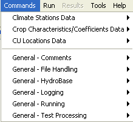
</p>**

**<p style="text-align: center;">
Commands Menu when Used with StateCU Dataset Files (<a href="../Menu_Commands_StateCU.png">see also the full-size image</a>)
</p>**

Each item corresponds to a data component group, under which are specific data components (products).
Each data product corresponds to a model input file and is discussed in the following sections.
The ***General*** commands are useful at any time (e.g., add comments).
The top-level data groups utilize unique data identifiers shared among the products in the group.
For example, the CU Locations Data are all referenced using a CU Location identifier (e.g., a ditch identifier).

Examples of StateCU model files are not included in this documentation.
Refer to the StateCU model documentation for detailed information about model file formats.
Example command files are included for each product and are taken from existing datasets.
Command file logic may vary by dataset and existing datasets should be consulted if available.
Datasets typically fall into three categories:

1. those that include groundwater (e.g., Arkansas, Rio Grande, and South Platte)
2. those that do not include groundwater (e.g., Colorado, Gunnison, San Juan, Yampa, White).
3. statewide climate station analysis

A StateCU analysis estimates water requirement at locations.
StateDMI uses general terminology and refers to the locations as “CU Locations”,
although StateCU datasets may focus on structures, climate stations, or other types of locations.
Each CU Location is associated with climate data,
crop patterns (either determined from actual irrigated lands or unit areas), and irrigation practice data.
The CDSS datasets have in the past used the concept of County/HUC (Hydrologic Unit Code)
to associate structures with climate stations.
StateDMI uses a more general `Region1`/`Region2` notation (e.g., the actual regions might be `County` or no `Region2` specified).
The command editor dialogs provide information to help explain the key data that are used to associate the various data components.

## Control Data ##

StateCU control data (the response and control file) are currently not processed by StateDMI,
although commands may be added in the future.
Currently the StateCU control data must be created using a text editor or copy and modify an existing file.

## Climate Station Data ##

Climate station data consists of:

**<p style="text-align: center;">
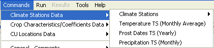
</p>**

**<p style="text-align: center;">
StateCU Climate Stations Data / Climate Stations Menu (<a href="../Menu_Commands_StateCU_ClimateStations_Data.png">see also the full-size image</a>)
</p>**

* Climate stations
* Temperature time series (monthly)
* Frost date time series (yearly)
* Precipitation time series (monthly)

Each of the above data types is stored in a separate file,
using the climate station identifier as the primary identifier.
Climate station weights are included in CU Location data.
The processing of each data file is discussed below.

### Climate Stations ###

Climate stations used with StateCU often are selected by reviewing available
climate time series data to find stations with acceptable periods of record.
TSTool or other software can be used to identify acceptable climate stations.
The ***Commands / Climate Stations Data / Climate Stations*** menus insert commands to process climate station data:

**<p style="text-align: center;">
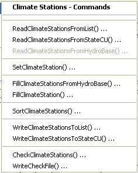
</p>**

**<p style="text-align: center;">
StateCU Commands / Climate Stations Data / Climate Stations Menu (<a href="../Menu_Commands_StateCU_ClimateStations.png">see also the full-size image</a>)
</p>**

The following table summarizes the use of each command:

**<p style="text-align: center;">
Climate Stations Data Commands
</p>**

| **Command**&nbsp;&nbsp;&nbsp;&nbsp;&nbsp;&nbsp;&nbsp;&nbsp;&nbsp;&nbsp;&nbsp;&nbsp;&nbsp;&nbsp;&nbsp;&nbsp;&nbsp;&nbsp;&nbsp;&nbsp;&nbsp;&nbsp;&nbsp;&nbsp;&nbsp;&nbsp;&nbsp;&nbsp;&nbsp;&nbsp;&nbsp;&nbsp;&nbsp;&nbsp;&nbsp;&nbsp;&nbsp;&nbsp;&nbsp;&nbsp;&nbsp;&nbsp;&nbsp;&nbsp;&nbsp;&nbsp;&nbsp;&nbsp; | **Description** |
| -- | -- |
| [`ReadClimateStationsFromList`](../command-ref/ReadClimateStationsFromLis/ReadClimaeStationsFromList.md) | Read from a delimited list file the list of climate stations to be included in the dataset. |
| [`ReadClimateStationsFromStateCU`](../command-ref/ReadClimateStationsFromStateCU/ReadClimateStationsFromStateCU.md) | Read from a StateCU climate stations file the list of climate stations to be included in the dataset. |
| [`ReadClimateStationsFromHydroBase`](../command-ref/ReadClimateStationsFromHydroBase/ReadClimateStationsFromHydroBase.md) | Currently disabled.  Read from HydroBase a list of climate stations to be included in the dataset.  It is envisioned that a county name or some other region would be supplied to help select climate stations.  Instead, use the [`FillClimateStationsFromHydroBase`](../command-ref/FillClimateStationsFromHydroBase/FillClimateStationsFromHydroBase.md) command. |
| [`SetClimateStation`](../command-ref/SetClimateStation/SetClimateStation.md) | Set the data for, and optionally add, climate stations. |
| [`FillClimateStationsFromHydroBase`](../command-ref/FillClimateStationsFromHydroBase/FillClimateStatiosnFromHydroBase.md) | Fill missing data for defined climate stations, using data from HydroBase. |
| [`FillClimateStation`](../command-ref/FillClimateStation/FillClimateStation.md) | Fill missing data for defined climate stations, user user-supplied values. |
| [`SortClimateStations`](../command-ref/SortClimateStations/SortClimateStations.md) | Sort the climate stations by station identifier. |
| [`WriteClimateStationsToList`](../command-ref/WriteClimateStationsToList/WriteClimateStationsToList.md) | Write defined climate stations to a delimited list file. |
| [`WriteClimateStationsToStateCU`](../command-ref/WriteClimateStationsToStateCU/WriteClimateStationsToStateCU.md) | Write defined climate stations to a StateCU file. |
| [`CheckClimateStations`](../command-ref/CheckClimateStations/CheckClimateStations.md) | Check climate stations data for problems. |
| [`WriteCheckFile`](../command-ref/WriteCheckFile/WriteCheckFile.md) | Write the results of data checks to a file. |

An example command file is shown below (adapted from the Colorado `cm2006` StateCU dataset):

```
# StateDMI commands to create Colorado model climate stations file
#
# Step 1 - read climate stations from a list
#
ReadClimateStationsFromList(ListFile="climsta.lst",IDCol=1)
#
# Step 2 - fill climate stations from HydroBase
#
FillClimateStationsFromHydroBase(ID="*")
#
# Step 3 - set/fill additional data not found in HydroBase
#
SetClimateStation(ID="3016",Region2="14080106",IfNotFound=Warn)
SetClimateStation(ID="1018",Region2="14040106",IfNotFound=Warn)
SetClimateStation(ID="1928",Elevation=6440,IfNotFound=Warn)
SetClimateStation(ID="0484",Region1="MOFFAT",IfNotFound=Add)
#
# Step 4 - write the file
#
WriteClimateStationsToStateCU(OutputFile="..\StateCU\COclim2006.cli")
#
# Step 5 - check results
#
CheckClimateStations(ID="*")
WriteCheckFile(OutputFile="CO.cli.StateDMI.check.html")
```

### Temperature Time Series (Monthly) ###

Monthly temperature time series are not created by StateDMI.  Instead, use TSTool or other software to create the time series file.  An example TSTool command file is shown below (adapted from the Rio Grande dataset).  Refer to the TSTool documentation for current software features.

```
SetOutputPeriod(OutputStart="01/1950",OutputEnd="12/2002")
SetOutputYearType(OutputYearType=Calendar)
# _________________________________________________________
# 2184 - DEL NORTE 2 E
2184.NOAA.TempMean.Month~HydroBase
#
# _________________________________________________________
# 0130 - ALAMOSA SAN LUIS VALLEY RGNL
0130.NOAA.TempMean.Month~HydroBase
FillRegression(TSID="2184.NOAA.TempMean.Month",IndependentTSID="0130.NOAA.TempMean.Month",NumberOfEquations=OneEquation)
# perform regress operation on the following
# _________________________________________________________
FillRegression(TSID="0130.NOAA.TempMean.Month",IndependentTSID="2184.NOAA.TempMean.Month",NumberOfEquations=OneEquation)
TS AlamosaFill = Copy(TSID="0130.NOAA.TempMean.Month",NewTSID="0130.NOAA.TempMean.Month.copy")
#
# _________________________________________________________
# 0776 - BLANCA
0776.NOAA.TempMean.Month~HydroBase
FillRegression(TSID="0776.NOAA.TempMean.Month",IndependentTSID="AlamosaFill",NumberOfEquations=OneEquation)
#
# _________________________________________________________
# 1458 - CENTER 4 SSW
1458.NOAA.TempMean.Month~HydroBase
FillRegression(TSID="1458.NOAA.TempMean.Month",IndependentTSID="AlamosaFill",NumberOfEquations=OneEquation)
#
# _________________________________________________________
# 3541 - GREAT SAND DUNES N M
3541.NOAA.TempMean.Month~HydroBase
FillRegression(TSID="3541.NOAA.TempMean.Month",IndependentTSID="AlamosaFill",NumberOfEquations=OneEquation)
#
# _________________________________________________________
# 3951 - HERMIT 7 ESE
3951.NOAA.TempMean.Month~HydroBase
FillRegression(TSID="3951.NOAA.TempMean.Month",IndependentTSID="0130.NOAA.TempMean.Month",NumberOfEquations=OneEquation)
# _________________________________________________________
#
# 5322 - MANASSA
5322.NOAA.TempMean.Month~HydroBase
FillRegression(TSID="5322.NOAA.TempMean.Month",IndependentTSID="AlamosaFill",NumberOfEquations=OneEquation)
#
# _________________________________________________________
# 5706 - MONTE VISTA 2 W
5706.NOAA.TempMean.Month~HydroBase
FillRegression(TSID="5706.NOAA.TempMean.Month",IndependentTSID="AlamosaFill",NumberOfEquations=OneEquation)
#
# _________________________________________________________
# 7337 - SAGUACHE
7337.NOAA.TempMean.Month~HydroBase
FillRegression(TSID="7337.NOAA.TempMean.Month",IndependentTSID="AlamosaFill",NumberOfEquations=OneEquation)
# _________________________________________________________
#
Free(TSList=LastMatchingTSID,TSID="AlamosaFill")
# _________________________________________________________
WriteStateMod(TSList=AllTS,OutputFile="..\StateCU\temp2002.stm")
CheckTimeSeries(CheckCriteria="Missing")
WriteCheckFile(OutputFile="rg2002_tmp.TSTool.check.html")
```

### Frost Date Time Series (Yearly) ###

Yearly frost date time series are not created by StateDMI.
Instead, use TSTool or other software to create the time series file.
Note that older versions of TSTool internally treated frost date time
series as a special time series with four frost dates per year.
However, this representation could not be handled generically by TSTool’s data filling and analysis features.
Consequently, the current TSTool treats frost dates as Julian days since the beginning of the year (day 1 = January 1),
allowing data to be filled with any of the standard commands,
and time series to be graphed similar to other data.
The following TSTool command file excerpt illustrates how to create the StateCU
frost date file (adapted from the Rio Grande dataset).
Refer to the TSTool documentation for current software features.

```
SetOutputPeriod(OutputStart="1950",OutputEnd="2002")
# _________________________________________________________
# 0130 - ALAMOSA SAN LUIS VALLEY RGNL
0130.NOAA.FrostDateL28S.Year~HydroBase
0130.NOAA.FrostDateL32S.Year~HydroBase
0130.NOAA.FrostDateF32F.Year~HydroBase
0130.NOAA.FrostDateF28F.Year~HydroBase
#
# _________________________________________________________
# 0776 - BLANCA
0776.NOAA.FrostDateL28S.Year~HydroBase
0776.NOAA.FrostDateL32S.Year~HydroBase
0776.NOAA.FrostDateF32F.Year~HydroBase
0776.NOAA.FrostDateF28F.Year~HydroBase
#
# _________________________________________________________
# 1458 - CENTER 4 SSW
1458.NOAA.FrostDateL28S.Year~HydroBase
1458.NOAA.FrostDateL32S.Year~HydroBase
1458.NOAA.FrostDateF32F.Year~HydroBase
1458.NOAA.FrostDateF28F.Year~HydroBase
#
# _________________________________________________________
FillHistYearAverage(TSList=AllMatchingTSID,TSID="*")
#
# _________________________________________________________
WriteStateCU(OutputFile="..\StateCU\Frost2002.stm")
CheckTimeSeries(CheckCriteria="Missing")
WriteCheckFile(OutputFile="rg2002_frost.TSTool.check.html")
```

### Precipitation Time Series (Monthly) ###

Monthly precipitation time series are not created by StateDMI.
Instead, use TSTool or other software to create the time series file.
The following TSTool command file excerpt illustrates how to create the
StateCU precipitation time series file (adapted from the Rio Grande dataset).
Refer to the TSTool documentation for current software features.

```
SetOutputPeriod(OutputStart="01/1950",OutputEnd="12/2002")
SetOutputYearType(OutputYearType=Calendar)
#
# _________________________________________________________
# 0130 - ALAMOSA SAN LUIS VALLEY RGNL
0130.NOAA.Precip.Month~HydroBase
#
# _________________________________________________________
# 0776 - BLANCA
0776.NOAA.Precip.Month~HydroBase
#
# _________________________________________________________
# 1458 - CENTER 4 SSW
1458.NOAA.Precip.Month~HydroBase
#
# _________________________________________________________
# 2184 - DEL NORTE 2 E
2184.NOAA.Precip.Month~HydroBase
#
# _________________________________________________________
# 3541 - GREAT SAND DUNES N M
3541.NOAA.Precip.Month~HydroBase
#
# _________________________________________________________
# 3951 - HERMIT 7 ESE
3951.NOAA.Precip.Month~HydroBase
# _________________________________________________________
#
# 5322 - MANASSA
5322.NOAA.Precip.Month~HydroBase
#
# _________________________________________________________
# 5706 - MONTE VISTA 2 W
5706.NOAA.Precip.Month~HydroBase
#
# _________________________________________________________
# 7337 - SAGUACHE
7337.NOAA.Precip.Month~HydroBase
#
# _________________________________________________________
FillHistMonthAverage(TSList=AllTS)
#
# _________________________________________________________
WriteStateMod(TSList=AllTS,OutputFile="..\StateCU\Ppt2002.stm")
CheckTimeSeries(CheckCriteria="Missing")
WriteCheckFile(OutputFile="rg2002_precip.TSTool.check.html")
```

## Crop Characteristics/Coefficients Data ##

StateCU crop characteristics and coefficients files are small files
that provide information about crops, independent of irrigation practice.

**<p style="text-align: center;">
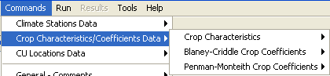
</p>**

**<p style="text-align: center;">
StateCU Crop Characteristics/Coefficients Data (<a href="../Menu_Commands_StateCU_Crop_Data.png">see also the full-size image</a>)
</p>**

The crop characteristics/coefficients data primary identifier is crop name (type), for example `ALFALFA.TR21`.
The information after the period is associated with an analysis method.
Crop data may be adjusted for high altitude or other local calibration efforts.
The irrigated lands crop data (i.e., the data in HydroBase) are typically saved as `ALFALFA`, etc.,
because these data are independent of the use of the data.
To make the crop names consistent during modeling, it is typical to use a `Translate*` command before writing the data.
For example, translate the more generic names to the longer names before writing the crop pattern time series to a file,
specifying ID patterns to translate by location if necessary.
Translate commands are available for data products that include the crop names.
In documentation and software, crop “name”, “type”, and “identifier” are used interchangeably.

### Crop Characteristics ###

Crop characteristics include information about crop types that are used in an analysis,
including planting, harvesting, and root depth data.
Although only a few crops are typically used in an analysis in a basin,
it is often convenient to provide information for many crop types.
Crop characteristics should be defined before CU Locations because the crop
types are used in the crop pattern time series file associated with CU Locations.

The ***Commands / Crop Characteristics/Coefficients / Crop Characteristics***
menu inserts commands to process the StateCU crop characteristics file:

**<p style="text-align: center;">
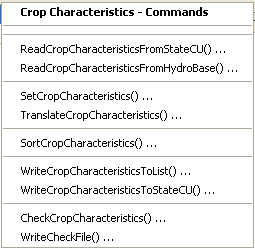
</p>**

**<p style="text-align: center;">
StateCU Crop Characteristics/Coefficients Data / Crop Characteristics (<a href="../Menu_Commands_StateCU_CropCharacteristics.png">see also the full-size image</a>)
</p>**

The following table summarizes the use of each command:

**<p style="text-align: center;">
Crop Characteristics Commands
</p>**

| **Command**&nbsp;&nbsp;&nbsp;&nbsp;&nbsp;&nbsp;&nbsp;&nbsp;&nbsp;&nbsp;&nbsp;&nbsp;&nbsp;&nbsp;&nbsp;&nbsp;&nbsp;&nbsp;&nbsp;&nbsp;&nbsp;&nbsp;&nbsp;&nbsp;&nbsp;&nbsp;&nbsp;&nbsp;&nbsp;&nbsp;&nbsp;&nbsp;&nbsp;&nbsp;&nbsp;&nbsp;&nbsp;&nbsp;&nbsp;&nbsp;&nbsp;&nbsp;&nbsp;&nbsp;&nbsp;&nbsp;&nbsp;&nbsp;&nbsp;&nbsp;&nbsp;&nbsp;&nbsp;&nbsp;&nbsp;&nbsp; | **Description** |
| -- | -- |
| [`ReadCropCharacteristicsFromStateCU`](../command/ref/ReadCropCharacteristicsFromStateCU/ReadCropCharacteristicsFromStateCU.md) | Read from a StateCU file the crop characteristics to include in the dataset. |
| [`ReadCropCharacteristicsFromHydroBase`](../command/ref/ReadCropCharacteristicsFromHydroBase/ReadCropCharacteristicsFromHydroBase.md) | Read from HydroBase the crop characteristics to include in the dataset. |
| [`SetCropCharacteristics`](../command/ref/SetCropCharacteristics/SetCropCharacteristics.md) | Set the data for, and optionally add, crop characteristics data. |
| [`TranslateCropCharacteristics`](../command/ref/TranslateCropCharacteristics/TranslateCropCharacteristics.md) | Translate crop characteristics name for specific modeling conventions, such as locally calibrated coefficients. |
| [`SortCropCharacteristics`](../command/ref/SortCropCharacteristics/SortCropCharacteristics.md) | Sort the crop characteristics by crop name. |
| [`WriteCropCharacteristicsToList`](../command/ref/WriteCropCharacteristicsToList/WriteCropCharacterisicsToList.md) | Write defined crop characteristics to a delimited list file. |
| [`WriteCropCharacteristicsToStateCU`](../command/ref/WriteCropCharacteristicsToStateCU/WriteCropCharacteristicsToStateCU.md) | Write defined crop characteristics to a StateCU file. |
| [`CheckCropCharacteristics`](../command/ref/CheckCropCharacteristics/CheckCropCharacteristics.md) | Check crop characteristics data for problems. |
| [`WriteCheckFile`](../command/ref/WriteCheckFile/WriteCheckFile.md) | Write the results of data checks to a file. |

An example command file is shown below (adapted from the Rio Grande dataset).

```
StartLog(LogFile="Crops_CCH.StateDMI.log")
#
# StateDMI commands to create the Rio Grande Crop Characteristics File
#
# Step 1 - read data from HydroBase
#
# Read the general TR-21 characteristics first and then override with Rio Grande
# data.
ReadCropCharacteristicsFromHydroBase(CUMethod="BLANEY-CRIDDLE_TR-21")
ReadCropCharacteristicsFromHydroBase(CUMethod="BLANEY-CRIDDLE_RIO_GRANDE")
#
# Step 2 - adjust crop characteristics if needed
#    No resets are needed.
#
# Step 3 - write the file
#
WriteCropCharacteristicsToStateCU(OutputFile="rg2007.cch")
#
# Check the results
#
CheckCropCharacteristics(ID="*")
WriteCheckFile(OutputFile="Crops_CCH.StateDMI.check.html")
```

### Blaney-Criddle Crop Coefficients ###

Blaney-Criddle crop coefficients estimate crop irrigation water
requirement during the year or growing season, based on reference conditions.
For daily (perennial) crop curves, 25 values are required, corresponding to the days of the year for month start/end and midpoints.
For percent of season (annual) crop curves,
21 values are required, corresponding to 0, 5, ..., 100 percent of the growing season.
The ***Commands / Crop Characteristics/Coefficients / Blaney-Criddle Crop Coefficients***
menu inserts commands to process the StateCU Blaney-Criddle crop coefficients file:

**<p style="text-align: center;">
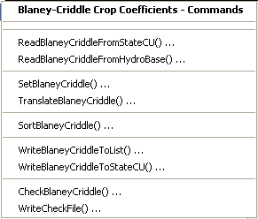
</p>**

**<p style="text-align: center;">
StateCU Crop Characteristics/Coefficients Data / Blaney-Criddle Crop Coefficients (<a href="../Menu_Commands_StateCU_BlaneyCriddle.png">see also the full-size image</a>)
</p>**

The following table summarizes the use of each command:

**<p style="text-align: center;">
Blaney-Criddle Crop Coefficient Commands
</p>**

| **Command**&nbsp;&nbsp;&nbsp;&nbsp;&nbsp;&nbsp;&nbsp;&nbsp;&nbsp;&nbsp;&nbsp;&nbsp;&nbsp;&nbsp;&nbsp;&nbsp;&nbsp;&nbsp;&nbsp;&nbsp;&nbsp;&nbsp;&nbsp;&nbsp;&nbsp;&nbsp;&nbsp;&nbsp;&nbsp;&nbsp;&nbsp;&nbsp;&nbsp;&nbsp;&nbsp;&nbsp;&nbsp;&nbsp;&nbsp;&nbsp;&nbsp;&nbsp;&nbsp;&nbsp; | **Description** |
| -- | -- |
| [`ReadBlaneyCriddleFromStateCU`](../command-ref/ReadBlaneyCriddleFromStateCU/ReadBlaneyCriddleFromStateCU.md) | Read from a StateCU file the Blaney-Criddle coefficient data to include in the dataset. |
| [`ReadBlaneyCriddleFromHydroBase`](../command-ref/ReadBlaneyCriddleFromHydroBase/ReadBlaneyCriddleFromHydroBase.md) | Read from HydroBase the Blaney-Criddle coefficient data to  include in the dataset. |
| [`SetBlaneyCriddle`](../command-ref/SetBlaneyCriddle/SetBlaneyCriddle.md) | Set the data for, and optionally add, Blaney-Criddle coefficient data. |
| [`TranslateBlaneyCriddle`](../command-ref/TranslateBlaneyCriddle/TranslateBlaneyCriddle.md) | Translate crop name in Blaney-Criddle data, for specific modeling conventions, such as locally calibrated coefficients. |
| [`SortBlaneyCriddle`](../command-ref/SortBlaneyCriddle/SortBlaneyCriddle.md) | Sort the Blaney-Criddle data by crop name. |
| [`WriteBlaneyCriddleToList`](../command-ref/WriteBlaneyCriddleToList/WriteBlaneyCriddleToList.md) | Write defined Blaney-Criddle data to a delimited list file. |
| [`WriteBlaneyCriddleToStateCU`](../command-ref/WriteBlaneyCriddleToStateCU/WriteBlaneyCriddleToStateCU.md) | Write defined Blaney-Criddle data to a StateCU file. |
| [`CheckBlaneyCriddle`](../command-ref/CheckBlaneyCriddle/CheckBlaneyCriddle.md) | Check Blaney-Criddle data for problems. |
| [`WriteCheckFile`](../command-ref/WriteCheckFile/WriteCheckFile.md) | Write the results of data checks to a file. |

An example command file is shown below:

```
StartLog(LogFile="Crops_KBC.StateDMI.log")
#
# StateDMI commands to create the Rio Grande Blaney-Criddle coefficients file
#
# Step 1 - read data from HydroBase
#
# Read the general Blaney-Criddle coefficients first and then override with Rio Grande
# data.
ReadBlaneyCriddleFromHydroBase(BlaneyCriddleMethod="BLANEY-CRIDDLE_TR-21")
ReadBlaneyCriddleFromHydroBase(BlaneyCriddleMethod="BLANEY-CRIDDLE_RIO_GRANDE")
#
# Step 3 - write the file
#
SortBlaneyCriddle(Order=Ascending)
WriteBlaneyCriddleToStateCU(OutputFile="rg2007.kbc")
#
# Check the results
#
CheckBlaneyCriddle(ID="*")
WriteCheckFile(OutputFile="Crops_KBC.StateDMI.check.html")
```

### Penman-Monteith Crop Coefficients ###

Penman-Monteith crop coefficients estimate crop irrigation water requirement during one or more growth stages,
with coefficients specified at 10 percent intervals (0... 100 per growth stage).
`ALFALFA` crops require 33 percent/coefficient pairs (3 growth stages),
`GRASS_PASTURE` requires 11 (1 growth stage), and all other crops require 22 (2 growth stages).
The ***Commands / Crop Characteristics/Coefficients / Penman-Monteith Crop Coefficients***
menu inserts commands to process the StateCU Penman-Monteith crop coefficients file:

**<p style="text-align: center;">
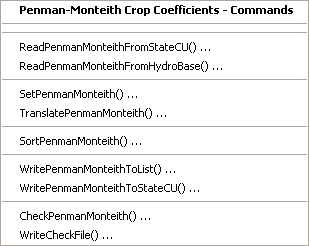
</p>**

**<p style="text-align: center;">
StateCU Crop Characteristics/Coefficients Data / Penman-Monteith Crop Coefficients (<a href="../Menu_Commands_StateCU_PenmanMonteith.png">see also the full-size image</a>)
</p>**

The following table summarizes the use of each command:

**<p style="text-align: center;">
Penman-Monteith Crop Coefficient Commands
</p>**

| **Command**&nbsp;&nbsp;&nbsp;&nbsp;&nbsp;&nbsp;&nbsp;&nbsp;&nbsp;&nbsp;&nbsp;&nbsp;&nbsp;&nbsp;&nbsp;&nbsp;&nbsp;&nbsp;&nbsp;&nbsp;&nbsp;&nbsp;&nbsp;&nbsp;&nbsp;&nbsp;&nbsp;&nbsp;&nbsp;&nbsp;&nbsp;&nbsp;&nbsp;&nbsp;&nbsp;&nbsp;&nbsp;&nbsp;&nbsp;&nbsp;&nbsp;&nbsp;&nbsp;&nbsp;&nbsp;&nbsp; | **Description** |
| -- | -- |
| [`ReadPenmanMonteithFromStateCU`](../command-ref/ReadPenmanMonteithFromStateCU/ReadPenmanMonteithFromStateCU.md) | Read from a StateCU file the Penman-Monteith coefficient data to include in the dataset. |
| [`ReadPenmanMonteithFromHydroBase`](../command-ref/ReadPenmanMonteithFromHydroBase/ReadPenmanMonteithFromHydroBase.md) | Read from HydroBase the Penman-Monteith coefficient data to include in the dataset. |
| [`SetPenmanMonteith`](../command-ref/SetPenmanMonteith/SetPenmanMonteith.md) | Set the data for, and optionally add, Penman-Monteith coefficient data. |
| [`TranslatePenmanMonteith`](../command-ref/TranslatePenmanMonteith/SetPenmanMonteith.md) | Translate crop name in Penman-Monteith data, for specific modeling conventions, such as locally calibrated coefficients. |
| [`SortPenmanMonteith`](../command-ref/SortPenmanMonteith/SortPenmanMonteith.md) | Sort the Penman-Monteith data by crop name. |
| [`WritePenmanMonteithToList`](../command-ref/WritePenmanMonteithToList/WritePenmanMonteithToList.md) | Write defined Penman-Monteith data to a delimited list file. |
| [`WritePenmanMonteithToStateCU`](../command-ref/WritePenMainMonteithToStateCU/WritePenmanMonteithToStateCU.md) | Write defined Penman-Monteith data to a StateCU file. |
| [`CheckPenmanMonteith`](../command-ref/CheckPenmanMonteith/CheckPenmanMonteith.md) | Check Penman-Monteith data for problems. |
| [`WriteCheckFile`](../command-ref/WriteCheckFile/WriteCheckFile.md) | Write the results of data checks to a file. |

An example command file is shown below:

```
StartLog(LogFile="Crops_KPM.StateDMI.log")
#
# StateDMI commands to create the Penman-Monteith crop coefficients file
#
# Step 1 - read data from HydroBase
#
# Read the general ASCE standardized coefficients
ReadPenmanMonteithFromHydroBase(PenmanMonteithMethod="PENMAN-MONTEITH_ALFALFA")
#
# Step 3 - write the file
#
SortPenmanMonteith (Order=Ascending)
WritePenmanMonteithToStateCU(OutputFile="rg2007.kpm")
#
# Check the results
#
CheckPenmanMonteith (ID="*")
WriteCheckFile(OutputFile="Crops_KPM.StateDMI.check.html")
```

## Delay Tables Data ##

Delay tables data were used previously with StateCU when modeling river depletions.
This approach is no longer used.  StateDMI features related to the delay tables data group have been disabled in StateDMI.
See StateMod model features related to delay tables.

## CU Location Data ##

The term CU Location is used to define a location where a consumptive use estimate is being determined.
Consumptive use is determined for the following locations:

1. Diversion structures with only surface water supply.
2. Diversion structures with surface and groundwater supply.
In this case, the wells are identified as an aggregate/system by ditch identifiers.
3. Wells or well fields with only groundwater supply.
Agricultural locations are typically specified as an aggregate/system by well identifiers (older datsets aggregated by parcel identifiers).

The StateCU model, files, documentation, and interface primarily focus on consumptive use at structures and terminology is dominated by “structure”.
For example, one of the main input files to StateCU is the structure (`.str`) file.
However, to allow for more general application of StateCU, StateDMI uses the more general term CU Location in its menus and documentation.
The current StateDMI features do focus on structure locations;
however, the design allows for other types of locations.  Examples of possible CU Locations are:

* ditches (diversion structures) and wells
* climate stations
* water district
* county
* parcel of land (e.g., irrigated parcel)
* any location specified by a coordinate

CU Locations are the entry point into several StateCU dataset files.
Once CU Locations are defined, other data objects, including crop patterns and irrigation practice, can be defined sequentially.
In most cases, the CU Location identifier (e.g., a structure identifier) is used in related files.
Therefore, these identifiers must be unique and are a primary key in all data processing.

StateCU previously managed CU Location data using county and HUC (Hydrologic Unit Code) identifier combinations.
For example, the StateCU `.str` file includes fields for county and HUC.
These fields can be treated generically as Region 1 and Region 2 because there is no real limitation to use county and HUC within StateCU.
Therefore, StateDMI uses the terms `Region1` and `Region2` for these data fields.
Commands and the corresponding edit dialogs currently offer options only for county and HUC
data but have been configured to allow future enhancements for other types of regions
(for example where Region 1 is “climate station” and Region 2 is blank).
More recent CU modeling is not tied to the County/HUC convention.

Data associated with CU Locations using the location ID are:

* CU Locations
* Crop pattern time series (yearly)
* Irrigation practice (parameter) time series (yearly)
* Diversion rights – water supply limited analysis only
* Diversion historical time series (monthly) – water supply limited analysis only
* Well Rights – used to limit groundwater acreage
* Well Historical Pumping Time Series – can be limited to well rights

The menu to access commands for each data component associated with CU Locations is show below:

**<p style="text-align: center;">
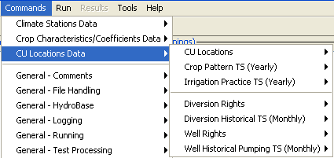
</p>**

**<p style="text-align: center;">
StateCU CULocations Data (<a href="../Menu_Commands_StateCU_CULocations_Data.png">see also the full-size image</a>)
</p>**

The following figure illustrates possible ditch and well water supply for parcels.

**<p style="text-align: center;">

</p>**

**<p style="text-align: center;">
Example Supply for Parcels (<a href="../ParcelSupplyDiagram.png">see also the full-size image</a>)
</p>**

In this example, two ditches (D1 and D2,
each represented with different hatching) provide surface water supply to the indicated parcels.
In some cases, only one ditch provides supply.
Between the ditches, both supply water to shared parcels.
Wells can supplement surface water supply (parcels above the river) or can be the sole supplier
of water (lower right) and wells do not need to be physically located on a parcel to provide supply to the parcel.

In addition to explicit locations (e.g., single ditch),
CU Locations may consist of a collection of individual parts.
Currently, two main types of collections are recognized, as historically used in StateMod modeling:

* **Aggregate** – a group of diversions and/or wells where the water rights and/or permits in the collection
are aggregated (the original distinct rights and/or permits are not individually accessible in the dataset files).
Aggregation reduces the number of water rights in model files,
thereby decreasing the amount of output and model run times.
Aggregation of well rights was used in Rio Grande modeling.
* **System** – a group of diversions and/or wells where water rights and/or permits in the collection
are not aggregated (each right is accessible in the dataset files).
For example, well systems are used in the South Platte dataset,
where individual rights are related to augmentation plans (StateMod plan stations).
Output and model run times increase when individual rights are modeled.

In both cases, StateDMI assumes that the CU Location list includes all locations to be modeled.
Any locations that are aggregates or systems must be defined using the appropriate commands (see `Set*Aggregate` and `Set*System` commands below).
Diversions are grouped by specifying a list of the individual ditch identifiers
(e.g., D1 in the above figure may be an aggregate of more than one ditch).
Irrigation wells are grouped by indicating the parcel identifiers associated with wells
(e.g., W6 – W10 in the above figure may be grouped into a single location for modeling,
using the parcel identifiers to group the data).  Municipal wells can be grouped by well identifier.

Aggregate and system identifier conventions are described in the [Introduction chapter](../introduction/introduction.md).
In general, StateCU datasets should use the same conventions as defined in a related StateMod dataset.
In particular, when referencing a well station,
use aggregate/system commands for well stations and when referencing a diversion station,
use aggregate/system commands for diversion stations.

### CU Locations ###

The ***Commands / CU Locations Data / CU Locations*** menu inserts commands to process the CU Locations (structure) file:

**<p style="text-align: center;">
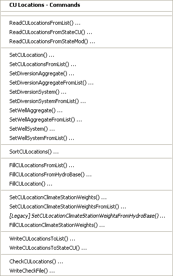
</p>**

**<p style="text-align: center;">
StateCU CULocations (<a href="../Menu_Commands_StateCU_CULocations.png">see also the full-size image</a>)
</p>**

The following table summarizes the use of each command, in the order of the menu:

**<p style="text-align: center;">
CU Location Commands
</p>**

| **Command**&nbsp;&nbsp;&nbsp;&nbsp;&nbsp;&nbsp;&nbsp;&nbsp;&nbsp;&nbsp;&nbsp;&nbsp;&nbsp;&nbsp;&nbsp;&nbsp;&nbsp;&nbsp;&nbsp;&nbsp;&nbsp;&nbsp;&nbsp;&nbsp;&nbsp;&nbsp;&nbsp;&nbsp;&nbsp;&nbsp;&nbsp;&nbsp;&nbsp;&nbsp;&nbsp;&nbsp;&nbsp;&nbsp;&nbsp;&nbsp;&nbsp;&nbsp;&nbsp;&nbsp;&nbsp;&nbsp;&nbsp;&nbsp;&nbsp;&nbsp;&nbsp;&nbsp;&nbsp;&nbsp;&nbsp;&nbsp;&nbsp;&nbsp;&nbsp;&nbsp;&nbsp;&nbsp;&nbsp;&nbsp;&nbsp;&nbsp;&nbsp;&nbsp;&nbsp;&nbsp;&nbsp;&nbsp;&nbsp;&nbsp;&nbsp;&nbsp;&nbsp;&nbsp;&nbsp;&nbsp; | **Description** |
| -- | -- |
| [`ReadCULocationsFromList`](../command-ref/ReadCULocationsFromList/ReadCULocationsFromList.md) | Read from a delimited list file the CU Locations to include in the dataset. |
| [`ReadCULocationsFromStateCU`](../command-ref/ReadCULocationsFromStateCU/ReadCULocationsFromStateCU.md) | Read from a StateCU structure file the CU Locations to include in the dataset. |
| [`ReadCULocationsFromStateMod`](../command-ref/ReadCULocationsFromStateMod/ReadCULocationsFromStateMod.md) | Read from a StateMod diversion or well station file the CU Locations to include in the dataset. |
| [`SetCULocation`](../command-ref/SetCULocation/SetCULocation.md) | Set data for an existing CU Location or optionally add a new CU Location. |
| [`SetCULocationsFromList`](../command-ref/SetCULocationsFromList/SetCULocationsFromList.md) | Read and set CU Location data from a delimited list file. |
| [`SetDiversionAggregate`](../command-ref/SetDiversionAggregate/SetDiversionAggregate.md) | For a diversion CU Location, indicate the parts that comprise an aggregate diversion. |
| [`SetDiversionAggregatesFromList`](../command-ref/SetDiversionAggregatesFromList/SetDiversionAggregatesFromList.md) | For diversion CU Locations, indicate the parts that comprise aggregate diversions, using data in a delimited list file. |
| [`SetDiversionSystem`](../command-ref/SetDiversionSystem/SetDiversionSystem.md) | For a diversion CU Location, indicate the parts that comprise a diversion system. |
| [`SetDiversionSystemsFromList`](../command-ref/SetDiversionSystemsFromList/SetDiversionSystemsFromList.md) | For diversion CU Locations, indicate the parts that comprise diversion systems, using data in a delimited list file. |
| [`SetWellAggregate`](../command-ref/SetWellAggregate/SetWellAggregate.md) | For a well CU Location, indicate the parts that comprise an aggregate well. |
| [`SetWellAggregatesFromList`](../command-ref/SetWellAggregatesFromList/SetWellAggregatesFromList.md) | For well CU Locations, indicate the parts that comprise aggregate wells, using data in a delimited list file. |
| [`SetWellSystem`](../command-ref/SetWellSystem/SetWellSystem.md) | For a well CU Location, indicate the parts that comprise a well system. |
| [`SetWellSystemsFromList`](../command-ref/SetWellSystemsFromList/SetWellSystemsFromList.md) | For well CU Locations, indicate the parts that comprise well systems, using data in a delimited list file. |
| [`SortCULocation`](../command-ref/SetCULocation/SetCULocation.md) | Sort the CU Locations.  This is useful to force consistency between files. |
| [`FillCULocationsFromList`](../command-ref/FillCULocationsFromList/FillCULocationsFromList.md) | Fill missing CU Location data, using data in a delimited list file. |
| [`FillCULocationsFromHydroBase`](../command-ref/FillCULocationsFromHydroBase/FillCULocationsFromHydroBase.md) | Fill missing CU Location data, using data in HydroBase. |
| [`FillCULocation`](../command-ref/FillCULocation/FillCULocation.md) | Fill missing CU Location data, using user-supplied data. |
| [`SetCULocationClimateStationWeights`](../command-ref/SetCULocationClimateStationWeights/SetCULocationClimateStationWeights.md) | Set climate station weight data for a CU Location, using user-supplied data. |
| [`SetCULocationClimateStationWeightsFromList`](../command-ref/SetCULocationClimateStationWeightsFromList/SetCULocationClimateStationWeightsFromList.md) | Set climate station weight data for a CU Location, using data in a delimited list file. |
| [`SetCULocationClimateStationWeightsFromHydroBase`](../command-ref/SetCUClimateStationWeightsFromHydroBase/SetCUClimateStationWeightsFromHydroBase.md) | Set climate station weight data for a CU Location, using data in HydroBase.  Legacy command – not currently used. |
| [`FillCULocationClimateStationWeights`](../command-ref/FillCULcoationClimateStationWeights/FillCULocationCLimateStationWeights.md) | Fill climate station weight data for a CU location, using user-supplied data. |
| [`WriteCULocationsToList`](../command-ref/WriteCULocationsToList/WriteCULocationsToList.md) | Write defined CU Locations data to a delimited list file. |
| [`WriteCULocationsToStateCU`](../command-ref/WriteCULocationsToStateCU/WriteCULocationsToStateCU.md) | Write defined CU Locations data to a StateCU file. |
| [`CheckCULocations`](../command-ref/CheckCULocations/CheckCULocations.md) | Check CU Location data for problems. |
| [`WriteCheckFile`](../command-ref/WriteCheckFile/WriteCheckFile.md) | Write the results of data checks to a file. |

An example command file is shown below (from preliminary South Platte Sp2008L dataset).
Lists of locations in this case have been generated from the StateMod network
(see the [StateMod chapter](../statemod/statemod.md) and separate lists are maintained for various surface and groundwater locations.

```
# Sp2008L_STR.StateDMI
# South Platte Decision Support System
# Historic Consumptive Use Model
# Structure File (*.str)
#
#  Step 1 - Read Structure List File (WDID, Name)
#
#  Structure List includes Key Structures from Task 3, Aggregate GW, and Aggregate SW
ReadCULocationsFromList(ListFile="Sp2008L_StructList.csv",IDCol=1,NameCol=3)
#
#  Step 2 - Read structure information from HydroBase (Latitude, County, HUC)
FillCULocationsFromHydroBase(ID="*",CULocType=Structure,Region1Type=County,Region2Type=HUC)
#
#  Step 3 - Assign AWC values based on Task 57, generate using the CDSS Toolbox
#
# # Key Structure AWC Values
SetCULocationsFromList(ListFile="AWC_2001.csv",IDCol=1,AWCCol=2)
#
# # GW AGG Structure AWC Values
SetCULocationsFromList(ListFile="AWC_Agg_GW.csv",IDCol=1,AWCCol=2)
#
# # SW AGG Structure AWC Values
SetCULocationsFromList(ListFile="AWC_Agg_SW.csv",IDCol=1,AWCCol=2)
#
#  Step 4 - Assign Elevation
FillCULocationsFromList(ListFile="Key_Elev.csv",IDCol=1,ElevationCol=3)
#
# Step 5 - Set Demand Structure Information based on Demand Carrier
SetCULocation(ID="0100503_I",Latitude=40.38,Elevation=4533.00,Region1="WELD",Region2="10190003",AWC=0.1375,IfNotFound=Warn)
#
SetCULocation(ID="6400526",AWC=0.1393,IfNotFound=Warn)
#
# Missing values assigned to Diversion Systems
SetCULocation(ID="0100503_D",Latitude=40.28567,Region1="MORGAN",IfNotFound=Warn)
# DivSys and Aggregate use weighted latitude from climate station assignments
# County and HUC information not assigned to DivSys or Aggregate Structures
#
# Step 6 - Read structure climate weights from list created from the CDSS Toolbox Climate Tool
SetCULocationClimateStationWeightsFromList(ListFile="Climate_2001.csv",IDCol=1,StationIDCol=2,TempWtCol=3,PrecWtCol=3)
#
# Step 8 - Fill Key Climate Station
#
FillCULocationClimateStationWeights(ID="01*",IncludeOrographicTempAdj=False,
IncludeOrographicPrecAdj=False,Weights="0945,1.0,1.0")
#
# Step 7 - Write Structure File
SortCULocations()
WriteCULocationsToStateCU(OutputFile="SP2008L.str")
#
# Check the results
CheckCULocations(ID="*")
WriteCheckFile(OutputFile="SP2008L.str.check.html")
```

The following command file illustrates creation of the CU Location file for a basin without groundwater (taken from Colorado `cm2006` dataset):

```
ReadCULocationsFromList(ListFile="cmstrlist.csv",IDCol=1,NameCol=6)
FillCULocationsFromHydroBase(ID="*",CULocType=Structure,Region1Type=County,Region2Type=HUC)
SetCULocationsFromList(ListFile="cmstrlist.csv",IDCol=1,LatitudeCol=2,AWCCol=11)
SetCULocationsFromList(ListFile="plateau.csv",IDCol=1,Region1Col=2)
SetCULocationClimateStationWeightsFromList(ListFile="cowts.csv",StationIDCol=1,Region1Col=2,Region2Col=3,TempWtCol=4,PrecWtCol=5)
FillCULocationClimateStationWeights(ID="72_ADC065",Weights="3146,0.68,0.68,3489,0.32,0.32")
FillCULocationClimateStationWeights(ID="36*",Weights="4664,1.0,0,3592,0,1.0")
FillCULocationClimateStationWeights(ID="37*",Weights="2454,1.0,1.0")
FillCULocationClimateStationWeights(ID="38*",Weights="3359,1.0,1.0")
FillCULocationClimateStationWeights(ID="39*",Weights="7031,1.0,1.0")
FillCULocationClimateStationWeights(ID="45*",Weights="7031,1.0,1.0")
FillCULocationClimateStationWeights(ID="50*",Weights="3500,0.5,0.5,4664,0.5,0.5")
FillCULocationClimateStationWeights(ID="51*",Weights="3500,0.5,0.5,4664,0.5,0.5")
FillCULocationClimateStationWeights(ID="52*",Weights="9265,1.0,1.0")
FillCULocationClimateStationWeights(ID="53*",Weights="9265,1.0,1.0")
FillCULocationClimateStationWeights(ID="70*",Weights="0214,1.0,1.0")
FillCULocationClimateStationWeights(ID="72*",Weights="1741,1.0,1.0")
FillCULocationClimateStationWeights(ID="950001",Weights="3146,0.68,0.68,3489,0.32,0.32")
FillCULocationClimateStationWeights(ID="950010",Weights="7031,1.0,1.0")
FillCULocationClimateStationWeights(ID="950011",Weights="7031,1.0,1.0")
FillCULocationClimateStationWeights(ID="950050",Weights="3146,0.68,0.68,3489,0.32,0.32")
WriteCULocationsToStateCU(OutputFile="..\Statecu\cm2006.str",WriteHow=OverwriteFile)
# Check the results
CheckCULocations(ID="*")
WriteCheckFile(OutputFile="cm2006.str.StateDMI.check.html")
```

### Crop Pattern Time Series (Yearly) ###

Crop pattern time series indicate the annual crops and their acreage for each CU Location.
The crop pattern file contains a time series of crop patterns for CU Locations, over the period that is being modeled.
The crop pattern data include crop type names and area associated with the crop for the year.
It is not required that all CU Locations include crops but this is often the case.
If a crop is added for a CU Location in any year, StateDMI will output a value in each year.
Consequently, a full time series will be available for each location/crop combination, even if many years have zeros.
It is therefore important to fill such data appropriately such that missing data (e.g., `-999`) are removed from output.

The crop characteristics/coefficients data primary identifier is crop name (type), for example `ALFALFA.TR21`.
The information after the period is associated with an analysis method.
Crop data may be adjusted for high altitude or other local calibration efforts.
The irrigated lands crop data are typically saved as `ALFALFA`, etc. in HydroBase,
because these data are independent of the use of the data.
To make the crop names consistent, use a
[`TranslateCropPatternTS`](../command-ref/TranslateCropPatternTS/TranslateCropPatternTS.md) command before writing the data.
For example, translate the more generic names from HydroBase to the
longer names before writing the crop pattern time series to a file,
specifying ID patterns to translate by location if necessary.

The crop pattern time series file format was originally defined by legacy software
in which a total acreage and fraction by crop is reported.
Because the fraction has three significant figures,
the resulting acreage by crop, when computed from the total, is only accurate to 3 significant figures.
In current StateDMI software, the actual copy acreage is used in computations and the total
and fraction are written to files only for information purposes and to retain the historical file format.
Consequently, comparing acreage from old and new files may be slightly different due to the precision issue.

The ***Commands / CU Locations Data / Crop Patterns TS (Yearly)*** menu inserts commands to process the crop patterns:

**<p style="text-align: center;">
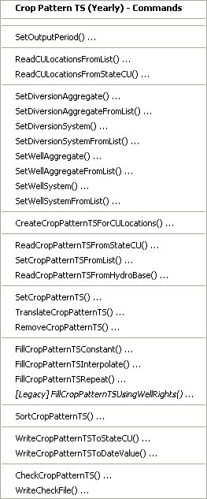
</p>**

**<p style="text-align: center;">
StateCU Crop Pattern TS (<a href="../Menu_Commands_StateCU_CropPatternTS.png">see also the full-size image</a>)
</p>**

The following table summarizes the use of each command, in the order of the menu items:

**<p style="text-align: center;">
Crop Pattern Time Series Commands
</p>**

| **Command**&nbsp;&nbsp;&nbsp;&nbsp;&nbsp;&nbsp;&nbsp;&nbsp;&nbsp;&nbsp;&nbsp;&nbsp;&nbsp;&nbsp;&nbsp;&nbsp;&nbsp;&nbsp;&nbsp;&nbsp;&nbsp;&nbsp;&nbsp;&nbsp;&nbsp;&nbsp;&nbsp;&nbsp;&nbsp;&nbsp;&nbsp;&nbsp;&nbsp;&nbsp;&nbsp;&nbsp;&nbsp;&nbsp;&nbsp;&nbsp;&nbsp;&nbsp;&nbsp;&nbsp;&nbsp;&nbsp;&nbsp;&nbsp;&nbsp;&nbsp; | **Description** |
| -- | -- |
| [`SetOutputPeriod`](../command-ref/SetOutputPeriod/SetOutputPeriod.md) | Set the output period for crop pattern time series.
| [`ReadCULocationsFromList`](../command-ref/ReadCULocationsFromList/ReadCULocationsFromList.md) | Read CU Locations from a list file.  Identifiers should be specified and other columns may be needed for data filling.
| [`ReadCULocationsFromStateCU`](../command-ref/ReadCULocationsFromStateCU/ReadCULocationsFromStateCU.md) | Read from a StateCU file the CU Locations to include in the dataset.
| [`SetDiversionAggregate`](../command-ref/SetDiversionAggregate/SetDiversionAggregate.md) | For a diversion CU Location, indicate the parts that comprise an aggregate diversion.
| [`SetDiversionAggregatesFromList`](../command-ref/SetDiversionAggregatesFromList/SetDiversionAggregatesFromList.md) | For diversion CU Locations, indicate the parts that comprise aggregate diversions, using data in a delimited list file.
| [`SetDiversionSystem`](../command-ref/SetDiversionSystem/SetDiversionSystem.md) | For a diversion CU Location, indicate the parts that comprise a diversion system.
| [`SetDiversionSystemsFromList`](../command-ref/SetDiversionSystemsFromList/SetDiversionSystemsFromList.md) | For diversion CU Locations, indicate the parts that comprise diversion systems, using data in a delimited list file.
| [`SetWellAggregate`](../command-ref/SetWellAggregate/SetWellAggregate.md) | For a well CU Location, indicate the parts that comprise an aggregate well.
| [`SetWellAggregatesFromList`](../command-ref/SetWellAggregatesFromList/SetWellAggregatesFromList.md) | For well CU Locations, indicate the parts that comprise aggregate wells, using data in a delimited list file.
| [`SetWellSystem`](../command-ref/SetWellSystem/SetWellSystem.md) | For a well CU Location, indicate the parts that comprise a well system.
| [`SetWellSystemsFromList`](../command-ref/SetWellSystemsFromList/SetWellSystemsFromList.md) | For well CU Locations, indicate the parts that comprise well systems, using data in a delimited list file.
| [`CreateCropPatternTSForCULocations`](../command-ref/CreateCropPatternTSForCULocations/CreateCropPatternTSForCULocations.md) | Create empty crop pattern time series data for each CU Location.  The resulting data can be updated with other commands.
| [`ReadCropPatternTSFromStateCU`](../command-ref/ReacCropPatternTSFromStateCU/ReadCropPatternTSFromStateCU.md) | Read crop pattern data from a StateCU file and update the StateDMI information.
| [`SetCropPatternTSFromList`](../command-ref/SetCropPatternTSFromList/SetCropPatternTSFromList.md) | Set crop pattern data from a list file, in order to supplement data that are not in HydroBase.  A list file should be specified for each year of irrigated lands data.  The data can be processed with HydroBase data as if they were parcels.
| [`ReadCropPatternTSFromHydroBase`](../command-ref/ReadCropPatternTSFromHydroBase/ReadCropPatternTSFromHydroBase.md) | Read crop pattern data from HydroBase.
| [`SetCropPatternTS`](../command-ref/SetCropPatternTS/SetCropPatternTS.md) | Set crop pattern data using user-supplied values.
| [`TranslateCropPatternTS`](../command-ref/TranslateCropPatternTS/TranslateCropPatternTS.md) | Change a crop type in crop pattern data.
| [`RemoveCropPatternTS`](../command-ref/RemoveCropPatternTS/RemoveCropPatternTS.md) | Remove a specific crop pattern time series.
| [`FillCropPatternTSConstant`](../command-ref/FillCropPatternTSConstant/FillCropPatternTSConstant.md) | Fill missing crop pattern data with a constant value.
| [`FillCropPatternTSInterpolate`](../command-ref/FillCropPatternTSInterpolate/FillCropPatternTSInterpolate.md) | Fill missing crop pattern data using interpolation.
| [`FillCropPatternTSRepeat`](../command-ref/FillCropPatternTSRepeat/FillCropPatternTSRepeat.md) | Fill missing crop pattern data by repeating values.
| [`FillCropPatternTSUsingWellRights`](../command-ref/FillCropPatternTSUsingWellRights/RillCropPatternTSUsingWellRights.md) | Fill crop pattern time series using well rights.  This is used to turn off groundwater only parcels back in time during the early data period.  This legacy command is typically no longer used.
| [`SortCropPatternTS`](../command-ref/SetCropPatternTS/SetCropPatternTS.md) | Sort crop pattern time series by location identifier.
| [`WriteCropPatternTSToStateCU`](../command-ref/WriteCropPatternTSToStateCU/WriteCropPatternTSToStateCU.md) | Write defined crop pattern data to a StateCU file.
| [`WriteCropPatternTSToDateValue`](../command-ref/WriteCropPatternTSToDateValue/WriteCropPatternTSToDateValue.md) | Write defined crop pattern data to a DateValue file.
| [`CheckCropPatternTS`](../command-ref/CheckCropPatternTS/CheckCropPatternTS.md) | Check crop pattern data for problems.
| [`WriteCheckFile`](../command-ref/WriteCheckFile/WriteCheckFile.md) | Write the results of data checks to a file.

There are several ways to define crop pattern data in StateDMI:

1. Read a CU Locations file using
[`ReadCULocationsFromStateCU`](../command-ref/ReadCULocationsFromStateCU/ReadCULocationsFromStateCU.md) or
[`ReadCULocationsFromList`](../command-ref/ReadCULocationsFromList/ReadCULocationsFromList.md) and then read the associated crop patterns from HydroBase using
[`ReadCropPatternTSFromHydrobase`](../command-ref/ReadCropPatternTSFromHydroBase/ReadCropPatternTSFromHydroBase.md).
This is typically used if irrigated lands data have been populated in HydroBase and is the standard approach.
2. Read crop patterns from an existing crop patterns time series file using the
[`ReadCUCropPatternsFromStateCU`](../command-ref/ReadCropPaternTSFromStateCU/ReadCropPatternTSFromStateCU.md) command.
This is typically only used if an existing file needs to be adjusted (e.g., by extending the period with fill options).
3. Utilize data that are not in HydroBase by using the
[`SetCropPatternTSFromList`](../command-ref/SetCropPatternTSFromList/SetCropPatternTSFromList.md) command.
This may be appropriate for new development where data have not yet been loaded into HydroBase.

Once crop patterns are defined with the above commands,
crop patterns for specific CU Locations can be edited using
[`SetCropPatternTS`](../command-ref/SetCropPatternTS/SetCropPatternTS.md) and
[`SetCropPatternTSFromList`](../command-ref/SetCropPatternTSFromList/SetCropPatternTSFromList.md) commands.
These commands can also be used to supply values for specific locations,
to be considered when irrigated lands are processed from a database.
For example, acreage can be assigned to a structure that is part of an aggregate (but which does not have irrigated parcels in the database),
and the supplied value will be included in the aggregate when the irrigated lands from the database are processed.
Because determining crop patterns is a data- and labor-intensive effort,
data are not typically available for each year in a modeling period.
Therefore, crop patterns known for specific years are often extended or interpolated for other years using the
[`FillCropPatternTSRepeat`](../command-ref/FillCropPaternTSRepeat/FillCropPatternTSRepeat.md) and
[`FillCropPatternTSInterpolate`](../command-ref/FillCropPatternTSInterpolate/FillCropPatternTSInterpolate.md) commands.
An attempt was made in the Rio Grande to relate crop patterns to agricultural statistics (crop planting and harvest data);
however, this approach proved to be inaccurate and the more straightforward methods are typically used.
Finally, output can be written using the
[`WriteCropPatternsTSToStateCU`](../command-ref/WriteCropPatternTSToStateCU/WriteCropPatternTSToStateCU.md) command.

An example commands file is shown below (from the Colorado `cm2006` dataset).
This illustrates the major steps in the standard approach.

```
# Step 1 - Set output period and read CU locations
SetOutputPeriod(OutputStart="1950",OutputEnd="2006")
ReadCULocationsFromStateCU(InputFile="..\StateCU\cm2006.str")
# Step 2 - Read SW aggregates
SetDiversionSystemFromList(ListFile="colorado_divsys.csv",IDCol=1,NameCol=2,PartIDsCol=3,PartsListedHow=InRow)
SetDiversionAggregateFromList(ListFile="colorado_agg.csv",IDCol=1,NameCol=2,PartIDsCol=3,PartsListedHow=InRow)
# Step 3 - Create *.cds file form and read acreage/crops from HydroBase
CreateCropPatternTSForCULocations(ID="*",Units="ACRE")
ReadCropPatternTSFromHydroBase(ID="*")
# Step 4 - Need to translate crops out of HB to include TR21 suffix
# Translate all crops from HB to include .TR21 suffix
TranslateCropPatternTS(ID="*",OldCropType="GRASS_PASTURE",NewCropType="GRASS_PASTURE.TR21")
TranslateCropPatternTS(ID="*",OldCropType="CORN_GRAIN",NewCropType="CORN_GRAIN.TR21")
TranslateCropPatternTS(ID="*",OldCropType="ALFALFA",NewCropType="ALFALFA.TR21")
TranslateCropPatternTS(ID="*",OldCropType="SMALL_GRAINS",NewCropType="SPRING_GRAIN.TR21")
TranslateCropPatternTS(ID="*",OldCropType="VEGETABLES",NewCropType="VEGETABLES.TR21")
TranslateCropPatternTS(ID="*",OldCropType="ORCHARD_WO_COVER",NewCropType="ORCHARD_WO_COVER.TR21")
TranslateCropPatternTS(ID="*",OldCropType="ORCHARD_WITH_COVER",NewCropType="ORCHARD_WITH_COVER.TR21")
TranslateCropPatternTS(ID="*",OldCropType="DRY_BEANS",NewCropType="DRY_BEANS.TR21")
TranslateCropPatternTS(ID="*",OldCropType="GRAPES",NewCropType="GRAPES.TR21")
TranslateCropPatternTS(ID="*",OldCropType="WHEAT",NewCropType="SPRING_GRAIN.TR21")
TranslateCropPatternTS(ID="*",OldCropType="SUNFLOWER",NewCropType="SPRING_GRAIN.TR21")
TranslateCropPatternTS(ID="*",OldCropType="SOD_FARM",NewCropType="GRASS_PASTURE.TR21")
# Step 5 - Translate crop names
# use high-altitude coefficients for structures with more than 50% of irrigated
# acreage above 6500 feet
TranslateCropPatternTS(ListFile="cm2005_HA.lst",IDCol=1,OldCropType="GRASS_PASTURE.TR21",NewCropType="GRASS_PASTURE.DWHA")
# Step 6 - Fill Acreage
#      Fill SW structure acreage backword from 1999 to 1950
#      Fill acreage forward for all structures from 2000 to 2006
FillCropPatternTSRepeat(ID="*",CropType="*",FillStart=1950,FillEnd=1993,FillDirection=Backward)
FillCropPatternTSRepeat(ID="*",CropType="*",FillStart=1993,FillEnd=1999,FillDirection=Forward)
FillCropPatternTSRepeat(ID="*",CropType="*",FillStart=2000,FillEnd=2006,FillDirection=Forward)
# Step 7 - Write final *.cds file
WriteCropPatternTSToStateCU(OutputFile="..\StateCU\cm2006.cds",WriteCropArea=True)
# Check the results
CheckCropPatternTS(ID="*")
WriteCheckFile(OutputFile="cm2006.cds.StateDMI.check.html")
```

The following command file illustrates how to process crop characteristics
in a basin with groundwater supply (from preliminary South Platte `Sp2008L` dataset).
The main difference is that lists of locations are defined using aggregate/system wells.

```
#
# Sp2008L_CDS.StateDMI
# ____________________________________________________________________________________
#
# StartLog(LogFile="Sp2008L_CDS.log")
# Crop Distribution File (*.cds) for the SPDSS Consumptive Use Model
#
# Step 1 - Set output period and read CU locations
SetOutputPeriod(OutputStart="1950",OutputEnd="2006")
ReadCULocationsFromStateCU(InputFile="..\LocationCU\SP2008L.str")
#
# Step 2 - Read SW aggregates, divsys, demandsys, and GW aggregates
#
SetDiversionAggregateFromList(ListFile="..\Sp2008L_SWAgg.csv",IDCol=1,NameCol=2,PartIDsCol=3,PartsListedHow=InColumn)
SetDiversionSystemFromList(ListFile="..\Sp2008L_DivSys_CDS.csv",IDCol=1,NameCol=2,PartIDsCol=3,PartsListedHow=InRow)
#
SetWellSystemFromList(ListFile="..\SP_GWAGG_1956.csv",Year=1956,Div=1,PartType=Parcel,IDCol=1,PartIDsCol=2,PartsListedHow=InColumn)
SetWellSystemFromList(ListFile="..\SP_GWAGG_1976.csv",Year=1976,Div=1,PartType=Parcel,IDCol=1,PartIDsCol=2,PartsListedHow=InColumn)
SetWellSystemFromList(ListFile="..\SP_GWAGG_1987.csv",Year=1987,Div=1,PartType=Parcel,IDCol=1,PartIDsCol=2,PartsListedHow=InColumn)
SetWellSystemFromList(ListFile="..\SP_GWAGG_2001.csv",Year=2001,Div=1,PartType=Parcel,IDCol=1,PartIDsCol=2,PartsListedHow=InColumn)
SetWellSystemFromList(ListFile="..\SP_GWAGG_2005.csv",Year=2005,Div=1,PartType=Parcel,IDCol=1,PartIDsCol=2,PartsListedHow=InColumn)
#
# Step 3 - Create *.cds file form and read acreage/crops from HydroBase
CreateCropPatternTSForCULocations(ID="*",Units="ACRE")
ReadCropPatternTSFromHydroBase(ID="*")
#
# # Step 4 - Read well rights and determine gw-only structure acreage in 1950
#
ReadWellRightsFromStateMod(InputFile="..\Wells\Sp2008L_NotMerged.wer")
FillCropPatternTSUsingWellRights(ID="*",IncludeSurfaceWaterSupply=False,CropType="*",FillStart=1950,FillEnd=1955,ParcelYear=1956)
#
# Step 5 -
#      Fill SW structure acreage backward from 1956 to 1950
#      Linearly interpolate acreage for all structures between 1956, 1976, 1987, 2001, and 2005
#      Fill acreage forward for all structures from 2005 to 2006
FillCropPatternTSRepeat(ID="*",CropType="*",FillStart=1950,FillEnd=1956,FillDirection=Backward)
FillCropPatternTSInterpolate(ID="*",CropType="*",FillStart=1956,FillEnd=1976)
FillCropPatternTSInterpolate(ID="*",CropType="*",FillStart=1976,FillEnd=1987)
FillCropPatternTSInterpolate(ID="*",CropType="*",FillStart=1987,FillEnd=2001)
FillCropPatternTSInterpolate(ID="*",CropType="*",FillStart=2001,FillEnd=2005)
FillCropPatternTSRepeat(ID="*",CropType="*",FillStart=2005,FillEnd=2006,FillDirection=Forward)
#
# Step 6 - Set to Missing and Fill primary WDID of Demand Structure = 0
SetCropPatternTS(ID="0100503_D",SetStart=1950,SetEnd=2006,CropPattern="ALFALFA,0,CORN_GRAIN.TR21,0,SUGAR_BEETS,0,GRASS_PASTURE,0,VEGETABLES,0,SPRING_GRAIN.TR21,0",IrrigationMethod=Flood,SupplyType=Ground,ProcessWhen=Now)
SetCropPatternTS(ID="0100507_D",SetStart=1950,SetEnd=2006,CropPattern="ALFALFA,0,CORN_GRAIN.TR21,0,SUGAR_BEETS,0,GRASS_PASTURE,0,VEGETABLES,0,SPRING_GRAIN.TR21,0",IrrigationMethod=Flood,SupplyType=Ground,ProcessWhen=Now)
SetCropPatternTS(ID="0100687",SetStart=1950,SetEnd=2006,CropPattern="ALFALFA,0,CORN_GRAIN.TR21,0,SUGAR_BEETS,0,GRASS_PASTURE,0,VEGETABLES,0,SPRING_GRAIN.TR21,0",IrrigationMethod=Flood,SupplyType=Ground,ProcessWhen=Now)
SetCropPatternTS(ID="0200834",SetStart=1950,SetEnd=2006,CropPattern="ALFALFA,0,CORN_GRAIN.TR21,0,SUGAR_BEETS,0,GRASS_PASTURE,0,VEGETABLES,0,SPRING_GRAIN.TR21,0",IrrigationMethod=Flood,SupplyType=Ground,ProcessWhen=Now)
#
SetCropPatternTS(ID="6400511_D",SetStart=1950,SetEnd=2006,CropPattern="ALFALFA,0,CORN_GRAIN.TR21,0,SUGAR_BEETS,0,GRASS_PASTURE,0,VEGETABLES,0,SPRING_GRAIN.TR21,0",IrrigationMethod=Flood,SupplyType=Ground,ProcessWhen=Now)
# Step 7 - No Acreage in HydroBase, Set to Missing = 0
SetCropPatternTS(ID="0100501",SetStart=1950,SetEnd=2006,CropPattern="ALFALFA,0,CORN_GRAIN.TR21,0,SUGAR_BEETS,0,GRASS_PASTURE,0,VEGETABLES,0,SPRING_GRAIN.TR21,0",IrrigationMethod=Flood,SupplyType=Ground,ProcessWhen=Now)
SetCropPatternTS(ID="0100513",SetStart=1950,SetEnd=2006,CropPattern="ALFALFA,0,CORN_GRAIN.TR21,0,SUGAR_BEETS,0,GRASS_PASTURE,0,VEGETABLES,0,SPRING_GRAIN.TR21,0",IrrigationMethod=Flood,SupplyType=Ground,ProcessWhen=Now)
SetCropPatternTS(ID="0100829",SetStart=1950,SetEnd=2006,CropPattern="ALFALFA,0,CORN_GRAIN.TR21,0,SUGAR_BEETS,0,GRASS_PASTURE,0,VEGETABLES,0,SPRING_GRAIN.TR21,0",IrrigationMethod=Flood,SupplyType=Ground,ProcessWhen=Now)
#
SetCropPatternTS(ID="6400519",SetStart=1950,SetEnd=2006,CropPattern="ALFALFA,0,CORN_GRAIN.TR21,0,SUGAR_BEETS,0,GRASS_PASTURE,0,VEGETABLES,0,SPRING_GRAIN.TR21,0",IrrigationMethod=Flood,SupplyType=Ground,ProcessWhen=Now)
# Step 8 - Translate crop names to Locally Calibrated based on structure location and elevation
# Source: Translate.xls (20070809)
# Alfalfa
TranslateCropPatternTS(ID="*",OldCropType="ALFALFA",NewCropType="ALFALFA.TR21")
TranslateCropPatternTS(ListFile="SP2008_CCLP.csv",IDCol=1,OldCropType="ALFALFA.TR21",NewCropType="ALFALFA.CCLP")
TranslateCropPatternTS(ListFile="SP2008_CCUP.csv",IDCol=1,OldCropType="ALFALFA.TR21",NewCropType="ALFALFA.CCUP")
# CORN_GRAIN
TranslateCropPatternTS(ID="*",OldCropType="CORN",NewCropType="CORN_GRAIN.TR21")
TranslateCropPatternTS(ListFile="SP2008_CCLP.csv",IDCol=1,OldCropType="CORN_GRAIN.TR21",NewCropType="CORN_GRAIN.CCLP")
TranslateCropPatternTS(ListFile="SP2008_CCUP.csv",IDCol=1,OldCropType="CORN_GRAIN.TR21",NewCropType="CORN_GRAIN.CCUP")
# DRY_BEANS
TranslateCropPatternTS(ID="*",OldCropType="DRY_BEANS",NewCropType="DRY_BEANS.TR21")
TranslateCropPatternTS(ListFile="SP2008_CCLP.csv",IDCol=1,OldCropType="DRY_BEANS.TR21",NewCropType="DRY_BEANS.CCLP")
TranslateCropPatternTS(ListFile="SP2008_CCUP.csv",IDCol=1,OldCropType="DRY_BEANS.TR21",NewCropType="DRY_BEANS.CCUP")
# GRASS_PASTURE
TranslateCropPatternTS(ID="*",OldCropType="GRASS_PASTURE",NewCropType="GRASS_PASTURE.TR21")
TranslateCropPatternTS(ListFile="SP2008_CCLP.csv",IDCol=1,OldCropType="GRASS_PASTURE.TR21",NewCropType="GRASS_PASTURE.CCLP")
TranslateCropPatternTS(ListFile="SP2008_CCUP.csv",IDCol=1,OldCropType="GRASS_PASTURE.TR21",NewCropType="GRASS_PASTURE.CCUP")
TranslateCropPatternTS(ListFile="SP2008_DWHA_OroAdj.csv",IDCol=1,OldCropType="GRASS_PASTURE.TR21",NewCropType="GRASS_PASTURE.DWHA")
# SMALL_GRAINS
TranslateCropPatternTS(ID="*",OldCropType="SMALL_GRAINS",NewCropType="SPRING_GRAIN.TR21")
TranslateCropPatternTS(ListFile="SP2008_CCLP.csv",IDCol=1,OldCropType="SPRING_GRAIN.TR21",NewCropType="SPRING_GRAIN.CCLP")
TranslateCropPatternTS(ListFile="SP2008_CCUP.csv",IDCol=1,OldCropType="SPRING_GRAIN.TR21",NewCropType="SPRING_GRAIN.CCUP")
# SUGAR_BEETS
TranslateCropPatternTS(ID="*",OldCropType="SUGAR_BEETS",NewCropType="SUGAR_BEETS.TR21")
TranslateCropPatternTS(ListFile="SP2008_CCLP.csv",IDCol=1,OldCropType="SUGAR_BEETS.TR21",NewCropType="SUGAR_BEETS.CCLP")
TranslateCropPatternTS(ListFile="SP2008_CCUP.csv",IDCol=1,OldCropType="SUGAR_BEETS.TR21",NewCropType="SUGAR_BEETS.CCUP")
# SUGAR_BEETS
TranslateCropPatternTS(ID="*",OldCropType="VEGETABLES",NewCropType="VEGETABLES.TR21")
# SOD_FARM
TranslateCropPatternTS(ID="*",OldCropType="SOD_FARM",NewCropType="BLUEGRASS.POCHOP")
# ORCHARD_WO_COVER
TranslateCropPatternTS(ID="*",OldCropType="ORCHARD_WO_COVER",NewCropType="ORCHARD_WO_COVER.TR21")
#
# Step 9 - Write final *.cds file
WriteCropPatternTSToStateCU(OutputFile="..\StateCU\Historic\SP2008L.cds",WriteHow=OverwriteFile)
WriteCropPatternTSToStateCU(OutputFile="SP2008L.cds",WriteHow=OverwriteFile)
```

### Irrigation Practice Time Series (Yearly) ###

The irrigation practice (parameter) time series file contains CU Location
parameter data that are available as yearly time series.
These data are also used as input to StateMod for use in groundwater and variable-efficiency modeling.
The data in the file include the following for each year:

* Maximum delivery efficiencies, which may be specified with
[`SetIrrigationPracticeTS`](../command-ref/SetIrrigationPracticeTS/SetIrrigationPracticeTS.md) or
[`SetIrrigationPracticeTSFromList`](../command-ref/SetIrrigationPracticeTSFromList/SetIrrigationPracticeTSFromList.md) commands.
* Maximum flood irrigation efficiencies, which may be specified with
[`SetIrrigationPracticeTS`](../command-ref/SetIrrigationPracticeTS/SetIrrigationPracticeTS.md) or
[`SetIrrigationPracticeTSFromList`](../command-ref/SetIrrigationPracticeTSFromList/SetIrrigationPracticeTSFromList.md).  This applies to low efficiency irrigation methods such as flood and furrow.
* Maximum sprinkler irrigation efficiencies, which may be specified with
[`SetIrrigationPracticeTS`](../command-ref/SetIrrigationPracticeTS/SetIrrigationPracticeTS.md) or
[`SetIrrigationPracticeTSFromList`](../command-ref/SetIrrigationPracticeTSFromList/SetIrrigationPracticeTSFromList.md).  This applies to high efficiency irrigation methods such as sprinkler and drip.
* Acres irrigated from surface water only with flood irrigation (low efficiency irrigation).
Data are typically read from HydroBase and then estimated with interpolation or repeat.  See the example below.
* Acres irrigated from surface water only with sprinkler irrigation (high efficiency irrigation).
Data are typically read from HydroBase and then estimated with interpolation or repeat.  See the example below.
* Acres irrigated that have ground water supply (may also have surface water supply), flood irrigation (low efficiency irrigation).
Data are typically read from HydroBase and then estimated with interpolation or repeat.  See the example below.
* Acres irrigated that have ground water supply (may also have surface water supply), sprinkler irrigation (high efficiency irrigation).
Data are typically read from HydroBase and then estimated with interpolation or repeat.  See the example below.
* Maximum monthly pumping (ACFT), determined from summing the well yields/decrees for the
wells associated with the location, using the permit and right dates to turn on wells.
The data are usually processed with the
[`SetIrrigationPracticeTSPumpingMaxToWellRights`](../command-ref/SetIrrigationPracticeTSPumpingMaxToWellRights/SetIrrigationPracticeTSPumpingMaxToWellRights.md) command.
* Groundwater use mode, typically changed from defaults using the
[`SetIrrigationPraticeTS`](../command-ref/SetIrrigationPraticeTS/SetIrrigationPraticeTS.md) command.
* Total acres for location.  These numbers should be an exact duplicate of the total acreage from the crop pattern time series.
See the
[`SetIrrigationPracticeTSTotalAcreageFromCropPatternTSTotalAcreage`](../command-ref/SetIrrigationPracticeTSTotalAcreageFromCropPatternTSTotalAcreage/SetIrrigationPracticeTSTotalAcreageFromCropPatternTSTotalAcreage.md) command.

The definition of CU Locations as well/diversion system/aggregate is important
because the logic to process each type of location is different.
The only way for StateDMI to know whether a CU location is groundwater only is to
check for an aggregate/system that is specified as a list of parcels.
This is because CU Locations data in the StateCU files have no indicator of
whether a location is a diversion, well or diversion supplemented by wells.
This information could be determined from the irrigation practice file; however,
creating this file is the subject of this section and the file is not available as input!

Because the irrigation practice time series file contains multiple time series, the
[`CreateIrrigationPracticeTSForCULocations`](../command-ref/CreateIrrigationPracticeTSForCULocations/CreateIrrigationPracticeTSForCULocations.md) command is used to create blank
time series for each CU location, each filled with missing data.
Appropriate `SetIrrigationPracticeTS*` commands can then be used to define data values.
Fill commands can be used to fill in missing values during the output period.

The crop pattern time series file should have been previously created and is
utilized as the “baseline” for acreage by supplying the total acreage.
The total acreage is maintained during irrigation practice data filling, adjusting acreage parts as appropriate.
General guidelines on setting acreage, as implemented by commands discussed in this section, are as follows:

1. Crop pattern time series total acreage is relied on for the total acreage.
Where inconsistencies occur (e.g., groundwater acres are higher than total acres), the crop pattern total takes precedence.
2. Groundwater acreage takes precedence next because of data availability for
groundwater supply for parcels (well to parcel relationships).
Total groundwater acreage is made consistent with the total acreage,
and may cause a cascade of acreage adjustments described in following items.
In cases where there is no groundwater supply, groundwater acreage is zero and surface water acreage takes precedence.
	1. Groundwater acreage irrigated by sprinklers takes precedence over flood irrigation,
	based on irrigated lands irrigation method identification.
	2. Groundwater acreage irrigated by flood is the remainder within the groundwater acreage.
3. Surface water only acreage (no groundwater supply) is set to total acres minus groundwater supply acres.
	1. Surface water acreage irrigated by sprinklers takes precedence over flood irrigation,
	based on irrigated lands irrigation method identification.
	2. Surface water acreage irrigated by flood irrigation is the remainder within the surface water only acreage.

Consequently, the following acreage relationships are maintained, and are used at checks at various locations during processing:

```
Total = Groundwater + SurfaceOnly

Total = (GroundwaterOnlySprinkler + GroundwaterOnlyFlood) + (SurfaceOnlySprinkler + SurfaceOnlyFlood)
```

The above logic is necessary to make the solution of acreage terms determinate and
may result in a cascade of acreage adjustments as values are set.
If missing values remain after processing, it is necessary to utilize more data to set observations
(e.g., using well rights to limit acreage in the early part of the period),
or to use fill commands to fill gaps (which will result in the cascade of calculations described above).
During initial dataset development, it may be useful to implement one command at a time and review the results,
studying the impacts of each command in filling in gaps.

The ***Commands / CU Locations Data / Irrigation Practice TS (Yearly)*** menu inserts commands to process the StateCU irrigation practice file:

**<p style="text-align: center;">
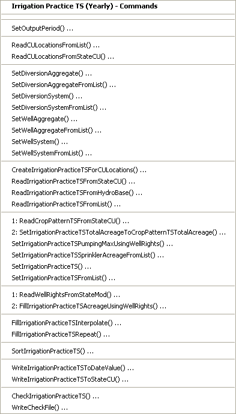
</p>**

**<p style="text-align: center;">
StateCU Irrigation Practice TS (<a href="../Menu_Commands_StateCU_IrrigationPracticeTS.png">see also the full-size image</a>)
</p>**

The following table summarizes the use of each command:

**<p style="text-align: center;">
Irrigation Practice Time Series Commands
</p>**

| **Command**&nbsp;&nbsp;&nbsp;&nbsp;&nbsp;&nbsp;&nbsp;&nbsp;&nbsp;&nbsp;&nbsp;&nbsp;&nbsp;&nbsp;&nbsp;&nbsp;&nbsp;&nbsp;&nbsp;&nbsp;&nbsp;&nbsp;&nbsp;&nbsp;&nbsp;&nbsp;&nbsp;&nbsp;&nbsp;&nbsp;&nbsp;&nbsp;&nbsp;&nbsp;&nbsp;&nbsp;&nbsp;&nbsp;&nbsp;&nbsp;&nbsp;&nbsp;&nbsp;&nbsp;&nbsp;&nbsp;&nbsp;&nbsp;&nbsp;&nbsp;&nbsp;&nbsp;&nbsp;&nbsp;&nbsp;&nbsp;&nbsp;&nbsp;&nbsp;&nbsp;&nbsp;&nbsp;&nbsp;&nbsp;&nbsp;&nbsp;&nbsp;&nbsp;&nbsp;&nbsp;&nbsp;&nbsp;&nbsp;&nbsp;&nbsp;&nbsp;&nbsp;&nbsp;&nbsp;&nbsp; | **Description** |
| -- | -- |
|[`SetOutputPeriod`](../command-ref/SetOutputPeriod/SetOutputPeriod.md) | Set the output period for irrigation practice time series. |
|[`ReadCULocationsFromList`](../command-ref/ReadCULocationsFromList/ReadCULocationsFromList.md) | Read CU Locations from a list file.  Identifiers should be specified and other columns may be needed for data filling. |
|[`ReadCULocationsFromStateCU`](../command-ref/ReadCULocationsFromStateCU/ReadCULocationsFromStateCU.md) | Read from a StateCU file the CU Locations to include in the dataset. |
|[`SetDiversionAggregate`](../command-ref/SetDiversionAggregate/SetDiversionAggregate.md) | For a diversion CU Location, indicate the parts that comprise an aggregate diversion. |
|[`SetDiversionAggregateFromList`](../command-ref/SetDiversionAggregateFromList/SetDiversionAggregateFromList.md) | For diversion CU Locations, indicate the parts that comprise aggregate diversions, using data in a delimited list file. |
|[`SetDiversionSystem`](../command-ref/SetDiversionSystem/SetDiversionSystem.md) | For a diversion CU Location, indicate the parts that comprise a diversion system. |
|[`SetDiversionSystemFromList`](../command-ref/SetDiversionSystemFromList/SetDiversionSystemFromList.md) | For diversion CU Locations, indicate the parts that comprise diversion systems, using data in a delimited list file. |
|[`SetWellAggregate`](../command-ref/SetWellAggregate/SetWellAggregate.md) | For a well CU Location, indicate the parts that comprise an aggregate well. |
|[`SetWellAggregateFromList`](../command-ref/SetWellAggregateFromList/SetWellAggregateFromList.md) | For well CU Locations, indicate the parts that comprise aggregate wells, using data in a delimited list file. |
|[`SetWellSystem`](../command-ref/SetWellSystem/SetWellSystem.md) | For a well CU Location, indicate the parts that comprise a well system. |
|[`SetWellSystemFromList`](../command-ref/SetWellSystemFromList/SetWellSystemFromList.md) | For well CU Locations, indicate the parts that comprise well systems, using data in a delimited list file. |
|[`CreateIrrigationPracticeTSForCULocations`](../command-ref/CreateIrrigationPracticeTSForCULocations/CreateIrrigationPracticeTSForCULocations.md) | Create empty irrigation practice time series data for each CU Location.  The resulting data can be updated with other commands. |
|[`ReadIrrigationPracticeTSFromStateCU`](../command-ref/ReadIrrigationPracticeTSFromStateCU/ReadIrrigationPracticeTSFromStateCU.md) | Read irrigation practice time series data from a StateCU file. |
|[`ReadIrrigationPracticeTSFromHydroBase`](../command-ref/ReadIrrigationPracticeTSFromHydroBase/ReadIrrigationPracticeTSFromHydroBase.md) | Read irrigation practice acreage values from HydroBase. |
|[`ReadIrrigationPracticeTSFromList`](../command-ref/ReadIrrigationPracticeTSFromList/ReadIrrigationPracticeTSFromList.md) | Read irrigation practice time series data from a list, optionally to combine with HydroBase data. |
|[`ReadCropPatternTSFromStateCU`](../command-ref/ReadCropPatternTSFromStateCU/ReadCropPatternTSFromStateCU.md) | Read crop pattern time series from a StateCU file, in order to set the acreage total in the irrigation practice time series. |
|[`SetIrrigationPracticeTSTotalAcreageToCropPatternTSTotalAcreage`](../command-ref/SetIrrigationPracticeTSTotalAcreageToCropPatternTSTotalAcreage/SetIrrigationPracticeTSTotalAcreageToCropPatternTSTotalAcreage.md) | Set the irrigation practice total acreage to the crop pattern total acreage.  This should be done after reading acreage data from HydroBase and before any other acreage filling occurs because the total is used as a check and is maintained in final results. |
|[`SetIrrigationPracticeTSPumpingMaxUsingWellRights`](../command-ref/SetIrrigationPracticeTSPumpingMaxUsingWellRights/SetIrrigationPracticeTSPumpingMaxUsingWellRights.md) | Set the irrigation practice pumping maximum time series to well rights.  See also [`ReadWellRightsFromStateMod`](../command-ref/ReadWellRightsFromStateMod/ReadWellRightsFromStateMod.md). |
|[`SetIrrigationPracticeTSSprinklerAcreageFromList`](../command-ref/SetIrrigationPracticeTSSprinklerAcreageFromList/SetIrrigationPracticeTSSprinklerAcreageFromList.md) | Set the irrigation practice sprinkler acreage time series from a list file. |
|[`SetIrrigationPracticeTS`](../command-ref/SetIrrigationPracticeTS/SetIrrigationPracticeTS.md) | Set irrigation practice data using user-supplied values. |
|[`SetIrrigationPracticeTSFromList`](../command-ref/SetIrrigationPracticeTSFromList/SetIrrigationPracticeTSFromList.md) | Set irrigation practice data from a delimited list file. |
|[`ReadWellRightsFromStateMod`](../command-ref/ReadWellRightsFromStateMod/ReadWellRightsFromStateMod.md) | Read a StateMod well rights file, for use with [`SetIrrigationPracticeTSPumpingMaxUsingWellRights`](../command-ref/SetIrrigationPracticeTSPumpingMaxUsingWellRights/SetIrrigationPracticeTSPumpingMaxUsingWellRights.md) and [`FillIrrigationPracticeTS`](../command-ref/FillIrrigationPracticeTS/FillIrrigationPracticeTS.md). |
|[`FillIrrigationPracticeTSUsingWellRights`](../command-ref/FillIrrigationPracticeTSUsingWellRights/FillIrrigationPracticeTSUsingWellRights.md) | Fill the irrigation practice acreage time series using well rights.  This is only applied to lands with groundwater supply and is used in the early data period. |
|[`FillIrrigationPracticeTSInterpolate`](../command-ref/FillIrrigationPracticeTSInterpolate/FillIrrigationPracticeTSInterpolate.md) | Fill missing irrigation practice data using interpolation. |
|[`FillIrrigationPracticeTSRepeat`](../command-ref/FillIrrigationPracticeTSRepeat/FillIrrigationPracticeTSRepeat.md) | Fill missing irrigation practice data by repeating values. |
|[`SortIrrigationPracticeTS`](../command-ref/SortIrrigationPracticeTS/SortIrrigationPracticeTS.md) | Sort irrigation practice time series by location identifier. |
|[`WriteIrrigationPracticeTSToDateValue`](../command-ref/WriteIrrigationPracticeTSToDateValue/WriteIrrigationPracticeTSToDateValue.md) | Write defined irrigation practice time series to a DateValue file.   This is useful if the data are to be used with the TSTool software. |
|[`WriteIrrigationPracticeTSToStateCU`](../command-ref/WriteIrrigationPracticeTSToStateCU/WriteIrrigationPracticeTSToStateCU.md) | Write defined irrigation practice time series to a StateCU file. |
|[`CheckIrrigationPracticeTS`](../command-ref/CheckIrrigationPracticeTS/CheckIrrigationPracticeTS.md) | Check crop pattern data for problems. |
|[`WriteCheckFile`](../command-ref/WriteCheckFile/WriteCheckFile.md) | Write the results of data checks to a file. |

The following example command file illustrates creating the irrigation practice file in a basin where groundwater supply is not included (from Colorado `cm2006` dataset):

```
# Step 1 - Set output period and read CU locations from structure file
SetOutputPeriod(OutputStart="1950",OutputEnd="2006")
ReadCULocationsFromStateCU(InputFile="..\StateCU\cm2006.str")
# Step 2 - Read SW aggregates
SetDiversionSystemFromList(ListFile="colorado_divsys.csv",IDCol=1,NameCol=2,PartIDsCol=3,PartsListedHow=InRow)
SetDiversionAggregateFromList(ListFile="colorado_agg.csv",IDCol=1,NameCol=2,PartIDsCol=3,PartsListedHow=InRow)
# Step 3 - Create form for *.ipy file
CreateIrrigationPracticeTSForCULocations(ID="*")
# Step 5 - set max flood and surface water efficiencies and GWmode - NOT in HydroBase
# Set Max SW Eff = 1.0
SetIrrigationPracticeTS(ID="*",SurfaceDelEffMax=1.0,FloodAppEffMax=.60,SprinklerAppEffMax=.80,PumpingMax=0,GWMode=2)
SetIrrigationPracticeTSFromList(ListFile="cmstrlist.csv",ID="*",SetStart=1950,SetEnd=2006,IDCol="1",SurfaceDelEffMaxCol="7",FloodAppEffMaxCol="8",SprinklerAppEffMaxCol="9")
# Step 6 - Read category acreage from HydroBase
ReadIrrigationPracticeTSFromHydroBase(ID="*",Year="1993,2000",Div="5")
# Step 8 - Read total acreage from *.cds file and Set total for *.ipy file
ReadCropPatternTSFromStateCU(InputFile="..\StateCU\cm2006.cds")
SetIrrigationPracticeTSTotalAcreageToCropPatternTSTotalAcreage(ID="*")
# Step 9 - Fill all land use acreage
# Fill groundwater acreage first
# Fill surface water sprinkler and flood 1950-2006
# Fill ground water sprinkler and flood 1950-2006
# Step 9a - estimate total GW and total SW
FillIrrigationPracticeTSRepeat(ID="*",DataType="CropArea-GroundWater",FillStart="1950",FillEnd="1993",FillDirection="Backward")
FillIrrigationPracticeTSRepeat(ID="*",DataType="CropArea-GroundWater",FillStart="1993",FillEnd="1999",FillDirection="Forward")
FillIrrigationPracticeTSRepeat(ID="*",DataType="CropArea-GroundWater",FillStart="2000",FillEnd="2006",FillDirection="Forward")
# Step 9b - fill remaining irrigation method values
FillIrrigationPracticeTSRepeat(ID="*",DataType="CropArea-SurfaceWaterOnlySprinkler",FillStart="1950",FillEnd="1993",FillDirection="Backward")
FillIrrigationPracticeTSRepeat(ID="*",DataType="CropArea-SurfaceWaterOnlySprinkler",FillStart="1993",FillEnd="1999",FillDirection="Forward")
FillIrrigationPracticeTSRepeat(ID="*",DataType="CropArea-SurfaceWaterOnlySprinkler",FillStart="2000",FillEnd="2006",FillDirection="Forward")
FillIrrigationPracticeTSRepeat(ID="*",DataType="CropArea-GroundWaterSprinkler",FillStart="1950",FillEnd="1993",FillDirection="Backward")
FillIrrigationPracticeTSRepeat(ID="*",DataType="CropArea-GroundWaterSprinkler",FillStart="1993",FillEnd="1999",FillDirection="Forward")
FillIrrigationPracticeTSRepeat(ID="*",DataType="CropArea-GroundWaterSprinkler",FillStart="2000",FillEnd="2006",FillDirection="Forward")
# Step 10 - Write final ipy file
WriteIrrigationPracticeTSToStateCU(OutputFile="..\StateCU\cm2006.ipy")
# Check the results
CheckIrrigationPracticeTS(ID="*")
WriteCheckFile(OutputFile="cm2006.ipy.StateDMI.check.html")
```

An example command file that considers groundwater is shown below (from Rio Grande dataset):

```
StartLog(LogFile="LocationCU_IPY.StateDMI.log")
#
# LocationCU_Ipy.StateDMI
# Used for all three scenarios:
#	1. rg2007 	Division 3
#       2. rg2007_SW 	Division 3 plus New Mexico
#	3. rg2007_GW	Ground Water Basin Only
#
# rrb 2007/10/09; Revised rgdssall_2007.csv  = rgdssall_STR.csv
#  to add the following based on new URF coverage
# 27URF28
# 20URF00
# 24URF00
# 24IRF00
# 35URF00
# 26URF21
#
# DOES INCLUDE 7 structures in New Mexico (90*).
# These are:
#                ID="90ACEQM",Name="Acequia Madre, NM")
#                ID="90AMALIA",Name="Amalia Area")
#                ID="90CERRO",Name="Cerro and Association")
#                ID="90CERTO",Name="Cerrito Canal")
#                ID="90METRJ",Name="ME Trujillo")
#                ID="90PAPEN",Name="Plaza Arriba and Penasquita")
#                ID="90PDMD",Name="Plaza Del Media")
#
# _________________________________________________________
# rrb 2007/09/18; File provided by Sam via Email on 9/19/2007. Revised as follows:
#
#                 Revised to exclude 2002 data until Agro does additional analysis
#                 Revised NoGIS_1936 to exclude the following structures already
#                 in the 1936 coverage per Sam Email on 9/19.
#                 Reset Taos No 3 (220639) because it sold in 1974
#                 Removed extra output include by SAM
#                 Revised sprinkler file from sprink_Acreage.csv to
#                 Sprink_Acreage_2007.csv to get include 2003-2005 data
# _________________________________________________________
# rrb 2007/08/07; Revised Ditches with Recharge decrees to use GW method 3 from method 1
# rrb 2007/06/27; Comment out Excelsior (200627) so that it uses SW first
# rrb 2007/06/27; Add San Luis Valley (200829) to use GW first
#
# _________________________________________________________
# rrb 2007/06/18; Copied from Sam via FTP per Email 6/19/2007.
# rrb 2007/06/18; Revised to exclude 2002 until questions answered by Agro
#
# _________________________________________________________
# rrb 2007/06/20; Added 2002 back in because of the following enhancement
# rrb 2007/06/20; To be consistent between years and the URF coverage
#                 Revised GW only lands from:
#     Nosurf_1936.csv to 1936_GWonly_Agg.csv
#     Nosurf_1998.csv to 1998_GWonly_Agg.csv
#     Nosurf_2002.csv to 2002_GWonly_Agg.csv
# ____________________________________________________________________________
# Step 1 - read locations
#     Read locations with irrigation from a list file produced with the STR file
#
ReadCULocationsFromList(ListFile="rgdssall_STR.csv",IDCol=1,NameCol=2,LatitudeCol=3,ElevationCol=4,Region1Col=5,Region2Col=6,AWCCol=7)
# ____________________________________________________________________________
# Step 2 - define aggregates and systems
#     Diversions are collections using a list of WDIDs, and the list of IDs is
#     constant through the model period.
#         Aggregates will result in well rights being aggregated.
#         Systems will be modeled with all well rights (no aggregation).
#     Well-only lands are collections using a list of parcel identifiers, and
#     the lists are specified for each year where data are available because the
#     parcel identifiers change from year to year.
#
# Diversions with and without groundwater supply...
SetDiversionAggregateFromList(ListFile="..\Diversions\rgTW_divaggregates.csv",IDCol=1,PartIDsCol=2,PartsListedHow=InRow)
#
SetDiversionSystemFromList(ListFile="rg2007_divsystems_Acres.csv",IDCol=1,PartIDsCol=2,PartsListedHow=InRow)
#
# Wells with groundwater only supply..
SetWellSystemFromList(ListFile="..\Wells\1936_GWonly_agg.csv",Year=1936,Div=3,PartType=Parcel,IDCol=1,PartIDsCol=2,PartsListedHow=InColumn)
SetWellSystemFromList(ListFile="..\Wells\1998_GWonly_agg.csv",Year=1998,Div=3,PartType=Parcel,IDCol=1,PartIDsCol=2,PartsListedHow=InColumn)
# ____________________________________________________________________________
# Step 3 - create irrigation practice time series...
#    Specify a start of 1936 to use 1936 data in filling.
#    Only 1950 to 2005 will be output at the end.
#    The createIrrigationPracticeTSForCULocations() command creates empty time
#    series for each location, so that they can be manipulated with following
#    commands.
#
SetOutputPeriod(OutputStart="1936",OutputEnd="2005")
CreateIrrigationPracticeTSForCULocations(ID="*")
# ____________________________________________________________________________
# Step 4 - fill/set data that are straightforward to set
#
# Step 4a - set efficiency limits for all structures.
#    These values are not in HydroBase.
#    Question - where do these come from?  StateCU?  Circular?
#
setIrrigationPracticeTSFromList(ListFile="eff.csv",IDCol="1",SurfaceDelEffMaxCol="2",FloodAppEffMaxCol="3",SprinklerAppEffMaxCol="4")
SetIrrigationPracticeTSFromList(ListFile="eff_2007.csv",ID="*",IDCol="1",SurfaceDelEffMaxCol="2",FloodAppEffMaxCol="3",SprinklerAppEffMaxCol="4")
#
# Step 4b - set the GWMode
#    The default is mutual ditch (GWMode=2).
#    Set GWMode for structures using the maximum supply mode (GWMode=1).
#    Does this have any impact on the order of importance of acreage below?
#
SetIrrigationPracticeTS(ID="200812",GWMode=3)
SetIrrigationPracticeTS(ID="200631",GWMode=3)
SetIrrigationPracticeTS(ID="200798",GWMode=3)
SetIrrigationPracticeTS(ID="200829",GWMode=3)
# ____________________________________________________________________________
# Step 5 - set the pumping maximum for all locations using well rights
#
# Set the maximum well pumping to well water rights from the StateMod merged
# rights, which contains merged rights from the multiple years of irrigated lands.
# The number of days per month (30.4) is specified to convert CFS to AF/M and
# agrees with the data processing done in Phase 4.
# The full period will be set, including zeros at the beginning if no well
# rights are available.
# Locations that only have surface water (no well rights) will be set to zero
# throughout the set period.
ReadWellRightsFromStateMod(InputFile="..\Wells\rg2007.wer",Append=False)
SetIrrigationPracticeTSPumpingMaxUsingWellRights(ID="*",IncludeSurfaceWaterSupply=True,IncludeGroundwaterOnlySupply="True",NumberOfDaysInMonth=30.4)
# ____________________________________________________________________________
# Step 6 - read the 1936 and 1998 Acreage/IrrigationMethod/SupplyType data
#
# Step 6a - provide supplemental data to be used - not in HydroBase
#
SetIrrigationPracticeTSFromList(ListFile="..\Crops\NoGIS_1998.csv",ID="*",SetStart=1998,SetEnd=1998,IDCol="1",AcresTotalCol="3")
SetIrrigationPracticeTSFromList(ListFile="..\Crops\NoGIS_1936.csv",ID="*",SetStart=1936,SetEnd=1936,IDCol="1",AcresTotalCol="3")
#
# Step 6b - read the data from HydroBase
#
#    Read 1936 and 1998 irrigated parcel data (area, irrigation method, supply
#      type[groundwater or not]) for each location.
#
#    After this step:
#    1. All acreage values for 1936 and 1998 will be set.
#    2. All other years will be missing.
#
ReadIrrigationPracticeTSFromHydroBase(ID="*",Year="1936,1998",Div="3")
# ____________________________________________________________________________
# Step 7 - read the crop pattern total acreage and set as the IPY total acreage
#
# Step 7a - read CDS total acreage and set in IPY
#    The CDS total is used in all cases for the full period - include 1936 to
#    facilitate data checks and review trends.  The extreme year 2002 is
#    ommitted so as to not impact data filling at the end of the period.  It is
#    read at the end of processing and superimposed on the results.
#    The period 1950+ is written at the end.
#
#    After this step:
#    1. All acreage values for 1936 and 1998 will be set.
#    2. All other years will be missing.
#    3. Total acreage will be set for the entire period.
#
ReadCropPatternTSFromStateCU(InputFile="..\Crops\rg2007_With1936.cds")
SetIrrigationPracticeTSTotalAcreageToCropPatternTSTotalAcreage(ID="*",SetStart=1936,SetEnd=2005)
# ____________________________________________________________________________
# Step 8 - fill groundwater acreage time series
#
# Step 8a - first limit the groundwater acreage using well rights
#
#     Fill the groundwater acreage data prior to 1998 using the 1998 parcels
#     and associated water rights.
#     Turn off parcels when a water right is not available for
#     the year.  This uses the water right file before it is merged for
#     multiple years because the unmerged 1998 rights are needed (therefore
#     the water rights file from max pumping CANNOT be reused here).
#
#     After this step:
#     1. All groundwater acreage prior to 1998 will have been estimated by using
#        the 1998 well data.  The irrigation method will therefore be controlled
#        by the 1998 data (This may result in overestimating sprinkler acres
#        prior to 1970, before which sprinkler acreage should be zero) and will
#        need to be further refined below.
#     2. Surface water only total acreage will have been estimated for all
#        locations as Total - GW.
#     3. Surface water acreage by irrigation method will have been set to zero
#        for groundwater only locations.  For other locations additional
#        processing will occur below (from user-supplied sprinkler data and/or
#        interpolate/repeat of irrigation method time series).
#
ReadWellRightsFromStateMod(InputFile="..\Wells\rg2007_NotMerged.wer",Append=False)
FillIrrigationPracticeTSAcreageUsingWellRights(ID="*",IncludeSurfaceWaterSupply=True,IncludeGroundwaterOnlySupply="True",FillStart=1937,FillEnd=1997,ParcelYear=1998)
# ____________________________________________________________________________
# Step 8b - fill the groundwater total acres for years that could not be
#     set from well rights.
#
#     Since 1998 was used as the year for well rights, all years up to and
#     including 1998 will have groundwater total acres set.  This will also
#     have resulted in surface water only total acres being set.  Therefore,
#     just repeat the 1998 values forward in time to the end of the period.
#     Fill each irrigation method since the values will be set in 1998 and the
#     information needs to be retained.  The groundwater total acres will be
#     computed from these values, and consequently the surface water total will
#     be computed.
#
#     After this step:
#     1. Groundwater total acreage will be set for all locations for the full
#        period.
#     2. Groundwater acreage by irrigation method will still be missing for
#        the years filled in this step, unless the groundwater total was zero,
#        in which case the irrigation method parts will also be zero.  See
#        the step below to use RCWCD data to fill the irrigation method time
#        series.
#     3. Surface water only total acreage time series will be computed as
#        Total - GW acres.
#     4. Surface water only acreage by irrigation method will still be missing
#        in some cases until the RCWCD is read below and/or repeat/interpolation
#        of irrigation method time series occurs below.
# Filling the total acres is NOT NORMALLY NEEDED.  However, this will
# fill in the 2002 data so that when groundwater acreage parts are set, they will
# be able to compare and adjust to the total.  Filling over 2002 is needed to
# complete the standard process but 2002 will be superimposed on the end.
#
FillIrrigationPracticeTSRepeat(ID="*",DataType="CropArea-GroundWaterFlood",FillStart="1998",FillEnd="2005",FillDirection="Forward")
FillIrrigationPracticeTSRepeat(ID="*",DataType="CropArea-GroundWaterSprinkler",FillStart="1998",FillEnd="2005",FillDirection="Forward")
# ____________________________________________________________________________
# Step 8c - use RGWCD sprinkler data to adjust irrigation method
#     The sprinkler acreage in the list file input to the command below should be filled for the
#     period 1950 to 2005, interpolating between observed data and carried
#     forward from 1998 to 2005.  This file indicates only sprinkler acreage
#     but not whether the acreage is for groundwater or surface-water only.
#     The above commands have focused on resolving groundwater acreage
#     total, utilizing 1998 data to determine whether FLOOD or SPRINKLER
#     for estimated years, the following command redistributes the acreage
#     within the groundwater total first, possibly resulting in a different
#     irrigation method mix than from above.  A summary of the steps is as
#     follows:
#        1. GWsprinkler = min(Sprinkler_FromListFile,GWTotal)
#            where GWTotal has resulted from the above processing steps
#            and Sprinkler_ListFile is sprinkler acreage from the list file (no
#            assumption about ground/surface water yet - the focus is on
#            resolving the irrigation method within groundwater).
#        2. GWflood = GWtotal - GWsprinkler
#        2. SWsprinkler = min(Sprinkler_FromListFile - GWsprinkler, SWtotal)
#        4. SWflood = SWtotal - SWsprinkler.
#
#    Note:  This step is used in the Rio Grande.
#           An alternative in basins like the South Platte is to use a set
#           command to explicitly set GWsprinkler and SWsprinkler to zero
#           in the early study period.
#
#    After this step:
#    1. All acreage terms should be set except where no sprinkler data were
#       available (in this case use a set command to set to zero if necessary) -
#       see the following step.
#    2. The end of the period, where sprinkler was not set, may need to be
#       repeated, interpolated from the last observation.
#
SetIrrigationPracticeTSSprinklerAcreageFromList(ListFile="..\SprinklerAcreage\sprink_acreage_2007.csv",ID="*",YearCol=2,IDCol="1",AcresSprinklerCol="3")
# ____________________________________________________________________________
# Step 8d - set sprinkler data to zero where RGWCD were not available in
#     the early period.
#
#     This will remove missing data from the early period.
#
#     After this step:
#     1) The only missing data should be at the end of the period where
#        sprinkler data were not provided from observations.
#
SetIrrigationPracticeTS(ID="*",SetStart=1936,SetEnd=1970,AcresSWSprinkler=0,AcresGWSprinkler=0)
# ____________________________________________________________________________
# Step 9 - fill surface water acres
#
# Step 9a - fill before 1998 using 1936
#     Use interpolation between the 1936 and 1998 snapshots to fill in surface
#     water sprinkler and flood acres - this defines the split between
#     SWflood and SWsprinkler.
#     After the initial interpolation, the values are adjusted so that
#        TotalAcres - GWacres = SWflood + SWsprinkler
#        If necessary, SWflood and SWsprinkler are prorated up/down to
#        satisfy the above.
#
#     Note for the South Platte, since there is not a bounding year with data
#     at the start of the period, use fill repeat backwards at the period start.
#
# Step 9b - fill acreage after 1998 by repeating 1998
#     Fill repeat after 1998 for all IPY acreage columns
#     Or should this go after Step 10 below?
#
FillIrrigationPracticeTSRepeat(ID="*",DataType="CropArea-SurfaceWaterOnlySprinkler",FillStart="1998",FillEnd="2005",FillDirection="Forward")
FillIrrigationPracticeTSRepeat(ID="*",DataType="CropArea-SurfaceWaterOnlyFlood",FillStart="1998",FillEnd="2005",FillDirection="Forward")
#
# ____________________________________________________________________________
# Step 10 - read the 2002 Acreage/IrrigationMethod/SupplyType data
#
# Step 10a - provide supplemental data to be used - not in HydroBase
#
# Step 10b - read the data from HydroBase
#
#    Read 2002 data.
#
#_____________________________________________________________________________
# Step 10b; Replace Taos No 3 (220639
SetIrrigationPracticeTS(ID="220639",SetStart=1936,SetEnd=1973,AcresSWFlood=911.05,AcresSWSprinkler=0.0,AcresGWFlood=0.0,AcresGWSprinkler=0.0,AcresTotal=911.05)
SetIrrigationPracticeTS(ID="220639",SetStart=1974,SetEnd=2005,AcresSWFlood=109.24,AcresSWSprinkler=0.0,AcresGWFlood=0.0,AcresGWSprinkler=0.0,AcresTotal=109.24)
# ____________________________________________________________________________
# Step 11 - write the StateCU IPY file(s)
#
# Step 11.a - write old format for Phase 4 comparison
#   First write old format to allow comparison with Phase 4 and use with
#   StateMod (not yet updated to version 12).
#   Problem - this may not be possible given the adjustments that are made
#    above - SAM will see if the old GW and Sprinkler data can be computed.
#
SortIrrigationPracticeTS()
WriteIrrigationPracticeTSToStateCU(OutputFile="..\CompareWithPhase4\Current\rg2007.Version10.ipy",OutputStart="1950",OutputEnd="2005",Version="10")
#
# Step 11.b - write the final results for use with StateCU and StateMod
#    This uses the StateCU version 12+ output because all acreage
#    computations require that the 4 acreage columns add up to the total.
#
WriteIrrigationPracticeTSToStateCU(OutputFile="rg2007_With1936.ipy")
WriteIrrigationPracticeTSToStateCU(OutputFile="..\StateCU\rg2007.ipy",OutputStart="1950",OutputEnd="2005")
#
# Store results in source directory and StateMod
WriteIrrigationPracticeTSToStateCU(OutputFile="rg2007.ipy",OutputStart="1950",OutputEnd="2005")
WriteIrrigationPracticeTSToStateCU(OutputFile="..\StateCU\Historic\rg2007.ipy",OutputStart="1950",OutputEnd="2005")
WriteIrrigationPracticeTSToStateCU(OutputFile="..\StateMod\Historic\rg2007.ipy",OutputStart="1950",OutputEnd="2005")
#
# Check the results
CheckIrrigationPracticeTS(ID="*")
WriteCheckFile(OutputFile="LocationCU_IPY.StateDMI.check.html")
```

### Diversion Water Rights ###

Diversion water rights, when used with StateCU,
are used for a water supply limited by water rights analysis and are typically copied from a StateMod dataset.
The relevant commands are included with StateCU commands to facilitate creating
the diversion rights file independent of a StateMod dataset.
Refer to the [StateMod chapter](../statemod/statemod.md) for information about creating the diversion water rights file.

### Diversion Time Series ###

Diversion time series, when used with StateCU,
are used for a water supply limited analysis and are typically copied from a StateMod dataset.
The relevant commands are included with StateCU commands to facilitate
creating the diversion demand time series file independent of a StateMod dataset.
Refer to the [StateMod chapter](../statemod/statemod.md) for information about creating the diversion demand time series file.

### Well Water Rights ###

Well water rights are used to set the maximum groundwater pumping data in the irrigation practice time series.
The relevant commands are included with StateCU commands to facilitate
creating the well water rights file independent of a StateMod dataset.
Refer to the [StateMod chapter](../statemod/statemod.md) for information about creating the well water rights file.

### Well Historical Pumping Time Series (Monthly) ####

Historical pumping time series are typically produced by StateCU and are input to StateMod.
The commands to process well demand time series are included as a copy of those available with StateMod data processing.
However, these commands may not be suitable based on data availability.
Refer to the [StateMod chapter](../statemod/statemod.md) for a description of these commands
and approaches for creating the historical pumping file for StateMod.
