# StateDMI / Creating StateMod Dataset Files #

* [Introduction](#introduction)
* [Control Data](#control-data)
	+ [Response File](#response-file)
	+ [Control File](#control-file)
	+ [Output Control File](#output-control-file)
* [Stream Gage Data](#stream-gage-data)
	+ [Stream Gage Stations](#stream-gage-stations)
	+ [Stream Historical Time Series (Monthly, Daily)](#stream-historical-time-series-monthly-daily)
	+ [Stream Natural Flow Time Series (Monthly, Daily)](#stream-natural-flow-time-series-monthly-daily)
* [Delay Table Data](#delay-table-data)
	+ [Delay Tables (Monthly)](#delay-tables-monthly)
	+ [Delay Tables (Daily)](#delay-tables-daily)
* [Diversion Data](#diversion-data)
	+ [Diversion Stations](#diversion-stations)
	+ [Diversion Rights](#diversion-rights)
	+ [Diversion Historical Time Series (Monthly)](#diversion-historical-time-series-monthly)
	+ [Diversion Historical Time Series (Daily)](#diversion-historical-time-series-daily)
	+ [Diversion Demand Time Series (Monthly)](#diversion-demand-time-series-monthly)
	+ [Diversion Demand Time Series Override (Monthly)](#diversion-demand-time-series-override-monthly)
	+ [Diversion Demand Time Series (Average Monthly)](#diversion-demand-time-series-average-monthly)
	+ [Diversion Demand Time Series (Daily)](#diversion-demand-time-series-daily)
	+ [Irrigation Practice Time Series (Yearly)](#irrigation-practice-time-series-yearly)
	+ [Consumptive Water Requirement (Monthly, Daily)](#consumptive-water-requirement-monthly-daily)
	+ [Soil Moisture](#soil-moisture)
* [Precipitation Data](#precipitation-data)
	+ [Precipitation Time Series (Monthly)](#precipitation-time-series-monthly)
* [Evaporation Data](#evaporation-data)
	+ [Evaporation Time Series (Monthly)](#evaporation-time-series-monthly)
* [Reservoir Data](#reservoir-data)
	+ [Reservoir Stations](#reservoir-stations)
	+ [Reservoir Rights](#reservoir-rights)
	+ [Reservoir Content, Target Time Series (Monthly, Daily)](#reservoir-content-target-time-series-monthly-daily)
* [Instream Flow Data](#instream-flow-data)
	+ [Instream Flow Stations](#instream-flow-stations)
	+ [Instream Flow Rights](#instream-flow-rights)
	+ [Instream Flow Demand Time Series (Average Monthly)](#instream-flow-demand-time-series-average-monthly)
	+ [Instream Flow Demand Time Series (Monthly, Daily)](#instream-flow-demand-time-series-monthly-daily)
* [Well Data](#well-data)
	+ [Well Stations](#well-stations)
	+ [Well Rights](#well-rights)
	+ [Well Historical Pumping Time Series (Monthly)](#well-historical-pumping-time-series-monthly)
	+ [Well Historical Pumping Time Series (Daily)](#well-historical-pumping-time-series-daily)
	+ [Well Demand Time Series (Monthly)](#well-demand-time-series-monthly)
	+ [Irrigation Practice Time Series (Yearly)](#irrigation-practice-time-series-yearly)
	+ [Consumptive Water Requirement (Monthly, Daily)](#consumptive-water-requirement-monthly-daily)
	+ [Soil Moisture Time Series (Yearly)](#soil-moisture-time-series-yearly)
* [Stream Estimate Data](#stream-estimate-data)
	+ [Stream Estimate Stations](#stream-estimate-stations)
	+ [Stream Estimate Coefficients](#stream-estimate-coefficients)
	+ [Stream Estimate Natural Flow Time Series (Monthly, Daily)](#stream-estimate-natural-flow-time-series-monthly-daily)
* [River Network Data](#river-network-data)
	+ [Network (used by StateDMI, StateMod GUI)](#network-used-by-statedmi-statemod-gui)
	+ [River Network (used by StateMod)](#river-network-used-by-statemod)
* [Operational Data](#operational-data)
* [San Juan Sediment Recovery Plan Data](#san-juan-sediment-recovery-plan-data)
* [Spatial Data](#spatial-data)

----------

## Introduction ##

The ***Commands*** menu lists StateMod data components and groups when StateDMI is used to process StateMod dataset files
(use ***File / Switch to StateMod*** if necessary to see the StateMod command menus).

**<p style="text-align: center;">
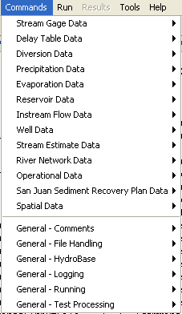
</p>**

**<p style="text-align: center;">
Commands Menu for StateMod (<a href="../Menu_Commands_StateMod.png">see also the full-size image</a>)
</p>**

Each menu corresponds to a data component group.
Each sub-menu corresponds to a StateMod dataset component and input file and is discussed in the following sections.
The top-level data groups utilize unique data identifiers shared among products in the group.
For example, Diversion Data are all referenced using a diversion station identifier.
General Commands are useful at any time (e.g., add comments) and are discussed in the
[Getting Started](../getting-started/getting-started.md) chapter.

Examples of StateMod model files are not included in this documentation.
Refer to the StateMod model documentation for detailed information about model file formats.
Command file examples from CDSS datasets are included in documentation;
however, refer to the current datasets for current examples because there may have been refinements in the approach.

The StateMod model is used to perform water allocation studies for a river basin.
Most data files focus on data groups that include primary data files (e.g., station files)
and secondary data files (e.g., water rights, time series).
Some files provide more basic data (e.g., return flow patterns)
and others provide more complex data (e.g., operating rules and river network).
The organization of the StateDMI Commands menu is meant to facilitate creating data files in a logical order.
However, there is generally no limitation that prevents a user from combining commands
in any desired order or working on files in other than the order shown.

## Control Data ##

StateMod control data consists of:

* Response file
* Control file
* Output control file

Control data are currently not processed by StateDMI,
although commands may be added in the future (e.g., to update the response file when a data file is written, so that the file names agree).
Background information about each file is provided in the following sections.

### Response File ###

A StateMod response file (`*.rsp`) lists all the data files that are used in a model
run and is specified to StateMod on the command line (see the StateMod documentation).
The StateMod GUI also uses the response file when opening a dataset.
The response file is generally copied from an existing dataset and hand-edited as appropriate.
The base name of the response file (the part before the extension)
should adhere to current modeling standards (see [Dataset Folder and File Conventions](../introduction/introduction.md#dataset-folder-and-file-conventions)).
A separate response file for each run (e.g., for historical, calculated, baseline, daily runs)
is usually created rather than editing the response file between runs.
Note that some files can be specified as empty files, in which case StateMod will ignore the input type.
A convention is to use an empty file named `dummy` in these cases.

Updates to the StateMod model have introduced a free-format response file that
allows dataset files to be listed in any order, or be omitted altogether.
This simplifies the management of a data.
It is recommended that the newer free-format response file be used for StateMod because it
allows more flexibility and reduces errors.
See the StateMod documentation for information about the response file.

It is recommended that the files in a StateMod response file be specified using
only file names (no paths) and that relative paths be used if necessary (e.g., `..\StateCU\rgTW.ddc`).
This allows the dataset to be moved from one location to another without requiring edits to response files.

Rather than requiring a response file during processing, StateDMI provides commands that directly read needed files.
For example, to process diversion station efficiencies,
commands are provided to read the irrigation water requirement and historical diversion time series files.

### Control File ###

The control file (`*.ctl`) is a fixed-format file that specifies many of the run-time parameters to StateMod,
including the simulation period (note the simulation period may be less than the input data period to shorten execution time)
and parameters that control the execution (e.g., whether the run is for monthly or daily data).
See the StateMod documentation for a full explanation of control file parameters.
The meaning of data in some data files requires referencing the control file.
For example, monthly efficiencies in the diversion and well stations files are listed
according to the year type (calendar, water, or irrigation year) in the control file.

Rather than requiring that a control file is available during processing,
StateDMI commands allow parameters to be specified as needed.
For example, the [`SetOutputYearType`](../command-ref/SetOutputYearType/SetOutputYearType.md)
command indicates whether output should be calendar or water year.

### Output Control File ###

The output control file (`*.out` or `*.xou`) contains data that will limit the extent of selected
output file requests when running StateMod in report mode.
It is generated by StateMod using the `–check` option,
which assumes that the modeler will want to review historical streamflow stations only.
The output control file can be edited manually or with the StateMod GUI
to add or remove additional structures for detailed output review.
The output control file is not used by StateDMI.

## Stream Gage Data ##

StateMod uses water supply from streamflow data to satisfy demands (it does not simulate run-off from precipitation).
Stream gage data consists of:

* Stream gage stations
* Historical flow time series (monthly, daily)
* Natural flow time series (monthly, daily)

Each of the above data types is stored in a separate file, using the stream gage station identifier as the primary identifier.
The term “River” and “Stream” are sometimes used interchangeably in StateMod documentation;
however, StateDMI uses “Stream” in most cases.
StateMod now supports separate stream gage and stream estimate data (see the [Stream Estimate Data](#stream-estimate-data) section).
Stream gage stations correspond to locations where historical data are available,
and when using separate stream gage and estimate station files should not include stream estimate stations.
However, until modeling conventions begin utilizing separate stream gage and estimate station files,
StateDMI also allows a combined stream gage/estimate station file (in which case the stream estimate station file is not used).

The processing of each data file is discussed below.

### Stream Gage Stations ###

Stream gage stations used with StateMod often are selected by reviewing available stream gage
historical time series data to find stations with acceptable periods of record.
TSTool or other software can be used to identify acceptable stream gage stations.

Stream gage station identifiers are typically USGS or other agency identifiers.
These identifiers correspond to data in HydroBase and other sources and therefore allow data to be located in the original source.

The ***Commands / Stream Gage Data / Stream Gage Stations*** menus insert commands to process stream gage station data:

**<p style="text-align: center;">
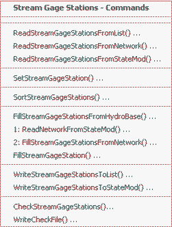
</p>**

**<p style="text-align: center;">
Commands / Stream Gage Data / Stream Gage Stations Menu (<a href="../Menu_Commands_StateMod_StreamGages.png">see also the full-size image</a>)
</p>**

The following table summarizes the use of each command:

**<p style="text-align: center;">
Stream Gage Station Commands
</p>**

| **Command**&nbsp;&nbsp;&nbsp;&nbsp;&nbsp;&nbsp;&nbsp;&nbsp;&nbsp;&nbsp;&nbsp;&nbsp;&nbsp;&nbsp;&nbsp;&nbsp;&nbsp;&nbsp;&nbsp;&nbsp;&nbsp;&nbsp;&nbsp;&nbsp;&nbsp;&nbsp;&nbsp;&nbsp;&nbsp;&nbsp;&nbsp;&nbsp;&nbsp;&nbsp;&nbsp;&nbsp;&nbsp;&nbsp;&nbsp;&nbsp;&nbsp;&nbsp;&nbsp;&nbsp;&nbsp;&nbsp;&nbsp;&nbsp;&nbsp;&nbsp;&nbsp;&nbsp;&nbsp;&nbsp; | **Description** |
| -- | -- |
| [`ReadStreamGageStationsFromList`](../command-ref/ReadStreamGageStationsFromList/ReadStreamGageStationsFromList.md) | Read from a delimited list file the list of stream gage stations to be included in the dataset. |
| [`ReadStreamGageStationsFromNetwork`](../command-ref/ReadStreamGageStationsFromNetwork/ReadStreamGageStationsFromNetwork.md) | Read from a StateMod network file a list of stream gage stations to be included in the dataset. |
| [`ReadStreamGageStationsFromStateMod`](../command-ref/ReadStreamGageStationsFromStateMod/ReadStreamGageStationsFromStateMod.md) | Read from a StateMod stream gage stations file the list of stream gage stations to be included in the dataset. |
| [`SetStreamGageStation`](../command-ref/SetStreamGageStation/SetStreamGageStation.md) | Set the data for, and optionally add, stream gage stations. |
| [`SortStreamGageStations`](../command-ref/SortStreamGageStations/SortStreamGageStations.md) | Sort the stream gage stations.  This is useful to force consistency between files. |
| [`FillStreamGageStationsFromHydroBase`](../command-ref/FillStreamGageStationsFromHydroBase/FillStreamGageStationsFromHydroBase.md) | Fill missing data for defined stream gage stations, using data from HydroBase.  For example, retrieve the station names. |
| [`ReadNetworkFromStateMod`](../command-ref/ReadNetworkFromStateMod/ReadNetworkFromStateMod.md) | Read the network file for use in filling. |
| [`FillStreamGageStationsFromNetwork`](../command-ref/FillStreamGageStationsFromNetwork/FillStreamGageStationsFromNetwork.md) | Fill missing data for defined stream gage stations, using data from a StateMod network file.  This is useful when the station names are not found in HydroBase and numerous [`SetStreamGageStation`](../command-ref/SetStreamGageStation/SetStreamGageStation.md) commands would otherwise be required. |
| [`FillStreamGageStation`](../command-ref/FillStreamGageStation/FillStreamGageStation.md) | Fill missing data for defined stream gage stations, user user-supplied values. |
| [`WriteStreamGageStationsToList`](../command-ref/WriteStreamGageStationsToList/WriteStreamGageStationsToList.md) | Write defined stream gage stations to a delimited list file. |
| [`WriteStreamGageStationsToStateMod`](../command-ref/WriteStreamGageStationsToStateMod/WriteStreamGageStationsToStateMod.md) | Write defined stream gage stations to a StateMod file. |
| [`CheckStreamGageStations`](../command-ref/CheckStreamGageStations/CheckStreamGageStations.md) | Check stream gage stations data for problems. |
| [`WriteCheckFile`](../command-ref/WriteCheckFile/WriteCheckFile.md) | Write the results of data checks to a file. |

An example command file to create the stream gage station file, including stream estimate stations, is shown below (from the Colorado `cm2005` dataset):

```
StartLog(LogFile="ris.commands.StateDMI.log")
# ris.commands.StateDMI
#
# StateDMI command file to create streamflow station file for the Colorado River
#
#  Step 1 - read streamgages and baseflows ids from the network file
#
ReadStreamGageStationsFromNetwork(InputFile="..\Network\cm2005.net",IncludeStreamEstimateStations="True")
#
#  Step 2 - read baseflow nodes names from HydroBase, fill in missing names from
#        the network file
#
FillStreamGageStationsFromHydroBase(ID="*",NameFormat=StationName,CheckStructures=True)
FillStreamGageStationsFromNetwork(ID="*",NameFormat="StationName")
#
#  Step 3 - set streamgage station to use to disaggregate monthly baseflows to daily
#
#  add set daily pattern gages for WD 36
SetStreamGageStation(ID="36*",DailyID="09047500",IfNotFound=Warn)
SetStreamGageStation(ID="954683",DailyID="09047500",IfNotFound=Warn)
SetStreamGageStation(ID="09046600",DailyID="09047500",IfNotFound=Warn)
...many similar commands omitted...
#
#  Step 4 - create streamflow station file
#
WriteStreamGageStationsToStateMod(OutputFile="..\StateMod\cm2005.ris")
#
# Check the results
CheckStreamGageStations(ID="*")
WriteCheckFile(OutputFile="ris.commands.StateDMI.check.html")
```

### Stream Historical Time Series (Monthly, Daily) ###

StateDMI does not process stream historical time series.
Instead, use TSTool, a spreadsheet, or other software to create the monthly and daily historical streamflow time series files.
For simple models, use TSTool’s [`CreateFromList`](../command-ref/CreateFromList/CreateFromList.md) command to
specify a list of station identifiers and create time series identifiers for HydroBase time series.
The following TSTool command file excerpt illustrates how to create a
historical monthly streamflow time series (from the Colorado `cm2005` dataset):

```
# rih.commands.TSTool
#
# creates historical streamflow file for the Colorado River Basin.
#
# step 1 - Extract data from Hydrobase or read *.stm files as noted below
#
SetInputPeriod(InputStart="10/1908",InputEnd="9/2005")
# COLORADO R BELOW BAKER GULCH, NR GRAND LAKE, CO.
09010500.USGS.Streamflow.Month~HydroBase
# COLORADO RIVER NEAR GRAND LAKE, CO.
09011000.USGS.Streamflow.Month~HydroBase
# COLORADO RIVER NEAR GRANBY, CO.
09019500...MONTH~StateMod~09019500.stm
# WILLOW CK BL WILLOW CK RESERVOIR
09021000...MONTH~StateMod~09021000.stm
# FRASER RIVER NEAR WINTER PARK, CO.
09024000.USGS.Streamflow.Month~HydroBase
# VASQUEZ CREEK AT WINTER PARK, CO.
09025000.USGS.Streamflow.Month~HydroBase
# ST. LOUIS CREEK NEAR FRASER, CO.
09026500.USGS.Streamflow.Month~HydroBase
...many similar commands omitted...
#
#  Combine the two historic gages that sit on the Blue River above Dillon
#
#  BLUE RIVER NEAR DILLON, CO.
09046600.USGS.Streamflow.Month~HydroBase
#  Blue River at Dillon, CO
09047000.USGS.Streamflow.Month~HydroBase
FillFromTS(TSList=LastMatchingTSID,TSID="09046600.USGS.Streamflow.Month",IndependentTSList=LastMatchingTSID,IndependentTSID="09047000.USGS.Streamflow.Month")
Free(TSList=LastMatchingTSID,TSID="09047000.USGS.Streamflow.Month")
#
#  SNAKE RIVER NEAR MONTEZUMA, CO.
09047500.USGS.Streamflow.Month~HydroBase
...many similar commands omitted...
#
# Use Homestake Creek near Red Cliff to fill missing values in Homestake Creek at Gold Park
#
#  HOMESTAKE CREEK AT GOLD PARK, CO.
09064000.USGS.Streamflow.Month~HydroBase
# 09064500 - HOMESTAKE CREEK NEAR RED CLIFF, CO.
09064500.USGS.Streamflow.Month~HydroBase
FillRegression(TSID="09064000.USGS.Streamflow.Month",IndependentTSID="09064500.USGS.Streamflow.Month",NumberOfEquations=MonthlyEquations,Transformation=Log)
Free(TSList=LastMatchingTSID,TSID="09064500.USGS.Streamflow.Month")
#
#  Cross Creek nr Minturn, CO
09065100.USGS.Streamflow.Month~HydroBase
...many similar commands omitted...
#
# Imports from other basins-replacement files created from 1909-2005 historical diversions
404657...MONTH~StateMod~404657.stm
504600...MONTH~StateMod~504600.stm
950040...MONTH~StateMod~950040.stm
954001...MONTH~StateMod~954001.stm
#
# step 2 - Set output period and year type
SetOutputYearType(OutputYearType=water)
SetOutputPeriod(OutputStart="10/1908",OutputEnd="09/2005")
#
# step 3 - write output file
#
WriteStateMod(TSList=AllTS,OutputFile="..\StateMod\cm2005.rih",Precision=0)
CheckStreamGageStations(ID=”*”)
WriteCheckFile(OutputFile=”rih.commands.StateDMI.check.html”)
```

### Stream Natural Flow Time Series (Monthly, Daily) ###

The stream natural flow file contains streamflows from which have been removed the impacts of historical diversions,
return flows, well pumping, and reservoir storage, release, evaporation and seepage.
It is normally generated by StateMod using the `–baseflow` option (the term “natural flow” has replaced “baseflow”,
although software and documentation my still use the older term in places).
To process natural flow time series, it is necessary to create station and historical time series files,
but not water rights or demands.
Stream natural flow time series for stream gage stations are not processed by StateDMI.
Instead, use StateMod’s baseflow module, TSTool, or other software to create monthly and daily natural flow time series files.

When historical data are provided that allow 100% of human impacts to be removed,
the natural flows generated by StateMod are the same as true natural flows.
When historical data are provided that represent less than 100% of human impacts,
it is implicitly assumed that the historical diversion and reservoir impacts
that are left in the gage will not change significantly under a "What If" scenario.

The monthly natural flow time series file created by StateMod is automatically named (`*.xbm`).
However, it is commonly renamed (`*.rim`) to ensure that a simulation scenario can be
reproduced and allow input datasets to be distributed without having to rerun the baseflow module.

## Delay Table Data ##

Delay table data consists of:

* Monthly delay tables
* Daily delay tables

Delay tables indicate the pattern for return flows (for diversion and well stations)
and depletions (for well stations) and therefore should be available before processing diversion or well stations.
Delay patterns represent how a unit of water is distributed by percent over time.
Each delay table has a unique numerical identifier, and the identifier can be shared between monthly and daily files.
StateDMI does not currently provide tools to generate delay tables
(see the [Introduction](../introduction/introduction.md) chapter for background on CDSS tools).
However, commands are available to manipulate existing files.

### Delay Tables (Monthly) ###

Monthly delay tables are typically produced manually (e.g., simple delay patterns)
or by using the Glover method, Stream Depletion Functions (SDFs), or Unit Response Functions (URFs).
In CDSS, the MakeRTN GIS tool has been used to develop return flow and depletion data for URF zones in the Rio Grande.

Delay table identifiers have traditionally been assigned sequential integer
identifiers because StateMod does not support character identifiers for delay tables.
Simple delay tables (e.g., return 100% of return flow in the first month) have lower delay table numbers.

The ***Commands / Delay Tables Data / Delay Tables (Monthly)*** menu items insert commands to process monthly delay table data:

**<p style="text-align: center;">
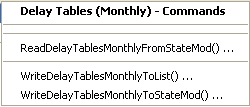
</p>**

**<p style="text-align: center;">
Commands / Delay Table Data / Delay Tables (Monthly) Menu (<a href="../Menu_Commands_StateMod_DelayTablesMonthly.png">see also the full-size image</a>)
</p>**

The following table summarizes the use of each command:

**<p style="text-align: center;">
Delay Table (Monthly) Commands
</p>**

| **Command**&nbsp;&nbsp;&nbsp;&nbsp;&nbsp;&nbsp;&nbsp;&nbsp;&nbsp;&nbsp;&nbsp;&nbsp;&nbsp;&nbsp;&nbsp;&nbsp;&nbsp;&nbsp;&nbsp;&nbsp;&nbsp;&nbsp;&nbsp;&nbsp;&nbsp;&nbsp;&nbsp;&nbsp;&nbsp;&nbsp;&nbsp;&nbsp;&nbsp;&nbsp;&nbsp;&nbsp;&nbsp;&nbsp;&nbsp;&nbsp;&nbsp;&nbsp;&nbsp;&nbsp;&nbsp;&nbsp;&nbsp;&nbsp;&nbsp;&nbsp;&nbsp;&nbsp; |**Description** |
| -- | -- |
| [`ReadDelayTablesMonthlyFromStateMod`](../command-ref/ReadDelayTablesMonthlyFromStateMod/ReadDelayTablesMonthlyFromStateMod.md) | Read monthly delay tables from a StateMod delay tables file, optionally scaling the delay values (e.g., to convert fraction to percent). |
| [`WriteDelayTablesMonthlyToList`](../command-ref/WriteDelayTablesMonthlyToList/WriteDelayTablesMonthlyToList.md) | Write monthly delay tables to a delimited list file. |
| [`WriteDelayTablesMonthlyToStateMod`](../command-ref/WriteDelayTablesMonthlyToStateMod/WriteDelayTablesMonthlyToStateMod.md) | Write monthly delay tables to a StateMod delay tables file. |

### Delay Tables (Daily) ###

The ***Commands / Delay Tables Data / Delay Tables (Daily)*** menu items insert commands to process daily delay table data:

**<p style="text-align: center;">
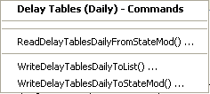
</p>**

**<p style="text-align: center;">
Commands / Delay Table Data / Delay Tables (Daily) Menu (<a href="../Menu_Commands_StateMod_DelayTablesDaily.png">see also the full-size image</a>)
</p>**

The following table summarizes the use of each command:

**<p style="text-align: center;">
Delay Table (Daily) Commands
</p>**

| **Command**&nbsp;&nbsp;&nbsp;&nbsp;&nbsp;&nbsp;&nbsp;&nbsp;&nbsp;&nbsp;&nbsp;&nbsp;&nbsp;&nbsp;&nbsp;&nbsp;&nbsp;&nbsp;&nbsp;&nbsp;&nbsp;&nbsp;&nbsp;&nbsp;&nbsp;&nbsp;&nbsp;&nbsp;&nbsp;&nbsp;&nbsp;&nbsp;&nbsp;&nbsp;&nbsp;&nbsp;&nbsp;&nbsp;&nbsp;&nbsp;&nbsp;&nbsp;&nbsp;&nbsp;&nbsp;&nbsp;&nbsp;&nbsp;&nbsp; | **Description** |
| -- | -- |
| [`ReadDelayTablesDailyFromStateMod`](../command-ref/ReadDelayTablesDailyFromStateMod/ReadDelayTablesDailyFromStateMod.md) | Read daily delay tables from a StateMod delay tables file, optionally scaling the delay values (e.g., to convert fraction to percent). |
| [`WriteDelayTablesDailyToList`](../command-ref/WriteDelayTablesDailyToList/WriteDelayTablesDailyToList.md) | Write daily delay tables to a delimited list file. |
| [`WriteDelayTablesDailyToStateMod`](../command-ref/WriteDelayTablesDailyToStateMod/WriteDelayTablesDailyToStateMod.md) | Write daily delay tables to a StateMod delay tables file. |

## Diversion Data ##

Diversion data consists of:

* Diversion stations
* Diversion rights
* Historical flow time series (monthly, daily)
* Demand time series (monthly, monthly override, average monthly, daily)
* Irrigation practice (yearly)
* Consumptive water requirement (monthly, daily)
* Soil moisture time series (yearly)

Each of the above data types is stored in a separate file, using the diversion station identifier as the primary identifier.

The processing of each data file is discussed below.

### Diversion Stations ###

Each diversion station used with StateMod can be one of four types:

1. **Explicit diversion**, where no aggregation or special treatment occurs – this type
is used for key structures that need to be explicitly modeled.
The diversion station diverts from a single point on a water body.
The diversion station identifier is usually a 7-character water district identifier
(6-character for old datasets) or fabricated identifier that starts with the water district number.
2. **Diversion “MultiStruct,”** used to represent two or more diversion stations
that divert from different tributaries but which serve the same lands.
In this case, multiple diversion stations are grouped and one is assigned as the primary diversion station.
To model historical conditions, each diversion station is represented in the network
(e.g., using the WDID as the station identifier) and diversion records,
water rights, and capacities correspond to each diversion station.
To estimate average efficiencies (when evaluating demand time series),
the total demand and historical time series are considered.
Additionally, when estimating demand time series, the total demand is assigned
to the primary structure and the demands for secondary structures are set to zero.
Operating rules are required to control the exchange of water between diversions in the MultiStruct.
This modeling construct should be defined using the
`SetDiversionMultiStruct*` commands and only need to be defined when processing demands.
3. **Diversion system** (a type of collection), where the characteristics (capacity, historical diversion, demand)
of multiple diversions are summed at one location and water rights are modeled
explicitly – this type is used when related diversion structures
operate as a system to divert water from a single water source.
Only the diversion system identifier is included in the model network and this
identifier should be different from the parts in the collection.
The naming convention for modeling in CDSS is to use a primary ditch in the collection for
the modeled node or select an identifier that includes the district and `MS` or similar.
Diversion systems should be defined using the `SetDiversionSystem*` commands and need
to be defined when processing all diversion station files (if diversion systems are used).
4. **Diversion aggregate** (a type of collection),
which is the same as a diversion system except that water rights are aggregated into classes.
Aggregation of the water rights occurs when the
[`ReadDiversionRightsFromHydroBase`](../command-ref/ReadDiversionRightsFromHydroBase/ReadDiversionRightsFromHydroBase.md) command is executed
The naming convention for modeling in CDSS is to use an identifier similar
to `20_ADCNNN`, where the leading 20 indicates the water district,
`ADC` indicates aggregate diversion,
and `NNN` is a number to allow multiple diversion aggregates in a water district.
This convention allows summary of demand and supply for basins.
Diversion aggregates should be defined using the `SetDiversionAggregate*` commands
and need to be defined when processing all diversion station files (if aggregates are used).

The determination of the diversion station type for each diversion station
is usually made by reviewing available data (e.g., water rights),
and discussing administrative data with knowledgeable persons (e.g., water commissioners).
Typically, key diversions have large capacities, irrigate larger acreage totals,
and/or have important water rights and administrative roles.
Minor diversions, or groups of diversions for which independent data are difficult to determine,
may be lumped together in an aggregate or system.
Grouping diversions into aggregates reduces the overall number of model nodes and output.
Various commands refer to “collection type” when discussing aggregates and systems, in order to simplify documentation.

The diversion stations file may be updated several times, as follows:

1. Initial creation (see this section).
2. Adjust diversion station capacities based on historical diversions (see the
[Diversion Historical Time Series (Monthly)](#diversion-historical-time-series-monthly) section).
3. Adjust diversion monthly efficiencies based on estimates from consumptive water requirement
(see the [Diversion Demand Time Series (Monthly)](#diversion-demand-time-series-monthly) section).

However, it is also possible to create the secondary files using an initial list of diversion stations,
and then create the StateMod diversion stations file with one command file.

The ***Commands / Diversion Data / Diversion Stations*** menus insert commands to process diversion station data:

**<p style="text-align: center;">
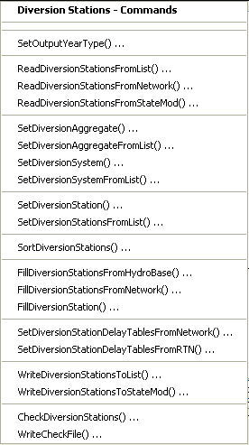
</p>**

**<p style="text-align: center;">
Commands / Diversion Data / Diversion Stations Menu (<a href="../Menu_Commands_StateMod_DiversionStations.png">see also the full-size image</a>)
</p>**

The following table summarizes the use of each command:

**<p style="text-align: center;">
Diversion Stations Commands
</p>**

| **Command**&nbsp;&nbsp;&nbsp;&nbsp;&nbsp;&nbsp;&nbsp;&nbsp;&nbsp;&nbsp;&nbsp;&nbsp;&nbsp;&nbsp;&nbsp;&nbsp;&nbsp;&nbsp;&nbsp;&nbsp;&nbsp;&nbsp;&nbsp;&nbsp;&nbsp;&nbsp;&nbsp;&nbsp;&nbsp;&nbsp;&nbsp;&nbsp;&nbsp;&nbsp;&nbsp;&nbsp;&nbsp;&nbsp;&nbsp;&nbsp;&nbsp;&nbsp;&nbsp;&nbsp;&nbsp;&nbsp;&nbsp;&nbsp;&nbsp;&nbsp;&nbsp;&nbsp;&nbsp;&nbsp;&nbsp;&nbsp;&nbsp;&nbsp;&nbsp;&nbsp;&nbsp;&nbsp;&nbsp;&nbsp;&nbsp;&nbsp; | **Description** |
| -- | -- |
| [`SetOutputYearType`](../command-ref/SetOutputYearType/SetOutputYearType.md) | Set the output year type.  For diversion stations, this indicates the order of monthly efficiencies in the diversion stations data. |
| [`ReadDiversionStationsFromList`](../command-ref/ReadDiversionStationsFromList/ReadDiversionStationsFromList.md) | Read from a delimited list file the list of diversion stations to be included in the dataset. |
| [`ReadDiversionStationsFromNetwork`](../command-ref/ReadDiversionStationsFromNetwork/ReadDiversionStationsFromNetwork.md) | Read from a StateMod network file a list of diversion stations to be included in the dataset. |
| [`ReadDiversionStationsFromStateMod`](../command-ref/ReadDiversionStationsFromStateMod/ReadDiversionStationsFromStateMod.md) | Read from a StateMod diversion stations file the list of diversion stations to be included in the dataset. |
| [`SetDiversionAggregate`](../command-ref/SetDiversionAggregate/SetDiversionAggregate.md) | Specify that a diversion station is an aggregate and define its parts. |
| [`SetDiversionAggregateFromList`](../command-ref/SetDiversionAggregateFromList/SetDiversionAggregateFromList.md) | Specify that one or more diversion stations are aggregates and define their parts, using a delimited list file. |
| [`SetDiversionSystem`](../command-ref/SetDiversionSystem/SetDiversionSystem.md) | Specify that a diversion station is a system and define its parts. |
| [`SetDiversionSystemFromList`](../command-ref/SetDiversionSystemFromList/SetDiversionSystemFromList.md) | Specify that one or more diversion stations are systems and define their parts, using a delimited list file. |
| [`SetDiversionStation`](../command-ref/SetDiversionStation/SetDiversionStation.md) | Set the data for, and optionally add, diversion stations. |
| [`SetDiversionStationsFromList`](../command-ref/SetDiversionStationsFromList/SetDiversionStationsFromList.md) | Set the data for diversion stations from a delimited list file. |
| [`SortDiversionStations`](../command-ref/SortDiversionStations/SortDiversionStations.md) | Sort the diversion stations.  This is useful to force consistency between files. |
| [`FillDiversionStationsFromHydroBase`](../command-ref/FillDiversionStationsFromHydroBase/FillDiversionStationsFromHydroBase.md) | Fill missing data for defined diversion stations, using data from HydroBase.  For example, retrieve the station names, and capacities. |
| [`FillDiversionStationsFromNetwork`](../command-ref/FillDiversionStationsFromNetwork/FillDiversionStationsFromNetwork.md) | Fill missing data for defined diversion stations, using data from the network. |
| [`FillDiversionStation`](../command-ref/FillDiversionStation/FillDiversionStation.md) | Fill missing data for defined diversion stations, using user-supplied values. |
| [`SetDiversionStationDelayTablesFromNetwork`](../command-ref/SetDiversionStationDelayTablesFromNetwork/SetDiversionStationDelayTablesFromNetwork.md) | Set default delay table information using network relationships. |
| [`SetDiversionStationDelayTablesFromRTN`](../command-ref/SetDiversionStationDelayTablesFromRTN/SetDiversionStationDelayTablesFromRTN.md) | Set delay table information using information in a return flow file. |
| [`WriteDiversionStationsToList`](../command-ref/WriteDiversionStationsToList/WriteDiversionStationsToList.md) | Write defined diversion stations to a delimited list file. |
| [`WriteDiversionStationsToStateMod`](../command-ref/WriteDiversionStationsToStateMod/WriteDiversionStationsToStateMod.md) | Write defined diversion stations to a StateMod file. |
| [`CheckDiversionStations`](../command-ref/CheckDiversionStations/CheckDiversionStations.md) | Check diversion stations data for problems. |
| [`WriteCheckFile`](../command-ref/WriteCheckFile/WriteCheckFile.md) | Write the results of data checks to a file. |

If a multi-step process is used to create the diversion stations file,
it is recommended that during initial creation of the diversion stations file,
suitable default values are assigned to complete as much information as possible, including:

* capacity
* default monthly efficiencies
* acreage
* use and demand type
* delay tables

The following command file example (from the Colorado `cm2005` dataset)
illustrates how to create a diversion station file.
The output file will in this case be updated with historical diversion time series in subsequent
processing but could be updated in one step if the time series file is created first
(e.g., by reading the diversion stations from a list file or the network when processing the time series file).

```
StartLog(LogFile="dds.commands.StateDMI.log")
# dds.commands.StateDMI
#
#  StateDMI command file to create the "step 1" direct diversion station file
#
#  Step 1 - set year type and read list of direct diversion stations from network file
#
SetOutputYearType(OutputYearType=Water)
ReadDiversionStationsFromNetwork(InputFile="..\Network\cm2005.net")
#
#  Step 2 - read aggregate and diversion system structure assignments.  Note that
#        want to combine historical acreage and capacites for aggs and diversion systems.
#
SetDiversionAggregateFromList(ListFile="cm_agg.csv",IDCol=1,NameCol=2,PartIDsCol=3,PartsListedHow=InRow)
SetDiversionSystemFromList(ListFile="cm_divsys.csv",IDCol=1,NameCol=2,PartIDsCol=3,PartsListedHow=InRow)
SetDiversionStation(ID="72_ADC054",IrrigatedAcres=1200,IfNotFound=Warn)
SetDiversionStation(ID="72_ADC055",IrrigatedAcres=928,IfNotFound=Warn)
#
#  Step 3 - read diversion station information from HydroBase and sort alphabetically
#
FillDiversionStationsFromHydroBase(ID="*")
SortDiversionStations(Order=Ascending)
#
#  Step 4 - set global options for all structures
#
SetDiversionStation(ID="*",RiverNodeID="ID",OnOff=1,ReplaceResOption=-1,DailyID="4",DemandType=1,UseType=1,DemandSource=1,EffAnnual=60,IfNotFound=Warn)
SetDiversionStationDelayTablesFromNetwork(ID="*",DefaultTable=1)
#
#  Step 5 - overwrite downstream return flow location, efficiencies and delay patterns based
#           on return flow file: read annual average irrigation efficiencies from StateCU (*.def)
#
SetDiversionStationDelayTablesFromRTN(InputFile="cm2005.rtn",SetEfficiency=True)
SetDiversionStationsFromList(ListFile="cm2005.def",IDCol="1",EffMonthlyCol="2",Delim="Space",MergeDelim=True)
#
#  Step 6 - overide HydroBase capacities and demand sources
#
# Transbasin Diversions - demscr=6 & resreplace=0 (does not get Green Mtn. replacement)
SetDiversionStation(ID="364626",ReplaceResOption=0,DemandSource=6,IfNotFound=Warn)
SetDiversionStation(ID="364684",ReplaceResOption=0,DemandSource=6,IfNotFound=Warn)
SetDiversionStation(ID="364685",ReplaceResOption=0,DemandSource=6,IfNotFound=Warn)
SetDiversionStation(ID="374614",ReplaceResOption=0,DemandSource=6,IfNotFound=Warn)
SetDiversionStation(ID="374641",ReplaceResOption=0,DemandSource=6,IfNotFound=Warn)
SetDiversionStation(ID="371091",ReplaceResOption=0,DemandSource=6,IfNotFound=Warn)
SetDiversionStation(ID="374648",ReplaceResOption=0,DemandSource=6,IfNotFound=Warn)
SetDiversionStation(ID="364683",Capacity=500.0,ReplaceResOption=0,DemandSource=6,IfNotFound=Warn)
SetDiversionStation(ID="364699",Capacity=77.0,ReplaceResOption=0,DemandSource=6,IfNotFound=Warn)
SetDiversionStation(ID="954683",Name="Continental_Hoosier_Tunnel",Capacity=500.0,ReplaceResOption=0,IrrigatedAcres=0,DemandSource=6,IfNotFound=Warn)
SetDiversionStation(ID="384613",Capacity=120,ReplaceResOption=0,DemandSource=6,IfNotFound=Warn)
SetDiversionStation(ID="384617",ReplaceResOption=0,DemandSource=6,IfNotFound=Warn)
SetDiversionStation(ID="384625",Capacity=1000.0,ReplaceResOption=0,DemandSource=6,IfNotFound=Warn)
SetDiversionStation(ID="954699",Name="Boustead_Summary",Capacity=1600.0,ReplaceResOption=0,IrrigatedAcres=0,DemandSource=6,IfNotFound=Warn)
SetDiversionStation(ID="514625",ReplaceResOption=0,DemandSource=6,IfNotFound=Warn)
SetDiversionStation(ID="514601",ReplaceResOption=0,DemandSource=6,IfNotFound=Warn)
SetDiversionStation(ID="514603",Capacity=500.0,ReplaceResOption=0,DemandSource=6,IfNotFound=Warn)
SetDiversionStation(ID="514634",ReplaceResOption=0,DemandSource=6,IfNotFound=Warn)
SetDiversionStation(ID="514655",ReplaceResOption=0,DemandSource=6,IfNotFound=Warn)
SetDiversionStation(ID="724721",ReplaceResOption=0,DemandSource=6,IfNotFound=Warn)
SetDiversionStation(ID="724715",ReplaceResOption=0,DemandSource=6,IfNotFound=Warn)
SetDiversionStation(ID="384717",ReplaceResOption=0,DemandSource=6,IfNotFound=Warn)
#
# The following are carriers to transbasin tunnel collections - demscr=7
#        Missouri Tunnel - Carrier to Homestake Tunnel
SetDiversionStation(ID="374643",Capacity=600.0,ReplaceResOption=0,DemandSource=7,IfNotFound=Warn)
#        Hunter Tunnel - Carrier to Bousted Tunnel
SetDiversionStation(ID="381594",Capacity=310.0,ReplaceResOption=0,DemandSource=7,IfNotFound=Warn)
#        Moffat Tunnel Carriers
SetDiversionStation(ID="510728",ReplaceResOption=0,DemandSource=7,IfNotFound=Warn)
SetDiversionStation(ID="511310",Name="Vasquez_Creek",ReplaceResOption=0,DemandSource=7,IfNotFound=Warn)
SetDiversionStation(ID="511309",Name="St_Louis_Cr",ReplaceResOption=0,DemandSource=7,IfNotFound=Warn)
SetDiversionStation(ID="510639",Name="Jim_Creek",ReplaceResOption=0,DemandSource=7,IfNotFound=Warn)
SetDiversionStation(ID="511269",Name="Ranch_Creek",ReplaceResOption=0,DemandSource=7,IfNotFound=Warn)
#
#	StateDMI expects monthly values to be entered in Calendar Year.
#
# The following are municipal and industrial diversions - demsrc=6
#        Rankin No. 1 Ditch, Dillon Valley W&SD
SetDiversionStation(ID="360784",DemandSource=6,EffMonthly="10,12,14,44,55,62,61,56,44,26,0,10",IfNotFound=Warn)
#        Straight Creek Ditch, Town of Dillon
SetDiversionStation(ID="360829",Capacity=3.5,DemandSource=6,EffMonthly="10,12,14,44,55,62,61,56,44,26,0,10",IfNotFound=Warn)
#        Climax Demands
SetDiversionStation(ID="360841",Capacity=53.19,ReplaceResOption=0,DemandSource=6,IfNotFound=Warn)
#        Keystone Snow Line Ditch (Snowmaking)
SetDiversionStation(ID="360908",Capacity=2.5,ReplaceResOption=0,DemandSource=6,IfNotFound=Warn)
#        Breckenridge Snowmaking
SetDiversionStation(ID="360989",ReplaceResOption=0,DemandSource=6,IfNotFound=Warn)
#        Breckenridge Municipal
SetDiversionStation(ID="361008",Capacity=4.87,DemandSource=6,EffMonthly="10,12,14,44,55,62,61,56,44,26,0,10",IfNotFound=Warn)
#        Copper Mtn. Snowmaking
SetDiversionStation(ID="361016",Capacity=2.5,ReplaceResOption=0,DemandSource=6,IfNotFound=Warn)
#        Metcalf Ditch - Upper Eagle Valley Water Authority
SetDiversionStation(ID="370708",DemandSource=6,EffMonthly="10,12,14,44,55,62,61,56,44,26,0,10",IfNotFound=Warn)
#        Town of Rifle Pump and Pipeline
SetDiversionStation(ID="390967",Capacity=8.5,DemandSource=6,EffMonthly="10,12,14,44,55,62,61,56,44,26,0,10",IfNotFound=Warn)
#        East Snowmass Brush Creek Pipeline
SetDiversionStation(ID="381441",DemandSource=6,EffMonthly="10,12,14,44,55,62,61,56,44,26,0,10",IfNotFound=Warn)
#        Glenwood L Water Company System
SetDiversionStation(ID="531051",DemandSource=6,EffMonthly="10,12,14,44,55,62,61,56,44,26,0,10",IfNotFound=Warn)
SetDiversionStation(ID="530585",DemandSource=6,EffMonthly="10,12,14,44,55,62,61,56,44,26,0,10",IfNotFound=Warn)
#        Maroon Ditch - Aspen
SetDiversionStation(ID="380854",DemandSource=6,EffMonthly="10,12,14,44,55,62,61,56,44,26,0,10",IfNotFound=Warn)
#        Midland Flume Ditch - Aspen
SetDiversionStation(ID="380869",DemandSource=6,EffMonthly="10,12,14,44,55,62,61,56,44,26,0,10",IfNotFound=Warn)
#        Carbondale Water System and Pipeline
SetDiversionStation(ID="381052",DemandSource=6,EffMonthly="10,12,14,44,55,62,61,56,44,26,0,10",IfNotFound=Warn)
#        Redlands Power Canal
SetDiversionStation(ID="420541",Capacity=610.0,ReplaceResOption=0,DemandSource=6,IfNotFound=Warn)
#        Henderson Mine Water System
SetDiversionStation(ID="511070",Capacity=8.8,ReplaceResOption=0,DemandSource=6,IfNotFound=Warn)
#        Shoshone Power Plant
SetDiversionStation(ID="530584",ReplaceResOption=0,DemandSource=6,IfNotFound=Warn)
#        Grand Junction Demands
SetDiversionStation(ID="950051",Name="Grand Junction Demands",Capacity=21.0,ReplaceResOption=0,IrrigatedAcres=0,DemandSource=6,EffMonthly="10,12,14,44,55,62,61,56,44,26,0,10",IfNotFound=Warn)
#        Grand Junction Gunnison Pipeline
SetDiversionStation(ID="420520",ReplaceResOption=0,DemandSource=6,EffMonthly="10,12,14,44,55,62,61,56,44,26,0,10",IfNotFound=Warn)
#        Grand Junction Colorado River Pipeline
SetDiversionStation(ID="720644",DemandSource=6,EffMonthly="10,12,14,44,55,62,61,56,44,26,0,10",IfNotFound=Warn)
#        Molina Power Plant
SetDiversionStation(ID="720807",Capacity=50.0,ReplaceResOption=0,DemandSource=6,IfNotFound=Warn)
#        Palisade Town Pipeline
SetDiversionStation(ID="720816",Capacity=5.0,DemandSource=6,EffMonthly="10,12,14,44,55,62,61,56,44,26,0,10",IfNotFound=Warn)
#        The following meet municipal demands for the Ute WCD
SetDiversionStation(ID="720920",Capacity=50.0,DemandSource=6,EffMonthly="10,12,14,44,55,62,61,56,44,26,0,10",IfNotFound=Warn)
SetDiversionStation(ID="721339",DemandSource=6,EffMonthly="10,12,14,44,55,62,61,56,44,26,0,10",IfNotFound=Warn)
SetDiversionStation(ID="950020",Name="Ute Water Treatment",Capacity=17.0,IrrigatedAcres=0,DemandSource=6,EffMonthly="10,12,14,44,55,62,61,56,44,26,0,10",IfNotFound=Warn)
SetDiversionStation(ID="950030",Name="Mason Eddy-Ute",Capacity=7.0,IrrigatedAcres=0,DemandSource=6,EffMonthly="10,12,14,44,55,62,61,56,44,26,0,10",IfNotFound=Warn)
SetDiversionStation(ID="721329",Name="Rapid Creek PP DivSys",DemandSource=6,EffMonthly="10,12,14,44,55,62,61,56,44,26,0,10",IfNotFound=Warn)
#        Keystone Municipal
SetDiversionStation(ID="955002",Name="Keystone Municipal",Capacity=2.0,IrrigatedAcres=0,DemandSource=6,EffMonthly="10,12,14,44,55,62,61,56,44,26,0,10",IfNotFound=Warn)
#        Vail Municipal Use
SetDiversionStation(ID="955001",Name="Vail Valley Consolidated-Senior",Capacity=11.2,IrrigatedAcres=0,DemandSource=6,EffMonthly="10,12,14,44,55,62,61,56,44,26,0,10",IfNotFound=Warn)
SetDiversionStation(ID="955003",Name="Vail Valley Consolidated-Non Irr",Capacity=13.0,IrrigatedAcres=0,DemandSource=6,EffMonthly="10,12,14,44,55,62,61,56,44,26,0,10",IfNotFound=Warn)
#        Green Mtn. Hydro-Electric
SetDiversionStation(ID="360881",ReplaceResOption=0,DemandSource=6,IfNotFound=Warn)
#        Williams Fork Power Conduit
SetDiversionStation(ID="511237",ReplaceResOption=0,DemandSource=6,IfNotFound=Warn)
#        Green Mtn. Contract Water Users (Baseline Scenario only)
SetDiversionStation(ID="950060",Name="Green_Mtn_Contract_Dem.",Capacity=999,ReplaceResOption=0,IrrigatedAcres=0,DemandSource=6,IfNotFound=Warn)
#        Redlands Power Canal Irrigation (acres from 724713)
SetDiversionStation(ID="950050",Name="Redlands Power Canal-Irr",Capacity=140.0,ReplaceResOption=0,IrrigatedAcres=4297,DemandSource=8,IfNotFound=Warn)
#
# The following are reservoir carrier structures
#        Elliott Creek Feeder - carrier to Green Mtn. Res
SetDiversionStation(ID="360606",ReplaceResOption=0,DemandSource=7,IfNotFound=Warn)
#        Wolcott Pumping Pipeline - carrier to Wolcott Res
SetDiversionStation(ID="371146",Capacity=500,ReplaceResOption=0,DemandSource=7,EffAnnual=0,IfNotFound=Warn)
#        CBT Willow Creek Feeder
SetDiversionStation(ID="510958",ReplaceResOption=0,DemandSource=7,IfNotFound=Warn)
#        Windy Gap Pump Pipeline Canal - carrier up to Shadow Mtn and Granby
SetDiversionStation(ID="514700",ReplaceResOption=0,DemandSource=7,IfNotFound=Warn)
#
# The following are project-specific diversions - demsrc  and resreplace can vary
#        Silt Project
#             Grass Valley Canal
SetDiversionStation(ID="390563",ReplaceResOption=0,IrrigatedAcres=0,DemandSource=7,IfNotFound=Warn)
#             Silt Pump Canal - secondary structure in MS setup
SetDiversionStation(ID="390663",ReplaceResOption=0,IrrigatedAcres=0,DemandSource=7,EffAnnual=0,IfNotFound=Warn)
#             Dry Elk Valley Demands
SetDiversionStation(ID="950010",Name="Dry Elk Valley Irr",Capacity=45.0,IrrigatedAcres=2590,IfNotFound=Warn)
#             Irrigation Demands below Harvey Gap Reservoir - primary structure of MS setup
SetDiversionStation(ID="950011",Name="Farmers Irrigation Comp",Capacity=72.0,IrrigatedAcres=2906,IfNotFound=Warn)
#
#        Collbran Project
#             Bonham Branch Pipeline
SetDiversionStation(ID="720542",ReplaceResOption=0,DemandSource=7,IfNotFound=Warn)
#             Cottonwood Branch Pipeline
SetDiversionStation(ID="720583",ReplaceResOption=0,DemandSource=7,IfNotFound=Warn)
#             Leon Park Feeder Canal
SetDiversionStation(ID="720746",ReplaceResOption=0,DemandSource=7,IfNotFound=Warn)
#             Park Creek Ditch (Vega)
SetDiversionStation(ID="720820",ReplaceResOption=0,IrrigatedAcres=0,DemandSource=7,IfNotFound=Warn)
#             Southside Canal
SetDiversionStation(ID="720879",ReplaceResOption=0,DemandSource=7,IfNotFound=Warn)
#
#        Cameo Demand/Grand Valley Area    EW - Why resreplace set to 1 for these structures?
#             Grand Valley Irrigation Canal
SetDiversionStation(ID="720645",Capacity=650.0,ReplaceResOption=1,IfNotFound=Warn)
#             Orchard Mesa Irrigation District - primary structure in MS Setup
SetDiversionStation(ID="720813",Capacity=461.0,ReplaceResOption=0,DemandSource=3,IfNotFound=Warn)
SetDiversionStation(ID="950004",Name="OMID Hydraulic Pump",Capacity=272.0,ReplaceResOption=0,IrrigatedAcres=0,DemandSource=6,IfNotFound=Warn)
#             Grand Valley Project
SetDiversionStation(ID="720646",Capacity=1620.0,IrrigatedAcres=0,DemandSource=7,IfNotFound=Warn)
SetDiversionStation(ID="950001",Name="Grand Valley Project",Capacity=850.0,ReplaceResOption=0,IrrigatedAcres=28900,DemandSource=8,IfNotFound=Warn)
#             Colorado River Pumping Plant - secondary source for OMID irrigation MS setup
SetDiversionStation(ID="721330",DemandSource=5,IfNotFound=Warn)
#             USA Power Plant
SetDiversionStation(ID="950002",Name="USA Power Plant",Capacity=800.0,ReplaceResOption=0,IrrigatedAcres=0,DemandSource=6,IfNotFound=Warn)
#             Orchard Mesa Check
SetDiversionStation(ID="950003",Name="Orchard Mesa Check",Capacity=1072.0,ReplaceResOption=0,IrrigatedAcres=0,DemandSource=6,IfNotFound=Warn)
SetDiversionStation(ID="950005",Name="OMID Pre-1985 Bypass",Capacity=1072.0,ReplaceResOption=0,IrrigatedAcres=0,DemandSource=6,IfNotFound=Warn)
SetDiversionStation(ID="950006",Name="OMID Post-1985 Bypass",Capacity=1072.0,ReplaceResOption=0,IrrigatedAcres=0,DemandSource=6,IfNotFound=Warn)
#             15-Mile Fish Requirement
SetDiversionStation(ID="952001",Name="15-Mile Fish Requirement",Capacity=999,ReplaceResOption=0,IrrigatedAcres=0,DemandSource=6,IfNotFound=Warn)
#
# The following structure is an aggregate M & I node -
#   this node is included (despite zero demand) to maintain consistency with other basins and for
#   potential future use.
SetDiversionStation(ID="72_AMC001",Name="72_AMC001 Colorado River nr Stateline",Capacity=999,IrrigatedAcres=0,DemandSource=6,IfNotFound=Warn)
#
# The following structures are used for a dataset-specific scenario
#        Leonard Rice - 2 structures (Calculated and Baseline datasets only!)
SetDiversionStation(ID="950007",Name="USA PP-Winter-OM Stip",Capacity=850.35,ReplaceResOption=0,IrrigatedAcres=0,DemandSource=6,IfNotFound=Warn)
SetDiversionStation(ID="950008",Name="USA PP-Summer-OM Stip",Capacity=850.35,ReplaceResOption=0,IrrigatedAcres=0,DemandSource=6,IfNotFound=Warn)
SetDiversionStation(ID="950061",Name="Green_Mtn_Annual_Rep_Est.",Capacity=999,ReplaceResOption=0,IrrigatedAcres=0,DemandSource=6,IfNotFound=Warn)
SetDiversionStation(ID="953001",Name="Ruedi Rnd 1-Muni Demand",Capacity=999,ReplaceResOption=0,IrrigatedAcres=0,DemandSource=6,IfNotFound=Warn)
SetDiversionStation(ID="953002",Name="Ruedi Rnd 1-Ind Demand",Capacity=999,ReplaceResOption=0,IrrigatedAcres=0,DemandSource=6,IfNotFound=Warn)
SetDiversionStation(ID="953003",Name="Ruedi Rnd 2-Muni Demand",Capacity=999,ReplaceResOption=0,IrrigatedAcres=0,DemandSource=6,IfNotFound=Warn)
SetDiversionStation(ID="953004",Name="Ruedi Rnd 2-Ind Demand",Capacity=999,ReplaceResOption=0,IrrigatedAcres=0,DemandSource=6,IfNotFound=Warn)
SetDiversionStation(ID="953005",Name="Ruedi Addl Demand",Capacity=999,ReplaceResOption=0,IrrigatedAcres=0,DemandSource=6,IfNotFound=Warn)
#        Wolford Mtn Reservoir Demand (Baseline dataset only!)
SetDiversionStation(ID="953101",Name="Wolford Fraser Demand",Capacity=999,ReplaceResOption=0,IrrigatedAcres=0,DemandSource=6,IfNotFound=Warn)
SetDiversionStation(ID="953102",Name="Wolford MidPark Demand",Capacity=999,ReplaceResOption=0,IrrigatedAcres=0,DemandSource=6,IfNotFound=Warn)
SetDiversionStation(ID="953103",Name="Wolford Market Demand",Capacity=999,ReplaceResOption=0,IrrigatedAcres=0,DemandSource=6,IfNotFound=Warn)
#        C1 - structures (Calculated and Baseline datasets only!)
SetDiversionStation(ID="956001",Name="Future Depletion #1",Capacity=999,ReplaceResOption=0,IrrigatedAcres=0,DemandSource=6,IfNotFound=Warn)
SetDiversionStation(ID="956002",Name="Future Depletion #2",Capacity=999,ReplaceResOption=0,IrrigatedAcres=0,DemandSource=6,IfNotFound=Warn)
#
#        Demand nodes to release excess HUP water from Homestake, Dillon, Williams Fork, and
#        Wolford Reservoirs
SetDiversionStation(ID="954516D",Name="HUP Release Node",OnOff=1,Capacity=99999,ReplaceResOption=0,IrrigatedAcres=0,DemandSource=7,EffAnnual=0,IfNotFound=Warn)
SetDiversionStation(ID="954512D",Name="HUP Release Node",OnOff=1,Capacity=99999,ReplaceResOption=0,IrrigatedAcres=0,DemandSource=7,EffAnnual=0,IfNotFound=Warn)
SetDiversionStation(ID="953709D",Name="HUP Release Node",OnOff=1,Capacity=99999,ReplaceResOption=0,IrrigatedAcres=0,DemandSource=7,EffAnnual=0,IfNotFound=Warn)
SetDiversionStation(ID="953668D",Name="HUP Release Node",OnOff=1,Capacity=99999,ReplaceResOption=0,IrrigatedAcres=0,DemandSource=7,EffAnnual=0,IfNotFound=Warn)
#
# The following are structures that need alternate return location definitions
#        510848 - change return flow pattern to mimic portion of returns that occur in the same month
SetDiversionStation(ID="510848",Returns="510546,40,4",IfNotFound=Warn)
#
#	StateDMI expects monthly values to be entered in Calendar Year.
#
#  Step 7 - setting efficiencies for specific structures
#           Acreage during the study period for the following 22 structures is different than what
#           it is today (the value in HydroBase). Crop water requirements calculated by
#           the CU Model are incorrect for the structures during the study period, but are correct
#           for the baseline scenario.
#           To avoid incorrect efficiencies being calculated by StateDMI (crop water requirement /
#           historical diversion),
#           we are setting the efficiencies for these structures equal to the basin-wide
#           efficiency (3/9/99), ra
#           Updated by James Heath (heath@lrcwe.com) with updated basin wide efficiencies (2/23/2006)
#
SetDiversionStation(ID="360687",EffMonthly="5,4,9,16,25,29,30,25,18,9,5,6",IfNotFound=Warn)
SetDiversionStation(ID="360725",EffMonthly="5,4,9,16,25,29,30,25,18,9,5,6",IfNotFound=Warn)
SetDiversionStation(ID="360728",EffMonthly="5,4,9,16,25,29,30,25,18,9,5,6",IfNotFound=Warn)
SetDiversionStation(ID="360729",EffMonthly="5,4,9,16,25,29,30,25,18,9,5,6",IfNotFound=Warn)
SetDiversionStation(ID="360765",EffMonthly="5,4,9,16,25,29,30,25,18,9,5,6",IfNotFound=Warn)
SetDiversionStation(ID="360780",EffMonthly="5,4,9,16,25,29,30,25,18,9,5,6",IfNotFound=Warn)
SetDiversionStation(ID="360800",EffMonthly="5,4,9,16,25,29,30,25,18,9,5,6",IfNotFound=Warn)
SetDiversionStation(ID="370519",EffMonthly="5,4,9,16,25,29,30,25,18,9,5,6",IfNotFound=Warn)
SetDiversionStation(ID="370571",EffMonthly="5,4,9,16,25,29,30,25,18,9,5,6",IfNotFound=Warn)
SetDiversionStation(ID="370723",EffMonthly="5,4,9,16,25,29,30,25,18,9,5,6",IfNotFound=Warn)
SetDiversionStation(ID="370848",EffMonthly="5,4,9,16,25,29,30,25,18,9,5,6",IfNotFound=Warn)
SetDiversionStation(ID="380528",EffMonthly="5,4,9,16,25,29,30,25,18,9,5,6",IfNotFound=Warn)
SetDiversionStation(ID="380572",EffMonthly="5,4,9,16,25,29,30,25,18,9,5,6",IfNotFound=Warn)
SetDiversionStation(ID="380663",EffMonthly="5,4,9,16,25,29,30,25,18,9,5,6",IfNotFound=Warn)
SetDiversionStation(ID="380939",EffMonthly="5,4,9,16,25,29,30,25,18,9,5,6",IfNotFound=Warn)
SetDiversionStation(ID="380996",EffMonthly="5,4,9,16,25,29,30,25,18,9,5,6",IfNotFound=Warn)
SetDiversionStation(ID="381062",EffMonthly="5,4,9,16,25,29,30,25,18,9,5,6",IfNotFound=Warn)
SetDiversionStation(ID="381078",EffMonthly="5,4,9,16,25,29,30,25,18,9,5,6",IfNotFound=Warn)
#
#  Step 8 - create "step 1" direct diversion station file
#
WriteDiversionStationsToStateMod(OutputFile="cm2005_dds.dds")
#
# Check the results.
CheckDiversionStations(ID="*")
WriteCheckFile(OutputFile="dds.commands.StateDMI.check.html")
```

### Diversion Rights ###

Diversion rights correspond to the diversion stations,
using the diversion station identifier to relate the data.
Diversion right identifiers are typically the diversion station identifier followed by `.NN`,
where `NN` is a sequential number starting with `01`.
Rights for diversion aggregate/system stations have rights corresponding to water right classes.

The ***Commands / Diversion Data / Diversion Rights*** menu items insert commands to process diversion rights data:

**<p style="text-align: center;">
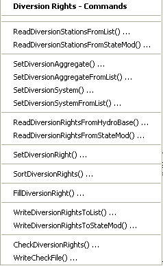
</p>**

**<p style="text-align: center;">
Commands / Diversion Data / Diversion Rights Menu (<a href="../Menu_Commands_StateMod_DiversionRights.png">see also the full-size image</a>)
</p>**

The following table summarizes the use of each command:

**<p style="text-align: center;">
Diversion Rights Commands
</p>**

| **Command**&nbsp;&nbsp;&nbsp;&nbsp;&nbsp;&nbsp;&nbsp;&nbsp;&nbsp;&nbsp;&nbsp;&nbsp;&nbsp;&nbsp;&nbsp;&nbsp;&nbsp;&nbsp;&nbsp;&nbsp;&nbsp;&nbsp;&nbsp;&nbsp;&nbsp;&nbsp;&nbsp;&nbsp;&nbsp;&nbsp;&nbsp;&nbsp;&nbsp;&nbsp;&nbsp;&nbsp;&nbsp;&nbsp;&nbsp;&nbsp;&nbsp;&nbsp;&nbsp;&nbsp;&nbsp;&nbsp;&nbsp;&nbsp;&nbsp;&nbsp; | **Description** |
| -- | -- |
| [`ReadDiversionStationsFromList`](../command-ref/ReadDiversionStationsFromList/ReadDiversionStationsFromList.md) | Read from a delimited file the list of diversion stations to be included in the dataset – the list indicates the stations for which to process rights. |
| [`ReadDiversionStationsFromStateMod`](../command-ref/ReadDiversionStationsFromStateMod/ReadDiversionStationsFromStateMod.md) | Read from a StateMod diversion stations file the list of diversion stations to be included in the dataset – the list indicates the stations for which to process rights. |
| [`SetDiversionAggregate`](../command-ref/SetDiversionAggregate/SetDiversionAggregate.md) | Specify that a diversion is an aggregate and define its parts. |
| [`SetDiversionAggregateFromList`](../command-ref/SetDiversionAggregateFromList/SetDiversionAggregateFromList.md) | Specify that one or more diversions are aggregates and define their parts, using a delimited list file. |
| [`SetDiversionSystem`](../command-ref/SetDiversionSystem/SetDiversionSystem.md) | Specify that a diversion is a system and define its parts. |
| [`SetDiversionSystemFromList`](../command-ref/SetDiversionSystemFromList/SetDiversionSystemFromList.md) | Specify that one or more diversions are systems and define their parts, using a delimited list file. |
| [`ReadDiversionRightsFromHydroBase`](../command-ref/ReadDiversionRightsFromHydroBase/ReadDiversionRightsFromHydroBase.md) | For each diversion station, read the corresponding diversion rights from HydroBase. |
| [`ReadDiversionRightsFromStateMod`](../command-ref/ReadDiversionRightsFromStateMod/ReadDiversionRightsFromStateMod.md) | Read diversion rights from a StateMod diversion rights file. |
| [`SetDiversionRight`](../command-ref/SetDiversionRight/SetDiversionRight.md) | Set the data for, and optionally add, diversion rights. |
| [`SortDiversionRights`](../command-ref/SortDiversionRights/SortDiversionRights.md) | Sort the diversion rights.  This is useful to force consistency between files. |
| [`FillDiversionRight`](../command-ref/FillDiversionRight/FillDiversionRight.md) | Fill missing data for defined diversion rights, using user-supplied values. |
| [`WriteDiversionRightsToList`](../command-ref/WriteDiversionRightsToList/WriteDiversionRightsToList.md) | Write defined diversion rights to a delimited file. |
| [`WriteDiversionRightsToStateMod`](../command-ref/WriteDiversionRightsToStateMod/WriteDiversionRightsToStateMod.md) | Write defined diversion rights to a StateMod file. |
| [`CheckDiversionRights`](../command-ref/CheckDiversionRights/CheckDiversionRights.md) | Check diversion rights data for problems. |
| [`WriteCheckFile`](../command-ref/WriteCheckFile/WriteCheckFile.md) | Write the results of data checks to a file. |

An example command file to create the diversion rights file is shown below (from the Colorado `cm2005` dataset):

```
StartLog(LogFile="ddr.commands.StateDMI.log")
# ddr.commands.StateDMI
#
#  StateDMI command file to create the direct diversion rights file for the Colorado model
#
#  Step 1 - read structures from preliminary direct diversion station file
#
ReadDiversionStationsFromStateMod(InputFile="cm2005_dds.dds")
#
#  Step 2 - read aggregate and diversion system structure assignments.  Note that
#        want to combine water rights for aggs and diversion systems, but
#        water rights are assigned to primary and secondary components of multistructures
#
SetDiversionAggregateFromList(ListFile="cm_agg.csv",IDCol=1,NameCol=2,PartIDsCol=3,PartsListedHow=InRow)
SetDiversionSystemFromList(ListFile="cm_divsys.csv",IDCol=1,NameCol=2,PartIDsCol=3,PartsListedHow=InRow)
#
#  Step 3 - read diversion rights from HydroBase and define water rights classes
#           used for aggregate structures - but NOT for diversion systems
#
ReadDiversionRightsFromHydroBase(ID="*",OnOffDefault=1,AdminNumClasses="14854.00000,20427.18999,22729.21241,30895.21241,31258.00000,32023.28989,39095.38998,43621.42906,46674.00000,48966.00000,99999.")
#
#  Step 4 - set water rights for structure IDs different from or not included in HydroBase
#
# Grand Valley Area - many rights obtain water through operations
SetDiversionRight(ID="720646.02",Name="Orchard Mesa Irr Dist Sys",StationID="ID",OnOff=1,IfNotFound=Add,IfFound=Set)
SetDiversionRight(ID="720646.03",Name="Orchard Mesa Irr Dist Sys",StationID="ID",OnOff=1,IfNotFound=Add,IfFound=Set)
SetDiversionRight(ID="720646.05",Name="USA Power Plant",StationID="ID",Decree=800.0,OnOff=1,IfNotFound=Add,IfFound=Set)
SetDiversionRight(ID="720646.07",Name="Grand Valley Proj",StationID="ID",AdministrationNumber=22729.19544,Decree=40.0,OnOff=1,IfNotFound=Add,IfFound=Set)
SetDiversionRight(ID="720646.08",Name="USA_PP_Winter_OM-Stip",StationID="ID",AdministrationNumber=30895.21241,Decree=800.00,OnOff=1,IfNotFound=Add,IfFound=Set)
SetDiversionRight(ID="720646.09",Name="USA_PP_SummerSr_OM-Stip",StationID="ID",AdministrationNumber=30895.21241,Decree=490,OnOff=1,IfNotFound=Add,IfFound=Set)
SetDiversionRight(ID="720646.10",Name="USA_PP_SummerJr_OM-Stip",StationID="ID",AdministrationNumber=100000.1000,Decree=999.00,OnOff=1,IfNotFound=Add,IfFound=Set)
SetDiversionRight(ID="720813.01",Name="Orchard Mesa Irr Dist Sys",StationID="ID",AdministrationNumber=99999.99999,Decree=999.0,OnOff=1,IfNotFound=Add,IfFound=Set)
SetDiversionRight(ID="950001.01",Name="Grand Valley Proj - Irr",StationID="ID",AdministrationNumber=99999.99999,Decree=999.0,OnOff=1,IfNotFound=Add,IfFound=Warn)
SetDiversionRight(ID="950002.01",Name="USA Power Plant",StationID="ID",AdministrationNumber=99999.99999,Decree=999.0,OnOff=1,IfNotFound=Add,IfFound=Warn)
SetDiversionRight(ID="950003.01",Name="Orchard Mesa Check",StationID="ID",AdministrationNumber=999999.0000,Decree=640.0,OnOff=1,IfNotFound=Add,IfFound=Warn)
SetDiversionRight(ID="950004.01",Name="OMID Hydraulic Pump",StationID="ID",AdministrationNumber=99999.99999,Decree=999.0,OnOff=1,IfNotFound=Add,IfFound=Warn)
SetDiversionRight(ID="950005.01",Name="OMID Pre-1985 Bypass",StationID="ID",AdministrationNumber=999998.0000,Decree=1100.0,OnOff=1,IfNotFound=Add,IfFound=Warn)
SetDiversionRight(ID="950006.01",Name="OMID Post-1985 Bypass",StationID="ID",AdministrationNumber=30895.23492,Decree=1100.0,OnOff=1,IfNotFound=Add,IfFound=Warn)
SetDiversionRight(ID="950007.01",Name="USA PP Winter OM-Stip",StationID="ID",AdministrationNumber=99999.90009,Decree=999.0,OnOff=1,IfNotFound=Add,IfFound=Warn)
SetDiversionRight(ID="950008.01",Name="USA PP Summer OM-Stip",StationID="ID",AdministrationNumber=100000.1000,Decree=999.0,OnOff=1,IfNotFound=Add,IfFound=Warn)
#
... similar commands omitted...
#
# Municipal Water Rights
SetDiversionRight(ID="955002.01",Name="Snake R Water Dist Well 1",StationID="ID",AdministrationNumber=18181.00000,Decree=0.03,OnOff=1,IfNotFound=Add,IfFound=Warn)
SetDiversionRight(ID="955002.02",Name="Snake R Water Dist Well 1",StationID="ID",AdministrationNumber=32075.25333,Decree=0.12,OnOff=1,IfNotFound=Add,IfFound=Warn)
SetDiversionRight(ID="955002.03",Name="Snake R Water Dist Well 1",StationID="ID",AdministrationNumber=44741.00000,Decree=1.23,OnOff=1,IfNotFound=Add,IfFound=Warn)
SetDiversionRight(ID="955001.01",Name="Vail Valley Water - Irr",StationID="ID",AdministrationNumber=15646.00000,Decree=11.2,OnOff=1,IfNotFound=Add,IfFound=Warn)
SetDiversionRight(ID="955003.01",Name="Vail Valley Water - NonIrr",StationID="ID",AdministrationNumber=42420.41366,Decree=13.0,OnOff=1,IfNotFound=Add,IfFound=Warn)
SetDiversionRight(ID="950051.01",Name="City of Grand Jnct",StationID="ID",AdministrationNumber=1.00000,Decree=999.0,OnOff=1,IfNotFound=Add,IfFound=Warn)
SetDiversionRight(ID="950020.01",Name="Ute Water Treatment Plant",StationID="ID",AdministrationNumber=12753.00000,Decree=4.03,OnOff=1,IfNotFound=Add,IfFound=Warn)
SetDiversionRight(ID="950020.02",Name="Ute Water Treatment Plant",StationID="ID",AdministrationNumber=30895.12724,Decree=1.95,OnOff=1,IfNotFound=Add,IfFound=Warn)
SetDiversionRight(ID="950020.03",Name="Ute Water Treatment Plant",StationID="ID",AdministrationNumber=30895.24260,Decree=0.74,OnOff=1,IfNotFound=Add,IfFound=Warn)
SetDiversionRight(ID="950020.04",Name="Ute Water Treatment Plant",StationID="ID",AdministrationNumber=32811.00000,Decree=2.12,OnOff=1,IfNotFound=Add,IfFound=Warn)
SetDiversionRight(ID="950020.05",Name="Ute Water Treatment Plant",StationID="ID",AdministrationNumber=38847.00000,Decree=20.0,OnOff=1,IfNotFound=Add,IfFound=Warn)
SetDiversionRight(ID="950020.06",Name="Ute Water Treatment Plant",StationID="ID",AdministrationNumber=46751.46599,Decree=11.00,OnOff=1,IfNotFound=Add,IfFound=Warn)
SetDiversionRight(ID="950020.07",Name="Ute Water Treatment Plant",StationID="ID",AdministrationNumber=46995.00000,Decree=4.1,OnOff=1,IfNotFound=Add,IfFound=Warn)
SetDiversionRight(ID="950020.08",Name="Ute Water Treatment Plant",StationID="ID",AdministrationNumber=41791.00000,Decree=15.00,OnOff=1,IfNotFound=Add,IfFound=Warn)
SetDiversionRight(ID="720816.01",Name="Palisade Town Pipeline",StationID="ID",AdministrationNumber=12797.00000,Decree=1.44,OnOff=1,IfNotFound=Add,IfFound=Warn)
SetDiversionRight(ID="720816.02",Name="Palisade Town Pipeline",StationID="ID",AdministrationNumber=14222.00000,Decree=3.55,OnOff=1,IfNotFound=Add,IfFound=Warn)
...similar commands omitted...
#
# Industrial Water Rights
SetDiversionRight(ID="360989.01",Name="Maggie Pond Snowmaking",StationID="ID",AdministrationNumber=99999.99999,Decree=999.0,OnOff=1,IfNotFound=Add,IfFound=Warn)
SetDiversionRight(ID="361016.01",Name="Copper Mtn Snowmaking",StationID="ID",AdministrationNumber=99999.99999,Decree=999.0,OnOff=1,IfNotFound=Add,IfFound=Warn)
SetDiversionRight(ID="720807.01",Name="Molina Power Plant",StationID="ID",AdministrationNumber=99999.99999,Decree=999.0,OnOff=1,IfNotFound=Add,IfFound=Warn)
#
# TenMile Diversion No. 1 - set diversion b/c it has been "Transferred From" in 1996 database
SetDiversionRight(ID="360841.01",Name="TenMile Diversion No.1",StationID="ID",AdministrationNumber=31566.00000,Decree=35.0,OnOff=1,IfNotFound=Add,IfFound=Warn)
#
# Redlands Power Canal and Irrigation rights (420541 has 3 rights of which only the first is modified,
#  James Heath (heath@lrcwe.com))
SetDiversionRight(ID="420541.01",Name="Redlands Power Canal",StationID="ID",AdministrationNumber=22283.20300,Decree=610.0,OnOff=1,IfNotFound=Add,IfFound=Set)
SetDiversionRight(ID="950050.01",Name="Redlands Power Canal-Irr",StationID="ID",AdministrationNumber=22283.20300,Decree=60.0,OnOff=1,IfNotFound=Add,IfFound=Warn)
SetDiversionRight(ID="950050.02",Name="Redlands Power Canal-Irr",StationID="ID",AdministrationNumber=34419.33414,Decree=80.0,OnOff=1,IfNotFound=Add,IfFound=Warn)
#
# Silt Project default water rights - water obtained through operations
SetDiversionRight(ID="950010.01",Name="Dry Elk Valley Irr",StationID="ID",AdministrationNumber=99999.99999,Decree=0,OnOff=1,IfNotFound=Add,IfFound=Warn)
SetDiversionRight(ID="950011.01",Name="Farmers Irrigation Comp",StationID="ID",AdministrationNumber=99999.99999,Decree=0,OnOff=1,IfNotFound=Add,IfFound=Warn)
#
# 15-Mile Reach - LR-2
SetDiversionRight(ID="952001.01",Name="15-Mile Fish Require",StationID="ID",AdministrationNumber=99999.91000,Decree=0,OnOff=1,IfNotFound=Add,IfFound=Warn)
#
# Excess HUP Releases from Homestake, Dillon, Williams Fork, and Wolford Reservoirs Water Rights
SetDiversionRight(ID="954516D.01",Name="HUP Release Node",StationID="ID",AdministrationNumber=99999.99999,Decree=0.0,OnOff=1,IfNotFound=Add,IfFound=Warn)
SetDiversionRight(ID="954512D.01",Name="HUP Release Node",StationID="ID",AdministrationNumber=99999.99999,Decree=0.0,OnOff=1,IfNotFound=Add,IfFound=Warn)
SetDiversionRight(ID="953709D.01",Name="HUP Release Node",StationID="ID",AdministrationNumber=99999.99999,Decree=0.0,OnOff=1,IfNotFound=Add,IfFound=Warn)
SetDiversionRight(ID="953668D.01",Name="HUP Release Node",StationID="ID",AdministrationNumber=99999.99999,Decree=0.0,OnOff=1,IfNotFound=Add,IfFound=Warn)
#
# WOLFORD MOUNTAIN RESERVOIR DEMAND
SetDiversionRight(ID="953101.01",Name="Wolford_Fraser_Dem",StationID="ID",AdministrationNumber=99999.00000,Decree=0,OnOff=1,IfNotFound=Add,IfFound=Warn)
SetDiversionRight(ID="953102.01",Name="Wolford_MidPark_Dem",StationID="ID",AdministrationNumber=99999.00000,Decree=0,OnOff=1,IfNotFound=Add,IfFound=Warn)
SetDiversionRight(ID="953103.01",Name="Wolford_Market_Dem",StationID="ID",AdministrationNumber=99999.00000,Decree=0,OnOff=1,IfNotFound=Add,IfFound=Warn)
#
...similar commands omitted...
# FUTURE DEPLETIONS
SetDiversionRight(ID="956001.01",Name="Future_Depletion_#1",StationID="ID",AdministrationNumber=99999.00000,Decree=0,OnOff=1,IfNotFound=Add,IfFound=Warn)
SetDiversionRight(ID="956002.01",Name="Future_Depletion_#2",StationID="ID",AdministrationNumber=99999.00000,Decree=0,OnOff=1,IfNotFound=Add,IfFound=Warn)
#
#
# Cliff Ditch - both water rights reside under WDID 500539 - set 12 cfs of second water right to 500731
# and reduce to 12 cfs at 500539 - this water right serves both 500539 & 500731
SetDiversionRight(ID="500731.01",Name="Cliff Ditch Hdg No 2",StationID="ID",AdministrationNumber=20676.19665,Decree=12.0,OnOff=1,IfNotFound=Add,IfFound=Set)
SetDiversionRight(ID="500539.02",Name="Cliff Ditch",StationID="ID",AdministrationNumber=20676.19665,Decree=12.0,OnOff=1,IfNotFound=Add,IfFound=Set)
#
#
#  Step 5 - Add Free water rights for structures historically diverting more than water rights
# Example from San Juan - replace section when we get a list of free river water rights
SetDiversionRight(ID="360662.99",Name="HOAGLAND CANAL SPRUCE",StationID="360662",AdministrationNumber=99999.99999,Decree=999.00,IfNotFound=Add,IfFound=Set)
SetDiversionRight(ID="360729.99",Name="MAT NO 2 DITCH",StationID="360729",AdministrationNumber=99999.99999,Decree=999.00,IfNotFound=Add,IfFound=Set)
SetDiversionRight(ID="360734.99",Name="MCKAY DITCH",StationID="360734",AdministrationNumber=99999.99999,Decree=999.00,IfNotFound=Add,IfFound=Set)
SetDiversionRight(ID="360765.99",Name="PALMER-MCKINLEY DITCH",StationID="360765",AdministrationNumber=99999.99999,Decree=999.00,IfNotFound=Add,IfFound=Set)
...similar commands omitted...
#
#  Step 6 - add municipal aggregate rights - this agg node water right is set to zero as no
#           M&I uses need to be aggregated and accounted for.
#           the node is included to maintain consistency with other basins and for potential future use
#
SetDiversionRight(ID="72_AMC001.01",Name="72_AMC001 Colorado River nr Stateline",StationID="ID",AdministrationNumber=1.00000,Decree=0.0,IfNotFound=Add,IfFound=Set)
#
#  Step 7 - create direct diverison rights file
#
WriteDiversionRightsToStateMod(OutputFile="..\STATEMOD\cm2005.ddr")
#
# Check the results
CheckDiversionRights(ID="*")
WriteCheckFile(OutputFile="ddr.commands.StateDMI.check.html")
```

### Diversion Historical Time Series (Monthly) ###

Diversion historical time series (monthly) correspond to each diversion station,
using the station identifier to relate the data.

The ***Commands / Diversion Data / Diversion Historical TS (Monthly)*** menus
insert commands to process diversion historical time series (monthly)
data (and also update the diversion stations file because of changes to the capacity data):

**<p style="text-align: center;">
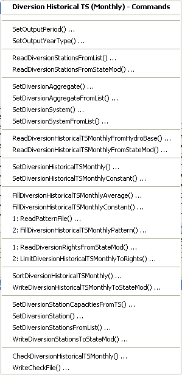
</p>**

**<p style="text-align: center;">
Commands / Diversion Data / Diversion Historical TS (Monthly) Menu (<a href="../Menu_Commands_StateMod_DiversionHistoricalTSMonthly.png">see also the full-size image</a>)
</p>**

The following table summarizes the use of each command:

**<p style="text-align: center;">
Diversion Historical Time Series (Monthly) Commands
</p>**

| **Command**&nbsp;&nbsp;&nbsp;&nbsp;&nbsp;&nbsp;&nbsp;&nbsp;&nbsp;&nbsp;&nbsp;&nbsp;&nbsp;&nbsp;&nbsp;&nbsp;&nbsp;&nbsp;&nbsp;&nbsp;&nbsp;&nbsp;&nbsp;&nbsp;&nbsp;&nbsp;&nbsp;&nbsp;&nbsp;&nbsp;&nbsp;&nbsp;&nbsp;&nbsp;&nbsp;&nbsp;&nbsp;&nbsp;&nbsp;&nbsp;&nbsp;&nbsp;&nbsp;&nbsp;&nbsp;&nbsp;&nbsp;&nbsp;&nbsp;&nbsp;&nbsp;&nbsp;&nbsp;&nbsp;&nbsp;&nbsp;&nbsp;&nbsp;&nbsp;&nbsp;&nbsp;&nbsp;&nbsp;&nbsp;&nbsp;&nbsp;&nbsp;&nbsp;&nbsp;&nbsp;&nbsp;&nbsp;&nbsp;&nbsp; | **Description** |
| -- | -- |
| [`SetOutputPeriod`](../command-ref/SetOutputPeriod/SetOutputPeriod.md) | Set the output period.  Time series are automatically extended to this period if necessary. |
| [`SetOutputYearType`](../command-ref/SetOutputYearType/SetOutputYearType.md) | Set the output year type, which is used when writing the files and for monthly efficiency data order. |
| [`ReadDiversionStationsFromList`](../command-ref/ReadDiversionStationsFromList/ReadDiversionStationsFromList.md) | Read from a delimited file the list of diversion stations to be included in the dataset. |
| [`ReadDiversionStationsFromStateMod`](../command-ref/ReadDiversionStationsFromStateMod/ReadDiversionStationsFromStateMod.md) | Read from a StateMod diversion stations file the list of diversion stations to be included in the dataset. |
| [`SetDiversionAggregate`](../command-ref/SetDiversionAggregate/SetDiversionAggregate.md) | Specify that a diversion is an aggregate and define its parts. |
| [`SetDiversionAggregateFromList`](../command-ref/SetDiversionAggregateFromList/SetDiversionAggregateFromList.md) | Specify that one or more diversions are aggregates and define their parts, using a delimited list file. |
| [`SetDiversionSystem`](../command-ref/SetDiversionSystem/SetDiversionSystem.md) | Specify that a diversion is a system and define its parts. |
| [`SetDiversionSystemFromList`](../command-ref/SetDiversionSystemFromList/SetDiversionSystemFromList.md) | Specify that one or more diversions are systems and define their parts, using a delimited list file. |
| [`ReadDiversionHistoricalTSMonthlyFromHydroBase`](../command-ref/ReadDiversionHistoricalTSMonthlyFromHydroBase/ReadDiversionHistoricalTSMonthlyFromHydroBase.md) | Read diversion historical time series (monthly) from HydroBase, filling and adding aggregate/system part time series if necessary. |
| [`ReadDiversionHistoricalTSMonthlyFromStateMod`](../command-ref/ReadDiversionHistoricalTSMonthlyFromStateMod/ReadDiversionHistoricalTSMonthlyFromStateMod.md) | Read diversion historical time series (monthly) from a StateMod file. |
| [`SetDiversionHistoricalTSMonthly`](../command-ref/SetDiversionHistoricalTSMonthly/SetDiversionHistoricalTSMonthly.md) | Set the data for a diversion historical time series (monthly) by reading another time series (e.g., from a file).  This cannot be used to set the data for an aggregate/system part (only the aggregate/system total can be set). |
| [`SetDiversionHistoricalTSMonthlyConstant`](../command-ref/SetDiversionHistoricalTSMonthlyConstant/SetDiversionHistoricalTSMonthlyConstant.md) | Set the data for a diversion historical time series (monthly) to a constant value.  This cannot be used to set the data for an aggregate/system part (only the aggregate/system total can be set). |
| [`FillDiversionHistoricalTSMonthlyAverage`](../command-ref/FillDiversionHistoricalTSMonthlyAverage/FillDiversionHistoricalTSMonthlyAverage.md) | Fill missing data in diversion historical time series (monthly) to the historical monthly average values.  If an aggregate/system, the historical average is computed from the total. |
| [`FillDiversionHistoricalTSMonthlyConstant`](../command-ref/FillDiversionHistoricalTSMonthlyConstant/FillDiversionHistoricalTSMonthlyConstant.md) | Fill missing data in diversion historical time series (monthly) to a constant value. |
| [`ReadPatternFile`](../command-ref/ReadPatternFile/ReadPatternFile.md) | Read the pattern file used with [`FillDiversionHistoricalTSMonthlyPattern`](../command-ref/FillDiversionHistoricalTSMonthlyPattern/FillDiversionHistoricalTSMonthlyPattern.md) commands. |
| [`FillDiversionHistoricalTSMonthlyPattern`](../command-ref/FillDiversionHistoricalTSMonthlyPattern/FillDiversionHistoricalTSMonthlyPattern.md) | Fill missing data in diversion historical time series (monthly) to the historical monthly average values, using wet/dry/average values. |
| [`ReadDiversionRightsFromStateMod`](../command-ref/ReadDiversionRightsFromStateMod/ReadDiversionRightsFromStateMod.md) | Read the diversion rights file for use with the [`LimitDiversionHistoricalTSMonthlyToRights`](../command-ref/LimitDiversionHistoricalTSMonthlyToRights/LimitDiversionHistoricalTSMonthlyToRights.md) command. |
| [`LimitDiversionHistoricalTSMonthlyToRights`](../command-ref/LimitDiversionHistoricalTSMonthlyToRights/LimitDiversionHistoricalTSMonthlyToRights.md) | Limit the diversion historical time series (monthly) to the water rights that were available at each point in time. |
| [`SortDiversionHistoricalTSMonthly`](../command-ref/SortDiversionHistoricalTSMonthly/SortDiversionHistoricalTSMonthly.md) | Sort the diversion historical time series (monthly).  This is useful to force consistency between files. |
| [`WriteDiversionHistoricalTSMonthlyToStateMod`](../command-ref/WriteDiversionHistoricalTSMonthlyToStateMod/WriteDiversionHistoricalTSMonthlyToStateMod.md) | Write defined diversion historical time series (monthly) to a StateMod file. |
| [`SetDiversionStationCapacitiesFromTS`](../command-ref/SetDiversionStationCapacitiesFromTS/SetDiversionStationCapacitiesFromTS.md) | Set the diversion station capacities to the maximum historical time series value. |
| [`SetDiversionStation`](../command-ref/SetDiversionStation/SetDiversionStation.md) | Set diversion station information (e.g., to override capacity changes from the previous step). |
| [`SetDiversionStationsFromList`](../command-ref/SetDiversionStationsFromList/SetDiversionStationsFromList.md) | Set diversion station information from a delimited file (e.g., to override capacity changes from the previous step). |
| [`WriteDiversionStationsToStateMod`](../command-ref/WriteDiversionStationsToStateMod/WriteDiversionStationsToStateMod.md) | Write diversion stations data to a StateMod diversion stations file (use if the capacities have been updated). |
| [`CheckDiversionHistoricalTSMonthly`](../command-ref/CheckDiversionHistoricalTSMonthly/CheckDiversionHistoricalTSMonthly.md) | Check diversion historical monthly time series data for problems. |
| [`WriteCheckFile`](../command-ref/WriteCheckFile/WriteCheckFile.md) | Write the results of data checks to a file. |

An example command file to create the diversion historical time series (monthly)
file is shown below (from the Colorado `cm2005` dataset).
Note that aggregate part time series are filled before being added to the total for the aggregate station,
and explicit diversion time series are filled separately after reading.

```
StartLog(LogFile="ddh.commands.StateDMI.log")
# ddh.commands.StateDMI
#
#  StateDMI command file to create the historical diversion file
#           and the "step 2" direct diversion structure file, updated so structure
#           capacity = maximum historical diversion
#
#  Step 1 - set time-series period and year type
#
SetOutputPeriod(OutputStart="10/1908",OutputEnd="09/2005")
SetOutputYearType(OutputYearType=Water)
#
#  Step 2 - read structure list from preliminary direct diversion structure file
#
ReadDiversionStationsFromStateMod(InputFile="cm2005_dds.dds")
#
#  Step 3 - read aggregate and diversion system structure assignments.  Note that
#        want to combine historical diversions for aggs and diversion systems, but
#        historical diversions are separate for primary and secondary components
#        of multistructures
#
SetDiversionAggregateFromList(ListFile="cm_agg.csv",IDCol=1,NameCol=2,PartIDsCol=3,PartsListedHow=InRow)
SetDiversionSystemFromList(ListFile="cm_divsys.csv",IDCol=1,NameCol=2,PartIDsCol=3,PartsListedHow=InRow)
#
#  Step 4 - read historical diversions from HydroBase. Note that want individual structures
#           in aggregates and diversion systems to be filled first, then diversions combined.
#
ReadDiversionHistoricalTSMonthlyFromHydroBase(ID="*",IncludeCollections=False,UseDiversionComments=True)
#
#  Step 5 - read fill pattern file, and assign patterns to water districts
#
ReadPatternFile(InputFile="fill2005.pat")
ReadDiversionHistoricalTSMonthlyFromHydroBase(ID="36*",IncludeExplicit=False,UseDiversionComments=True,PatternID="09037500",FillPatternOrder=1,FillAverageOrder=2)
#
#  Step 6 - assign transbasin diversions from streamflow gages
#
SetDiversionHistoricalTSMonthly(ID="364626",TSID="09047300.DWR.Streamflow.Month~HydroBase")
...similar commands omitted...
# note that adams tunnel streamgage ID changed in 10/1996 from 09013000 to ADANETCO
SetDiversionHistoricalTSMonthly(ID="514634",TSID="514634...MONTH~StateMod~514634.stm")
#     Con-Hoosier System - Blue River Diversion, driven by operating rules to con-hoosier summary demand
SetDiversionHistoricalTSMonthly(ID="364683",TSID="364683...MONTH~StateMod~zero.stm")
SetDiversionHistoricalTSMonthly(ID="364699",TSID="364699...MONTH~StateMod~zero.stm")
#     Fryingpan-Arkansas Project
SetDiversionHistoricalTSMonthly(ID="381594",TSID="381594...MONTH~StateMod~381594.stm")
SetDiversionHistoricalTSMonthly(ID="384625",TSID="384625...MONTH~StateMod~384625.stm")
SetDiversionHistoricalTSMonthly(ID="954699",TSID="954699...MONTH~StateMod~zero.stm")
...similar commands omitted...
#
#  Step 7 - set diversions from external time-series files
#
# The following commands are added to access Task 11.2 replacement files
SetDiversionHistoricalTSMonthly(ID="380757",TSID="380757...MONTH~StateMod~380757.stm")
...similar commands omitted...
#
# The following structures are set for Municipal and Industrial Diversions
SetDiversionHistoricalTSMonthly(ID="360784",TSID="360784...MONTH~StateMod~360784.stm")
...similar commands omitted...
#
# Set transbasin diversions to "0" prior to construction
#
#      Wurtz Ditch
SetDiversionHistoricalTSMonthlyConstant(ID="374648",Constant=0,SetEnd="01/1929")
...similar commands omitted...
#
#  Step 8 - fill historical diversion using pattern approach
#
FillDiversionHistoricalTSMonthlyPattern(ID="36*",PatternID="09034500")
...similar commands omitted...
#
#   Step 9 - Fill remaining missing with month average
#
FillDiversionHistoricalTSMonthlyAverage(ID="*")
#
#   Step 10 - Limit filled diversion to water rights. Exceptions include structure
#             receiving significant reservoir supply, carrier structures, etc.
#
LimitDiversionHistoricalTSMonthlyToRights(InputFile="..\statemod\cm2005.ddr",ID="*",IgnoreID="954683,952001,950010,950011")
#
#   Step 11 - sort structures and create historical diversion file
#
SortDiversionHistoricalTSMonthly(Order=Ascending)
WriteDiversionHistoricalTSMonthlyToStateMod(OutputFile="..\StateMod\cm2005.ddh")
#
#  Step 12 - update capacities and create final direct diversion station file
#
SetDiversionStationCapacitiesFromTS(ID="*")
WriteDiversionStationsToStateMod(OutputFile="..\statemod\cm2005.dds")
#
# Check the results.
CheckDiversionHistoricalTSMonthly(ID="*")
WriteCheckFile(OutputFile="ddh.commands.StateDMI.check.html")
```

### Diversion Historical Time Series (Daily) ###

StateDMI does not process daily diversion historical time series.
TSTool, a spreadsheet, or other software can be used to create the data.
More commonly, the monthly demand data can be distributed to daily time series
internally by StateMod by specifying the appropriate daily station identifier.

### Diversion Demand Time Series (Monthly) ###

Diversion demand time series (monthly) correspond to each diversion station,
using the station identifier to relate the data.
Current modeling practices use variable monthly efficiency, computed by StateCU.
Average monthly efficiencies are also typically set from StateCU results
(as a list file input when defining diversion stations) but can also be computed by
dividing irrigation water requirement time series from StateCU by historical diversion time series.
In CDSS, demands are typically computed for three different datasets, as follows:

#### Historical Demand ####

Filled demands are limited by the water rights on-line at the time.
Historical measured diversions are not limited.
Free water rights are assumed to either be on for the entire period,
or beginning with the earliest water right.
In this case the demands are the same as the historical diversions,
typically just a copy of the historical diversions time series file.
This approach can be accomplished by using the
[`LimitDiversionHistoricalTSMonthlyToRights`](../command-ref/LimitDiversionHistoricalTSMonthlyToRights/LimitDiversionHistoricalTSMonthlyToRights.md) command.

#### Calculated Demand ####

Irrigation demands are calculated based on `IWR/Effave`.
The entire period is limited by water rights on-line at the time.
Free water rights are assumed to either be on for the entire period,
or beginning with the earliest water right.
This approach can be accomplished by using the
[`LimitDiversionDemandTSMonthlyToRights`](../command-ref/LimitDiversionDemandTSMonthlyToRights/LimitDiversionDemandTSMonthlyToRights.md) command.

#### Baseline Calculated Demands ####

Demands are treated the same as for the calculated demand case.
However, the entire period is limited by the current water rights (to simulate current conditions).
This approach can be accomplished by using the
[`LimitDiversionDemandTSMonthlyToRights(...,LimitToCurrent=True,...)`](../command-ref/LimitDiversionDemandTSMonthlyToRights/LimitDiversionDemandTSMonthlyToRights.md) command.

#### Special Considerations – Conditional Rights ####

Conditional water rights may be included in StateMod rights files and be turned off for the
historical demands by setting the rights switch to `0` (zero) in the historical data files.
Conditional rights, if considered in the Baseline dataset, can be turned on.
This requires that a different rights file be used with the calculated dataset files.

##### Special Considerations – Comparing Calculated and Historical Demands #####

For some datasets, it may be appropriate to use the
[`CalculateDiversionDemandTSMonthlyAsMax`](../command-ref/CalculateDiversionDemandTSMonthlyAsMax/CalculateDiversionDemandTSMonthlyAsMax.md)
command to set the diversion demands to the maximum of calculated and historical demands.
Using this approach can improve calibrations, for example:

* If the demand equals the historical value,
then the diversion station at times operates at a significantly lower efficiency than the average efficiency.
* If the demand equals `IWR/Effave`,
then the diversion station may be water short and will try to divert at least enough water to operate at an average efficiency.

Modelers should consider the above issues when deciding how to prepare data for a particular dataset.

The ***Commands / Diversion Data / Diversion Demand TS (Monthly)*** menus insert commands to process
diversion demand time series (monthly) data (and optionally the diversion stations, to save estimated efficiencies):

**<p style="text-align: center;">
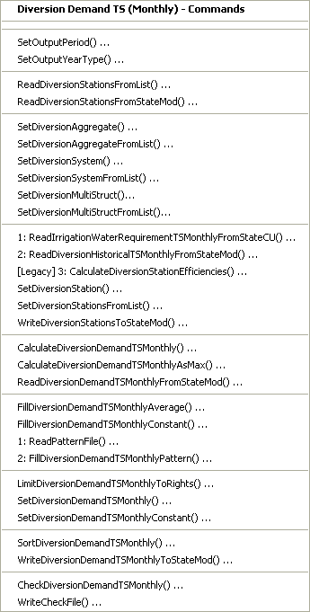
</p>**

**<p style="text-align: center;">
Commands / Diversion Data / Diversion Demand TS (Monthly) Menu (<a href="../Menu_Commands_StateMod_DiversionDemandTSMonthly.png">see also the full-size image</a>)
</p>**

The following table summarizes the use of each command:

**<p style="text-align: center;">
Diversion Demand Time Series (Monthly) Commands
</p>**

| **Command**&nbsp;&nbsp;&nbsp;&nbsp;&nbsp;&nbsp;&nbsp;&nbsp;&nbsp;&nbsp;&nbsp;&nbsp;&nbsp;&nbsp;&nbsp;&nbsp;&nbsp;&nbsp;&nbsp;&nbsp;&nbsp;&nbsp;&nbsp;&nbsp;&nbsp;&nbsp;&nbsp;&nbsp;&nbsp;&nbsp;&nbsp;&nbsp;&nbsp;&nbsp;&nbsp;&nbsp;&nbsp;&nbsp;&nbsp;&nbsp;&nbsp;&nbsp;&nbsp;&nbsp;&nbsp;&nbsp;&nbsp;&nbsp;&nbsp;&nbsp;&nbsp;&nbsp;&nbsp;&nbsp;&nbsp;&nbsp;&nbsp;&nbsp;&nbsp;&nbsp;&nbsp;&nbsp;&nbsp;&nbsp;&nbsp;&nbsp;&nbsp;&nbsp;&nbsp;&nbsp;&nbsp;&nbsp;&nbsp;&nbsp;&nbsp;&nbsp;&nbsp;&nbsp;&nbsp;&nbsp;&nbsp;&nbsp;&nbsp;&nbsp;&nbsp;&nbsp; | **Description** |
| -- | -- |
| [`SetOutputPeriod`](../command-ref/SetOutputPeriod/SetOutputPeriod.md) | Set the output period.  Time series are automatically extended to this period if necessary. |
| [`SetOutputYearType`](../command-ref/SetOutputYearType/SetOutputYearType.md) | Set the output year type, which is used when writing the files and for determining the monthly efficiency order in station data. |
| [`ReadDiversionStationsFromList`](../command-ref/ReadDiversionStationsFromList/ReadDiversionStationsFromList.md) | Read from a delimited file the list of diversion stations to be included in the dataset. |
| [`ReadDiversionStationsFromStateMod`](../command-ref/ReadDiversionStationsFromStateMod/ReadDiversionStationsFromStateMod.md) | Read from a StateMod diversion stations file the list of diversion stations to be included in the dataset. |
| [`SetDiversionAggregate`](../command-ref/SetDiversionAggregate/SetDiversionAggregate.md) | Specify that a diversion is an aggregate and define its parts. |
| [`SetDiversionAggregateFromList`](../command-ref/SetDiversionAggregateFromList/SetDiversionAggregateFromList.md) | Specify that one or more diversions are aggregates and define their parts, using a delimited list file. |
| [`SetDiversionSystem`](../command-ref/SetDiversionSystem/SetDiversionSystem.md) | Specify that a diversion is a system and define its parts. |
| [`SetDiversionSystemFromList`](../command-ref/SetDiversionSystemFromList/SetDiversionSystemFromList.md) | Specify that one or more diversions are systems and define their parts, using a delimited list file. |
| [`SetDiversionMultiStruct`](../command-ref/SetDiversionMultiStruct/SetDiversionMultiStruct.md) | Specify that a diversion is a “MultiStruct” and define its parts. |
| [`SetDiversionMultiStructFromList`](../command-ref/SetDiversionMultiStructFromList/SetDiversionMultiStructFromList.md) | Specify that one or more diversions are “MultiStruct”s and define their parts, using a delimited list file. |
| [`ReadIrrigationWaterRequirementTSMonthlyFromStateCU`](../command-ref/ReadIrrigationWaterRequirementTSMonthlyFromStateCU/ReadIrrigationWaterRequirementTSMonthlyFromStateCU.md) | Read irrigation water requirement (IWR) time series generated by the StateCU model. |
| [`ReadDiversionHistoricalTSMonthlyFromStateMod`](../command-ref/ReadDiversionHistoricalTSMonthlyFromStateMod/ReadDiversionHistoricalTSMonthlyFromStateMod.md) | Read diversion historical time series (monthly) from a StateMod file. |
| [`CalculateDiversionStationEfficiencies`](../command-ref/CalculateDiversionStationEfficiencies/CalculateDiversionStationEfficiencies.md) | Calculate diversion station average monthly efficiencies as IWR/Diversions. |
| [`SetDiversionStation`](../command-ref/SetDiversionStation/SetDiversionStation.md) | Set diversion station data, in particular efficiency data to override the result from the previous command. |
| [`SetDiversionStationsFromList`](../command-ref/SetDiversionStationsFromList/SetDiversionStationsFromList.md) | Set diversion station information from a delimited file (e.g., to override capacity changes from the previous step). |
| [`WriteDiversionStationsToStateMod`](../command-ref/WriteDiversionStationsToStateMod/WriteDiversionStationsToStateMod.md) | Write diversion stations to StateMod – the data will include updated average efficiencies. |
| [`CalculateDiversionDemandTSMonthly`](../command-ref/CalculateDiversionDemandTSMonthly/CalculateDiversionDemandTSMonthly) | Calculate the diversion demand time series (monthly) using `IWR/Effave` and historical diversion time series. |
| [`CalculateDiversionDemandTSMonthlyAsMax`](../command-ref/CalculateDiversionDemandTSMonthlyAsMax/CalculateDiversionDemandTSMonthlyAsMax.md) | Calculate the diversion demand time series (monthly) as the maximum of the demand (see previous command) and the diversion historical time series. |
| [`ReadDiversionDemandTSMonthlyFromStateMod`](../command-ref/ReadDiversionDemandTSMonthlyFromStateMod/ReadDiversionDemandTSMonthlyFromStateMod.md) | Read the diversion demand time series (monthly) from a StateMod file, if a previous result is being modified. |
| [`FillDiversionDemandTSMonthlyAverage`](../command-ref/FillDiversionDemandTSMonthlyAverage/FillDiversionDemandTSMonthlyAverage.md) | Fill missing data in diversion demand time series (monthly) to the monthly average values.  If an aggregate/system, the average is computed from the total. |
| [`FillDiversionDemandTSMonthlyConstant`](../command-ref/FillDiversionDemandTSMonthlyConstant/FillDiversionDemandTSMonthlyConstant.md) | Fill missing data in diversion demand time series (monthly) to a constant value. |
| [`ReadPatternFile`](../command-ref/ReadPatternFile/ReadPatternFile.md) | Read the pattern file used with FillDiversionDemandTSMonthlyPattern`]() commands. |
| [`FillDiversionDemandTSMonthlyPattern`](../command-ref/FillDiversionDemandTSMonthlyPattern/FillDiversionDemandTSMonthlyPattern.md) | Fill missing data in diversion demand time series (monthly) to the monthly average values, using wet/dry/average values. |
| [`LimitDiversionDemandTSMonthlyToRights`](../command-ref/LimitDiversionDemandTSMonthlyToRights/LimitDiversionDemandTSMonthlyToRights.md) | Limit the diversion demand time series (monthly) to the water rights that were available at each point in time. |
| [`SetDiversionDemandTSMonthly`](../command-ref/SetDiversionDemandTSMonthly/SetDiversionDemandTSMonthly.md) | Set the data for a diversion demand time series (monthly).  This cannot be used to set the data for an aggregate/system part (only the aggregate/system total can be set).  Use this after the other commands to ensure that values will remain set. |
| [`SetDiversionDemandTSMonthlyConstant`](../command-ref/SetDiversionDemandTSMonthlyConstant/SetDiversionDemandTSMonthlyConstant.md) | Set the data for a diversion demand time series (monthly) to a constant value.  This cannot be used to set the data for an aggregate/system part (only the aggregate/system total can be set). |
| [`SortDiversionDemandTSMonthly`](../command-ref/SortDiversionDemandTSMonthly/SortDiversionDemandTSMonthly.md) | Sort the diversion demand time series (monthly).  This is useful to force consistency between files. |
| [`WriteDiversionDemandTSMonthlyToStateMod`](../command-ref/WriteDiversionDemandTSMonthlyToStateMod/WriteDiversionDemandTSMonthlyToStateMod.md) | Write diversion demand time series (monthly) to a StateMod file. |
| [`CheckDiversionDemandTSMonthly`](../command-ref/CheckDiversionDemandTSMonthly/CheckDiversionDemandTSMonthly.md) | Check diversion demand monthly time series data for problems. |
| [`WriteCheckFile`](../command-ref/WriteCheckFile/WriteCheckFile.md) | Write the results of data checks to a file. |

An example command file to create the diversion demand time series (monthly) file for the historical case is shown below (adapted from Colorado `cm2005` dataset):

```
StartLog(LogFile="Hddm.commands.StateDMI.log")
# Hddm.commands.StateDMI - Creates Upper Colorado River Historical Demand file
#
#  Step 1 - set the output period, used to compute averages...
#
SetOutputPeriod(OutputStart="10/1908",OutputEnd="9/2005")
SetOutputYearType(OutputYearType=Water)
#
#  Step 2 - read historical diversion file as demand - defined structures for *.ddm file
#
ReadDiversionDemandTSMonthlyFromStateMod(InputFile="..\statemod\cm2005.ddh")
#
#  Step 3 - override specific demands with time series...
#
SetDiversionDemandTSMonthly(ID="720807",TSID="720807..DivTotal.Month~StateMod~720807.stm")
# Set carrier structures to zero
SetDiversionDemandTSMonthlyConstant(ID="360606",Constant=0)
SetDiversionDemandTSMonthlyConstant(ID="720542",Constant=0)
SetDiversionDemandTSMonthlyConstant(ID="720583",Constant=0)
SetDiversionDemandTSMonthlyConstant(ID="720746",Constant=0)
SetDiversionDemandTSMonthlyConstant(ID="720820",Constant=0)
SetDiversionDemandTSMonthlyConstant(ID="720879",Constant=0)
SetDiversionDemandTSMonthlyConstant(ID="724721",Constant=0)
# Set GVP specific demands
SetDiversionDemandTSMonthlyConstant(ID="950003",Constant=100000,SetStart="11/1926")
SetDiversionDemandTSMonthlyConstant(ID="950005",Constant=60000,SetEnd="9/1984")
SetDiversionDemandTSMonthlyConstant(ID="950006",Constant=60000,SetStart="10/1984")
# Set Excess HUP node demands for Homestake, Dillon, Williams Fork, and Wolford Reservoirs
SetDiversionDemandTSMonthlyConstant(ID="954516D",Constant=999999)
SetDiversionDemandTSMonthlyConstant(ID="954512D",Constant=999999)
SetDiversionDemandTSMonthlyConstant(ID="953709D",Constant=999999)
SetDiversionDemandTSMonthlyConstant(ID="953668D",Constant=999999)
#
#  Step 4 - write the time series to the StateMod file...
#
WriteDiversionDemandTSMonthlyToStateMod(OutputFile="..\statemod\cm2005H.ddm")
#
# Check the results.
CheckDiversionDemandTSMonthly(ID="*")
WriteCheckFile(OutputFile="Hddm.commands.StatedDMI.check.html")
```

The following example illustrates how to create the calculated dataset diversion demand time series (from the Colorado `cm2005` dataset):

```
StartLog(LogFile="Cddm.commands.StateDMI.log")
# Cddm.commands.StateDMI
#
#  StateDMI command file to create the Calculated demand file
#
#
#  Step 1 - set the output period, used to compute averages...
#
SetOutputPeriod(OutputStart="10/1908",OutputEnd="09/2005")
SetOutputYearType(OutputYearType=Water)
#
#  Step 2 - read historical diversion file -defines structures for *.ddm file
#           plus read *.ddh file
#
ReadDiversionStationsFromStateMod(InputFile="..\StateMod\cm2005.dds")
ReadDiversionHistoricalTSMonthlyFromStateMod(InputFile="..\StateMod\cm2005.ddh")
#
#  Step 3 - read StateCU *.iwr and *.def files (irrigation requirements and average efficiencies)
#
ReadIrrigationWaterRequirementTSMonthlyFromStateCU(InputFile="..\StateMod\cm2005.iwr")
# CalculateDiversionStationEfficiencies(ID="*",EffMin=0,EffMax=60,EffCalcStart=10/1974,EffCalcEnd=9/2004,LEZeroInAverage=False)
SetDiversionStationsFromList(ListFile="cm2005.def",IDCol="1",EffMonthlyCol="2",Delim="Space",MergeDelim=True)
#
#  Step 4 - determine calculated demand =iwr/efficiency
#         - take max of calculated demand and historical diversion
#
CalculateDiversionDemandTSMonthly(ID="*")
CalculateDiversionDemandTSMonthlyAsMax(ID="*")
#
#  Step 5 - set carriers nodes demand to 0, set full demand and summary demand nodes
#
#  set carrier "transbasin" diversion to Divide Creek to "0", use operating rules to satisfy demand
SetDiversionDemandTSMonthlyConstant(ID="724721",Constant=0)
# place summary demand at the Moffat Tunnel, zero out collection points
SetDiversionDemandTSMonthly(ID="514655",TSID="514655..DivTotal.Month~StateMod~514655.stm")
SetDiversionDemandTSMonthlyConstant(ID="510639",Constant=0)
SetDiversionDemandTSMonthlyConstant(ID="510728",Constant=0)
SetDiversionDemandTSMonthlyConstant(ID="511269",Constant=0)
SetDiversionDemandTSMonthlyConstant(ID="511309",Constant=0)
SetDiversionDemandTSMonthlyConstant(ID="511310",Constant=0)
SetDiversionDemandTSMonthlyConstant(ID="514603",Constant=0)
# place summary demand at the Boustead Summary node, zero out collection points
SetDiversionDemandTSMonthly(ID="954699",TSID="954699..DivTotal.Month~StateMod~954699.stm")
SetDiversionDemandTSMonthlyConstant(ID="381594",Constant=0)
SetDiversionDemandTSMonthlyConstant(ID="384625",Constant=0)
# Homestake - Zero Missouri Tunnel and drive by Homestake Reservoir Demend
SetDiversionDemandTSMonthlyConstant(ID="374643",Constant=0)
#   Collbran Project Feeder/Supply Canals
SetDiversionDemandTSMonthlyConstant(ID="720879",Constant=0)
SetDiversionDemandTSMonthlyConstant(ID="720820",Constant=0)
SetDiversionDemandTSMonthlyConstant(ID="720746",Constant=0)
#   Grand Valley Project Carrier (Roller Dam)
SetDiversionDemandTSMonthlyConstant(ID="720646",Constant=0)
SetDiversionDemandTSMonthlyConstant(ID="950001",Constant=0,SetEnd="09/1915")
#   Molina Power Project
SetDiversionDemandTSMonthlyConstant(ID="720583",Constant=0)
SetDiversionDemandTSMonthlyConstant(ID="720542",Constant=0)
SetDiversionDemandTSMonthly(ID="720807",TSID="720807..DivTotal.MONTH~StateMod~..\StateMod\cm2005H.ddm")
#   Silt Project / Grass Valley / Rifle Gap
SetDiversionDemandTSMonthlyConstant(ID="390663",Constant=0)
SetDiversionDemandTSMonthlyConstant(ID="390563",Constant=0)
#   Elliot Feeder to Green Mountain Res
SetDiversionDemandTSMonthlyConstant(ID="360606",Constant=0)
#
# set demands for OMID Multi Structure - need to change demand calculation for 720813 in the future
# when 721330 is operational. At that point an stm file will need to be created with the total diversions
# of structures 720813 and 721330.
SetDiversionDemandTSMonthlyConstant(ID="721330",Constant=0)
SetDiversionDemandTSMonthly(ID="720813",TSID="720813..DivTotal.MONTH~StateMod~..\StateMod\cm2005H.ddm")
#
#   Step 6 - set calculated demand to historic for structures whose historical acreage is different
#            from current
#
SetDiversionDemandTSMonthly(ID="360687",TSID="360687..DivTotal.MONTH~StateMod~..\StateMod\cm2005H.ddm")
SetDiversionDemandTSMonthly(ID="360725",TSID="360725..DivTotal.MONTH~StateMod~..\StateMod\cm2005H.ddm")
SetDiversionDemandTSMonthly(ID="360728",TSID="360728..DivTotal.MONTH~StateMod~..\StateMod\cm2005H.ddm")
SetDiversionDemandTSMonthly(ID="360729",TSID="360729..DivTotal.MONTH~StateMod~..\StateMod\cm2005H.ddm")
SetDiversionDemandTSMonthly(ID="360765",TSID="360765..DivTotal.MONTH~StateMod~..\StateMod\cm2005H.ddm")
SetDiversionDemandTSMonthly(ID="360780",TSID="360780..DivTotal.MONTH~StateMod~..\StateMod\cm2005H.ddm")
SetDiversionDemandTSMonthly(ID="360800",TSID="360800..DivTotal.MONTH~StateMod~..\StateMod\cm2005H.ddm")
SetDiversionDemandTSMonthly(ID="370519",TSID="370519..DivTotal.MONTH~StateMod~..\StateMod\cm2005H.ddm")
SetDiversionDemandTSMonthly(ID="370571",TSID="370571..DivTotal.MONTH~StateMod~..\StateMod\cm2005H.ddm")
SetDiversionDemandTSMonthly(ID="370723",TSID="370723..DivTotal.MONTH~StateMod~..\StateMod\cm2005H.ddm")
SetDiversionDemandTSMonthly(ID="370848",TSID="370848..DivTotal.MONTH~StateMod~..\StateMod\cm2005H.ddm")
SetDiversionDemandTSMonthly(ID="380528",TSID="380528..DivTotal.MONTH~StateMod~..\StateMod\cm2005H.ddm")
SetDiversionDemandTSMonthly(ID="380572",TSID="380572..DivTotal.MONTH~StateMod~..\StateMod\cm2005H.ddm")
SetDiversionDemandTSMonthly(ID="380663",TSID="380663..DivTotal.MONTH~StateMod~..\StateMod\cm2005H.ddm")
SetDiversionDemandTSMonthly(ID="380939",TSID="380939..DivTotal.MONTH~StateMod~..\StateMod\cm2005H.ddm")
SetDiversionDemandTSMonthly(ID="380996",TSID="380996..DivTotal.MONTH~StateMod~..\StateMod\cm2005H.ddm")
SetDiversionDemandTSMonthly(ID="381062",TSID="381062..DivTotal.MONTH~StateMod~..\StateMod\cm2005H.ddm")
SetDiversionDemandTSMonthly(ID="381078",TSID="381078..DivTotal.MONTH~StateMod~..\StateMod\cm2005H.ddm")
SetDiversionDemandTSMonthly(ID="950005",TSID="950005..DivTotal.MONTH~StateMod~..\StateMod\cm2005H.ddm")
SetDiversionDemandTSMonthly(ID="950006",TSID="950006..DivTotal.MONTH~StateMod~..\StateMod\cm2005H.ddm")
#
#  Set Ute WCD demand node structure and set other structures to zero
SetDiversionDemandTSMonthly(ID="950020",TSID="950020..DivTotal.Month~StateMod~950020.stm")
SetDiversionDemandTSMonthlyConstant(ID="950030",Constant=0)
SetDiversionDemandTSMonthlyConstant(ID="721339",Constant=0)
SetDiversionDemandTSMonthlyConstant(ID="720920",Constant=0)
SetDiversionDemandTSMonthlyConstant(ID="721329",Constant=0)
#
#  Set Orchard Mesa Check
SetDiversionDemandTSMonthly(ID="950003",TSID="950003..DivTotal.MONTH~StateMod~..\StateMod\cm2005H.ddm")
#
# Set Excess HUP node demands for Homestake, Dillon, Williams Fork, and Wolford Reservoirs
SetDiversionDemandTSMonthlyConstant(ID="954516D",Constant=999999)
SetDiversionDemandTSMonthlyConstant(ID="954512D",Constant=999999)
SetDiversionDemandTSMonthlyConstant(ID="953709D",Constant=999999)
SetDiversionDemandTSMonthlyConstant(ID="953668D",Constant=999999)
#  Step 7 - write out calculated demand file
#
WriteDiversionDemandTSMonthlyToStateMod(OutputFile="..\StateMod\cm2005C.ddm")
#
# Check the results
CheckDiversionDemandTSMonthly(ID="*")
WriteCheckFile(OutputFile="Cddm.commands.StateDMI.check.html")
```

The following example illustrates how to create the baseline dataset diversion demand time series (from the Colorado `cm2005` dataset):

```
StartLog(LogFile="Bddm.commands.StateDMI.log")
# Bddm.commands.StateDMI
#
#  StateDMI command file to create the Baseline demand file
#
#  Step 1 - set time-series period and year type
#
SetOutputPeriod(OutputStart="10/1908",OutputEnd="09/2005")
SetOutputYearType(OutputYearType=Water)
#
#  Step 2 - read calculated demand file
#
ReadDiversionDemandTSMonthlyFromStateMod(InputFile="..\statemod\cm2005C.ddm")
#
#  Step 3 - set baseline demand that vary from calculated demand
#
#  TRANSBASIN DIVERSIONS
#
#  Con-Hoosier Transbasin Demands
SetDiversionDemandTSMonthly(ID="954683",TSID="954683..DivTotal.MONTH~StateMod~954683_baseline.stm")
#  Boustead Transbasin Demands
SetDiversionDemandTSMonthly(ID="954699",TSID="954699..DivTotal.MONTH~StateMod~954699_baseline.stm")
#  Moffat Transbasin Demands
SetDiversionDemandTSMonthly(ID="514655",TSID="514655..DivTotal.MONTH~StateMod~514655_baseline.stm")
#  Vidler Tunnel
SetDiversionDemandTSMonthly(ID="364626",TSID="364626..DivTotal.MONTH~StateMod~364626_baseline.stm")
#  Robert's Tunnel
SetDiversionDemandTSMonthly(ID="364684",TSID="364684..DivTotal.MONTH~StateMod~364684_baseline.stm")
#  BOREAS PASS DITCH
SetDiversionDemandTSMonthly(ID="364685",TSID="364685..DivTotal.MONTH~StateMod~364685_baseline.stm")
#  EWING DITCH AT TENNESSEE PASS, CO.
SetDiversionDemandTSMonthly(ID="371091",TSID="371091..DivTotal.MONTH~StateMod~371091_baseline.stm")
#  HOMESTAKE PROJ TUNNEL
SetDiversionDemandTSMonthly(ID="374614",TSID="374614..DivTotal.MONTH~StateMod~374614_baseline.stm")
#  COLUMBINE DITCH
SetDiversionDemandTSMonthly(ID="374641",TSID="374641..DivTotal.MONTH~StateMod~374641_baseline.stm")
#  WARREN E WURTS DITCH
SetDiversionDemandTSMonthly(ID="374648",TSID="374648..DivTotal.MONTH~StateMod~374648_baseline.stm")
#  BUSK - IVANHOE TUNNEL
SetDiversionDemandTSMonthly(ID="384613",TSID="384613..DivTotal.MONTH~StateMod~384613_baseline.stm")
#  INDEPENDENCE PASS TM DVR TUNNEL NO 1
SetDiversionDemandTSMonthly(ID="384617",TSID="384617..DivTotal.MONTH~StateMod~384617_baseline.stm")
#  BERTHOUD CANAL TUNNEL
SetDiversionDemandTSMonthly(ID="514625",TSID="514625..DivTotal.MONTH~StateMod~514625_baseline.stm")
#  ADAMS TUNNEL
SetDiversionDemandTSMonthly(ID="514634",TSID="514634..DivTotal.MONTH~StateMod~514634_baseline.stm")
#  WILLOW CREEK FEEDER
SetDiversionDemandTSMonthly(ID="510958",TSID="510958..DivTotal.MONTH~StateMod~510958_baseline.stm")
#  WINDY GAP PUMP
SetDiversionDemandTSMonthly(ID="514700",TSID="514700..DivTotal.MONTH~StateMod~514700_baseline.stm")
#  WEST THREE MILE DITCH
SetDiversionDemandTSMonthly(ID="384717",TSID="384717..DivTotal.MONTH~StateMod~384717_baseline.stm")
#
#   MUNICIPAL AND INDUSTRIAL
#
#  DILLON_VALLEY_W&SD_(RANKIN_NO._1_DITCH)
SetDiversionDemandTSMonthly(ID="360784",TSID="360784..DivTotal.MONTH~StateMod~360784_baseline.stm")
#  TOWN_OF_DILLON_(Straight_Creek_Ditch)
SetDiversionDemandTSMonthly(ID="360829",TSID="360829..DivTotal.MONTH~StateMod~360829_baseline.stm")
#  TENMILE DIVERSION NO 1 (Climax)
SetDiversionDemandTSMonthlyConstant(ID="360841",Constant=0)
#  Keystone Resort Snowmaking
SetDiversionDemandTSMonthly(ID="360908",TSID="360908..DivTotal.MONTH~StateMod~360908_baseline.stm")
#  TOWN_OF_BRECKENRIDGE_(Breckenridge_Pipeline)
SetDiversionDemandTSMonthly(ID="361008",TSID="361008..DivTotal.MONTH~StateMod~361008_baseline.stm")
#  COPPER_MOUNTAIN_SKI_AREA_SNOWMAKING
SetDiversionDemandTSMonthly(ID="361016",TSID="361016..DivTotal.MONTH~StateMod~361016_baseline.stm")
#  UPPER_EAGLE_VALLEY_WATER_AUTHORITY_(Metcalf_Ditch)
SetDiversionDemandTSMonthly(ID="370708",TSID="370708..DivTotal.MONTH~StateMod~370708_baseline.stm")
#  CARBONDALE WTR SYS & PL
SetDiversionDemandTSMonthly(ID="381052",TSID="381052..DivTotal.MONTH~StateMod~381052_baseline.stm")
#  Snowmass Water and Utility
SetDiversionDemandTSMonthly(ID="381441",TSID="381441..DivTotal.MONTH~StateMod~381441_baseline.stm")
#  RIFLE TOWN OF PUMP & PL
SetDiversionDemandTSMonthly(ID="390967",TSID="390967..DivTotal.MONTH~StateMod~390967_baseline.stm")
#  GRAND JCT GUNNISON P-L
SetDiversionDemandTSMonthly(ID="420520",TSID="420520..DivTotal.MONTH~StateMod~420520_baseline.stm")
#  REDLANDS POWER CANAL
SetDiversionDemandTSMonthly(ID="420541",TSID="420541..DivTotal.MONTH~StateMod~420541_baseline.stm")
#  HENDERSON MINE WTR SYS
SetDiversionDemandTSMonthly(ID="511070",TSID="511070..DivTotal.MONTH~StateMod~511070_baseline.stm")
#  SHOSHONE POWER PLANT
SetDiversionDemandTSMonthly(ID="530584",TSID="530584..DivTotal.MONTH~StateMod~530584_baseline.stm")
#  GLENWOOD L WATER CO SYS
SetDiversionDemandTSMonthly(ID="530585",TSID="530585..DivTotal.MONTH~StateMod~530585_baseline.stm")
#  TOWN_OF_CLIFTON_(Grand_Junction_Colorado_River_PL)
SetDiversionDemandTSMonthly(ID="720644",TSID="720644..DivTotal.MONTH~StateMod~720644_baseline.stm")
#  MOLINA POWER PLANT
SetDiversionDemandTSMonthly(ID="720807",TSID="720807..DivTotal.MONTH~StateMod~720807_baseline.stm")
#  PALISADE_TOWN_PIPELINE_(720816)_(TREATED_PLANT_FLOW)
SetDiversionDemandTSMonthly(ID="720816",TSID="720816..DivTotal.MONTH~StateMod~720816_baseline.stm")
#  Ute Water Treatment
SetDiversionDemandTSMonthly(ID="950020",TSID="950020..DivTotal.MONTH~StateMod~950020_baseline.stm")
#  CITY_OF_GRAND_JUNCTION
SetDiversionDemandTSMonthly(ID="950051",TSID="950051..DivTotal.MONTH~StateMod~950051_baseline.stm")
#  VAIL VALLEY CONSOLIDATED WATER DISTRICT - irr. season
SetDiversionDemandTSMonthly(ID="955001",TSID="955001..DivTotal.MONTH~StateMod~955001_baseline.stm")
#  TOTAL FOR ALL SNAKE RIVER WATER DISTRICT WELLS (KEYSTONE_MUNICIPAL)
SetDiversionDemandTSMonthly(ID="955002",TSID="955002..DivTotal.MONTH~StateMod~955002_baseline.stm")
#  VAIL VALLEY CONSOLIDATED WATER DISTRICT - nonirr. season
SetDiversionDemandTSMonthly(ID="955003",TSID="955003..DivTotal.MONTH~StateMod~955003_baseline.stm")
#
#    RESERVOIR STRUCTURES
#
#  GRN MTN HYDRO-ELECTRIC
SetDiversionDemandTSMonthly(ID="360881",TSID="360881..DivTotal.MONTH~StateMod~360881_baseline.stm")
#  WILLIAMS FORK POWER COND
SetDiversionDemandTSMonthly(ID="511237",TSID="511237..DivTotal.MONTH~StateMod~511237_baseline.stm")
#  Green Mountain Contract water
SetDiversionDemandTSMonthly(ID="950060",TSID="950060..DivTotal.MONTH~StateMod~950060_baseline.stm")
#  FRASER BASIN demands out of Wolford Mountain Reservoir
SetDiversionDemandTSMonthly(ID="953101",TSID="953101..DivTotal.MONTH~StateMod~953101_baseline.stm")
#  MIDDLE PARK demands out of Wolford Mountain Reservoir
SetDiversionDemandTSMonthly(ID="953102",TSID="953102..DivTotal.MONTH~StateMod~953102_baseline.stm")
#  Green Mtn Annual Rep Est
SetDiversionDemandTSMonthly(ID="950061",TSID="950061..DivTotal.MONTH~StateMod~950061_baseline.stm")
#  Ruedi Rnd 1-Muni Demand
SetDiversionDemandTSMonthly(ID="953001",TSID="953001..DivTotal.MONTH~StateMod~953001_baseline.stm")
#  Ruedi Rnd 1-Ind Demand
SetDiversionDemandTSMonthly(ID="953002",TSID="953002..DivTotal.MONTH~StateMod~953002_baseline.stm")
#  Ruedi Rnd 2-Muni Demand
SetDiversionDemandTSMonthly(ID="953003",TSID="953003..DivTotal.MONTH~StateMod~953003_baseline.stm")
#  Ruedi Rnd 2-Ind Demand
SetDiversionDemandTSMonthly(ID="953004",TSID="953004..DivTotal.MONTH~StateMod~953004_baseline.stm")
#
#    CAMEO DEMAND / GRAND VALLEY AREA
#
#  GRAND VALLEY PROJECT IRRIGATION (fill in years from 1909 to 1916)
SetDiversionDemandTSMonthly(ID="950001",TSID="950001..DivTotal.MONTH~StateMod~..\StateMod\cm2005C-AcreageChange.ddm")
#  Orchard Mesa Irrigation District (OMID power) demand
SetDiversionDemandTSMonthlyConstant(ID="950002",Constant=0)
#  ORCHARD_MESA_CHECK
SetDiversionDemandTSMonthly(ID="950003",TSID="950003..DivTotal.MONTH~StateMod~950003_baseline.stm")
#  Orchard Mesa Irrigation District (OMID pump) demand
SetDiversionDemandTSMonthly(ID="950004",TSID="950004..DivTotal.MONTH~StateMod~950004_baseline.stm")
#  OMID Bypass (950005) time series for baseline dataset
SetDiversionDemandTSMonthlyConstant(ID="950005",Constant=0)
#  OMID Bypass (950006) time series for baseline dataset
SetDiversionDemandTSMonthly(ID="950006",TSID="950006..DivTotal.MONTH~StateMod~950006_baseline.stm")
#  USA PP-Winter-OM Stip
SetDiversionDemandTSMonthly(ID="950007",TSID="950007..DivTotal.MONTH~StateMod~950007_baseline.stm")
#  USA PP-Summer-OM Stip
SetDiversionDemandTSMonthly(ID="950008",TSID="950008..DivTotal.MONTH~StateMod~950008_baseline.stm")
#
#    FISH DEMAND (in Baseline it is located at instream flow node 952002)
#
#  15 Mile Reach area for endangered fish
SetDiversionDemandTSMonthlyConstant(ID="952001",Constant=0)
#
#   Step 4 - set calculated demand to current demand for structures whose historical acreage is
#            different from current
#
SetDiversionDemandTSMonthly(ID="360687",TSID="360687..DivTotal.MONTH~StateMod~..\StateMod\cm2005C-AcreageChange.ddm")
SetDiversionDemandTSMonthly(ID="360725",TSID="360725..DivTotal.MONTH~StateMod~..\StateMod\cm2005C-AcreageChange.ddm")
SetDiversionDemandTSMonthly(ID="360728",TSID="360728..DivTotal.MONTH~StateMod~..\StateMod\cm2005C-AcreageChange.ddm")
SetDiversionDemandTSMonthly(ID="360729",TSID="360729..DivTotal.MONTH~StateMod~..\StateMod\cm2005C-AcreageChange.ddm")
SetDiversionDemandTSMonthly(ID="360765",TSID="360765..DivTotal.MONTH~StateMod~..\StateMod\cm2005C-AcreageChange.ddm")
SetDiversionDemandTSMonthly(ID="360780",TSID="360780..DivTotal.MONTH~StateMod~..\StateMod\cm2005C-AcreageChange.ddm")
SetDiversionDemandTSMonthly(ID="360800",TSID="360800..DivTotal.MONTH~StateMod~..\StateMod\cm2005C-AcreageChange.ddm")
SetDiversionDemandTSMonthly(ID="370519",TSID="370519..DivTotal.MONTH~StateMod~..\StateMod\cm2005C-AcreageChange.ddm")
SetDiversionDemandTSMonthly(ID="370571",TSID="370571..DivTotal.MONTH~StateMod~..\StateMod\cm2005C-AcreageChange.ddm")
SetDiversionDemandTSMonthly(ID="370723",TSID="370723..DivTotal.MONTH~StateMod~..\StateMod\cm2005C-AcreageChange.ddm")
SetDiversionDemandTSMonthly(ID="370848",TSID="370848..DivTotal.MONTH~StateMod~..\StateMod\cm2005C-AcreageChange.ddm")
SetDiversionDemandTSMonthly(ID="380528",TSID="380528..DivTotal.MONTH~StateMod~..\StateMod\cm2005C-AcreageChange.ddm")
SetDiversionDemandTSMonthly(ID="380572",TSID="380572..DivTotal.MONTH~StateMod~..\StateMod\cm2005C-AcreageChange.ddm")
SetDiversionDemandTSMonthly(ID="380663",TSID="380663..DivTotal.MONTH~StateMod~..\StateMod\cm2005C-AcreageChange.ddm")
SetDiversionDemandTSMonthly(ID="380939",TSID="380939..DivTotal.MONTH~StateMod~..\StateMod\cm2005C-AcreageChange.ddm")
SetDiversionDemandTSMonthly(ID="380996",TSID="380996..DivTotal.MONTH~StateMod~..\StateMod\cm2005C-AcreageChange.ddm")
SetDiversionDemandTSMonthly(ID="381062",TSID="381062..DivTotal.MONTH~StateMod~..\StateMod\cm2005C-AcreageChange.ddm")
SetDiversionDemandTSMonthly(ID="381078",TSID="381078..DivTotal.MONTH~StateMod~..\StateMod\cm2005C-AcreageChange.ddm")
#
#   Step 5 - create baseline demand file
#
WriteDiversionDemandTSMonthlyToStateMod(OutputFile="..\statemod\cm2005B.ddm")
#
# Check the results
CheckDiversionDemandTSMonthly(ID="*")
WriteCheckFile(OutputFile="Bddm.commands.StateDMI.check.html")
```

### Diversion Demand Time Series Override (Monthly) ###

Demand override time series, if specified, will be used instead of the time series in the primary demand file.
StateDMI does not process demand time series override (monthly).
If needed, TSTool, a spreadsheet, or other software can be used to create the data.

### Diversion Demand Time Series (Average Monthly) ###

StateDMI does not process demand time series (average monthly).
If needed, TSTool, a spreadsheet, or other software can be used to create the data.

### Diversion Demand Time Series (Daily) ###

StateDMI does not process daily diversion demand time series.
TSTool, a spreadsheet, or other software can be used to create the data.
More commonly, the monthly historical data can be distributed to daily time series
internally be StateMod by specifying the appropriate daily station identifier.

### Irrigation Practice Time Series (Yearly) ###

The irrigation practice time series (yearly) file is created by the StateCU commands in StateDMI,
for use with a StateCU dataset.  The StateMod dataset can reference the StateCU file or a copy of the file.
This file provides maximum efficiency, ground water acres, sprinkler acres, by year,
to be used with variable efficiency calculations.
The consumptive water requirement file from the StateCU model (see next section) is also used as input.

An example of variable efficiency is as follows:  if the diversion is `100` and the CWR (IWR) is `25`,
the efficiency is 25%; if the diversion is `25` and the CWR (IWR) is `20`, the efficiency is 80%.
If variable efficiency is used and the irrigation practice time series file is provided,
the efficiencies in the diversion station file are ignored.
If variable efficiency is used by the irrigation practice time series is not used,
the average efficiency in the structure station file is used.

### Consumptive Water Requirement (Monthly, Daily) ###

StateDMI does not process consumptive water requirement time series.
The consumptive water requirement file is typically the same as the StateMod format
IWR (irrigation water requirement) time series file from StateCU output,
for agricultural structures, but can contain consumptive water requirement
time series for municipal and industrial locations.
Therefore, unlike the demand time series, these data represent on-site requirements
and do not reflect a delivery loss (as do diversion headgate demands).
See the StateMod documentation for more information about specifying the demand type.

### Soil Moisture ###

The soil moisture file allows both StateCU and StateMod to consider soil moisture for supply.
StateDMI does not process the soil moisture file.
Previously this file was the same as the StateCU parameter (`*.par`) file,
which supplied available water content to start each year; however, this file is not used in the new version of StateCU.

## Precipitation Data ##

Precipitation data consist of:

* Precipitation Time Series (Monthly)

Precipitation data are used to estimate net evaporation from reservoirs.
Reservoir stations can reference both precipitation and evaporation data,
or may include only net evaporation data (evaporation - precipitation).
StateMod datasets do not include a file for precipitation stations.
Therefore, the precipitation time series referenced in reservoir stations
(if net evaporation is not used) must use the same identifiers found in the precipitation time series file.

### Precipitation Time Series (Monthly) ###

StateDMI does not process precipitation time series.
Instead, use TSTool, a spreadsheet or other software to prepare the time series file.
See the [Creating StateCU Dataset Files](../statecu/statecu.md) chapter
for an example TSTool commands file for monthly precipitation data.
Often, precipitation time series are not provided and instead net evaporation time series
(evaporation minus precipitation) are provided (see the [Evaporation Data](#evaporation-data) section).
The StateMod control file indicates whether the precipitation time series contain monthly or average monthly values.
Precipitation time series identifiers typically match the precipitation station identifiers from HydroBase or other data source.

## Evaporation Data ##

Evaporation data consist of:

* Evaporation Time Series (Monthly)

Evaporation data are used to estimate net evaporation from reservoirs.
Reservoir stations can reference both precipitation and evaporation data
(in which case the net evaporation is computed by StateMod),
or may include only net evaporation data (evaporation - precipitation) in the evaporation time series.
StateMod datasets do not include a file for evaporation stations.
Therefore, the evaporation time series referenced in reservoir stations
must use the same identifiers found in the evaporation time series file.

### Evaporation Time Series (Monthly) ###

StateDMI does not process evaporation time series.
Instead, use TSTool, a spreadsheet or other software to prepare the time series file.
The StateMod control file indicates whether the precipitation
time series contain monthly or average monthly values.
For example, use TSTool to review the average monthly values for key evaporation
and precipitation stations and manually create an average monthly net evaporation time series file.
Evaporation time series identifiers typically match the evaporation station identifiers from HydroBase or other data source.

## Reservoir Data ##

Reservoir data consists of:

* Reservoir stations
* Reservoir rights
* Historical content time series (monthly, daily)
* Target time series (monthly, daily)

Each of the above data types is stored in a separate file,
using the diversion station identifier as the primary identifier.

The processing of each data file is discussed below.

### Reservoir Stations ###

Each reservoir station used with StateMod can be one of two types:

1. **Explicit reservoir**, where no aggregation occurs – this type is used for key
structures that need to be explicitly modeled.
The reservoir station identifier is usually a 7-character water district identifier
(6-character for old datasets) or fabricated identifier that starts with the water district number.
2. **Reservoir aggregate**, in which reservoir characteristics (maximum volume)
are summed and water rights are aggregated into classes.
Currently, aggregation of the water rights occurs when the
[`ReadReservoirRightsFromHydroBase`](../command-ref/ReadReservoirRightsFromHydroBase/ReadReservoirRightsFromHydroBase.md) command is executed.
The naming convention for modeling in CDSS is to use an identifier similar to `20_ARCNNN`,
where the leading `20` indicates the water district, `ARC` indicates aggregate reservoir,
and `NNN` is a number to allow multiple reservoir aggregates in a water district.
This convention allows summary of storage for basins.
Aggregates should be defined using the `SetReservoirAggregate*`
commands and need to be defined when processing all reservoir station files (if aggregates are used).

Currently, StateDMI does not support Reservoir Systems (which would be similar to Diversion Systems),
in which reservoir physical characteristics are combined but all water rights are explicitly represented.

The determination of the reservoir station type for each reservoir station
is usually made by reviewing available data (e.g., water rights),
and discussing administrative data with knowledgeable persons (e.g., water commissioners).
Typically, key reservoirs have large capacities, and/or have important water rights and administrative roles.
Minor reservoirs, or groups of reservoirs for which independent data are difficult to determine,
may be lumped together in an aggregate or system.
Grouping reservoirs into aggregates reduces the overall number of model nodes, size of output, and model run time.

The ***Commands / Reservoir Data / Reservoir Stations*** menus insert commands to process reservoir station data:

**<p style="text-align: center;">
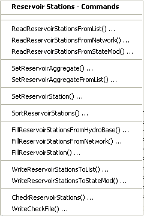
</p>**

**<p style="text-align: center;">
Commands / Reservoir Data / Reservoir Stations Menu (<a href="../Menu_Commands_StateMod_ReservoirStations.png">see also the full-size image</a>)
</p>**

The following table summarizes the use of each command:

**<p style="text-align: center;">
Reservoir Stations Commands
</p>**

| **Command**&nbsp;&nbsp;&nbsp;&nbsp;&nbsp;&nbsp;&nbsp;&nbsp;&nbsp;&nbsp;&nbsp;&nbsp;&nbsp;&nbsp;&nbsp;&nbsp;&nbsp;&nbsp;&nbsp;&nbsp;&nbsp;&nbsp;&nbsp;&nbsp;&nbsp;&nbsp;&nbsp;&nbsp;&nbsp;&nbsp;&nbsp;&nbsp;&nbsp;&nbsp;&nbsp;&nbsp;&nbsp;&nbsp;&nbsp;&nbsp;&nbsp;&nbsp;&nbsp;&nbsp;&nbsp;&nbsp;&nbsp;&nbsp;&nbsp;&nbsp;&nbsp;&nbsp; | **Description** |
| -- | -- |
| [`ReadReservoirStationsFromList`](../command-ref/ReadReservoirStationsFromList/ReadReservoirStationsFromList.md) | Read from a delimited list file the list of reservoir stations to be included in the dataset.
| [`ReadReservoirStationsFromNetwork`](../command-ref/ReadReservoirStationsFromNetwork/ReadReservoirStationsFromNetwork.md) | Read from a StateMod network file a list of reservoir stations to be included in the dataset.
| [`ReadReservoirStationsFromStateMod`](../command-ref/ReadReservoirStationsFromStateMod/ReadReservoirStationsFromStateMod.md) | Read from a StateMod reservoir stations file the list of reservoir stations to be included in the dataset.
| [`SetReservoirAggregate`](../command-ref/SetReservoirAggregate/SetReservoirAggregate.md) | Specify that a reservoir is an aggregate and define its parts.
| [`SetReservoirAggregateFromList`](../command-ref/SetReservoirAggregateFromList/SetReservoirAggregateFromList.md) | Specify that one or more reservoirs are aggregates and define their parts, using a delimited list file.
| [`SetReservoirStation`](../command-ref/SetReservoirStation/SetReservoirStation.md) | Set the data for, and optionally add, reservoir stations.
| [`SortReservoirStations`](../command-ref/SortReservoirStations/SortReservoirStations.md) | Sort the reservoir stations.  This is useful to force consistency between files.
| [`FillReservoirStationsFromHydroBase`](../command-ref/FillReservoirStationsFromHydroBase/FillReservoirStationsFromHydroBase.md) | Fill missing data for defined reservoir stations, using data from HydroBase.  For example, retrieve the station names, and maximum volumes.
| [`FillReservoirStationsFromNetwork`](../command-ref/FillReservoirStationsFromNetwork/FillReservoirStationsFromNetwork.md) | Fill missing data for defined reservoir stations, using data from the network.  For example, retrieve the station names.
| [`FillReservoirStation`](../command-ref/FillReservoirStation/FillReservoirStation.md) | Fill missing data for defined reservoir stations, user user-supplied values.
| [`WriteReservoirStationsToList`](../command-ref/WriteReservoirStationsToList/WriteReservoirStationsToList.md) | Write defined reservoir stations to a delimited file.
| [`WriteReservoirStationsToStateMod`](../command-ref/WriteReservoirStationsToStateMod/WriteReservoirStationsToStateMod.md) | Write defined reservoir stations to a StateMod file.
| [`CheckReservoirStations`](../command-ref/CheckReservoirStations/CheckReservoirStations.md) | Check reservoir stations data for problems.
| [`WriteCheckFile`](../command-ref/WriteCheckFile/WriteCheckFile.md) | Write the results of data checks to a file.

An example command file to create the reservoir station file is shown below (from Colorado `cm2005` dataset):

```
StartLog(LogFile="res.commands.StateDMI.log")
# res.commands.StateDMI
#
# Creates the reservoir station file for the Upper Colorado River monthly models
# Initial reservoir contents are set to 9/1908 estimated contents
#
# Phase IIIb modifications
#       to reflect reservoir storage as of October 1908 - zero out account owners' current
#       storage capacity if the reservoir came on-line during the study period.
#       No changes made to reservoirs that were on-line in 10/1908 (including aggregate storage).
#
#       Turned on Wolford Mountain and added Wolford Mountain accounts and storage rights per CWCB
#
#       Eliminated Unallocated Pool from Vega Reservoir; it was getting filled but not booked over
#       to the Power Exchange pool, and could not get released for use
#
# commands used in this file establish reservoir capacity, fill date,
# reservoir account ownership, area-capacity tables and representative
# evaporation stations (see StateMod documentation)
#
#  Step 1 - read reservoirs from network file and sort alphabetically
#
ReadReservoirStationsFromNetwork(InputFile="..\network\cm2005.net")
SortReservoirStations(Order=Ascending)
#
#  Step 2 - read reservoir information from HydroBase
#
FillReservoirStationsFromHydroBase(ID="*")
#
#  Step 3 - set reservoir information not available in HydroBase including min/max
#           content, starting content, and account information
#
# GREEN MOUNTAIN RESERVIOR Characteristics
SetReservoirStation(ID="363543",OnOff=3,OneFillRule=4,DailyID="5",ContentMin=0,ContentMax=154645,ReleaseMax=4010,DeadStorage=0,AccountID=1,AccountName="Hist_Users",AccountMax=66000,AccountInitial=0,AccountEvap=0,AccountOneFill=1,EvapStations="10008,100",IfNotFound=Warn)
SetReservoirStation(ID="363543",AccountID=2,AccountName="CBT_Pool",AccountMax=52000,AccountInitial=0,AccountEvap=0,AccountOneFill=1,IfNotFound=Warn)
SetReservoirStation(ID="363543",AccountID=3,AccountName="Contract",AccountMax=20000,AccountInitial=0,AccountEvap=0,AccountOneFill=1,IfNotFound=Warn)
SetReservoirStation(ID="363543",AccountID=4,AccountName="Silt_Proj",AccountMax=5000,AccountInitial=0,AccountEvap=0,AccountOneFill=1,IfNotFound=Warn)
SetReservoirStation(ID="363543",AccountID=5,AccountName="Inactive",AccountMax=11645,AccountInitial=0,AccountEvap=0,AccountOneFill=1,IfNotFound=Warn)
SetReservoirStation(ID="363543",AccountID=6,AccountName="SurplusFish",AccountMax=66000,AccountInitial=0,AccountEvap=0,IfNotFound=Warn)
... similar commands for other reservoirs omitted...
#
# District 50 Aggregated Reservoirs
SetReservoirStation(ID="50_ARC006",Name="50_ARC006",OnOff=1,OneFillRule=-1,DailyID="5",ContentMin=0,ContentMax=11481,ReleaseMax=999999,DeadStorage=0,AccountID=1,AccountName="50_ARC006",AccountMax=11481,AccountInitial=11481,AccountEvap=0,AccountOneFill=1,EvapStations="10008,100",ContentAreaSeepage="0,0,0;11481,1148.1,0;9999999,1148.1,0",IfNotFound=Warn)
...similar commands for other reservoirs omitted...
#
WriteReservoirStationsToStateMod(OutputFile="..\statemod\cm2005.res")
#
# Check the results
CheckReservoirStations(ID="*")
WriteCheckFile(OutputFile="res.commands.StateDMI.check.html")
```

### Reservoir Rights ###

Reservoir rights correspond to the reservoir stations,
using the reservoir station identifier to relate the data.
Reservoir right identifiers are typically the reservoir station identifier followed by
`.NN`, where `NN` is a sequential number starting with `01`.
Reservoir aggregate stations have rights corresponding to water right classes.

The ***Commands / Reservoir Data / Reservoir Rights*** menu items insert commands to process reservoir rights data:

**<p style="text-align: center;">
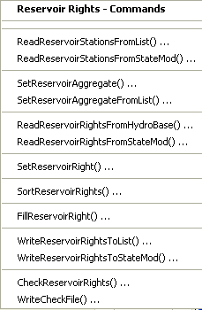
</p>**

**<p style="text-align: center;">
Commands / Reservoir Data / Reservoir Rights Menu (<a href="../Menu_Commands_StateMod_ReservoirRights.png">see also the full-size image</a>)
</p>**

The following table summarizes the use of each command:

**<p style="text-align: center;">
Reservoir Rights Commands
</p>**

| **Command**&nbsp;&nbsp;&nbsp;&nbsp;&nbsp;&nbsp;&nbsp;&nbsp;&nbsp;&nbsp;&nbsp;&nbsp;&nbsp;&nbsp;&nbsp;&nbsp;&nbsp;&nbsp;&nbsp;&nbsp;&nbsp;&nbsp;&nbsp;&nbsp;&nbsp;&nbsp;&nbsp;&nbsp;&nbsp;&nbsp;&nbsp;&nbsp;&nbsp;&nbsp;&nbsp;&nbsp;&nbsp;&nbsp;&nbsp;&nbsp;&nbsp;&nbsp;&nbsp;&nbsp;&nbsp;&nbsp;&nbsp;&nbsp;&nbsp;&nbsp; | **Description** |
| -- | -- |
| [`ReadReservoirStationsFromList`](../command-ref/ReadReservoirStationsFromList/ReadReservoirStationsFromList.md) | Read from a delimited file the list of reservoir stations to be included in the dataset – the list indicates the stations for which to process rights. |
| [`ReadReservoirStationsFromStateMod`](../command-ref/ReadReservoirStationsFromStateMod/ReadReservoirStationsFromStateMod.md) | Read from a StateMod reservoir stations file the list of reservoir stations to be included in the dataset – the list indicates the stations for which to process rights. |
| [`SetReservoirAggregate`](../command-ref/SetReservoirAggregate/SetReservoirAggregate.md) | Specify that a reservoir is an aggregate and define its parts. |
| [`SetReservoirAggregateFromList`](../command-ref/SetReservoirAggregateFromList/SetReservoirAggregateFromList.md) | Specify that one or more reservoirs are aggregates and define their parts, using a delimited list file. |
| [`ReadReservoirRightsFromHydroBase`](../command-ref/ReadReservoirRightsFromHydroBase/ReadReservoirRightsFromHydroBase.md) | For each reservoir station, read the corresponding reservoir rights from HydroBase. |
| [`ReadReservoirRightsFromStateMod`](../command-ref/ReadReservoirRightsFromStateMod/ReadReservoirRightsFromStateMod.md) | Read reservoir rights from a StateMod reservoir rights file. |
| [`SetReservoirRight`](../command-ref/SetReservoirRight/SetReservoirRight.md) | Set the data for, and optionally add, reservoir rights. |
| [`SortReservoirRights`](../command-ref/SortReservoirRights/SortReservoirRights.md) | Sort the reservoir rights.  This is useful to force consistency between files. |
| [`FillReservoirRight`](../command-ref/FillReservoirRight/FillReservoirRight.md) | Fill missing data for defined reservoir rights, using user-supplied values. |
| [`WriteReservoirRightsToList`](../command-ref/WriteReservoirRightsToList/WriteReservoirRightsToList.md) | Write defined reservoir rights to a delimited file. |
| [`WriteReservoirRightsToStateMod`](../command-ref/WriteReservoirRightsToStateMod/WriteReservoirRightsToStateMod.md) | Write defined reservoir rights to a StateMod file. |
| [`CheckReservoirRights`](../command-ref/CheckReservoirRights/CheckReservoirRights.md) | Check reservoir rights data for problems. |
| [`WriteCheckFile`](../command-ref/WriteCheckFile/WriteCheckFile.md) | Write the results of data checks to a file. |

The following example command file (from the Colorado `cm2005` dataset) illustrates how to create the reservoir rights file:

```
StartLog(LogFile="rer.commands.StateDMI.log")
# rer.commands.StateDMI
#
# Creates the reservoir rights file for the Upper Colorado River model
#
#  Step 1 - read reservoirs from reservoir station file
#
ReadReservoirStationsFromStateMod(InputFile="..\StateMod\cm2005.res")
#
#  Step 2 - read reservoir rights from HyroBase
#
ReadReservoirRightsFromHydroBase(ID="*",OnOffDefault=1)
#
#  Step 3 - assign rights to specific accounts, if required
#           assign rights not in hydrobase and free-river rights
SetReservoirRight(ID="363543.01",Name="GREEN_MOUNTAIN_RESERVOIR",StationID="ID",AdministrationNumber=31258.00000,Decree=154645,OnOff=1943,AccountDist="-5",RightType=1,FillType=1,IfNotFound=Warn,IfFound=Set)
# Set Green Mountain's senior refill right to be junior to the Con-Hoosier and
#  Dillon/Roberts Tunnel projects and the Blue River Decree Exchange
# this is based on agreements with the USBR and Denver.
SetReservoirRight(ID="363543.02",Name="GREEN_MOUNTAIN_RESERVOIR",StationID="ID",AdministrationNumber=38628.00001,Decree=6316,OnOff=1943,AccountDist="-5",RightType=1,FillType=2,IfNotFound=Warn,IfFound=Set)
SetReservoirRight(ID="363543.03",Name="GREEN_MOUNTAIN-refill",StationID="ID",AdministrationNumber=50403.49309,Decree=154645,OnOff=1943,AccountDist="-5",FillType=2,IfNotFound=Add,IfFound=Set)
# 363543.04 right is used by Type 41 Rule in accordance with the Blue River Decree and the Interim Policy
SetReservoirRight(ID="363543.04",Name="GREEN_MOUNTAIN_RES_Exch",StationID="ID",AdministrationNumber=38628.00000,Decree=154645,OnOff=1,AccountDist="-5",FillType=2,IfNotFound=Add,IfFound=Warn)
# Con-Hoosier Res (aka Upper Blue Lakes) set 0.00001 junior to Con-Hoosier tunnel diversion
SetReservoirRight(ID="363570.01",Name="CON_HOOSIER_RES-orig",StationID="ID",AdministrationNumber=35927.00001,Decree=10000,OnOff=1,AccountDist="1",FillType=1,IfNotFound=Warn,IfFound=Set)
SetReservoirRight(ID="363570.02",Name="CON_HOOSIER_RES-free",StationID="ID",AdministrationNumber=99999.99999,Decree=10000,OnOff=1,AccountDist="1",RightType=1,FillType=2,IfNotFound=Add,IfFound=Warn)
SetReservoirRight(ID="363575.01",Name="Clinton Gulch Original Modified",Decree=600,AccountDist="-9",FillType=1,IfNotFound=Warn,IfFound=Set)
SetReservoirRight(ID="363575.02",Name="CLINTON_GULCH-refill",StationID="ID",OnOff=1,AccountDist="-9",RightType=1,FillType=2,IfNotFound=Warn,IfFound=Set)
SetReservoirRight(ID="363575.03",Name="Clinton Gulch Modified Sr to Dillon",StationID="ID",AdministrationNumber=31257.99999,Decree=3650,OnOff=1,AccountDist="-9",RightType=1,FillType=1,IfNotFound=Add,IfFound=Warn)
# Denver's Dillon Reservoir set junior to Colorado Springs' Conntinental Hoosier Project
SetReservoirRight(ID="364512.01",Name="DILLON_RESERVOIR-modify",StationID="ID",AdministrationNumber=35927.00005,Decree=252678,OnOff=1,AccountDist="-3",RightType=1,FillType=1,IfNotFound=Warn,IfFound=Set)
SetReservoirRight(ID="364512.02",Name="DILLON_RESERVOIR-refill",StationID="ID",AdministrationNumber=50038.49309,Decree=252678,OnOff=1,AccountDist="-3",RightType=1,FillType=1,IfNotFound=Warn,IfFound=Set)
SetReservoirRight(ID="373639.01",Name="Wolcott_Reservoir",StationID="ID",AdministrationNumber=42485.00000,Decree=65975,OnOff=1,AccountDist="-1",RightType=1,FillType=1,IfNotFound=Add,IfFound=Warn)
SetReservoirRight(ID="373699.01",AccountDist="-4",FillType=1,IfNotFound=Warn,IfFound=Set)
SetReservoirRight(ID="374516.01",AccountDist="-2",FillType=1,IfNotFound=Warn,IfFound=Set)
SetReservoirRight(ID="374516.02",Name="HOMESTAKE_RES-refill",StationID="ID",AdministrationNumber=99999.99999,Decree=43505,OnOff=1,AccountDist="-2",RightType=1,FillType=2,IfNotFound=Add,IfFound=Warn)
SetReservoirRight(ID="383713.01",Name="RUEDI_RESERVOIR",StationID="ID",OnOff=1,AccountDist="-6",RightType=1,FillType=1,IfNotFound=Warn,IfFound=Set)
SetReservoirRight(ID="383713.02",Name="RUEDI_RESERVOIR-refill",StationID="ID",Decree=101280,OnOff=1,AccountDist="-3",RightType=1,FillType=2,IfNotFound=Warn,IfFound=Set)
SetReservoirRight(ID="393505.01",AccountDist="1",FillType=1,IfNotFound=Warn,IfFound=Set)
SetReservoirRight(ID="393505.02",AccountDist="1",FillType=1,IfNotFound=Warn,IfFound=Set)
SetReservoirRight(ID="393505.03",Name="GRASS_VALLEY_RES-refill",StationID="ID",AdministrationNumber=99999.99999,Decree=5920,OnOff=1,AccountDist="1",RightType=1,FillType=2,IfNotFound=Add,IfFound=Warn)
SetReservoirRight(ID="393508.01",AccountDist="-2",FillType=1,IfNotFound=Warn,IfFound=Set)
SetReservoirRight(ID="393508.02",Name="RIFLE_GAP_RES-refill",StationID="ID",AdministrationNumber=99999.99999,Decree=13601,OnOff=1,AccountDist="-2",RightType=1,FillType=2,IfNotFound=Add,IfFound=Warn)
SetReservoirRight(ID="503668.01",Name="WOLFORD_MOUNTAIN_RES",StationID="ID",OnOff=1,AccountDist="-2",RightType=1,FillType=1,IfNotFound=Warn,IfFound=Set) SetReservoirRight(ID="503668.02",Name="WOLFORD_MOUNTAIN_RES",StationID="ID",OnOff=1,AccountDist="3",RightType=1,FillType=1,IfNotFound=Warn,IfFound=Set)
SetReservoirRight(ID="503668.03",Name="WOLFORD_MOUNTAIN-refill",StationID="ID",AdministrationNumber=99999.99999,Decree=30000,OnOff=1,AccountDist="-2",RightType=1,FillType=2,IfNotFound=Add,IfFound=Warn)
SetReservoirRight(ID="513686.01",AccountDist="-3",FillType=1,IfNotFound=Warn,IfFound=Set)
SetReservoirRight(ID="513686.02",Name="MEADOW_CREEK_RES-refill",StationID="ID",AdministrationNumber=99999.99999,Decree=5100,OnOff=1,AccountDist="-3",RightType=1,FillType=2,IfNotFound=Add,IfFound=Warn)
SetReservoirRight(ID="513695.01",AccountDist="-2",FillType=1,IfNotFound=Warn,IfFound=Set)
SetReservoirRight(ID="513695.02",Name="SHADOW_MTN_RES-refill",StationID="ID",AdministrationNumber=99999.99999,Decree=19669,OnOff=1,AccountDist="-2",RightType=1,FillType=2,IfNotFound=Add,IfFound=Warn)
SetReservoirRight(ID="513709.01",AccountDist="-2",FillType=1,IfNotFound=Warn,IfFound=Set)
SetReservoirRight(ID="513709.02",AccountDist="-1",FillType=2,IfNotFound=Warn,IfFound=Set)
SetReservoirRight(ID="513710.01",AccountDist="-2",FillType=1,IfNotFound=Warn,IfFound=Set)
SetReservoirRight(ID="513710.02",Name="WILLOW_CREEK_RES-refill",StationID="ID",AdministrationNumber=99999.99999,Decree=10553,OnOff=1,AccountDist="-2",RightType=1,FillType=2,IfNotFound=Add,IfFound=Warn)
SetReservoirRight(ID="514620.01",Name="GRANBY_RESERVOIR",StationID="ID",AdministrationNumber=31258.00000,Decree=543758,OnOff=1,AccountDist="-2",RightType=1,FillType=1,IfNotFound=Add,IfFound=Warn)
SetReservoirRight(ID="514620.02",Name="GRANBY_RESERVOIR-refill",StationID="ID",AdministrationNumber=99999.99999,Decree=543758,OnOff=1,AccountDist="-2",RightType=1,FillType=2,IfNotFound=Add,IfFound=Warn)
SetReservoirRight(ID="723844.01",AccountDist="-3",FillType=1,IfNotFound=Warn,IfFound=Set)
SetReservoirRight(ID="723844.02",Name="VEGA_RESERVOIR_refill",StationID="ID",AdministrationNumber=99999.99999,Decree=33500,OnOff=1,AccountDist="-2",RightType=1,FillType=2,IfNotFound=Add,IfFound=Warn)
#
#    set rights for reservoirs and stock pond to capacity with senior water right
#
SetReservoirRight(ID="36_ARC001.01",Name="36_ARC001",StationID="ID",AdministrationNumber=1.00000,Decree=8702,OnOff=1,FillType=1,IfNotFound=Add,IfFound=Warn)
SetReservoirRight(ID="37_ARC002.01",Name="37_ARC002",StationID="ID",AdministrationNumber=1.00000,Decree=6671,OnOff=1,FillType=1,IfNotFound=Add,IfFound=Warn)
SetReservoirRight(ID="38_ARC003.01",Name="38_ARC003",StationID="ID",AdministrationNumber=1.00000,Decree=13074,OnOff=1,FillType=1,IfNotFound=Add,IfFound=Warn)
SetReservoirRight(ID="39_ARC004.01",Name="39_ARC004",StationID="ID",AdministrationNumber=1.00000,Decree=2236,OnOff=1,FillType=1,IfNotFound=Add,IfFound=Warn)
SetReservoirRight(ID="45_ARC005.01",Name="45_ARC005",StationID="ID",AdministrationNumber=1.00000,Decree=2054,OnOff=1,FillType=1,IfNotFound=Add,IfFound=Warn)
SetReservoirRight(ID="50_ARC006.01",Name="50_ARC006",StationID="ID",AdministrationNumber=1.00000,Decree=11481,OnOff=1,FillType=1,IfNotFound=Add,IfFound=Warn)
SetReservoirRight(ID="51_ARC007.01",Name="51_ARC007",StationID="ID",AdministrationNumber=1.00000,Decree=8480,OnOff=1,FillType=1,IfNotFound=Add,IfFound=Warn)
SetReservoirRight(ID="52_ARC008.01",Name="52_ARC008",StationID="ID",AdministrationNumber=1.00000,Decree=821,OnOff=1,FillType=1,IfNotFound=Add,IfFound=Warn)
SetReservoirRight(ID="53_ARC009.01",Name="53_ARC009",StationID="ID",AdministrationNumber=1.00000,Decree=8389,OnOff=1,FillType=1,IfNotFound=Add,IfFound=Warn)
SetReservoirRight(ID="72_ARC010.01",Name="72_ARC010",StationID="ID",AdministrationNumber=1.00000,Decree=25664,OnOff=1,FillType=1,IfNotFound=Add,IfFound=Warn)
SetReservoirRight(ID="72_ASC001.01",Name="72_ASC001",StationID="ID",AdministrationNumber=1.00000,Decree=2261,OnOff=1,FillType=1,IfNotFound=Add,IfFound=Warn)
SetReservoirRight(ID="953802.01",Name="LEON_CREEK_AGGREG_RES",StationID="ID",AdministrationNumber=1.00000,Decree=4933,OnOff=1,AccountDist="1",RightType=1,FillType=1,IfNotFound=Add,IfFound=Warn)
SetReservoirRight(ID="953800.01",Name="BONHAM_AGGREGATED_RES",StationID="ID",AdministrationNumber=1.00000,Decree=6778,OnOff=1,AccountDist="1",RightType=1,FillType=1,IfNotFound=Add,IfFound=Warn)
SetReservoirRight(ID="953801.01",Name="COTTONWOOD_AGGREG_RES",StationID="ID",AdministrationNumber=1.00000,Decree=3812,OnOff=1,AccountDist="1",RightType=1,FillType=1,IfNotFound=Add,IfFound=Warn)
#
#  Step 4 - create output for Historic and Calculated datasets
#
WriteReservoirRightsToStateMod(OutputFile="..\StateMod\cm2005.rer")
#
#  Step 5 - Reset Green Mountain Rights' Start Dates for Baseline dataset
#
SetReservoirRight(ID="363543.01",Name="GREEN_MOUNTAIN_RESERVOIR",StationID="ID",AdministrationNumber=31258.00000,Decree=154645,OnOff=1,AccountDist="-5",RightType=1,FillType=1,IfNotFound=Warn,IfFound=Set)
SetReservoirRight(ID="363543.02",Name="GREEN_MOUNTAIN_RESERVOIR",StationID="ID",AdministrationNumber=31258.00000,Decree=6316,OnOff=1,AccountDist="-5",RightType=1,FillType=2,IfNotFound=Warn,IfFound=Set)
SetReservoirRight(ID="363543.03",Name="GREEN_MOUNTAIN-refill",StationID="ID",AdministrationNumber=50403.49309,Decree=154645,OnOff=1,AccountDist="-5",FillType=2,IfNotFound=Add,IfFound=Set)
#
#  Step 6 - create output for Baseline dataset
#
WriteReservoirRightsToStateMod(OutputFile="..\StateMod\cm2005B.rer")
#
# Check the results
CheckReservoirRights(ID="*")
WriteCheckFile(OutputFile="rer.commands.StateDMI.check.html")
```

### Reservoir Content, Target Time Series (Monthly, Daily) ###

StateDMI does not process reservoir time series.
Instead, use TSTool, a spreadsheet or other software to prepare the time series file.
For example, use TSTool’s `CreateFromList` command to specify a
list of reservoir station identifiers and create time series identifiers for HydroBase time series.

The following example TSTool command file (from the Colorado `cm2005` dataset)
illustrates how end of month content time series can be created:

```
# eom.commands.TSTool
#
# commands in this file either pull historical EOM contents from the CRDSS database
# (i.e. Rifle Gap) or from user-defined *.stm files
#
# rrb 98/09/29; Revised aggregated reservoir and stockpond ID's (e.g. 36_ADC_001 = 36_ADC001)
#
# Phase IIIb modifications
# 	Include extended replacement files from Task 11.1 and Cont. Auth. #5
# 	Add Wolford Mtn EOM Data from River District
# 	Fill missing data using water district indicator gages determined in demandts runs
# 	Fill with historical monthly average if no wetness pattern average available
# 	Set start dates for reservoirs in March of year listed in Ray A fax (9/8/98)
#
# James Heath, LRE (heath@lrcwe.com) updated the previous version of the file to reflect changes
#	in the TSTool commands and formatting. Data has also been updated through 2005. Some
#	underlying engineering estimates have changed and are reflected in this command file.
#
#
SetOutputPeriod(OutputStart="10/1908",OutputEnd="09/2005")
SetOutputYearType(OutputYearType=Water)
ReadPatternFile(PatternFile="..\Diversions\fill2005.pat")
#
# GREEN MOUNTAIN RESERVOIR
363543...MONTH~StateMod~363543.stm
#
# UPPER BLUE RESERVOIR (ConHoosier)
# Data from HydroBase is used to better represent actual opperations of the reservoir in the cm2005
# update rather than setting the contents to its maximum as in previous model versions.
363570.DWR.ResMeasStorage.Day~HydroBase
TS ConHoosier363570 = NewEndOfMonthTSFromDayTS(DayTSID="363570.DWR.ResMeasStorage.Day",Bracket=16)
Free(TSList=LastMatchingTSID,TSID="363570.DWR.ResMeasStorage.Day")
FillPattern(TSList=LastMatchingTSID,TSID="ConHoosier363570",PatternID="09037500")
SetConstant(TSList=LastMatchingTSID,TSID="ConHoosier363570",ConstantValue=0,SetEnd="03/1962")
FillInterpolate(TSList=LastMatchingTSID,TSID="ConHoosier363570",MaxIntervals=0,Transformation=None)
#
# CLINTON GULCH RESERVOIR
# Data from HydroBase is used to better represent actual opperations of the reservoir in the cm2005
# update rather than setting the contents to its maximum as in previous model versions.
363575.DWR.ResMeasStorage.Day~HydroBase
TS ClintonGulch363575 = NewEndOfMonthTSFromDayTS(DayTSID="363575.DWR.ResMeasStorage.Day",Bracket=16)
Free(TSList=LastMatchingTSID,TSID="363575.DWR.ResMeasStorage.Day")
FillInterpolate(TSList=LastMatchingTSID,TSID=”ClintonGulch363575”,FillStart=”10/1992”,FillEnd=”09/2004)
FillPattern(TSList=LastMatchingTSID,TSID="ClintonGulch363575",PatternID="09037500")
SetConstant(TSList=LastMatchingTSID,TSID="ClintonGulch363575",ConstantValue=0,SetEnd="03/1977")
FillInterpolate(TSList=LastMatchingTSID,TSID="ClintonGulch363575",MaxIntervals=0,Transformation=None)
#
# DILLON RESERVOIR
364512...MONTH~StateMod~364512.stm
#
36_ARC001...MONTH~StateMod~36_ARC001.stm
FillPattern(TSList=LastMatchingTSID,TSID="36_ARC001...MONTH",PatternID="09037500")
#
# WOLCOTT RESERVOIR
373639...MONTH~StateMod~zero.stm
#
# EAGLE PARK RESERVOIR
373699...MONTH~StateMod~zero.stm
# Data is available in HydroBase for Eagle Park Reservoir but currently the reservor is only a
# placeholder for future updates to fill in the details at a later date.
#373699.DWR.ResMeasStorage.Day~HydroBase
#TS EaglePark373699 = newEndOfMonthTSFromDayTS(373699.DWR.ResMeasStorage.Day,16)
#free(TSID="373699.DWR.ResMeasStorage.Day")
#fillPattern(EaglePark373699,09085000)
#setConstant(TSID="EaglePark373699",ConstantValue=0,SetEnd="04/1997")
#fillInterpolate(EaglePark373699,0,Linear)
#
# HOMESTAKE PROJ RESERVOIR
# Data from HydroBase is used exclusively as it was representative of what was previously in the .stm
# file as used in previous model versions. This allows for easier updating in the future.
374516.DWR.ResMeasStorage.Day~HydroBase
TS Homestake374516 = NewEndOfMonthTSFromDayTS(DayTSID="374516.DWR.ResMeasStorage.Day",Bracket=16)
Free(TSList=LastMatchingTSID,TSID="374516.DWR.ResMeasStorage.Day")
FillPattern(TSList=LastMatchingTSID,TSID="Homestake374516",PatternID="09085000")
SetConstant(TSList=LastMatchingTSID,TSID="Homestake374516",ConstantValue=0,SetEnd="03/1967")
FillInterpolate(TSList=LastMatchingTSID,TSID="Homestake374516",MaxIntervals=0,Transformation=None)
#
37_ARC002...MONTH~StateMod~37_ARC002.stm
FillPattern(TSList=LastMatchingTSID,TSID="37_ARC002...MONTH",PatternID="09085000")
#
# RUEDI RESERVOIR
383713...MONTH~StateMod~383713.stm
#
38_ARC003...MONTH~StateMod~38_ARC003.stm
FillPattern(TSList=LastMatchingTSID,TSID="38_ARC003...MONTH",PatternID="09085000")
#
# GRASS VALLEY RESERVOIR
# Data from HydroBase is used exclusively as it was representative of what was previously in the .stm
# file as used in previous model versions. This allows for easier updating in the future.
# There was one data point, in April 1981, that was replaced with 5989 af (mis-key).
393505.DWR.ResMeasStorage.Day~HydroBase
TS GrassValley393505 = NewEndOfMonthTSFromDayTS(DayTSID="393505.DWR.ResMeasStorage.Day",Bracket=16)
Free(TSList=LastMatchingTSID,TSID="393505.DWR.ResMeasStorage.Day")
FillPattern(TSList=LastMatchingTSID,TSID="GrassValley393505",PatternID="09095500")
FillInterpolate(TSList=LastMatchingTSID,TSID="GrassValley393505",MaxIntervals=0,Transformation=None)
SetConstant(TSList=LastMatchingTSID,TSID="GrassValley393505",ConstantValue=5989,SetStart="04/1981",SetEnd="04/1981")
#
# RIFLE GAP RESERVOIR
# Data from HydroBase is used exclusively as it was previously in past model versions.
# August of 2004 appeared to be a typo and has been corrected below to what apeared to be the
# correct value.
393508.DWR.ResMeasStorage.Day~HydroBase
TS RifleGap393508 = NewEndOfMonthTSFromDayTS(DayTSID="393508.DWR.ResMeasStorage.Day",Bracket=16)
Free(TSList=LastMatchingTSID,TSID="393508.DWR.ResMeasStorage.Day")
SetConstant(TSList=LastMatchingTSID,TSID="RifleGap393508",ConstantValue=700.16,SetStart="08/2004",SetEnd="08/2004")
FillPattern(TSList=LastMatchingTSID,TSID="RifleGap393508",PatternID="09095500")
SetConstant(TSList=LastMatchingTSID,TSID="RifleGap393508",ConstantValue=0,SetEnd="03/1967")
FillInterpolate(TSList=LastMatchingTSID,TSID="RifleGap393508",MaxIntervals=0,Transformation=None)
#
39_ARC004...MONTH~StateMod~39_ARC004.stm
FillPattern(TSList=LastMatchingTSID,TSID="39_ARC004...MONTH",PatternID="09095500")
#
45_ARC005...MONTH~StateMod~45_ARC005.stm
FillPattern(TSList=LastMatchingTSID,TSID="45_ARC005...MONTH",PatternID="09095500")
#
# WOLFORD MOUNTAIN RES
503668...MONTH~StateMod~503668.stm
SetConstant(TSList=LastMatchingTSID,TSID="503668...MONTH",ConstantValue=0,SetEnd="03/1995")
#
50_ARC006...MONTH~StateMod~50_ARC006.stm
FillPattern(TSList=LastMatchingTSID,TSID="50_ARC006...MONTH",PatternID="09034500")
#
# MEADOW CREEK RESERVOIR
# Data from HydroBase is used exclusively as it was representative of what was previously in the .stm
# file as used in previous model versions. This allows for easier updating in the future.
# Additionally a shift has been added as it represents 300 af additional dead storage not represented
# in the HydroBase records (as stated in the previous model version's .stm file).
513686.DWR.ResMeasStorage.Day~HydroBase
TS MeadowCreek513686 = NewEndOfMonthTSFromDayTS(DayTSID="513686.DWR.ResMeasStorage.Day",Bracket=16)
Free(TSList=LastMatchingTSID,TSID="513686.DWR.ResMeasStorage.Day")
FillPattern(TSList=LastMatchingTSID,TSID="MeadowCreek513686",PatternID="09034500")
AddConstant(TSList=LastMatchingTSID,TSID="MeadowCreek513686",ConstantValue=300)
SetConstant(TSList=LastMatchingTSID,TSID="MeadowCreek513686",ConstantValue=0,SetEnd="03/1956")
FillInterpolate(TSList=LastMatchingTSID,TSID="MeadowCreek513686",MaxIntervals=0,Transformation=None)
#
# CBT SHADOW MTN GRAND L
# Data from HydroBase is used exclusively as it was previously in past model versions.
513695.DWR.ResMeasStorage.Day~HydroBase
TS ShadowMountainGrandLake513695 = NewEndOfMonthTSFromDayTS(DayTSID="513695.DWR.ResMeasStorage.Day",Bracket=16)
Free(TSList=LastMatchingTSID,TSID="513695.DWR.ResMeasStorage.Day")
FillPattern(TSList=LastMatchingTSID,TSID="ShadowMountainGrandLake513695",PatternID="09034500")
SetConstant(TSList=LastMatchingTSID,TSID="ShadowMountainGrandLake513695",ConstantValue=0,SetEnd="03/1946")
FillInterpolate(TSList=LastMatchingTSID,TSID="ShadowMountainGrandLake513695",MaxIntervals=0,Transformation=None)
#
# WILLIAMS FORK RESERVOIR
513709...MONTH~StateMod~513709.stm
#
# CBT WILLOW CREEK RES
# Data from HydroBase is used exclusively as it was previously in past model versions.
513710.DWR.ResMeasStorage.Day~HydroBase
TS WillowCreek513710 = NewEndOfMonthTSFromDayTS(DayTSID="513710.DWR.ResMeasStorage.Day",Bracket=16)
Free(TSList=LastMatchingTSID,TSID="513710.DWR.ResMeasStorage.Day")
FillPattern(TSList=LastMatchingTSID,TSID="WillowCreek513710",PatternID="09034500")
SetConstant(TSList=LastMatchingTSID,TSID="WillowCreek513710",ConstantValue=0,SetEnd="03/1953")
FillInterpolate(TSList=LastMatchingTSID,TSID="WillowCreek513710",MaxIntervals=0,Transformation=None)
#
# CBT GRANBY RESERVOIR
514620...MONTH~StateMod~514620.stm
# Setting specific descrepencies that Meg Frantz and Heather Thompson found
#  durring the Windy Gap Firming Project modeling by Boyle Engineering
SetDataValue(TSList=LastMatchingTSID,TSID="514620...MONTH",SetDateTime="03/1954",NewValue=372900)
SetDataValue(TSList=LastMatchingTSID,TSID="514620...MONTH",SetDateTime="10/1960",NewValue=411100)
SetDataValue(TSList=LastMatchingTSID,TSID="514620...MONTH",SetDateTime="10/1961",NewValue=478100)
SetDataValue(TSList=LastMatchingTSID,TSID="514620...MONTH",SetDateTime="06/1967",NewValue=263400)
#
51_ARC007...MONTH~StateMod~51_ARC007.stm
FillPattern(TSList=LastMatchingTSID,TSID="51_ARC007...MONTH",PatternID="09034500")
#
52_ARC008...MONTH~StateMod~52_ARC008.stm
FillPattern(TSList=LastMatchingTSID,TSID="52_ARC008...MONTH",PatternID="09085000")
#
53_ARC009...MONTH~StateMod~53_ARC009.stm
FillPattern(TSList=LastMatchingTSID,TSID="53_ARC009...MONTH",PatternID="09085000")
#
# VEGA RESERVOIR
723844...MONTH~StateMod~723844.stm
SetConstant(TSList=LastMatchingTSID,TSID="723844...MONTH",ConstantValue=0,SetEnd="03/1960")
#
72_ARC010...MONTH~StateMod~72_ARC010.stm
FillPattern(TSList=LastMatchingTSID,TSID="72_ARC010...MONTH",PatternID="09095500")
#
72_ASC001...MONTH~StateMod~72_ASC001.stm
FillPattern(TSList=LastMatchingTSID,TSID="72_ASC001...MONTH",PatternID="09095500")
#
# BONHAM AGGREGATED RES
953800...MONTH~StateMod~953800.stm
FillPattern(TSList=LastMatchingTSID,TSID="953800...MONTH",PatternID="09095500")
#
# COTTONWOOD AGGREG RES
953801...MONTH~StateMod~953801.stm
FillPattern(TSList=LastMatchingTSID,TSID="953801...MONTH",PatternID="09095500")
#
# LEON CREEK AGGRES RES
953802...MONTH~StateMod~953802.stm
FillPattern(TSList=LastMatchingTSID,TSID="953802...MONTH",PatternID="09095500")
FillHistMonthAverage(TSList=AllTS)
#
WriteStateMod(TSList=AllTS,OutputFile="..\statemod\cm2005.eom",Precision=0)
CheckTimeSeries(CheckCriteria="Missing")
WriteCheckFile(OutputFile="eom.commands.TSTool.check.html")
```

Reservoir targets can be created similarly;
however, each reservoir have a minimum target time series (often zero) and a maximum target.
StateMod will also allow the minimum target time series to be omitted.
The following command file (from the Colorado `cm2005` dataset)
illustrates how to create the historical case reservoir target file:

```
# Htar.commands.TSTOOL
#
# Targets for Step 1 calibration (release to target)
# Minimum targets set to "0", Maximum targets same as eom file
#
SetOutputPeriod(OutputStart="10/1908",OutputEnd="09/2005")
SetOutputYearType(OutputYearType=Water)
#
# Green Mountain Reservoir
363543...MONTH~StateMod~..\statemod\cm2005.eom
SetConstant(TSList=LastMatchingTSID,TSID="363543...MONTH",ConstantValue=0)
363543...MONTH~StateMod~..\statemod\cm2005.eom
#
# UPPER BLUE RESERVOIR
363570...MONTH~StateMod~..\statemod\cm2005.eom
SetConstant(TSList=LastMatchingTSID,TSID="363570...MONTH",ConstantValue=0)
363570...MONTH~StateMod~..\statemod\cm2005.eom
SetConstant(TSList=LastMatchingTSID,TSID="363570...MONTH",MonthValues="0,0,0,2113,2113,2113,2113,1850,2113,2113,0,0",SetStart="04/1962")
#
# CLINTON GULCH RESERVOIR
363575...MONTH~StateMod~..\statemod\cm2005.eom
SetConstant(TSList=LastMatchingTSID,TSID="363575...MONTH",ConstantValue=0)
363575...MONTH~StateMod~..\statemod\cm2005.eom
SetConstant(TSList=LastMatchingTSID,TSID="363575...MONTH",ConstantValue=4300,SetStart="04/1977")
#
# DILLON RESERVOIR
364512...MONTH~StateMod~..\statemod\cm2005.eom
SetConstant(TSList=LastMatchingTSID,TSID="364512...MONTH",ConstantValue=0)
364512...MONTH~StateMod~..\statemod\cm2005.eom
#
36_ARC001...MONTH~StateMod~..\statemod\cm2005.eom
SetConstant(TSList=LastMatchingTSID,TSID="36_ARC001...MONTH",ConstantValue=0)
36_ARC001...MONTH~StateMod~..\statemod\cm2005.eom
#
# WOLCOTT RESERVOIR
373639...MONTH~StateMod~..\statemod\cm2005.eom
SetConstant(TSList=LastMatchingTSID,TSID="373639...MONTH",ConstantValue=0)
373639...MONTH~StateMod~..\statemod\cm2005.eom
#
# EAGLE PARK RESERVOIR
373699...MONTH~StateMod~..\statemod\cm2005.eom
SetConstant(TSList=LastMatchingTSID,TSID="373699...MONTH",ConstantValue=0)
373699...MONTH~StateMod~..\statemod\cm2005.eom
#
# HOMESTAKE PROJ RESERVOIR
374516...MONTH~StateMod~..\statemod\cm2005.eom
SetConstant(TSList=LastMatchingTSID,TSID="374516...MONTH",ConstantValue=0)
374516...MONTH~StateMod~..\statemod\cm2005.eom
#
37_ARC002...MONTH~StateMod~..\statemod\cm2005.eom
SetConstant(TSList=LastMatchingTSID,TSID="37_ARC002...MONTH",ConstantValue=0)
37_ARC002...MONTH~StateMod~..\statemod\cm2005.eom
#
# RUEDI RESERVOIR
383713...MONTH~StateMod~..\statemod\cm2005.eom
SetConstant(TSList=LastMatchingTSID,TSID="383713...MONTH",ConstantValue=0)
383713...MONTH~StateMod~..\statemod\cm2005.eom
#
38_ARC003...MONTH~StateMod~..\statemod\cm2005.eom
SetConstant(TSList=LastMatchingTSID,TSID="38_ARC003...MONTH",ConstantValue=0)
38_ARC003...MONTH~StateMod~..\statemod\cm2005.eom
#
# GRASS VALLEY RESERVOIR
393505...MONTH~StateMod~..\statemod\cm2005.eom
SetConstant(TSList=LastMatchingTSID,TSID="393505...MONTH",ConstantValue=0)
393505...MONTH~StateMod~..\statemod\cm2005.eom
#
# RIFLE GAP RESERVOIR
393508...MONTH~StateMod~..\statemod\cm2005.eom
SetConstant(TSList=LastMatchingTSID,TSID="393508...MONTH",ConstantValue=0)
393508...MONTH~StateMod~..\statemod\cm2005.eom
#
39_ARC004...MONTH~StateMod~..\statemod\cm2005.eom
SetConstant(TSList=LastMatchingTSID,TSID="39_ARC004...MONTH",ConstantValue=0)
39_ARC004...MONTH~StateMod~..\statemod\cm2005.eom
#
45_ARC005...MONTH~StateMod~..\statemod\cm2005.eom
SetConstant(TSList=LastMatchingTSID,TSID="45_ARC005...MONTH",ConstantValue=0)
45_ARC005...MONTH~StateMod~..\statemod\cm2005.eom
#
# WOLFORD MOUNTAIN RES
503668...MONTH~StateMod~..\statemod\cm2005.eom
SetConstant(TSList=LastMatchingTSID,TSID="503668...MONTH",ConstantValue=0)
503668...MONTH~StateMod~..\statemod\cm2005.eom
#
50_ARC006...MONTH~StateMod~..\statemod\cm2005.eom
SetConstant(TSList=LastMatchingTSID,TSID="50_ARC006...MONTH",ConstantValue=0)
50_ARC006...MONTH~StateMod~..\statemod\cm2005.eom
#
# MEADOW CREEK RESERVOIR
513686...MONTH~StateMod~..\statemod\cm2005.eom
SetConstant(TSList=LastMatchingTSID,TSID="513686...MONTH",ConstantValue=0)
513686...MONTH~StateMod~..\statemod\cm2005.eom
#
# CBT SHADOW MTN GRAND L
513695...MONTH~StateMod~..\statemod\cm2005.eom
SetConstant(TSList=LastMatchingTSID,TSID="513695...MONTH",ConstantValue=0)
513695...MONTH~StateMod~..\statemod\cm2005.eom
#
# WILLIAMS FORK RESERVOIR
513709...MONTH~StateMod~..\statemod\cm2005.eom
SetConstant(TSList=LastMatchingTSID,TSID="513709...MONTH",ConstantValue=0)
513709...MONTH~StateMod~..\statemod\cm2005.eom
#
# CBT WILLOW CREEK RES
513710...MONTH~StateMod~..\statemod\cm2005.eom
SetConstant(TSList=LastMatchingTSID,TSID="513710...MONTH",ConstantValue=0)
513710...MONTH~StateMod~..\statemod\cm2005.eom
#
# CBT GRANBY RESERVOIR
514620...MONTH~StateMod~..\statemod\cm2005.eom
SetConstant(TSList=LastMatchingTSID,TSID="514620...MONTH",ConstantValue=0)
514620...MONTH~StateMod~..\statemod\cm2005.eom
#
51_ARC007...MONTH~StateMod~..\statemod\cm2005.eom
SetConstant(TSList=LastMatchingTSID,TSID="51_ARC007...MONTH",ConstantValue=0)
51_ARC007...MONTH~StateMod~..\statemod\cm2005.eom
#
52_ARC008...MONTH~StateMod~..\statemod\cm2005.eom
SetConstant(TSList=LastMatchingTSID,TSID="52_ARC008...MONTH",ConstantValue=0)
52_ARC008...MONTH~StateMod~..\statemod\cm2005.eom
#
53_ARC009...MONTH~StateMod~..\statemod\cm2005.eom
SetConstant(TSList=LastMatchingTSID,TSID="53_ARC009...MONTH",ConstantValue=0)
53_ARC009...MONTH~StateMod~..\statemod\cm2005.eom
#
# VEGA RESERVOIR
723844...MONTH~StateMod~..\statemod\cm2005.eom
SetConstant(TSList=LastMatchingTSID,TSID="723844...MONTH",ConstantValue=0)
723844...MONTH~StateMod~..\statemod\cm2005.eom
#
72_ARC010...MONTH~StateMod~..\statemod\cm2005.eom
SetConstant(TSList=LastMatchingTSID,TSID="72_ARC010...MONTH",ConstantValue=0)
72_ARC010...MONTH~StateMod~..\statemod\cm2005.eom
#
72_ASC001...MONTH~StateMod~..\statemod\cm2005.eom
SetConstant(TSList=LastMatchingTSID,TSID="72_ASC001...MONTH",ConstantValue=0)
72_ASC001...MONTH~StateMod~..\statemod\cm2005.eom
#
# BONHAM AGGREGATED RES
953800...MONTH~StateMod~..\statemod\cm2005.eom
SetConstant(TSList=LastMatchingTSID,TSID="953800...MONTH",ConstantValue=0)
953800...MONTH~StateMod~..\statemod\cm2005.eom
#
# COTTONWOOD AGGREG RES
953801...MONTH~StateMod~..\statemod\cm2005.eom
SetConstant(TSList=LastMatchingTSID,TSID="953801...MONTH",ConstantValue=0)
953801...MONTH~StateMod~..\statemod\cm2005.eom
#
# LEON CREEK AGGREG RES
953802...MONTH~StateMod~..\statemod\cm2005.eom
SetConstant(TSList=LastMatchingTSID,TSID="953802...MONTH",ConstantValue=0)
953802...MONTH~StateMod~..\statemod\cm2005.eom
#
#
WriteStateMod(TSList=AllTS,OutputFile="..\StateMod\cm2005H.tar",Precision=0)
CheckTimeSeries(CheckCriteria=”Missing”)
WriteCheckFile(OutputFile=”Htar.commands.TSTool.check.html”)
```

## Instream Flow Data ##

Instream flow data consist of:

* Instream flow stations
* Instream flow rights
* Instream flow demand time series (average monthly)
* Instream flow demand time series (monthly, daily)

Each of the above data types is stored in a separate file,
using the instream flow station identifier as the primary identifier.
StateMod represents the instream flow as a stream reach, with upstream and downstream termini.
The processing of each data file is discussed below.

### Instream Flow Stations ###

Instream flow stations used with StateMod are typically specified based on water rights for a stream reach.

Key instream flow stations to include in a model are typically determined by reviewing available data,
including HydroBase water rights and the CWCB instream flow database,
for streams that are included in the model.
The streams are those that are associated with stream gage, diversion, reservoir,
and well stations included in the dataset.
The upstream instream flow station identifier is usually a 7-character water
district identifier (6-character for old datasets) or fabricated identifier that starts with the water district number.
The downstream node is typically inserted into the network as an “other”
node having the same identifier as the upstream terminus followed by `_Dwn`.

The ***Commands / Instream Flow Data / Instream Flow Stations*** menu items insert commands to process instream flow station data:

**<p style="text-align: center;">
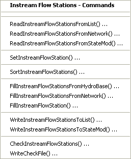
</p>**

**<p style="text-align: center;">
Commands / Instream Flow Data / Instream Flow Stations Menu (<a href="../Menu_Commands_StateMod_InstreamFlowStations.png">see also the full-size image</a>)
</p>**

The following table summarizes the use of each command:

**<p style="text-align: center;">
Instream Flow Station Commands
</p>**

| **Command**&nbsp;&nbsp;&nbsp;&nbsp;&nbsp;&nbsp;&nbsp;&nbsp;&nbsp;&nbsp;&nbsp;&nbsp;&nbsp;&nbsp;&nbsp;&nbsp;&nbsp;&nbsp;&nbsp;&nbsp;&nbsp;&nbsp;&nbsp;&nbsp;&nbsp;&nbsp;&nbsp;&nbsp;&nbsp;&nbsp;&nbsp;&nbsp;&nbsp;&nbsp;&nbsp;&nbsp;&nbsp;&nbsp;&nbsp;&nbsp;&nbsp;&nbsp;&nbsp;&nbsp;&nbsp;&nbsp;&nbsp;&nbsp;&nbsp;&nbsp;&nbsp;&nbsp;&nbsp;&nbsp;&nbsp;&nbsp;&nbsp;&nbsp;&nbsp;&nbsp;&nbsp;&nbsp;&nbsp;&nbsp;&nbsp;&nbsp;&nbsp;&nbsp;&nbsp;&nbsp;&nbsp;&nbsp; | **Description** |
| -- | -- |
| [`ReadInstreamFlowStationsFromList`](../command-ref/ReadInstreamFlowStationsFromList/ReadInstreamFlowStationsFromList.md) | Read from a delimited list file the list of instream flow stations to be included in the dataset. |
| [`ReadInstreamFlowStationsFromNetwork`](../command-ref/ReadInstreamFlowStationsFromNetwork/ReadInstreamFlowStationsFromNetwork.md) | Read from a StateMod network file a list of instream flow stations to be included in the dataset. |
| [`ReadInstreamFlowStationsFromStateMod`](../command-ref/ReadInstreamFlowStationsFromStateMod/ReadInstreamFlowStationsFromStateMod.md) | Read from a StateMod instream flow stations file the list of instream flow stations to be included in the dataset. |
| [`SetInstreamFlowStation`](../command-ref/SetInstreamFlowStation/SetInstreamFlowStation.md) | Set the data for, and optionally add, instream flow stations. |
| [`SortInstreamFlowStations`](../command-ref/SortInstreamFlowStations/SortInstreamFlowStations.md) | Sort the instream flow stations.  This is useful to force consistency between files. |
| [`FillInstreamFlowStationsFromHydroBase`](../command-ref/FillInstreamFlowStationsFromHydroBase/FillInstreamFlowStationsFromHydroBase.md) | Fill missing data for defined instream flow stations, using data from HydroBase.  For example, retrieve the station names. |
| [`FillInstreamFlowStationsFromNetwork`](../command-ref/FillInstreamFlowStationsFromNetwork/FillInstreamFlowStationsFromNetwork.md) | Fill missing data for defined instream flow stations, using data from a StateMod network file.  This is useful when the station names are not found in HydroBase and numerous [`SetInstreamFlowStation`](../command-ref/SetInstreamFlowStation/SetInstreamFlowStation.md) commands would otherwise be required. |
| [`FillInstreamFlowStation`](../command-ref/FillInstreamFlowStation/FillInstreamFlowStation.md) | Fill missing data for defined instream flow stations, user user-supplied values. |
| [`WriteInstreamFlowStationsToList`](../command-ref/WriteInstreamFlowStationsToList/WriteInstreamFlowStationsToList.md) | Write defined instream flow stations to a delimited file. |
| [`WriteInstreamFlowStationsToStateMod`](../command-ref/WriteInstreamFlowStationsToStateMod/WriteInstreamFlowStationsToStateMod.md) | Write defined instream flow stations to a StateMod file. |
| [`CheckInstreamFlowStations`](../command-ref/CheckInstreamFlowStations/CheckInstreamFlowStations.md) | Check instream flow stations data for problems. |
| [`WriteCheckFile`](../command-ref/WriteCheckFile/WriteCheckFile.md) | Write the results of data checks to a file. |

An example command file (from the Colorado `cm2005` dataset) to create the instream flow station file is shown below:

```
StartLog(LogFile="ifs.commands.StateDMI.log")
#
# Create the Colorad Instream Flow Stations file
#
#  Step 1 - read instream flow structures from network file, sort alphabetically.
#
ReadInstreamFlowStationsFromNetwork(InputFile="..\Network\cm2005.net")
SortInstreamFlowStations(Order=Ascending)
#
#  Step 2 - create file and set daily flags
#
SetInstreamFlowStation(ID="*",DailyID="0",DemandType=2)
#
#  Step 3 - set instream flow information for non-HB structures
#
# Following insf are reservoir bypasses
SetInstreamFlowStation(ID="953508",Name="Rifle_Gap_Res_Bypass",UpstreamRiverNodeID="953508",DownstreamRiverNodeID="953508_Dwn",OnOff=1,DailyID="0",DemandType=2,IfNotFound=Warn)
SetInstreamFlowStation(ID="953543",Name="Green_Mtn_Res_Bypass",UpstreamRiverNodeID="953543",DownstreamRiverNodeID="953543_Dwn",OnOff=1,DailyID="0",DemandType=2,IfNotFound=Warn)
SetInstreamFlowStation(ID="953668",Name="Wolford_Res_Bypass",UpstreamRiverNodeID="953668",DownstreamRiverNodeID="953668_Dwn",OnOff=1,DailyID="0",DemandType=2,IfNotFound=Warn)
SetInstreamFlowStation(ID="953695",Name="Shadow_Mtn_Res_Bypass",UpstreamRiverNodeID="953695",DownstreamRiverNodeID="953695_Dwn",OnOff=1,DailyID="0",DemandType=2,IfNotFound=Warn)
SetInstreamFlowStation(ID="953709",Name="Williams_Fork_Res_Bypass",UpstreamRiverNodeID="953709",DownstreamRiverNodeID="953709_Dwn",OnOff=1,DailyID="0",DemandType=2,IfNotFound=Warn)
SetInstreamFlowStation(ID="953710",Name="Willow_Crk_Res_Bypass",UpstreamRiverNodeID="953710",DownstreamRiverNodeID="953710_Dwn",OnOff=1,DailyID="0",DemandType=2,IfNotFound=Warn)
SetInstreamFlowStation(ID="953713",Name="Ruedi_Res_Bypass",UpstreamRiverNodeID="953713" DownstreamRiverNodeID="953713_Dwn",OnOff=1,DailyID="0",DemandType=2,IfNotFound=Warn)
SetInstreamFlowStation(ID="951146",Name="Wolcott_PP_Bypass",UpstreamRiverNodeID="951146",OnOff=1,DailyID="0",DemandType=2,IfNotFound=Warn)
# Following insf are minimum reservoir release requirements (operating rules control)
SetInstreamFlowStation(ID="954512",Name="Dillon_Res_Min_Rel",UpstreamRiverNodeID="954512",DownstreamRiverNodeID="954512_Dwn",OnOff=1,DailyID="0",DemandType=2,IfNotFound=Warn)
SetInstreamFlowStation(ID="954620",Name="Granby_Res_Min_Rel",UpstreamRiverNodeID="954620",DownstreamRiverNodeID="954620_Dwn",OnOff=1,DailyID="0",DemandType=1,IfNotFound=Warn)
# Following insf are Fraser collection system bypass requirements (Denver's Moffat)
SetInstreamFlowStation(ID="950639",Name="Jim_Creek_Bypass",UpstreamRiverNodeID="950639",DownstreamRiverNodeID="950639_Dwn",OnOff=1,DailyID="0",DemandType=2,IfNotFound=Warn)
SetInstreamFlowStation(ID="951269",Name="Den_Ranch_Crk_Bypass",UpstreamRiverNodeID="951269",DownstreamRiverNodeID="951269_Dwn",OnOff=1,DailyID="0",DemandType=2,IfNotFound=Warn)
SetInstreamFlowStation(ID="951309",Name="St_Louis_Crk_Bypass",UpstreamRiverNodeID="951309",DownstreamRiverNodeID="951309_Dwn",OnOff=1,DailyID="0",DemandType=2,IfNotFound=Warn)
SetInstreamFlowStation(ID="951310",Name="Vasquez_Crk_Bypass",UpstreamRiverNodeID="951310",DownstreamRiverNodeID="951310_Dwn",OnOff=1,DailyID="0",DemandType=2,IfNotFound=Warn)
# Following insf are minimum bypass for Williams Fork Diversion Project (Denver)
SetInstreamFlowStation(ID="954603",Name="Gumlick_Tunnel_Bypass",UpstreamRiverNodeID="954603",DownstreamRiverNodeID="954603_Dwn",OnOff=1,DailyID="0",DemandType=2,IfNotFound=Warn)
# Following insf are minimum bypass for Fry-Ark Project
SetInstreamFlowStation(ID="950786",Name="Thomasville_Gage_Bypass",UpstreamRiverNodeID="950786",DownstreamRiverNodeID="950786_Dwn",OnOff=1,DailyID="0",DemandType=2,IfNotFound=Warn)
SetInstreamFlowStation(ID="951594",Name="Hunter_Crk_Bypass",UpstreamRiverNodeID="951594",DownstreamRiverNodeID="951594_Dwn",OnOff=1,DailyID="0",DemandType=2,IfNotFound=Warn)
SetInstreamFlowStation(ID="954625",Name="Boustead_Tunnel_Bypass",UpstreamRiverNodeID="954625",DownstreamRiverNodeID="954625_Dwn",OnOff=1,DailyID="0",DemandType=2,IfNotFound=Warn)
# Following insf is minimum bypass below Homestake Tunnel (Col. Springs)
SetInstreamFlowStation(ID="954516",Name="Gold_Park_Gage_Min_Flow",UpstreamRiverNodeID="954516",DownstreamRiverNodeID="954516_Dwn",OnOff=1,DailyID="0",DemandType=2,IfNotFound=Warn)
# Following insf is minimum release for the Clinton Res. agreement
SetInstreamFlowStation(ID="954655",Name="Winter_Park_Ski_Min_Flow",UpstreamRiverNodeID="954655",DownstreamRiverNodeID="954655_Dwn",OnOff=1,DailyID="0",DemandType=2,IfNotFound=Warn)
# Insf node added above the Shoshone Power Plant to allow simulation of Green Mtn. Res.
# operations prior to 1985
SetInstreamFlowStation(ID="950500",Name="Shoshone_Call_Flows",UpstreamRiverNodeID="950500",DownstreamRiverNodeID="950500_Dwn",OnOff=1,DailyID="0",DemandType=1,IfNotFound=Warn)
# CWCB insf in 15-mile reach
SetInstreamFlowStation(ID="952002",Name="USFWS_Recomm._Fish_Flow",UpstreamRiverNodeID="952002",DownstreamRiverNodeID="952002_Dwn",OnOff=1,DailyID="0",DemandType=1,IfNotFound=Warn)
# GVWM Bypass
SetInstreamFlowStation(ID="950099",Name="GVWM_Bypass",UpstreamRiverNodeID="950099",OnOff=1,DailyID="0",DemandType=2,IfNotFound=Warn)
# Eagle River Minimum Flow Second Reach
SetInstreamFlowStation(ID="372059_2",Name="MIN_FLOW_EAGLE_RIVER_2",UpstreamRiverNodeID="372059_2",DownstreamRiverNodeID="372059_2_Dwn",OnOff=1,DailyID="0",DemandType=2,IfNotFound=Warn)
#
#  Step 4 - fill remaining instream flow information from HB and output file
#
FillInstreamFlowStationsFromHydroBase(ID="*")
WriteInstreamFlowStationsToStateMod(OutputFile="..\StateMod\cm2005.ifs",WriteHow=OverwriteFile)
#
# Check the results
CheckInstreamFlowStations(ID="*")
WriteCheckFile(OutputFile="ifs.commands.StateDMI.check.html")
```

### Instream Flow Rights ###

Instream flow rights correspond to the instream flow stations,
using the instream flow station identifier to relate the data.
Instream flow right identifiers are typically the reservoir right identifier followed by
`.NN`, where `NN` is a sequential number starting with `01`.
The ***Commands / Instream Flow Data / Instream Flow Rights*** menu
items insert commands to process instream flow rights data:

**<p style="text-align: center;">
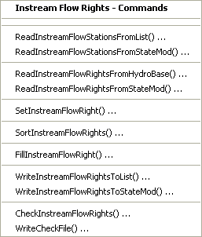
</p>**

**<p style="text-align: center;">
Commands / Instream Flow Data / Instream Flow Rights Menu (<a href="../Menu_Commands_StateMod_InstreamFlowRights.png">see also the full-size image</a>)
</p>**

The following table summarizes the use of each command:

**<p style="text-align: center;">
Instream Flow Rights Commands
</p>**

| **Command**&nbsp;&nbsp;&nbsp;&nbsp;&nbsp;&nbsp;&nbsp;&nbsp;&nbsp;&nbsp;&nbsp;&nbsp;&nbsp;&nbsp;&nbsp;&nbsp;&nbsp;&nbsp;&nbsp;&nbsp;&nbsp;&nbsp;&nbsp;&nbsp;&nbsp;&nbsp;&nbsp;&nbsp;&nbsp;&nbsp;&nbsp;&nbsp;&nbsp;&nbsp;&nbsp;&nbsp;&nbsp;&nbsp;&nbsp;&nbsp;&nbsp;&nbsp;&nbsp;&nbsp;&nbsp;&nbsp;&nbsp;&nbsp;&nbsp;&nbsp;&nbsp;&nbsp;&nbsp;&nbsp;&nbsp;&nbsp; | **Description** |
| -- | -- |
| [`ReadInstreamFlowStationsFromList`](../command-ref/ReadInstreamFlowStationsFromList/ReadInstreamFlowStationsFromList.md) | Read from a delimited file the list of instream flow stations to be included in the dataset – the list indicates the stations for which to process rights. |
| [`ReadInstreamFlowStationsFromStateMod`](../command-ref/ReadInstreamFlowStationsFromStateMod/ReadInstreamFlowStationsFromStateMod.md) | Read from a StateMod instream flow stations file the list of instream flow stations to be included in the dataset – the list indicates the stations for which to process rights. |
| [`ReadInstreamFlowRightsFromHydroBase`](../command-ref/ReadInstreamFlowRightsFromHydroBase/ReadInstreamFlowRightsFromHydroBase.md) | For each instream flow station, read the corresponding instream flow rights from HydroBase. |
| [`ReadInstreamFlowRightsFromStateMod`](../command-ref/ReadInstreamFlowRightsFromStateMod/ReadInstreamFlowRightsFromStateMod.md) | Read instream flow rights from a StateMod instream flow rights file. |
| [`SetInstreamFlowRight`](../command-ref/SetInstreamFlowRight/SetInstreamFlowRight.md) | Set the data for, and optionally add, instream flow rights. |
| [`SortInstreamFlowRights`](../command-ref/SortInstreamFlowRights/SortInstreamFlowRights.md) | Sort the instream flow stations.  This is useful to force consistency between files. |
| [`FillInstreamFlowRight`](../command-ref/FillInstreamFlowRight/FillInstreamFlowRight.md) | Fill missing data for defined instream flow rights, using user-supplied values. |
| [`WriteInstreamFlowRightsToList`](../command-ref/WriteInstreamFlowRightsToList/WriteInstreamFlowRightsToList.md) | Write instream flow rights to a delimited list file. |
| [`WriteInstreamFlowRightsToStateMod`](../command-ref/WriteInstreamFlowRightsToStateMod/WriteInstreamFlowRightsToStateMod.md) | Write instream flow rights to a StateMod file. |
| [`CheckInstreamFlowRights`](../command-ref/CheckInstreamFlowRights/CheckInstreamFlowRights.md) | Check instream flow rights data for problems. |
| [`WriteCheckFile`](../command-ref/WriteCheckFile/WriteCheckFile.md) | Write the results of data checks to a file. |

An example command file to create the instream flow rights file is shown below (from the Colorado `cm2005` dataset):

```
StartLog(LogFile="ifr.commands.StateDMI.log")
# ifr.commands.StateDMI
#
#  StateDMI command file to create the annual instream flow rights file for the
#           Colorado model Historical and Calibrated models
#
#  Step 1 - read instream flow structures from instream flow structure file
#
ReadInstreamFlowStationsFromStateMod(InputFile="..\STATEMOD\cm2005.ifs")
#
#  Step 2 - read instream flow rights from HydroBase
#
ReadInstreamFlowRightsFromHydroBase(ID="*",OnOffDefault=1)
#
#  Step 3 - set instream flow rights for non-HydroBase structures
#
# Following insf are reservoir bypasses
SetInstreamFlowRight(ID="953508.01",Name="Rifle_Gap_Res_Bypass",StationID="ID",AdministrationNumber=37503.36898,Decree=5.00,OnOff=1,IfNotFound=Add,IfFound=Warn)
SetInstreamFlowRight(ID="953543.01",Name="Green_Mtn_Res_Bypass",StationID="ID",AdministrationNumber=31257.99994,Decree=85.00,OnOff=1,IfNotFound=Add,IfFound=Warn)
SetInstreamFlowRight(ID="953668.01",Name="Wolford_Res_Bypass",StationID="ID",AdministrationNumber=50385.99999,Decree=13.00,OnOff=1,IfNotFound=Add,IfFound=Warn)
SetInstreamFlowRight(ID="953695.01",Name="Shadow_Mtn_Res_Bypass",StationID="ID",AdministrationNumber=31257.99999,Decree=50.00,OnOff=1,IfNotFound=Add,IfFound=Warn)
SetInstreamFlowRight(ID="953709.01",Name="Williams_Fork_Res_Bypass",StationID="ID",AdministrationNumber=31358.99999,Decree=15.00,OnOff=1,IfNotFound=Add,IfFound=Warn)
SetInstreamFlowRight(ID="953710.01",Name="Willow_Crk_Res_Bypass",StationID="ID",AdministrationNumber=31257.99999,Decree=7.00,OnOff=1,IfNotFound=Add,IfFound=Warn)
SetInstreamFlowRight(ID="953713.01",Name="Ruedi_Res_Bypass",StationID="ID",AdministrationNumber=39290.99999,Decree=110.00,OnOff=1,IfNotFound=Add,IfFound=Warn)
SetInstreamFlowRight(ID="951146.01",Name="Wolcott_PP_Bypass",StationID="ID",AdministrationNumber=42484.99999,Decree=110.00,OnOff=1,IfNotFound=Add,IfFound=Warn)
# Following insf are minimum reservoir release requirements (operating rules control)
SetInstreamFlowRight(ID="954512.01",Name="Dillon_Res_Min_Rel",StationID="ID",AdministrationNumber=31257.99997,Decree=50.00,OnOff=1,IfNotFound=Add,IfFound=Warn)
SetInstreamFlowRight(ID="954620.01",Name="Granby_Res_Min_Rel",StationID="ID",AdministrationNumber=31257.99999,Decree=75.00,OnOff=1,IfNotFound=Add,IfFound=Warn)
# Following insf are Fraser collection system bypass requirements (Denver's Moffat)
SetInstreamFlowRight(ID="950639.01",Name="Jim_Creek_Bypass",StationID="ID",AdministrationNumber=30870.26116,Decree=10.00,OnOff=1,IfNotFound=Add,IfFound=Warn)
SetInstreamFlowRight(ID="951269.01",Name="Den_Ranch_Crk_Bypass",StationID="ID",AdministrationNumber=30870.26116,Decree=4.00,OnOff=1,IfNotFound=Add,IfFound=Warn)
SetInstreamFlowRight(ID="951309.01",Name="St_Louis_Crk_Bypass",StationID="ID",AdministrationNumber=30870.26116,Decree=10.00,OnOff=1,IfNotFound=Add,IfFound=Warn)
SetInstreamFlowRight(ID="951310.01",Name="Vasquez_Crk_Bypass",StationID="ID",AdministrationNumber=30870.26116,Decree=8.00,OnOff=1,IfNotFound=Add,IfFound=Warn)
# Following insf are minimum bypass for Williams Fork Diversion Project (Denver)
SetInstreamFlowRight(ID="954603.01",Name="Gumlick_Tunnel_Bypass",StationID="ID",AdministrationNumber=30870.26116,Decree=1.00,OnOff=1,IfNotFound=Add,IfFound=Warn)
# Following insf are minimum bypass for Fry-Ark Project
SetInstreamFlowRight(ID="950786.01",Name="Thomasville_Gage_Bypass",StationID="ID",AdministrationNumber=39290.99999,Decree=200.00,OnOff=1,IfNotFound=Add,IfFound=Warn)
SetInstreamFlowRight(ID="951594.01",Name="Hunter_Crk_Bypass",StationID="ID",AdministrationNumber=39290.99999,Decree=21.00,OnOff=1,IfNotFound=Add,IfFound=Warn)
SetInstreamFlowRight(ID="954625.01",Name="Boustead_Tunnel_Bypass",StationID="ID",AdministrationNumber=39290.99999,Decree=30.00,OnOff=1,IfNotFound=Add,IfFound=Warn)
# Following insf is minimum bypass below Homestake Tunnel (Col. Springs)
SetInstreamFlowRight(ID="954516.01",Name="Gold_Park_Gage_Min_Flow",StationID="ID",AdministrationNumber=39650.37519,Decree=24.00,OnOff=1,IfNotFound=Add,IfFound=Warn)
# Following insf is minimum release for the Clinton Res. agreement
SetInstreamFlowRight(ID="954655.01",Name="Winter_Park_Ski_Min_Flow",StationID="ID",AdministrationNumber=30870.26116,Decree=3.90,OnOff=1,IfNotFound=Add,IfFound=Warn)
# Insf node added above the Shoshone Power Plant to allow simulation of Green Mtn. Res. operations prior to 1985
SetInstreamFlowRight(ID="950500.01",Name="Shoshone_Call_Flows",StationID="ID",AdministrationNumber=99999.80000,Decree=1250.00,OnOff=1,IfNotFound=Add,IfFound=Warn)
# CWCB insf in 15-mile reach
SetInstreamFlowRight(ID="952002.01",Name="USFWS_Recomm._Fish_Flow",StationID="ID",AdministrationNumber=99999.92000,Decree=16000.00,OnOff=1,IfNotFound=Add,IfFound=Warn)
# GVWM Bypass
SetInstreamFlowRight(ID="950099.01",Name="GVWM_Bypass",StationID="ID",AdministrationNumber=99999.00000,Decree=0.00,OnOff=1,IfNotFound=Add,IfFound=Warn)
# Eagle River Minimum Flow Second Reach
SetInstreamFlowRight(ID="372059_2.01",Name="MIN_FLOW_EAGLE_RIVER_2",StationID="ID",AdministrationNumber=47558.00000,Decree=155.00,OnOff=1,IfNotFound=Add,IfFound=Warn)
#
#  Step 4 - create output file
#
WriteInstreamFlowRightsToStateMod(OutputFile="..\STATEMOD\cm2005.ifr")
#
# Check the results
CheckInstreamFlowRights(ID="*")
WriteCheckFile(OutputFile="ifr.commands.StateDMI.check.html")
```

### Instream Flow Demand Time Series (Average Monthly) ###

Instream flow demand time series correspond to the instream flow stations,
using the instream flow station identifier as a key.
Instream flow demand time series (average monthly) are typically generated from instream flow water rights.
When read from HydroBase, these time series currently have the same value for
each month of the year (although future enhancements may support seasonal right values in HydroBase).

The ***Commands / Instream Flow Data / Instream Flow Demands (Average Monthly)***
menu items insert commands to process instream flow demand time series (average monthly):

**<p style="text-align: center;">
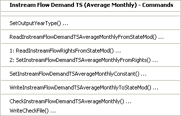
</p>**

**<p style="text-align: center;">
Commands / Instream Flow Data / Instream Flow Demand TS (Average Monthly)  Menu (<a href="../Menu_Commands_StateMod_InstreamFlowDemandTSAverageMonthly.png">see also the full-size image</a>)
</p>**

The following table summarizes the use of each command:

**<p style="text-align: center;">
Instream Flow Demands (Average Monthly) Commands
</p>**

| **Command**&nbsp;&nbsp;&nbsp;&nbsp;&nbsp;&nbsp;&nbsp;&nbsp;&nbsp;&nbsp;&nbsp;&nbsp;&nbsp;&nbsp;&nbsp;&nbsp;&nbsp;&nbsp;&nbsp;&nbsp;&nbsp;&nbsp;&nbsp;&nbsp;&nbsp;&nbsp;&nbsp;&nbsp;&nbsp;&nbsp;&nbsp;&nbsp;&nbsp;&nbsp;&nbsp;&nbsp;&nbsp;&nbsp;&nbsp;&nbsp;&nbsp;&nbsp;&nbsp;&nbsp;&nbsp;&nbsp;&nbsp;&nbsp;&nbsp;&nbsp;&nbsp;&nbsp;&nbsp;&nbsp;&nbsp;&nbsp;&nbsp;&nbsp;&nbsp;&nbsp;&nbsp;&nbsp;&nbsp;&nbsp;&nbsp;&nbsp;&nbsp;&nbsp;&nbsp;&nbsp;&nbsp;&nbsp;&nbsp;&nbsp;&nbsp;&nbsp;&nbsp;&nbsp;&nbsp;&nbsp;&nbsp;&nbsp;&nbsp;&nbsp;&nbsp;&nbsp;&nbsp;&nbsp; | **Description** |
| -- | -- |
| [`SetOutputYearType`](../command-ref/SetOutputYearType/SetOutputYearType.md) | Set the output year type for time series.  This should correspond to the model dataset year type and ensures that time series data are in the proper order.  Omitting this information may result in missing data in the output. |
| [`ReadInstreamFlowDemandTSAverageMonthylyFromStateMod`](../command-ref/ReadInstreamFlowDemandTSAverageMonthylyFromStateMod/ReadInstreamFlowDemandTSAverageMonthylyFromStateMod.md) | Read the instream flow demand average monthly time series from a StateMod file (if reading and manipulating). |
| [`ReadInstreamFlowRightsFromStateMod`](../command-ref/ReadInstreamFlowRightsFromStateMod/ReadInstreamFlowRightsFromStateMod.md) | Read instream flow rights from a StateMod instream flow rights file. |
| [`SetInstreamFlowDemandTSAverageMonthlyFromRights`](../command-ref/SetInstreamFlowDemandTSAverageMonthlyFromRights/SetInstreamFlowDemandTSAverageMonthlyFromRights.md) | For the specified instream flow water right(s), create a demand time series (average monthly). |
| [`SetInstreamFlowDemandTSAverageMonthlyConstant`](../command-ref/SetInstreamFlowDemandTSAverageMonthlyConstant/SetInstreamFlowDemandTSAverageMonthlyConstant.md) | For the specified instream flow location, create a demand time series (average monthly) that is a constant value monthly pattern (twelve values). |
| [`WriteInstreamFlowDemandTSAverageMonthlyToStateMod`](../command-ref/WriteInstreamFlowDemandTSAverageMonthlyToStateMod/WriteInstreamFlowDemandTSAverageMonthlyToStateMod.md) | Write defined instream flow demand time series (average monthly) to a StateMod file. |
| [`CheckInstreamFlowDemandTSAverageMonthly`](../command-ref/CheckInstreamFlowDemandTSAverageMonthly/CheckInstreamFlowDemandTSAverageMonthly.md) | Check instream flow demand time series (average monthy) data for problems. |
| [`WriteCheckFile`](../command-ref/WriteCheckFile/WriteCheckFile.md) | Write the results of data checks to a file. |

An example command file to create the instream flow demand time series (average monthly) file is shown below (from the Colorado `cm2005` dataset):

```
StartLog(LogFile="ifa.commands.StateDMI.log")
# ifa.commands.StateDMI
#
#  StateDMI command file to create the annual instream flow demand file for the Colorado model
#
SetOutputYearType(OutputYearType=Water)
#
#  Structures and total demands (rights) are defined in the instream flow rights file
#
ReadInstreamFlowRightsFromStateMod(InputFile="..\StateMod\cm2005.ifr")
#
#  Step 1 - Set monthly instream flow demand to water rights for structures that are of
#           DemandType = 2 (*.dds)
#
SetInstreamFlowDemandTSAverageMonthlyFromRights(ID="3*",IfNotFound=Add)
SetInstreamFlowDemandTSAverageMonthlyFromRights(ID="5*",IfNotFound=Add)
SetInstreamFlowDemandTSAverageMonthlyFromRights(ID="7*",IfNotFound=Add)
SetInstreamFlowDemandTSAverageMonthlyFromRights(ID="9500*",IfNotFound=Add)
SetInstreamFlowDemandTSAverageMonthlyFromRights(ID="9506*",IfNotFound=Add)
SetInstreamFlowDemandTSAverageMonthlyFromRights(ID="9507*",IfNotFound=Add)
SetInstreamFlowDemandTSAverageMonthlyFromRights(ID="951*",IfNotFound=Add)
SetInstreamFlowDemandTSAverageMonthlyFromRights(ID="9535*",IfNotFound=Add)
SetInstreamFlowDemandTSAverageMonthlyFromRights(ID="9536*",IfNotFound=Add)
SetInstreamFlowDemandTSAverageMonthlyFromRights(ID="9537*",IfNotFound=Add)
SetInstreamFlowDemandTSAverageMonthlyFromRights(ID="9545*",IfNotFound=Add)
SetInstreamFlowDemandTSAverageMonthlyFromRights(ID="954603",IfNotFound=Add)
SetInstreamFlowDemandTSAverageMonthlyFromRights(ID="954625",IfNotFound=Add)
SetInstreamFlowDemandTSAverageMonthlyFromRights(ID="954655",IfNotFound=Add)
#
#
#	StateDMI expects monthly values to be entered in Calendar Year.
#
#  Step 2 - Set monthly instream flow demands that vary by month
#
SetInstreamFlowDemandTSAverageMonthlyConstant(ID="362000",MonthValues="3.00,3.00,3.00,3.00,6.00,6.00,6.00,6.00,6.00,3.00,3.00,3.00",IfNotFound=Add)
SetInstreamFlowDemandTSAverageMonthlyConstant(ID="362012",MonthValues="3.00,3.00,3.00,3.00,7.00,7.00,7.00,7.00,7.00,3.00,3.00,3.00",IfNotFound=Add)
SetInstreamFlowDemandTSAverageMonthlyConstant(ID="362030",MonthValues="10.00,10.00,10.00,10.00,20.00,20.00,20.00,20.00,20.00,20.00,10.00,10.00",IfNotFound=Add)
SetInstreamFlowDemandTSAverageMonthlyConstant(ID="362033",MonthValues="6.00,6.00,6.00,6.00,12.00,12.00,12.00,12.00,12.00,6.00,6.00,6.00",IfNotFound=Add)
SetInstreamFlowDemandTSAverageMonthlyConstant(ID="362037",MonthValues="16.00,16.00,16.00,16.00,32.00,32.00,32.00,32.00,32.00,32.00,16.00,16.00",IfNotFound=Add)
...similar commands omitted...
#
#  Step 3 - Create StateMod file
#
WriteInstreamFlowDemandTSAverageMonthlyToStateMod(OutputFile="..\StateMod\cm2005.ifa")
#
# Check the results
CheckInstreamFlowDemandTSAverageMonthly(ID="*")
WriteCheckFile(OutputFile="ifa.commands.StateDMI.check.html")
```

### Instream Flow Demand Time Series (Monthly, Daily) ###

StateDMI does not process monthly or daily instream flow demand time series.
In most cases, the average monthly time series described in the previous section are sufficient.
To create complete monthly or daily time series, use TSTool, a spreadsheet,
or other software to prepare the time series file.

## Well Data ##

Wells can be used to supply water to irrigated lands and municipal/industrial (M&I) demands (similar to diversions).
However, in most cases, StateMod modeling and StateDMI focuses on agricultural wells.
For agriculture, wells can be the only source of supply or can supplement surface water supply from diversion stations.
Well features were added to the StateMod model after diversions;
consequently, much of the processing for wells is similar to diversions.

Well stations that supplement diversion stations are often determined through GIS,
where the service area for the diversion station is intersected with well locations.
Well stations that fall within a service area, or are within a reasonable distance,
are associated with the ditch service area.
However, at a more fundamental level, diversion and well stations in CDSS are associated with irrigated parcels.
The parcel data and its supply relationship from diversions and wells
are then stored in HydroBase and can be processed by StateDMI.
Because a service area will typically contain multiple wells,
the wells in the StateMod well station file are typically aggregated and given
an identifier that matches the diversion station.
The diversion station is then indicated as a D&W (diversion and well) node in the model network.
In general a “well station” in the StateMod well station file is not actually a
single hole in the ground, but is a group of physical wells that serve an area.

Well station data consists of:

* Well stations (will be associated with a diversion station if the well supplements the diversion station)
* Well rights
* Historical pumping time series (monthly, daily)
* Demand time series (monthly, daily)
* Irrigation practice time series (yearly)
* Consumptive water requirement time series (monthly, daily)
* Soil moisture time series (yearly)

Each of the above data types is stored in a separate file,
using the well station identifier as the primary identifier.
The processing of each data file is discussed below, with background on specific issues.

### Well Stations ###

Each well station used with StateMod can be one of the following types:

1. **Explicit well**, where the no aggregation occurs – this type is used for key
structures that need to be explicitly modeled.
For example, this type of well station may be appropriate for a large municipal supply well.
This type of well does not supplement a diversion station and therefore will
have a unique identifier that is represented in the model network.
The well station identifier is usually a 7-character water district
identifier or fabricated identifier that starts with the water district number.
2. **Well system**, where the characteristics (capacity, historical diversion, demand)
of multiple wells are summed at one location and water rights are modeled
explicitly – this type is used when related well structures operate as a system (e.g., a well field).
Only the well system identifier is included in the model network and this
identifier should be different from the parts in the collection.
Well systems should be defined using the `SetWellSystem*` commands and need to be
defined when processing all well station files (if well systems are used).
Well systems can be one of the following types:
	* Well-only supply (does not supplement diversions).
	The naming convention for modeling in RGDSS is to use groundwater unit
	response function zones (URF); however,
	aggregating wells by basin or some other logical grouping as appropriate.
	* Well systems that supplement a diversion station’s supply.
	In this case the identifier for the well should be the same as the diversion station,
	the well station should indicate the diversion station identifier in the well station file,
	and the diversion station should be represented in the network as a D&W node.
	Because relationships between wells and diversion stations occur via parcels in HydroBase,
	the diversion station systems should be defined
	(and the wells associated with each diversion station will consequently be treated as a system).
3. **Well aggregate**, which is the same as a well system except that water rights are aggregated into classes.
Aggregation of the water rights typically occurs at the end of the
command file with an
[`AggregateWellRights`](../command-ref/AggregateWellRights/AggregateWellRights.md) command.
Aggregates should be defined using the `SetWellAggregate*` commands.

Because the number of wells can be very large, well stations often
are grouped by whether they supplement surface water supply
(in which case the well is associated with a diversion via its service area)
or are the only source of supply for irrigated lands (in which case the well is associated with one or more parcels).
Processing the data then involves interpreting relationships between parcels,
wells (holes in the ground), and diversion stations,
in order to lump wells into a model station that represents the total groundwater supply in an area.

The well stations file may be updated several times, as follows:

1. Initial creation (see this section).
2. Adjust well station capacities based on historical well pumping
(see the [Well Historical Pumping Time Series (Monthly)](#well-historical-pumping-time-series-monthly) section).
3. Adjust well monthly efficiencies based on estimates from consumptive water requirement
(see the [Well Demand Time Series (Monthly)](#well-demand-time-series-monthly) section).

If a list of well stations is determined initially,
the secondary files can be processed first and then the well stations file can be fully created with one command file.

The ***Commands / Well Data / Well Stations*** menus insert commands to process well station data:

**<p style="text-align: center;">
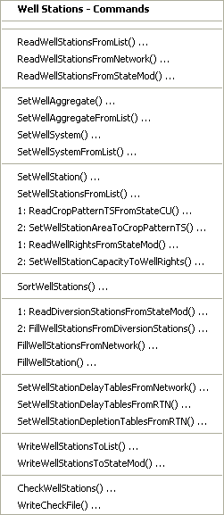
</p>**

**<p style="text-align: center;">
Commands / Well Station Data / Well Stations Menu (<a href="../Menu_Commands_StateMod_WellStations.png">see also the full-size image</a>)
</p>**

The following table summarizes the use of each command:

**<p style="text-align: center;">
Well Stations Commands
</p>**

| **Command**&nbsp;&nbsp;&nbsp;&nbsp;&nbsp;&nbsp;&nbsp;&nbsp;&nbsp;&nbsp;&nbsp;&nbsp;&nbsp;&nbsp;&nbsp;&nbsp;&nbsp;&nbsp;&nbsp;&nbsp;&nbsp;&nbsp;&nbsp;&nbsp;&nbsp;&nbsp;&nbsp;&nbsp;&nbsp;&nbsp;&nbsp;&nbsp;&nbsp;&nbsp;&nbsp;&nbsp;&nbsp;&nbsp;&nbsp;&nbsp;&nbsp;&nbsp;&nbsp;&nbsp;&nbsp;&nbsp;&nbsp;&nbsp;&nbsp;&nbsp;&nbsp;&nbsp;&nbsp;&nbsp;&nbsp;&nbsp;&nbsp;&nbsp; | **Description** |
| -- | -- |
| [`ReadWellStationsFromList`](../command-ref/ReadWellStationsFromList/ReadWellStationsFromList.md) | Read from a delimited list file the list of well stations to be included in the dataset. |
| [`ReadWellStationsFromNetwork`](../command-ref/ReadWellStationsFromNetwork/ReadWellStationsFromNetwork.md) | Read from a StateMod network file a list of well stations to be included in the dataset. |
| [`ReadWellStationsFromStateMod`](../command-ref/ReadWellStationsFromStateMod/ReadWellStationsFromStateMod.md) | Read from a StateMod diversion stations file the list of well stations to be included in the dataset. |
| [`SetWellAggregate`](../command-ref/SetWellAggregate/SetWellAggregate.md) | Specify that a well station is an aggregate and define its parts. |
| [`SetWellAggregateFromList`](../command-ref/SetWellAggregateFromList/SetWellAggregateFromList.md) | Specify that one or more well stations are aggregates and define their parts, using a delimited list file. |
| [`SetWellSystem`](../command-ref/SetWellSystem/SetWellSystem.md) | Specify that a well station is a system and define its parts. |
| [`SetWellSystemFromList`](../command-ref/SetWellSystemFromList/SetWellSystemFromList.md) | Specify that one or more well stations are systems and define their parts, using a delimited list file. |
| [`SetWellStation`](../command-ref/SetWellStation/SetWellStation.md) | Set the data for, and optionally add, well stations. |
| [`SetWellStationsFromList`](../command-ref/SetWellStationsFromList/SetWellStationsFromList.md) | Set well station data from a list file. |
| [`ReadCropPatternTSFromStateCU`](../command-ref/ReadCropPatternTSFromStateCU/ReadCropPatternTSFromStateCU.md) | Read the crop pattern time series file, for use by the [`SetWellStationAreaToCropPatternTS`](../command-ref/SetWellStationAreaToCropPatternTS/SetWellStationAreaToCropPatternTS.md) command. |
| [`SetWellStationAreaToCropPatternTS`](../command-ref/SetWellStationAreaToCropPatternTS/SetWellStationAreaToCropPatternTS.md) | Set the well station area data to the maximum area value from the crop pattern time series (see previous command to read the rights). |
| [`ReadWellRightsFromStateMod`](../command-ref/ReadWellRightsFromStateMod/ReadWellRightsFromStateMod.md) | Read the well rights file, for use by the [`SetWellStationCapacityToWellRights`](../command-ref/SetWellStationCapacityToWellRights/SetWellStationCapacityToWellRights.md) command. |
| [`SetWellStationCapacityToWellRights`](../command-ref/SetWellStationCapacityToWellRights/SetWellStationCapacityToWellRights.md) | Set the well station capacity to the sum of the well rights for the station (see the previous command to read the rights). |
| [`SortWellStations`](../command-ref/SortWellStations/SortWellStations.md) | Sort the well stations.  This is useful to force consistency between files. |
| [`ReadDiversionStationsFromStateMod`](../command-ref/ReadDiversionStationsFromStateMod/ReadDiversionStationsFromStateMod.md) | Read the diversion stations data, to fill well station data using [`FillWellStationsFromDiversionStations`](../command-ref/FillWellStationsFromDiversionStations/FillWellStationsFromDiversionStations.md). |
| [`FillWellStationsFromDiversionStations`](../command-ref/FillWellStationsFromDiversionStations/FillWellStationsFromDiversionStations.md) | Fill well stations from diversion stations (see the previous command to read the diversion stations). |
| [`FillWellStationsFromNetwork`](../command-ref/FillWellStationsFromNetwork/FillWellStationsFromNetwork.md) | Fill missing data for defined well stations, using data from the network.  For example, retrieve the well names, and capacities. |
| [`FillWellStation`](../command-ref/FillWellStation/FillWellStation.md) | Fill missing data for defined well stations, using user-supplied values. |
| [`SetWellStationDelayTablesFromNetwork`](../command-ref/SetWellStationDelayTablesFromNetwork/SetWellStationDelayTablesFromNetwork.md) | Set default delay table information using network relationships. |
| [`SetWellStationDelayTablesFromRTN`](../command-ref/SetWellStationDelayTablesFromRTN/SetWellStationDelayTablesFromRTN.md) | Set delay table information using information in a return flow format file. |
| [`SetWellStationDepletionTablesFromRTN`](../command-ref/SetWellStationDepletionTablesFromRTN/SetWellStationDepletionTablesFromRTN.md) | Set depletion table information using information in a return flow format file. |
| [`WriteWellStationsToList`](../command-ref/WriteWellStationsToList/WriteWellStationsToList.md) | Write the well stations to a list file. |
| [`WriteWellStationsToStateMod`](../command-ref/WriteWellStationsToStateMod/WriteWellStationsToStateMod.md) | Write defined well stations to a StateMod file. |
| [`CheckWellStations`](../command-ref/CheckWellStations/CheckWellStations.md) | Check well station data for problems. |
| [`WriteCheckFile`](../command-ref/WriteCheckFile/WriteCheckFile.md) | Write the results of data checks to a file. |

An initial well station list is typically created from the network.
The list is then used to create other files, including water rights and time series.
Finally, the completed files can be read and summarized in the well station file, to update the following:

* capacity
* default monthly efficiencies
* acreage
* use and demand type
* delay and depletion tables

In the future, some data are expected to be split out of the well station file,
to minimize updating the station file.

An example command file to create the initial well station file is
shown below (from the preliminary South Platte `Sp2008L` dataset).

```
#
#
# Wells_WES.StateDMI
#
# _________________________________________________________
StartLog(LogFile="Sp2008L_WES.log")
#
# _________________________________________________________
# Step 1 - Set the output period, used to compute averages...
SetOutputPeriod(OutputStart="1950-01",OutputEnd="2006-12")
#
# _________________________________________________________
#  Step 2 - Read the list of well stations (all diversions + all well only)
ReadWellStationsFromList(ListFile="..\Network\sp2008L_Wells.csv",IDCol=1,NameCol=2,DiversionIDCol=8)
#
# ---------------------------------------------------------
#  Step 2b - Read Aug and recharge well list (currently not in network, assigned to aug station ID)
# readWellStationsFromList(ListFile="sp2008L_AugRchWells.csv",IDCol="1",NameCol="2",DiversionIDCol="8")
#
# _________________________________________________________
# Step 3 - Read diversion station information.  This allows some diversion data to
# be transferred to wells (e.g., demand source) and provides memory for
# aggregate/system information.
ReadDiversionStationsFromList(ListFile="..\Network\Sp2008L_Diversion.csv",IDCol=1,NameCol=2)
#
# _________________________________________________________
# Step 4 - Set Well aggregates (GW Only lands)
SetWellSystemFromList(ListFile="1956_01_GW.csv",Year=1956,Div=1,PartType=Parcel,IDCol=1,PartIDsCol=2,PartsListedHow=InColumn)
SetWellSystemFromList(ListFile="1976_01_GW.csv",Year=1976,Div=1,PartType=Parcel,IDCol=1,PartIDsCol=2,PartsListedHow=InColumn)
SetWellSystemFromList(ListFile="1987_01_GW.csv",Year=1987,Div=1,PartType=Parcel,IDCol=1,PartIDsCol=2,PartsListedHow=InColumn)
SetWellSystemFromList(ListFile="2001_01_GW.csv",Year=2001,Div=1,PartType=Parcel,IDCol=1,PartIDsCol=2,PartsListedHow=InColumn)
#
# _________________________________________________________
# Step 5 - Set Diversion _IRR aggregates...
SetWellAggregateFromList(ListFile="..\Sp2008L_SwAgg.csv",Year=2001,Div=1,PartType=Ditch,IDCol=1,PartIDsCol=3,PartsListedHow=InRow)
#
# _________________________________________________________
# Step 6 - Set Diversion Systems
SetWellSystemFromList(ListFile="..\Sp2008L_DivSys_DDH.csv",Year=2001,Div=1,PartType=Ditch,IDCol=1,PartIDsCol=3,PartsListedHow=InRow)
#
# _________________________________________________________
# Step 7 - Set Diversion ID For D&W wells
# _________________________________________________________
# Step 8 -**** Get capacity from well right file
FillWellStation(ID="*")
#
# _________________________________________________________
# Step 9 - rrb 2007/10/10; Added commands to set well area to data in *.cds
ReadCropPatternTSFromStateCU(InputFile="..\Crops\Sp2008L.cds")
SetWellStationAreaToCropPatternTS(ID="*")
# _________________________________________________________
# Step 10 - Fill remaining missing data in well stations...
FillWellStation(ID="*",RiverNodeID="ID",Capacity=999,DailyID="4",AdminNumShift=0,DemandType=1,UseType=1,DemandSource=1,EffAnnual=60)
#
# _________________________________________________________
# Step 11 - Set delay and depletion data
SetWellStationDelayTablesFromRTN(InputFile="..\DelaySW\sp2008L_Sw.rtn",SetEfficiency=False)
SetWellStationDepletionTablesFromRTN(InputFile="..\DelaySW\sp2008L_Gw.rtn")
#
# Include Aug & Recharge wells
# _________________________________________________________
# Step 12 - rrb 2007/11/16 Read Well rights from a StateMod well right file
ReadWellRightsFromStateMod(InputFile="..\Wells\Sp2008L.wer")
# _________________________________________________________
# Step 13 - rrb 2007/10/03 Set capacity to total of water rights
SetWellStationCapacityToWellRights(ID="*")
# _______________________________________________________
#
#        SmOpr
#        State of Colorado
#        Version:  1.00
#        Last revision date: 2006/10/27
# _______________________________________________________
SetWellStation(ID="0102522_AuW ",Name="RIVERSIDE Aug Well      ",RiverNodeID="0102522_AuW ",Capacity=999.,DailyID="4",AdminNumShift=0,DiversionID="NA",DemandType=1,IrrigatedAcres=0.0,UseType=5,DemandSource=8,EffAnnual=100.0,Returns="06759910,100.0,1",Depletions="06759910,100.0,2",IfNotFound=Add)
SetWellStation(ID="0102528_AuW ",Name="FT Aug Well             ",RiverNodeID="0102528_AuW ",Capacity=999.,DailyID="4",AdminNumShift=0,DiversionID="NA",DemandType=1,IrrigatedAcres=0.0,UseType=5,DemandSource=8,EffAnnual=100.0,Returns="06759910,100.0,1",Depletions="06759910,100.0,2",IfNotFound=Add)
SetWellStation(ID="0102529_AuW ",Name="UPPER Aug Well          ",RiverNodeID="0102529_AuW ",Capacity=999.,DailyID="4",AdminNumShift=0,DiversionID="NA",DemandType=1,IrrigatedAcres=0.0,UseType=5,DemandSource=8,EffAnnual=100.0,Returns="06759910,100.0,1",Depletions="06759910,100.0,2",IfNotFound=Add)
...similar commands omitted...
# _______________________________________________________
#
# rrb add Alternate Point wells SmAltP
# _______________________________________________________
SetWellStation(ID="0102520_AlP ",Name="Alternate Point         ",Capacity= 999.,EffAnnual=100.0,IfNotFound=Add)
SetWellStation(ID="0102524_AlP ",Name="Alternate Point         ",Capacity= 999.,EffAnnual=100.0,IfNotFound=Add)
...similar commands omitted...
# _________________________________________________________
SortWellStations(Order=Ascending)
# Step 14 - Write the updated stations with estimated efficiencies to the StateMod file...
WriteWellStationsToStateMod(OutputFile="Sp2008L.wes")
WriteWellStationsToStateMod(OutputFile="..\StateMod\Historic\Sp2008L.wes")
#
# Check well stations
CheckWellStations(ID="*")
WriteCheckFile(OutputFile="Sp2008L_WES.StateDMI.check.html")
```

### Well Rights ###

Well rights correspond to the well stations, using the well station identifier to relate the data.
Well right identifiers are typically the HydroBase identifier if modeling all rights explicitly.
For Rio Grande modeling, right identifiers used the convention of well station identifier followed by
`W.NN`, where `W` indicates well right (to avoid conflict with diversion rights that would otherwise have the same identifier),
and `NN` is a sequential number starting with `01`.
Rights for well aggregate stations have rights corresponding to water right classes.

The ***Commands / Well Data / Well Rights*** menu items insert commands to process well rights data:

**<p style="text-align: center;">
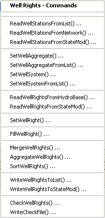
</p>**

**<p style="text-align: center;">
Commands / Well Station Data / Well Rights Menu (<a href="../Menu_Commands_StateMod_WellRights.png">see also the full-size image</a>)
</p>**

The following table summarizes the use of each command.
Note that well right aggregation (if aggregate well stations are used) occurs after other processing.

**<p style="text-align: center;">
Well Rights Commands
</p>**

| **Command**&nbsp;&nbsp;&nbsp;&nbsp;&nbsp;&nbsp;&nbsp;&nbsp;&nbsp;&nbsp;&nbsp;&nbsp;&nbsp;&nbsp;&nbsp;&nbsp;&nbsp;&nbsp;&nbsp;&nbsp;&nbsp;&nbsp;&nbsp;&nbsp;&nbsp;&nbsp;&nbsp;&nbsp;&nbsp;&nbsp;&nbsp;&nbsp;&nbsp;&nbsp;&nbsp;&nbsp;&nbsp;&nbsp;&nbsp;&nbsp; | **Description** |
| -- | -- |
| [`ReadWellStationsFromList`](../command-ref/ReadWellStationsFromList/ReadWellStationsFromList.md) | Read from a delimited file the list of well stations to be included in the dataset – the list indicates the stations for which to process rights. |
| [`ReadWellStationsFromNetwork`](../command-ref/ReadWellStationsFromNetwork/ReadWellStationsFromNetwork.md) | Read from the network the list of well stations to be included in the dataset – the list indicates the stations for which to process rights. |
| [`ReadWellStationsFromStateMod`](../command-ref/ReadWellStationsFromStateMod/ReadWellStationsFromStateMod.md) | Read from a StateMod well stations file the list of well stations to be included in the dataset – the list indicates the stations for which to process rights. |
| [`SetWellAggregate`](../command-ref/SetWellAggregate/SetWellAggregate.md) | Specify that a well station is an aggregate and define its parts. |
| [`SetWellAggregateFromList`](../command-ref/SetWellAggregateFromList/SetWellAggregateFromList.md) | Specify that one or more well stations are aggregates and define their parts, using a delimited list file. |
| [`SetWellSystem`](../command-ref/SetWellSystem/SetWellSystem.md) | Specify that a well station is a system and define its parts. |
| [`SetWellSystemFromList`](../command-ref/SetWellSystemFromList/SetWellSystemFromList.md) | Specify that one or more well stations are systems and define their parts, using a delimited list file. |
| [`ReadWellRightsFromHydroBase`](../command-ref/ReadWellRightsFromHydroBase/ReadWellRightsFromHydroBase.md) | For each well station, read the corresponding well rights from HydroBase. |
| [`ReadWellRightsFromStateMod`](../command-ref/ReadWellRightsFromStateMod/ReadWellRightsFromStateMod.md) | Read well rights from a StateMod well rights file. |
| [`SetWellRight`](../command-ref/SetWellRight/SetWellRight.md) | Set the data for, and optionally add, well rights. |
| [`FillWellRight`](../command-ref/FillWellRight/FillWellRight.md) | Fill missing data for defined well rights, using user-supplied values. |
| [`MergeWellRights`](../command-ref/MergeWellRights/MergeWellRights.md) | Merge well rights determined from multiple years of irrigated lands parcel data in HydroBase.  This is necessary to avoid double-counting rights.  Well/parcel matching data are unique to each year of parcel data. |
| [`AggregateWellRights`](../command-ref/AggregateWellRights/AggregateWellRights.md) | Aggregate well rights.  This is used in some datasets to reduce the number of well rights, which decreases model run time and simplifies output. |
| [`SortWellRights`](../command-ref/SortWellRights/SortWellRights.md) | Sort the well rights.  This is useful to force consistency between files. |
| [`WriteWellRightsToList`](../command-ref/WriteWellRightsToList/WriteWellRightsToList.md) | Write well rights to a list file. |
| [`WriteWellRightsToStateMod`](../command-ref/WriteWellRightsToStateMod/WriteWellRightsToStateMod.md) | Write well rights to a StateMod file. |
| [`CheckWellRights`](../command-ref/CheckWellRights/CheckWellRights.md) | Check well right data for problems. |
| [`WriteCheckFile`](../command-ref/WriteCheckFile/WriteCheckFile.md) | Write the results of data checks to a file. |

An example command file to create the well rights file is shown below (from preliminary South Platte `Sp2008L` dataset):

```
#
# Sp2008L_WER.StateDMI
#
# rrb 2009/06/09; Revised to read 2005 data and recognize Aug and Recharge wells are in the network
# _________________________________________________________
# Well Rights File (*.wer)
#
StartLog(LogFile="Sp2008L_WER.log")
#
# _________________________________________________________
# Step 1 - Read all structures
#
ReadWellStationsFromNetwork(InputFile="..\Network\Sp2008L.net")
SortWellStations()
#
# ---------------------------------------------------------
#
# _________________________________________________________
# Step 2 - define diversion and d&w aggregates and demand systems
SetWellAggregateFromList(ListFile="..\Sp2008L_SWAgg.csv",PartType=Ditch,IDCol=1,NameCol=2,PartIDsCol=3,PartsListedHow=InColumn,IfNotFound=Warn)
SetWellSystemFromList(ListFile="..\Sp2008L_DivSys_DDH.csv",PartType=Ditch,IDCol=1,NameCol=2,PartIDsCol=3,PartsListedHow=InRow,IfNotFound=Warn)
#
SetWellAggregateFromList(ListFile="Sp2008L_AugRchWell_Aggregates.csv",PartType=Well,IDCol=1,PartIDsCol=2,PartsListedHow=InRow)
#
# _________________________________________________________
# Step 3- Set Well aggregates (GW Only lands)
# rrb Same as provided by LRE as Sp_GWAgg_xxxx.csv except non WD 01 and 64 removed
SetWellSystemFromList(ListFile="..\Sp2008L_GWAgg_1956.csv",Year=1956,Div=1,PartType=Parcel,IDCol=1,PartIDsCol=2,PartsListedHow=InColumn)
SetWellSystemFromList(ListFile="..\Sp2008L_GWAgg_1976.csv",Year=1976,Div=1,PartType=Parcel,IDCol=1,PartIDsCol=2,PartsListedHow=InColumn)
SetWellSystemFromList(ListFile="..\Sp2008L_GWAgg_1987.csv",Year=1987,Div=1,PartType=Parcel,IDCol=1,PartIDsCol=2,PartsListedHow=InColumn)
SetWellSystemFromList(ListFile="..\Sp2008L_GWAgg_2001.csv",Year=2001,Div=1,PartType=Parcel,IDCol=1,PartIDsCol=2,PartsListedHow=InColumn)
SetWellSystemFromList(ListFile="..\Sp2008L_GWAgg_2005.csv",Year=2005,Div=1,PartType=Parcel,IDCol=1,PartIDsCol=2,PartsListedHow=InColumn)
#
# _________________________________________________________
# Step 4 - Read Augmentation and Recharge Well Aggregate Parts
SetWellAggregateFromList(ListFile="Sp2008L_AugRchWell_Aggregates.csv",PartType=Well,IDCol=1,PartIDsCol=2,PartsListedHow=InRow,PartIDsColMax=25,IfNotFound=Ignore)
SetWellAggregateFromList(ListFile="Sp2008L_AlternatePoint_Aggregates.csv",PartType=Well,IDCol=1,PartIDsCol=2,PartsListedHow=InRow,PartIDsColMax=1,IfNotFound=Ignore)
#
# _________________________________________________________
# Step 5 - Read rights from HydroBase
#
ReadWellRightsFromHydroBase(ID="*",IDFormat="HydroBaseID",Year="1956,1976,1987,2001,2005",Div="1",DefaultAppropriationDate="1950-01-01",DefineRightHow=RightIfAvailable,ReadWellRights=True,UseApex=True,OnOffDefault=AppropriationDate)
# _________________________________________________________
# Step 6 - Sort and Write
#  Write Data Comments="True" provides output used for subsequent cds and ipy acreage filling
#  Write Data Comments="False" provides merged file used for seting ipy max pumping
SortWellRights(Order=LocationIDAscending,Order2=IDAscending)
#
# _________________________________________________________
WriteWellRightsToStateMod(OutputFile="Sp2008L_NotMerged.wer",WriteDataComments=True)
MergeWellRights(OutputFile="..\StateMod\Historic\Sp2008L.wer")
SortWellRights(Order=LocationIDAscending,Order2=IDAscending)
#
# _________________________________________________________
WriteWellRightsToStateMod(OutputFile="Sp2008L.wer",WriteDataComments=False,WriteHow=OverwriteFile)
WriteWellRightsToStateMod(OutputFile="..\StateCU\Historic\Sp2008L.wer",WriteDataComments=False,WriteHow=OverwriteFile)
WriteWellRightsToStateMod(OutputFile="..\StateMod\Historic\Sp2008L.wer",WriteDataComments=False,WriteHow=OverwriteFile)
# Check the well rights
CheckWellRights(ID="*")
```

### Well Historical Pumping Time Series (Monthly) ###

Well historical pumping time series (monthly) are estimated by the StateCU software.
StateDMI does provide commands to process well pumping, as documented below.
However, it is typical to use TSTool or other software to process the StateCU output,
as shown in the following example (adapted from preliminary South Platte `Sp2008L` dataset):

```
#
# Sp2008L_WEH.TsTool
#
SetOutputPeriod(OutputStart="1950-01",OutputEnd="2006-12")
#
# Read a list of recharge wells and set to zero.
# Note that the following says to read a StateMod file with name "x".
# An input type is needed but use the above and HandleMissingTSHow to trick it:
# Specify the HandleMissingTSHow parameter to default to all missing values.
# Then fill with zero below.
CreateFromList(ListFile="Sp2008L_AugRchWells.csv",IDCol=1,DataType="WellPumping",Interval=Month,InputType=StateMod,InputName="x",HandleMissingTSHow=DefaultMissingTS)
FillConstant(TSList=AllTS,ConstantValue=0)
#
# Read a list of Alternate Point Structures (ID col = 2) and set to zero using same approach as above
CreateFromList(ListFile="Sp2008L_AlternatePoint.csv",IDCol=2,DataType="WellPumping",Interval=Month,InputType=StateMod,InputName="x",HandleMissingTSHow=DefaultMissingTS)
FillConstant(TSList=AllTS,ConstantValue=0)
#
# Now read time series from the historical well pumping file produced by StateCU.
# Don't read the time series file directly because it contains diversions and
# wells.  Instead, read the list of well stations with CreateFromList() and
# specify the well pumping time series file to read.  This takes a little
# longer to run because the time series file is opened and read for each ID
# in the list, but at least only the wells are added as time series.
#
CreateFromList(ListFile="..\Network\Sp2008L_Wells.csv",IDCol=1,DataType="WellPumping",Interval=Month,InputType=StateMod,InputName="..\StateCU\Historic\Sp2008L.gwp",HandleMissingTSHow=DefaultMissingTS)
#
# Now output all of the time series
#
SortTimeSeries()
WriteStateMod(TSList=AllTS,OutputFile="Sp2008L.weh")
WriteStateMod(TSList=AllTS,OutputFile="..\StateMod\Historic\Sp2008L.weh")
CheckTimeSeries(CheckCriteria="Missing")
WriteCheckFile(OutputFile="Sp2008L_WEH.TSTool.check.html")
```

Commands are available in StateDMI to support alternative approaches.
The ***Commands / Well Data / Well Historical Pumping TS (Monthly)*** menu items insert
commands to process well historical pumping time series (monthly) data:

**<p style="text-align: center;">
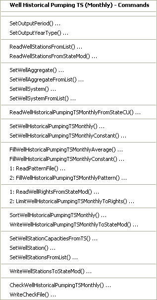
</p>**

**<p style="text-align: center;">
Commands / Well Station Data / Well Historical Pumping TS Monthly Menu (<a href="../Menu_Commands_StateMod_WellHistoricalPumpingTSMonthly.png">see also the full-size image</a>)
</p>**

The following table summarizes the use of each command.

**<p style="text-align: center;">
Well Historical Pumping TS (Monthly) Commands
</p>**

| **Command**&nbsp;&nbsp;&nbsp;&nbsp;&nbsp;&nbsp;&nbsp;&nbsp;&nbsp;&nbsp;&nbsp;&nbsp;&nbsp;&nbsp;&nbsp;&nbsp;&nbsp;&nbsp;&nbsp;&nbsp;&nbsp;&nbsp;&nbsp;&nbsp;&nbsp;&nbsp;&nbsp;&nbsp;&nbsp;&nbsp;&nbsp;&nbsp;&nbsp;&nbsp;&nbsp;&nbsp;&nbsp;&nbsp;&nbsp;&nbsp;&nbsp;&nbsp;&nbsp;&nbsp;&nbsp;&nbsp;&nbsp;&nbsp;&nbsp;&nbsp;&nbsp;&nbsp;&nbsp;&nbsp;&nbsp;&nbsp;&nbsp;&nbsp;&nbsp;&nbsp;&nbsp;&nbsp;&nbsp;&nbsp;&nbsp;&nbsp;&nbsp;&nbsp;&nbsp;&nbsp;&nbsp;&nbsp;&nbsp;&nbsp;&nbsp;&nbsp; | **Description** |
| -- | -- |
| [`SetOutputPeriod`](../command-ref/SetOutputPeriod/SetOutputPeriod.md) | Set the output period.  Time series are automatically extended to this period if necessary. |
| [`SetOutputYearType`](../command-ref/SetOutputYearType/SetOutputYearType.md) | Set the output year type, which is used when writing the files and for determining the monthly efficiency order in station data. |
| [`ReadWellStationsFromList`](../command-ref/ReadWellStationsFromList/ReadWellStationsFromList.md) | Read from a delimited file the list of well stations to be included in the dataset. |
| [`ReadWellStationsFromStateMod`](../command-ref/ReadWellStationsFromStateMod/ReadWellStationsFromStateMod.md) | Read from a StateMod well stations file the list of well stations to be included in the dataset. |
| [`SetWellAggregate`](../command-ref/SetWellAggregate/SetWellAggregate.md) | Specify that a well station is an aggregate and define its parts. |
| [`SetWellAggregateFromList`](../command-ref/SetWellAggregateFromList/SetWellAggregateFromList.md) | Specify that one or more well stations are aggregates and define their parts, using a delimited list file. |
| [`SetWellSystem`](../command-ref/SetWellSystem/SetWellSystem.md) | Specify that a well station is a system and define its parts. |
| [`SetWellSystemFromList`](../command-ref/SetWellSystemFromList/SetWellSystemFromList.md) | Specify that one or more well stations are systems and define their parts, using a delimited list file. |
| [`ReadWellHistoricalPumpingTSMonthlyFromStateCU`](../command-ref/ReadWellHistoricalPumpingTSMonthlyFromStateCU/ReadWellHistoricalPumpingTSMonthlyFromStateCU.md) | Read well historical pumping time series (monthly) from a StateCU results file (StateMod time series format), when directly manipulating an existing file. |
| [`SetWellHistoricalPumpingTSMonthly`](../command-ref/SetWellHistoricalPumpingTSMonthly/SetWellHistoricalPumpingTSMonthly.md) | Set the data for a well historical pumping time series (monthly).  This cannot be used to set the data for an aggregate/system part (only the aggregate/system total can be set). |
| [`SetWellHistoricalPumpingTSMonthlyConstant`](../command-ref/SetWellHistoricalPumpingTSMonthlyConstant/SetWellHistoricalPumpingTSMonthlyConstant.md) | Set the data for a well historical pumping time series (monthly) to a constant value.  This cannot be used to set the data for an aggregate/system part (only the aggregate/system total can be set). |
| [`FillWellHistoricalPumpingTSMonthlyAverage`](../command-ref/FillWellHistoricalPumpingTSMonthlyAverage/FillWellHistoricalPumpingTSMonthlyAverage.md) | Fill missing data in well historical pumping time series (monthly) to the historical monthly average values.  If an aggregate/system, the historical average is computed from the total. |
| [`FillWellHistoricalPumpingTSMonthlyConstant`](../command-ref/FillWellHistoricalPumpingTSMonthlyConstant/FillWellHistoricalPumpingTSMonthlyConstant.md) | Fill missing data in well historical pumping time series (monthly) to a constant value. |
| [`ReadPatternFile`](../command-ref/ReadPatternFile/ReadPatternFile.md) | Read the pattern file used with FillWellHistoricalPumpingTSMonthlyPattern() commands. |
| [`FillWellHistoricalPumpingTSMonthlyPattern`](../command-ref/FillWellHistoricalPumpingTSMonthlyPattern/FillWellHistoricalPumpingTSMonthlyPattern.md) | Fill missing data in well historical pumping time series (monthly) to the monthly average values, using wet/dry/average values. |
| [`ReadWellRightsFromStateMod`](../command-ref/ReadWellRightsFromStateMod/ReadWellRightsFromStateMod.md) | Read well rights from a StateMod file, used to limit the time series to rights. |
| [`LimitWellHistoricalPumpingTSMonthlyToRights`](../command-ref/LimitWellHistoricalPumpingTSMonthlyToRights/LimitWellHistoricalPumpingTSMonthlyToRights.md) | Limit the well historical pumping time series (monthly) to the water rights that were available at each point in time. |
| [`SortWellHistoricalPumpingTSMonthly`](../command-ref/SortWellHistoricalPumpingTSMonthly/SortWellHistoricalPumpingTSMonthly.md) | Sort the well historical pumping time series (monthly).  This is useful to force consistency between files. |
| [`WriteWellHistoricalPumpingTSMonthlyToStateMod`](../command-ref/WriteWellHistoricalPumpingTSMonthlyToStateMod/WriteWellHistoricalPumpingTSMonthlyToStateMod.md) | Write well historical pumping time series (monthly) to a StateMod file. |
| [`SetWellStationCapacitiesFromTS`](../command-ref/SetWellStationCapacitiesFromTS/SetWellStationCapacitiesFromTS.md) | Set well station capacities from historical pumping time series maximum values, to update the well station data. |
| [`SetWellStation`](../command-ref/SetWellStation/SetWellStation.md) | Set well station data (for example to override capacities from time series). |
| [`SetWellStationsFromList`](../command-ref/SetWellStationsFromList/SetWellStationsFromList.md) | Set well station data (for example to override capacities from time series). |
| [`WriteWellStationsToStateMod`](../command-ref/WriteWellStationsToStateMod/WriteWellStationsToStateMod.md) | Write well stations to a StateMod file (if the stations have been updated). |
| [`CheckWellHistoricalPumpingTSMonthly`](../command-ref/CheckWellHistoricalPumpingTSMonthly/CheckWellHistoricalPumpingTSMonthly.md) | Check well historical pumping time series data for problems. |
| [`WriteCheckFile`](../command-ref/WriteCheckFile/WriteCheckFile.md) | Write the results of data checks to a file. |

### Well Historical Pumping Time Series (Daily) ###

StateDMI does not process daily well pumping time series.
Instead, use StateCU output, TSTool, a spreadsheet, or other software to prepare the time series file.

### Well Demand Time Series (Monthly) ###

Well demand time series (monthly) correspond to each well station, using the station identifier to relate the data.
Demands for well stations that supplement diversion stations are typically associated
with the diversion stations and are processed by commands described in the
[Diversion Demand Time Series (Monthly)](#diversion-demand-time-series-monthly) section).

The following example TSTool file illustrates how historical well pumping time
series can be used for the historical demand case (from the preliminary South Platte `Sp2008L` dataset):

```
#
# Wells_Wem.TsTool; command used to create a historic well demand file
# from a historic pumpinng file
SetOutputPeriod(OutputStart="1950-01",OutputEnd="2006-12")
ReadStateMod(InputFile="Sp2008L.weh")
#
SortTimeSeries()
WriteStateMod(TSList=AllTS,OutputFile="Sp2008L.wem")
WriteStateMod(TSList=AllTS,OutputFile="..\StateMod\Historic\Sp2008L.wem")
CheckTimeSeries(CheckCriteria="Missing")
WriteCheckFile(OutputFile="Sp2008L_WEH.TSTool.check.html")
```

StateDMI also provides commands to process the well demand time series,
should an approach different from the above be required.
The ***Commands / Well Data / Well Demand TS (Monthly)*** menus insert commands to
process well demand time series (monthly) data (and optionally the well stations file, to save estimated efficiencies):

**<p style="text-align: center;">
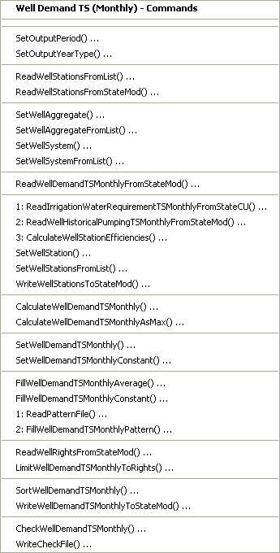
</p>**

**<p style="text-align: center;">
Commands / Well Station Data / Well Demand TS Monthly Menu (<a href="../Menu_Commands_StateMod_WellDemandTSMonthly.png">see also the full-size image</a>)
</p>**

The following table summarizes the use of each command:

**<p style="text-align: center;">
Well Demand Time Series (Monthly) Commands
</p>**

| **Command**&nbsp;&nbsp;&nbsp;&nbsp;&nbsp;&nbsp;&nbsp;&nbsp;&nbsp;&nbsp;&nbsp;&nbsp;&nbsp;&nbsp;&nbsp;&nbsp;&nbsp;&nbsp;&nbsp;&nbsp;&nbsp;&nbsp;&nbsp;&nbsp;&nbsp;&nbsp;&nbsp;&nbsp;&nbsp;&nbsp;&nbsp;&nbsp;&nbsp;&nbsp;&nbsp;&nbsp;&nbsp;&nbsp;&nbsp;&nbsp;&nbsp;&nbsp;&nbsp;&nbsp;&nbsp;&nbsp;&nbsp;&nbsp;&nbsp;&nbsp;&nbsp;&nbsp;&nbsp;&nbsp;&nbsp;&nbsp;&nbsp;&nbsp;&nbsp;&nbsp;&nbsp;&nbsp;&nbsp;&nbsp;&nbsp;&nbsp;&nbsp;&nbsp;&nbsp;&nbsp;&nbsp;&nbsp;&nbsp;&nbsp;&nbsp;&nbsp;&nbsp;&nbsp;&nbsp;&nbsp;&nbsp;&nbsp;&nbsp;&nbsp;&nbsp;&nbsp; | **Description** |
| -- | -- |
| [`SetOutputPeriod`](../command-ref/SetOutputPeriod/SetOutputPeriod.md) | Set the output period.  Time series are automatically extended to this period if necessary. |
| [`SetOutputYearType`](../command-ref/SetOutputYearType/SetOutputYearType.md) | Set the output year type, which is used when writing the files. |
| [`ReadWellStationsFromList`](../command-ref/ReadWellStationsFromList/ReadWellStationsFromList.md) | Read from a delimited file the list of well stations to be included in the dataset. |
| [`ReadWellStationsFromStateMod`](../command-ref/ReadWellStationsFromStateMod/ReadWellStationsFromStateMod.md) | Read from a StateMod well stations file the list of well stations to be included in the dataset. |
| [`SetWellAggregate`](../command-ref/SetWellAggregate/SetWellAggregate.md) | Specify that a well station is an aggregate and define its parts. |
| [`SetWellAggregateFromList`](../command-ref/SetWellAggregateFromList/SetWellAggregateFromList.md) | Specify that one or more well stations are aggregates and define their parts, using a delimited list file. |
| [`SetWellSystem`](../command-ref/SetWellSystem/SetWellSystem.md) | Specify that a well station is a system and define its parts. |
| [`SetWellSystemFromList`](../command-ref/SetWellSystemFromList/SetWellSystemFromList.md) | Specify that one or more well stations are systems and define their parts, using a delimited list file. |
| [`ReadWellDemandTSMonthlyFromStateMod`](../command-ref/ReadWellDemandTSMonthlyFromStateMod/ReadWellDemandTSMonthlyFromStateMod.md) | Read the well demand time series from a StateMod file (if manipulating an existing file). |
| [`ReadIrrigationWaterRequirementTSMonthlyFromStateCU`](../command-ref/ReadIrrigationWaterRequirementTSMonthlyFromStateCU/ReadIrrigationWaterRequirementTSMonthlyFromStateCU.md) | Read irrigation water requirement (IWR) time series generated by the StateCU model. |
| [`ReadWellHistoricalPumpingTSMonthlyFromStateMod`](../command-ref/ReadWellHistoricalPumpingTSMonthlyFromStateMod/ReadWellHistoricalPumpingTSMonthlyFromStateMod.md) | Read well historical pumping time series (monthly) from a StateMod file (can also read a StateCU file). |
| [`CalculateWellStationEfficiencies`](../command-ref/CalculateWellStationEfficiencies/CalculateWellStationEfficiencies.md) | Calculate well station average efficiencies as IWR/Diversions. |
| [`SetWellStation`](../command-ref/SetWellStation/SetWellStation.md) | Set well station data, in particular efficiency data, to override the result from the previous command. |
| [`SetWellStationsFromList`](../command-ref/SetWellStationsFromList/SetWellStationsFromList.md) | Set well station data from a delimited file, in particular efficiency data, to override the result from the previous command. |
| [`WriteWellStationsToStateMod`](../command-ref/WriteWellStationsToStateMod/WriteWellStationsToStateMod.md) | Write well stations to StateMod – the data will include updated average efficiencies. |
| [`CalculateWellDemandTSMonthly`](../command-ref/CalculateWellDemandTSMonthly/CalculateWellDemandTSMonthly.md) | Calculate the well demand time series (monthly) using IWR/Effave and historical pumping time series. |
| [`CalculateWellDemandTSMonthlyAsMax`](../command-ref/CalculateWellDemandTSMonthlyAsMax/CalculateWellDemandTSMonthlyAsMax.md) | Calculate the well demand time series (monthly) as the maximum of the demand (see previous command) and the well historical pumping time series. |
| [`SetWellDemandTSMonthly`](../command-ref/SetWellDemandTSMonthly/SetWellDemandTSMonthly.md) | Set the data for a well demand time series (monthly).  This cannot be used to set the data for an aggregate/system part (only the aggregate/system total can be set). |
| [`SetWellDemandTSMonthlyConstant`](../command-ref/SetWellDemandTSMonthlyConstant/SetWellDemandTSMonthlyConstant.md) | Set the data for a well demand time series (monthly) to monthly constant values.  This cannot be used to set the data for an aggregate/system part (only the aggregate/system total can be set). |
| [`FillWellDemandTSMonthlyAverage`](../command-ref/FillWellDemandTSMonthlyAverage/FillWellDemandTSMonthlyAverage.md) | Fill missing data in well demand time series (monthly) to the monthly average values.  If an aggregate/system, the average is computed from the total. |
| [`FillWellDemandTSMonthlyConstant`](../command-ref/FillWellDemandTSMonthlyConstant/FillWellDemandTSMonthlyConstant.md) | Fill missing data in well demand time series (monthly) to a constant value. |
| [`ReadPatternFile`](../command-ref/ReadPatternFile/ReadPatternFile.md) | Read the pattern file used with [`FillWellDemandTSMonthlyPattern`](../command-ref/FillWellDemandTSMonthlyPattern/FillWellDemandTSMonthlyPattern.md) commands. |
| [`FillWellDemandTSMonthlyPattern`](../command-ref/FillWellDemandTSMonthlyPattern/FillWellDemandTSMonthlyPattern.md) | Fill missing data in well demand time series (monthly) to the monthly average values, using wet/dry/average values. |
| [`ReadWellRightsFromStateMod`](../command-ref/ReadWellRightsFromStateMod/ReadWellRightsFromStateMod.md) | Read well rights from a StateMod file, used to limit the time series to rights. |
| [`LimitWellDemandTSMonthlyToRights`](../command-ref/LimitWellDemandTSMonthlyToRights/LimitWellDemandTSMonthlyToRights.md) | Limit the well demand time series (monthly) to the water rights that were available at each point in time. |
| [`SortWellDemandTSMonthly`](../command-ref/SortWellDemandTSMonthly/SortWellDemandTSMonthly.md) | Sort the well demand time series (monthly).  This is useful to force consistency between files. |
| [`WriteWellDemandTSMonthlyToStateMod`](../command-ref/WriteWellDemandTSMonthlyToStateMod/WriteWellDemandTSMonthlyToStateMod.md) | Write well demand time series (monthly) to a StateMod file. |
| [`CheckWellDemandTSMonthly`](../command-ref/CheckWellDemandTSMonthly/CheckWellDemandTSMonthly.md) | Check well demand time series data for problems. |
| [`WriteCheckFile`](../command-ref/WriteCheckFile/WriteCheckFile.md) | Write the results of data checks to a file. |

### Irrigation Practice Time Series (Yearly) ###

The irrigation practice time series for well and diversion stations is
typically copied from the StateCU data files or the StateCU file is directly referenced.

### Consumptive Water Requirement (Monthly, Daily) ###

The consumptive water requirement for well and diversion stations is typically
copied from the StateCU output or the StateCU file is directly referenced.

### Soil Moisture Time Series (Yearly) ###

The soil moisture time series are stored in the same file as for diversion stations.
See the StateMod documentation for more information.

## Stream Estimate Data ##

Stream estimate data consists of:

* Stream estimate stations
* Stream estimate coefficients
* Natural flow time series (monthly, daily)

Each of the above data types is stored in a separate file,
using the stream estimate station identifier as the primary identifier.
Stream estimate stations correspond to locations where historical data are not available,
and instead streamflow is estimated by prorating gaged flows from other locations.
StateMod now supports separate stream gage (see the [Stream Gage Data](#stream-gage-data) section) and stream estimate data;
however, stream estimate stations are often still mixed with stream gage stations
in one station file (`*.ris`),
and stream estimate stations are indicated by stations that have data in the stream estimate coefficients file.
Stream estimate stations can correspond to existing diversion, reservoir,
or well nodes, or can correspond to the “other” node type,
which will only have data in the network file and the stream estimate files.
In other words, a stream estimate “station” is a modeling term but does not
correspond to a typical station at which measurements are recorded.
It is possible that a stream gage station has insufficient historical
data to serve as a true stream gage but the location of the gage is important in the model.
In this situation, the stream gage should not be identified as a flow node
in the network but should instead be identified as an “other” node type that is also a natural flow node.
To support previous modeling conventions,
StateDMI allows combined stream gage/estimate stations lists in the stream stations file (`*.ris`).

### Stream Estimate Stations ###

The ***Commands / Stream Estimate Data / Stream Estimate Stations*** menus insert
commands to process stream estimate station data
(in general, the features are very similar to the stream gage stations):

**<p style="text-align: center;">
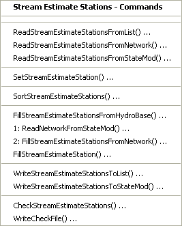
</p>**

**<p style="text-align: center;">
Commands / Stream Estimate Station Data / Stream Estimate Stations Menu (<a href="../Menu_Commands_StateMod_StreamEstimateStations.png">see also the full-size image</a>)
</p>**

The following table summarizes the use of each command:

**<p style="text-align: center;">
Stream Estimate Station Commands
</p>**

| **Command**&nbsp;&nbsp;&nbsp;&nbsp;&nbsp;&nbsp;&nbsp;&nbsp;&nbsp;&nbsp;&nbsp;&nbsp;&nbsp;&nbsp;&nbsp;&nbsp;&nbsp;&nbsp;&nbsp;&nbsp;&nbsp;&nbsp;&nbsp;&nbsp;&nbsp;&nbsp;&nbsp;&nbsp;&nbsp;&nbsp;&nbsp;&nbsp;&nbsp;&nbsp;&nbsp;&nbsp;&nbsp;&nbsp;&nbsp;&nbsp;&nbsp;&nbsp;&nbsp;&nbsp;&nbsp;&nbsp;&nbsp;&nbsp;&nbsp;&nbsp;&nbsp;&nbsp;&nbsp;&nbsp;&nbsp;&nbsp;&nbsp;&nbsp;&nbsp;&nbsp;&nbsp;&nbsp; | **Description** |
| -- | -- |
| [`ReadStreamEstimateStationsFromList`](../command-ref/ReadStreamEstimateStationsFromList/ReadStreamEstimateStationsFromList.md) | Read from a delimited list file the list of stream estimate stations to be included in the dataset. |
| [`ReadStreamEstimateStationsFromNetwork`](../command-ref/ReadStreamEstimateStationsFromNetwork/ReadStreamEstimateStationsFromNetwork.md) | Read from a StateMod network file a list of stream estimate stations to be included in the dataset. |
| [`ReadStreamEstimateStationsFromStateMod`](../command-ref/ReadStreamEstimateStationsFromStateMod/ReadStreamEstimateStationsFromStateMod.md) | Read from a StateMod stream estimate stations file the list of stream estimate stations to be included in the dataset. |
| [`SetStreamEstimateeStation`](../command-ref/SetStreamEstimateeStation/SetStreamEstimateeStation.md) | Set the data for, and optionally add, stream estimate stations. |
| [`SortStreamEstimateStations`](../command-ref/SortStreamEstimateStations/SortStreamEstimateStations.md) | Sort the stream estimate stations.  This is useful to force consistency between files. |
| [`FillStreamEstimateStationsFromHydroBase`](../command-ref/FillStreamEstimateStationsFromHydroBase/FillStreamEstimateStationsFromHydroBase.md) | Fill missing data for defined stream estimate stations, using data from HydroBase.  For example, retrieve the station names. |
| [`ReadNetworkFromStateMod`](../command-ref/ReadNetworkFromStateMod/ReadNetworkFromStateMod.md) | Read the network file, providing data for the [`FillStreamEstimateStationsFromNetwork`](../command-ref/FillStreamEstimateStationsFromNetwork/FillStreamEstimateStationsFromNetwork.md) command. |
| [`FillStreamEstimateStationsFromNetwork`](../command-ref/FillStreamEstimateStationsFromNetwork/FillStreamEstimateStationsFromNetwork.md) | Fill missing data for defined stream estimate stations, using data from a StateMod network file.  This is useful when the station names are not found in HydroBase and numerous [`SetStreamEstimateStation`](../command-ref/SetStreamEstimateStation/SetStreamEstimateStation.md) commands would otherwise be required. |
| [`FillStreamEstimateStation`](../command-ref/FillStreamEstimateStation/FillStreamEstimateStation.md) | Fill missing data for defined stream estimate stations, user user-supplied values. |
| [`WriteStreamEstimateStationsToList`](../command-ref/WriteStreamEstimateStationsToList/WriteStreamEstimateStationsToList.md) | Write defined stream estimate stations to a delimited file. |
| [`WriteStreamEstimateStationsToStateMod`](../command-ref/WriteStreamEstimateStationsToStateMod/WriteStreamEstimateStationsToStateMod.md) | Write defined stream estimate stations to a StateMod file. |
| [`CheckStreamEstimateStations`](../command-ref/CheckStreamEstimateStations/CheckStreamEstimateStations.md) | Check stream estimate station data for problems. |
| [`WriteCheckFile`](../command-ref/WriteCheckFile/WriteCheckFile.md) | Write the results of data checks to a file. |

An example command file to create the stream estimate station file is shown below
(adapted from Rio Grande dataset but not implemented in production because a combined gage/estimate
`*.ris` file was used, note that some comments indicate the stations that are present in the stream gage station file):

```
# Create the Rio Grande Stream Estimate Stations File
#
# Note some stations that were in the original RIS file are now in the SES file.
#
#
ReadStreamEstimateStationsFromNetwork(InputFile="..\StateMod\rgTW.net")
#
# Fill in the name from HydroBase...
#
FillStreamEstimateStationsFromHydroBase(ID="*",NameFormat="StationName_NodeType")
# Set specific data, including name and daily ID overrides.
#
# Set key gages to include actual daily observations
#
/* Stream gages are in the RIS
SetStreamGageStation(ID="08213500",Name="RG:THIRTYMILEBRG",DailyID="08213500",IfNotFound=Warn)
... similar commands omitted...
*/
#
# Set these key gages to use higer gages (less depletion) in the estimation
# of baseflows
#
/* Stream gages are in the RIS
SetStreamGageStation(ID="08221500",Name="RG:MONTEVISTA",DailyID="08220000",IfNotFound=Warn)
...similar commands omitted...
*/
#
# Set all diversion point flow stations to key gages in their water districts
#
SetStreamEstimateStation(ID="20*",DailyID="08220000",IfNotFound=Warn)
...similar commands omitted...
# Set gage flow stations to key gages in their general area
/* Stream gages are in the RIS
SetStreamGageStation(ID="08214500",Name="NCLEAR:BLWCONTRES",DailyID="08220000",IfNotFound=Warn)
...similar commands omitted...
*/
SetStreamEstimateStation(ID="VenAbvSan",Name="VenteroFlowAboveS",DailyID="08242500",IfNotFound=Warn)
/* Stream gages are in the RIS
SetStreamGageStation(ID="08250000",Name="CULEBRA:SANLUIS",DailyID="08242500",IfNotFound=Warn)
...similar commands omitted...
#
SetStreamGageStation(ID="McIntyreSpr",Name="MCINTYRESPRINGS",DailyID="0",IfNotFound=Warn)
...similar commands omitted...
*/
SetStreamEstimateStation(ID="BrkCrBFL",Name="BROOKCREEK",DailyID="08227500",IfNotFound=Warn)
...similar commands omitted...
# Set all no flow nodes to use zero daily ID
/* Stream gages are in the RIS
SetStreamGageStation(ID="ROCKCRNF",Name="ROCKCRK-NF",DailyID=0,IfNotFound=Warn)
...similar commands omitted...
*/
# Fill in the name from the network (anthing not filled or set above)...
#
FillStreamEstimateStationsFromNetwork(ID="*",NameFormat="StationName_NodeType")
# Write the output...
WriteStreamEstimateStationsToStateMod(OutputFile="..\StateMod\rgTW.ses",WriteHow="OverwriteFile")
CheckStreamEstimateStations(ID=”*”)
WriteCheckFile(OutputFile=”ses.commands.StateDMI.check.html”)
```

An example command file to create a combined stream gage/estimate stations
file is shown in the [Stream Gage Data](#stream-gage-data) section.

### Stream Estimate Coefficients ####

The stream estimate coefficients data indicate information to estimate
natural streamflow at ungaged locations, by prorating flows at stream gages.
Each stream estimate station has data in the stream estimate coefficients file.
Proration factors may be any coefficient but are generally developed from drainage area and precipitation data.
During model calibration, the proration factors may be modified using
[`SetStreamEstimateCoefficients`](../command-ref/SetStreamEstimateCoefficients/SetStreamEstimateCoefficients.md) commands.

The ***Commands / Stream Estimate Data / Stream Estimate Coefficients*** menus insert commands to process stream estimate coefficient data:

**<p style="text-align: center;">
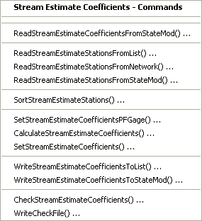
</p>**

**<p style="text-align: center;">
Commands / Stream Estimate Station Data / Stream Estimate Coefficients Menu (<a href="../Menu_Commands_StateMod_StreamEstimateCoefficients.png">see also the full-size image</a>)
</p>**

Note that although the stream estimate stations are the primary
data component related to stream estimate coefficients,
the list of stream estimate stations is typically read from the network.
This is because the network file includes data necessary to process the coefficients,
including upstream/downstream relationships and the `area*precipitation` information.
Area and precipitation data are typically developed using GIS tools – currently StateDMI does not estimate these values.

The area and precipitation data provided at a stream gage station represents
the total area and average precipitation for that drainage area.
The area and precipitation provided at a stream estimate station represent the incremented
area between that station and the next upstream stream gage station.
In the following figure, the incremented area between each node is 100 units.
As presented, the total area (and the area specified in the generalized network file) is equal for the stream gage station.
At stream estimate stations (i.e., natural flow nodes, also previously called baseflow nodes),
the area is the incremental area from the upstream stream gage (or gages) to the
stream estimate station (or the headwater area if there is no upstream gage in the basin): 100 units at point 2 and 200 units at point 3.

**<p style="text-align: center;">
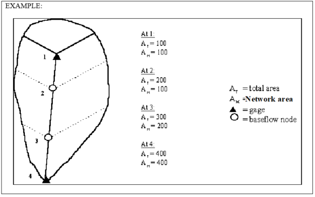
</p>**

**<p style="text-align: center;">
Gage Proration Example (<a href="../GageProrationDiagram.png">see also the full-size image</a>)
</p>**

The default method used to provide natural flow data to StateMod is the Gain Approach,
which includes two terms: the upstream gage term and the gain term.
The StateMod Users' Manual discusses this equation in detail.
The following summarizes the method StateDMI’s
[`CalculateStreamEstimateCoefficients`](../command-ref/CalculateStreamEstimateCoefficients/CalculateStreamEstimateCoefficients.md)
command uses to provide natural flow information to StateMod, using the Gain Approach.

* To estimate the gaged flow term,
StateDMI determines all of the stream gage stations that have area-precipitation
data upstream of the stream estimate station.
This results in a list of upstream stream gage stations with a
coefficient of +1 being entered on the first line of the stream estimate coefficients file.
* To estimate the gaged component of the gain term,
StateDMI identifies the downstream stream gage stations and all upstream stream gage stations.
This results in the downstream stream gage station being assigned a coefficient of
+1 and all the upstream stream gage stations being assigned a
coefficient of -1 on the second line of the stream estimate coefficients file.
* To estimate the proration factor component of the gain term,
StateDMI calculates the ratio of the incremental area-precipitation at the stream
estimate station divided by the ungaged area-precipitation (the downstream stream gage
station area-precipitation minus the upstream stream gage station area-precipitation).
* In the example above, the Gain approach results in the following at point 2:

```
	Gage term = stream gage station flow at point 1
	Gain term = 100/(400-100) * (flow (gage) at point 4 – flow (gage) at point 1).
```

The Neighboring Gage Approach is a second method that may be used
to provide baseflow data to headwater nodes only.
Like the Gain Approach, this technique includes two terms: the upstream gage term and the gain term.
Implement this approach by using
[`SetStreamEstimateCoefficientsPFGage(ID,GageID)`](../command-ref/SetStreamEstimateCoefficientsPFGage/SetStreamEstimateCoefficientsPFGage.md) commands.
The Neighboring Gage approach is commonly used at headwater stream estimate stations
to provide an ungaged hydrograph that is more representative than the hydrograph from the Gain Approach.
The following summarizes the method used by StateDMI to provide natural flow information to StateMod using the Neighboring Gage Approach:

* Because the gaged flow term is, by definition, null for a headwater node,
no upstream stream gage station values are entered on the first line of the stream estimate coefficients file.
* To estimate the gaged component of the gain term,
StateDMI provides the neighboring gage assigned by the user a coefficient of +1
on the second line of the stream estimate coefficients file.
* To estimate the proration factor component of the gain term,
StateDMI calculates the ratio of the area precipitation data provided at the natural flow node
divided by the area-precipitation at stream gage station assigned by the user.
* Assuming point 1 of the example is not a gage but instead is stream
estimate station using the Neighboring Gage Approach,
then a typical application to a headwater node at point 1 would result
in the following (if the neighboring gage selected was at point 4):

```
Gage term = none
Gain term = 100/400 * (flow (gage) at point 4)
```

Note that when the Neighboring Gage approach is applied to a headwater node,
StateDMI treats that stream estimate station as if it were a gage.
Therefore when the Neighboring Gage approach is used,
the area and precipitation data at any other stream estimate stations in the
reach must be adjusted to reflect that the aforementioned stream estimate
station has taken on the characteristics of a gage.
For the example, where point 1 was a stream estimate station that uses the Neighboring Gage approach,
the area and precipitation assigned to points 2 and 3 would be altered as if a gage existed at point 1.

For example, to tie the characteristics of stream estimate station `360345` to stream gage station `09053000`,
use the following command before the
[`CalculateStreamEstimateCoefficients`](../command-ref/CalculateStreamEstimateCoefficients/CalculateStreamEstimateCoefficients.md) command:

```
SetStreamEstimateCoefficientsPFGage(360345,09053000)
```

Use
[`SetStreamEstimateCoefficients`](../command-ref/SetStreamEstimateCoefficients/SetStreamEstimateCoefficients.md) commands,
as appropriate, to edit the calculated proration factor and coefficients.
This is particularly useful if the calculated proration factor does not accurately
represent the hydrology at that baseflow node.
For example, to adjust the proration factor for stream estimate station 384625 to 0.6:

```
SetStreamEstimateCoefficients(ID=”384625”,ProrationFactor=0.6)
```

The following table summarizes the use of each command:

**<p style="text-align: center;">
Stream Estimate Coefficients Commands
</p>**

| **Command**&nbsp;&nbsp;&nbsp;&nbsp;&nbsp;&nbsp;&nbsp;&nbsp;&nbsp;&nbsp;&nbsp;&nbsp;&nbsp;&nbsp;&nbsp;&nbsp;&nbsp;&nbsp;&nbsp;&nbsp;&nbsp;&nbsp;&nbsp;&nbsp;&nbsp;&nbsp;&nbsp;&nbsp;&nbsp;&nbsp;&nbsp;&nbsp;&nbsp;&nbsp;&nbsp;&nbsp;&nbsp;&nbsp;&nbsp;&nbsp;&nbsp;&nbsp;&nbsp;&nbsp;&nbsp;&nbsp;&nbsp;&nbsp;&nbsp;&nbsp;&nbsp;&nbsp;&nbsp;&nbsp;&nbsp;&nbsp;&nbsp;&nbsp;&nbsp;&nbsp;&nbsp;&nbsp;&nbsp;&nbsp;&nbsp;&nbsp;&nbsp;&nbsp; | **Description** |
| -- | - |
| [`ReadStreamEstimateCoefficientsFromStateMod`](../command-ref/ReadStreamEstimateCoefficientsFromStateMod/ReadStreamEstimateCoefficientsFromStateMod.md) | Read stream estimate coefficients from a StateMod file, which is useful if simple manipulation is occurring. |
| [`ReadStreamEstimateStationsFromList`](../command-ref/ReadStreamEstimateStationsFromList/ReadStreamEstimateStationsFromList.md) | Read from a delimited file a list of stream estimate stations to be included in the dataset. |
| [`ReadStreamEstimateStationsFromNetwork`](../command-ref/ReadStreamEstimateStationsFromNetwork/ReadStreamEstimateStationsFromNetwork.md) | Read from a StateMod network file a list of stream estimate stations to be included in the dataset. |
| [`ReadStreamEstimateStationsFromStateMod`](../command-ref/ReadStreamEstimateStationsFromStateMod/ReadStreamEstimateStationsFromStateMod.md) | Read from a StateMod stream estimate (or gage) stations file a list of stream estimate stations to be included in the dataset. |
| [`SortStreamEstimateStations`](../command-ref/SortStreamEstimateStations/SortStreamEstimateStations.md) | Sort the stream estimate stations.  The default when read from the network is top to bottom; however this order may be difficult to interpret or compare with other files and therefore sorting is useful. |
| [`SetStreamEstimateCoefficientsPFGage`](../command-ref/SetStreamEstimateCoefficientsPFGage/SetStreamEstimateCoefficientsPFGage.md) | Specify that the proration factor for a stream estimate station should be calculated using only the `area*precipitation` data for a specific gage, rather than the downstream node.  The station is then treated as if were a stream gage node for other base flow calculations. |
| [`CalculateStreamEstimateCoefficients`](../command-ref/CalculateStreamEstimateCoefficients/CalculateStreamEstimateCoefficients.md) | Calculate stream estimate coefficients from the network relationships and the `area*precipitation` data stored in the network for stream estimate stations. |
| [`SetStreamEstimateCoefficients`](../command-ref/SetStreamEstimateCoefficients/SetStreamEstimateCoefficients.md) | Set stream estimate coefficients, for example, if the values that were calculated need to be adjusted. |
| [`WriteStreamEstimateCoefficientssToList`](../command-ref/WriteStreamEstimateCoefficientssToList/WriteStreamEstimateCoefficientssToList.md) | Write defined stream estimate coefficients to a delimited file. |
| [`WriteStreamEstimateCoefficientssToStateMod`](../command-ref/WriteStreamEstimateCoefficientssToStateMod/WriteStreamEstimateCoefficientssToStateMod.md) | Write defined stream estimate coefficients to a StateMod file. |
| [`CheckStreamEstimateCoefficients`](../command-ref/CheckStreamEstimateCoefficients/CheckStreamEstimateCoefficients.md) | Check stream estimate coefficients data for problems. |
| [`WriteCheckFile`](../command-ref/WriteCheckFile/WriteCheckFile.md) | Write the results of data checks to a file. |

An example command file to create the stream estimate coefficients file is shown below (from the Colorado `cm2005` dataset):

```
StartLog(LogFile="rib.commands.StateDMI.log")
# rib.commands.StateDMI
#
# Creates the Stream Estimate Station Coefficient Data file
#
#  Step 1 - read river nodes from the network file and create file framework
#
ReadStreamEstimateStationsFromNetwork(InputFile="..\Network\cm2005.net")
#
#  Step 2 - set preferred gages for "neighboring" gage approach
#           this baseflow nodes are generally on smaller non-gaged tribs and have
#           different flow characteristics than next downstream gages
#
SetStreamEstimateCoefficientsPFGage(ID="360645",GageID="09055300")
SetStreamEstimateCoefficientsPFGage(ID="360801",GageID="09055300")
SetStreamEstimateCoefficientsPFGage(ID="362002",GageID="09054000")
SetStreamEstimateCoefficientsPFGage(ID="360829",GageID="09047500")
SetStreamEstimateCoefficientsPFGage(ID="381441",GageID="09075700")
SetStreamEstimateCoefficientsPFGage(ID="382013",GageID="09075700")
SetStreamEstimateCoefficientsPFGage(ID="380959",GageID="09075700")
SetStreamEstimateCoefficientsPFGage(ID="381104",GageID="09075700")
SetStreamEstimateCoefficientsPFGage(ID="BaseFlow",GageID="09091500")
SetStreamEstimateCoefficientsPFGage(ID="450632",GageID="09092600")
SetStreamEstimateCoefficientsPFGage(ID="450685",GageID="09089500")
SetStreamEstimateCoefficientsPFGage(ID="450810",GageID="09089500")
SetStreamEstimateCoefficientsPFGage(ID="450788",GageID="09089500")
SetStreamEstimateCoefficientsPFGage(ID="500601",GageID="09041200")
SetStreamEstimateCoefficientsPFGage(ID="500627",GageID="09041200")
SetStreamEstimateCoefficientsPFGage(ID="510594",GageID="09026500")
SetStreamEstimateCoefficientsPFGage(ID="510728",GageID="09032000")
SetStreamEstimateCoefficientsPFGage(ID="510941",GageID="09033500")
SetStreamEstimateCoefficientsPFGage(ID="512061",GageID="09039000")
SetStreamEstimateCoefficientsPFGage(ID="520658",GageID="09060500")
SetStreamEstimateCoefficientsPFGage(ID="522006",GageID="09060500")
SetStreamEstimateCoefficientsPFGage(ID="530883",GageID="09060500")
SetStreamEstimateCoefficientsPFGage(ID="530632",GageID="09071300")
SetStreamEstimateCoefficientsPFGage(ID="530585",GageID="09085200")
SetStreamEstimateCoefficientsPFGage(ID="531051",GageID="09085200")
SetStreamEstimateCoefficientsPFGage(ID="720649",GageID="09097500")
SetStreamEstimateCoefficientsPFGage(ID="720580",GageID="09097500")
SetStreamEstimateCoefficientsPFGage(ID="720557",GageID="09104500")
SetStreamEstimateCoefficientsPFGage(ID="09104000",GageID="09104500")
SetStreamEstimateCoefficientsPFGage(ID="09101500",GageID="09104500")
SetStreamEstimateCoefficientsPFGage(ID="953800",GageID="09097500")
SetStreamEstimateCoefficientsPFGage(ID="720816",GageID="09104500")
#
#  Step 3 - calculate stream coefficients
CalculateStreamEstimateCoefficients()
#
#  Step 4 - set proration factors directly
#
SetStreamEstimateCoefficients(ID="364512",ProrationFactor=1.000,IfNotFound=Warn)
SetStreamEstimateCoefficients(ID="374641",ProrationFactor=0.200,IfNotFound=Warn)
SetStreamEstimateCoefficients(ID="374648",ProrationFactor=0.350,IfNotFound=Warn)
SetStreamEstimateCoefficients(ID="380880",ProrationFactor=1.000,IfNotFound=Warn)
SetStreamEstimateCoefficients(ID="381594",ProrationFactor=0.800,IfNotFound=Warn)
SetStreamEstimateCoefficients(ID="384617",ProrationFactor=0.700,IfNotFound=Warn)
SetStreamEstimateCoefficients(ID="510639",ProrationFactor=1.000,IfNotFound=Warn)
SetStreamEstimateCoefficients(ID="514603",ProrationFactor=0.800,IfNotFound=Warn)
SetStreamEstimateCoefficients(ID="514620",ProrationFactor=1.000,IfNotFound=Warn)
SetStreamEstimateCoefficients(ID="510728",ProrationFactor=1.000,IfNotFound=Warn)
SetStreamEstimateCoefficients(ID="530555",ProrationFactor=0.180,IfNotFound=Warn)
SetStreamEstimateCoefficients(ID="530678",ProrationFactor=0.230,IfNotFound=Warn)
SetStreamEstimateCoefficients(ID="531082",ProrationFactor=1.000,IfNotFound=Warn)
SetStreamEstimateCoefficients(ID="954683",ProrationFactor=0.400,IfNotFound=Warn)
#
#  Step 5 - create streamflow estimate coefficient file
#
WriteStreamEstimateCoefficientsToStateMod(OutputFile="..\StateMOD\cm2005.rib")
#
# Check the results
CheckStreamEstimateCoefficients(ID="*")
WriteCheckFile(OutputFile="rib.commands.StateDMI.check.html")
```

### Stream Estimate Natural Flow Time Series (Monthly, Daily) ###

Stream estimate natural flow time series for stream estimate stations are not processed by StateDMI.
Instead, use StateMod’s baseflow module, TSTool, or other software to crate monthly and daily base flow time series files.

Refer to [Stream Natural Flow Time Series (Monthly, Daily)](#stream-natural-flow-time-series-monthly-daily) section for more information.

## River Network Data ##

River network data consists of:

* Network (used by StateDMI, StateMod GUI)
* River network (used by StateMod)

The river network file used by StateMod is a relatively simple file, containing river node identifiers,
river node name, and downstream river node.
The purpose of this file is to indicate the upstream to downstream connectivity of model nodes.
StateMod is designed to allow the river node identifiers to be different from station identifiers.
This allows, for example, multiple diversion stations to be located at the same river node.
Much of the detailed StateMod output is by river node, using river node identifiers.
However, StateDMI and the StateMod GUI enforce the convention that the river node
identifiers are the same as station identifiers in other files and allow only a single station at a river node.
This tends to minimize data errors and confusion with identifiers.
To be consistent with StateMod documentation and nomenclature,
the term “river node” is used in some parts of StateDMI where a river node
identifier is needed in addition to a station identifier.

The network data are listed after other data components in this documentation and StateDMI menus,
mainly because network data (and the operational data described in the [Operational Data](#operational-data) section)
are related to higher-level modeling concepts and do not need to be
completely addressed until other data files are created.  There are two main ways that network data will be created:

1. An existing dataset and model network are available and only minor changes to the network need to occur.
In this case, the StateDMI interface can be used to insert, delete, or modify nodes to make minor edits to the network.
Lists of stations can then be read from the network in order to process all data files.
This is the approach taken throughout the current StateDMI documentation.
2. Data files are created starting with lists of identifiers.
For example, for a new dataset, rather than developing a network file and
reading station identifiers from the network, simple delimited files with lists of identifiers are used.
These lists of station identifiers could be created by StateView or other software.
StateDMI supports this approach by allowing list files to be provided when creating station files.
Subsequent processing (e.g., for water rights and time series files), rely on the StateMod format station files.
This approach has not been fully implemented due to limited resources and because of a number of technical issues.
For example, some data file processing requires that the network file be available
(e.g., assigning default return flow locations).
Also, StateDMI does not currently provide the capability to display lists of stations
to allow upstream to downstream relationships to be defined.
This capability is planned for the future.
Consequently, the only alternative at this time is to create a model network using the StateDMI interface.
Because efforts have focused on developing StateDMI to support existing modeling efforts, option 1 is fully supported.
When the list-based approach is fully supported,
a network file would be initialized using the list data and then dataset maintenance would revert to option 1.

The generalized network file contains more data than the simple StateMod river network file:

* node locations, label position, and other information for the network diagram
* area and precipitation information used to calculate proration factors in the
stream estimate coefficients file (see [Stream Estimate Coefficients](#stream-estimate-coefficients) section)
* indicators for natural flow (stream estimate) nodes

The generalized network file was previously hand-edited and used as input to the Makenet program.
StateDMI generally allows reading the old Makenet file.
However, the new version is in XML format and allows for greater flexibility.
See [Updating an Old Makenet Network to New Format](../getting-started/getting-started.md#updating-an-old-makenet-network-to-new-format) section
for information about how to interactively convert an old network file to the new format.
These steps can also be performed using commands, as described below.
StateMod only reads the river network file.
However, the generalized network file is needed by StateDMI and StateMod GUI.
Therefore, effort should be taken to keep these files synchronized.
In general, all network editing should use the generalized network and the
StateMod river network file should be created from this file.

The processing of each data file is discussed below.

## Network (used by StateDMI, StateMod GUI) ##

These features are under development but are made available for evaluation.

The ***Commands / River Network Data / Network*** menus insert commands to process the generalized network file:

**<p style="text-align: center;">
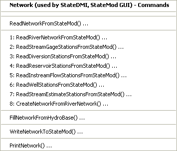
</p>**

**<p style="text-align: center;">
Commands / River Network Data / Network Menu (<a href="../Menu_Commands_StateMod_Network.png">see also the full-size image</a>)
</p>**

These commands can be used to convert a StateMod river network file to a
generalized network file – this may be necessary when StateDMI or Makenet
was not used to create the StateMod river network file.
The StateMod river network file contains limited information about nodes and
therefore information must be read from other StateMod files.
For most datasets, river network commands can be used instead (see the next section).

The following table summarizes the use of each command:

**<p style="text-align: center;">
Network Commands
</p>**

| **Command**&nbsp;&nbsp;&nbsp;&nbsp;&nbsp;&nbsp;&nbsp;&nbsp;&nbsp;&nbsp;&nbsp;&nbsp;&nbsp;&nbsp;&nbsp;&nbsp;&nbsp;&nbsp;&nbsp;&nbsp;&nbsp;&nbsp;&nbsp;&nbsp;&nbsp;&nbsp;&nbsp;&nbsp;&nbsp;&nbsp;&nbsp;&nbsp;&nbsp;&nbsp;&nbsp;&nbsp;&nbsp;&nbsp;&nbsp;&nbsp;&nbsp;&nbsp;&nbsp;&nbsp;&nbsp;&nbsp;&nbsp;&nbsp;&nbsp;&nbsp;&nbsp;&nbsp;&nbsp;&nbsp;&nbsp;&nbsp;&nbsp;&nbsp;&nbsp;&nbsp; | **Description** |
| -- | -- |
| [`ReadNetworkFromStateMod`](../command-ref/ReadNetworkFromStateMod/ReadNetworkFromStateMod.md) | Read the generalized network from an XML network file (for manipulation). |
| [`ReadRiverNetworkFromStateMod`](../command-ref/ReadRiverNetworkFromStateMod/ReadRiverNetworkFromStateMod.md) | Read the river network from a StateMod river network file. |
| [`ReadStreamGageStationsFromStateMod`](../command-ref/ReadStreamGageStationsFromStateMod/ReadStreamGageStationsFromStateMod.md) | Read stream gage stations from a StateMod stream gage stations file. |
| [`ReadDiversionStationsFromStateMod`](../command-ref/ReadDiversionStationsFromStateMod/ReadDiversionStationsFromStateMod.md) | Read diversion stations from a StateMod diversion stations file. |
| [`ReadReservoirStationsFromStateMod`](../command-ref/ReadReservoirStationsFromStateMod/ReadReservoirStationsFromStateMod.md) | Read reservoir stations from a StateMod reservoir stations file. |
| [`ReadInstreamFlowStationsFromStateMod`](../command-ref/ReadInstreamFlowStationsFromStateMod/ReadInstreamFlowStationsFromStateMod.md) | Read instream flow stations from a StateMod instream flow stations file. |
| [`ReadWellStationsFromStateMod`](../command-ref/ReadWellStationsFromStateMod/ReadWellStationsFromStateMod.md) | Read well stations from a StateMod well stations file. |
| [`ReadStreamEstimateStationsFromStateMod`](../command-ref/ReadStreamEstimateStationsFromStateMod/ReadStreamEstimateStationsFromStateMod.md) | Read stream estimate stations from a StateMod stream estimate stations file. |
| [`CreateNetworkFromRiverNetwork`](../command-ref/CreateNetworkFromRiverNetwork/CreateNetworkFromRiverNetwork.md) | Create the generalized network from the StateMod river network and information from stations files. |
| [`FillNetworkFromHydroBase`](../command-ref/FillNetworkFromHydroBase/FillNetworkFromHydroBase.md) | Fill missing network information using HydroBase. |
| [`WriteNetworkToStateMod`](../command-ref/WriteNetworkToStateMod/WriteNetworkToStateMod.md) | Write the generalized network to a StateMod XML network file. |
| [`PrintNetwork`](../command-ref/PrintNetwork/PrintNetwork.md) | Print all or a subset of the network diagram. |

An example command file to create the generalized network
file is shown below (contrived example not validated in production):

```
# This commands file creates a generalized network file from an existing
# StateMod network file (RIN).
#
ReadRiverNetworkFromStateMod("..\StateMod\rgTW_orig.rin")
ReadStreamGageStationsFromStateMod("..\StateMod\rgTW.ris")
ReadDiversionStationsFromStateMod("..\StateMod\rgTW.dds")
ReadReservoirStationsFromStateMod("..\StateMod\rgTW.res")
ReadInstreamFlowStationsFromStateMod("..\StateMod\rgTW.ifs")
ReadWellStationsFromStateMod("..\StateMod\rgTW.wes")
ReadStreamEstimateStationsFromStateMod("..\StateMod\rgTW.ses")
CreateNetworkFromRiverNetwork()
FillNetworkFromHydroBase(LocationEstimate="Interpolate")
WriteNetworkToStateMod(OutputFile="..\StateMod\rgtw.net",WriteHow="OverwriteFile")
```

After the above commands are run, the resulting network file can be edited with
the network editor to add stream labels, adjust node positions as necessary,
and specify area/precipitation data that can be used when processing stream estimate coefficients.

### River Network (used by StateMod) ###

The ***Commands / River Network Data / River Network*** menus insert commands to process the StateMod river network file:

**<p style="text-align: center;">
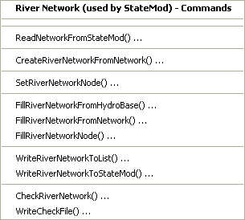
</p>**

**<p style="text-align: center;">
Commands / River Network Data / River Network Menu (<a href="../Menu_Commands_StateMod_RiverNetwork.png">see also the full-size image</a>)
</p>**

These commands are used to convert the generalized network file,
which StateDMI uses for the network diagram, into the StateMod river network,
which contains a subset of the data and is used by StateMod.  The following table summarizes the use of each command:

**<p style="text-align: center;">
River Network Commands
</p>**

| **Command**&nbsp;&nbsp;&nbsp;&nbsp;&nbsp;&nbsp;&nbsp;&nbsp;&nbsp;&nbsp;&nbsp;&nbsp;&nbsp;&nbsp;&nbsp;&nbsp;&nbsp;&nbsp;&nbsp;&nbsp;&nbsp;&nbsp;&nbsp;&nbsp;&nbsp;&nbsp;&nbsp;&nbsp;&nbsp;&nbsp;&nbsp;&nbsp;&nbsp;&nbsp;&nbsp;&nbsp;&nbsp;&nbsp;&nbsp;&nbsp;&nbsp;&nbsp; | **Description** |
| -- | -- |
| [`ReadNetworkFromStateMod`](../command_ref/ReadNetworkFromStateMod/ReadNetworkFromStateMod.md) | Read the generalized network from a StateMod XML (or old Makenet) network file. |
| [`CreateRiverNetworkFromNetwork`](../command_ref/CreateRiverNetworkFromNetwork/CreateRiverNetworkFromNetwork.md) | Create the StateMod river network from the generalized network data.  Node names are not, by default taken from the network because they may have been adjusted from database names to facilitate labeling or presentation. |
| [`FillRiverNetworkFromHydroBase`](../command_ref/FillRiverNetworkFromNetwork/FillRiverNetworkFromNetwork.md) | Fill river network data (e.g., station names) from HydroBase.  This allows “official” names to be used in the river network file, rather than those used in the generalized network file. |
| [`FillRiverNetworkFromNetwork`](../command_ref/FillRiverNetworkFromNetwork/FillRiverNetworkFromNetwork.md) | Fill river network data (e.g., station names) from the generalized network.  This allows names that are not in HydroBase (e.g., from aggregate nodes) to be taken from the network file. |
| [`FillRiverNetworkNode`](../command_ref/FillRiverNetworkNode/FillRiverNetworkNode.md) | Fill river network data (e.g., station names) from user supplied values. |
| [`WriteRiverNetworkToList`](../command_ref/WriteRiverNetworkToList/WriteRiverNetworkToList.md) | Write the river network to a delimited file. |
| [`WriteRiverNetworkToStateMod`](../command_ref/WriteRiverNetworkToStateMod/WriteRiverNetworkToStateMod.md) | Write the river network to a StateMod river network file. |
| [`CheckRiverNetwork`](../command_ref/CheckRiverNetwork/CheckRiverNetwork.md) | Check river network data for problems. |
| [`WriteCheckFile`](../command_ref/WriteCheckFile/WriteCheckFile.md) | Write the results of data checks to a file. |

An example command file to create the StateMod river network file is shown below (from the Colorado `cm2005` dataset):

```
StartLog(LogFile="rin.commands.StateDMI.log")
# rin.commands.StateDMI
#
# creates the river newtork file for the Colorado River monthly/daily models
#
#  Step 1 - read river nodes from the network file and create file framework
#
ReadNetworkFromStateMod(InputFile="cm2005.net")
CreateRiverNetworkFromNetwork()
#
#  Step 2 - get node (diversion, stream stations, reservoirs, instream flows)
#           names from from HydroBase
#
FillRiverNetworkFromHydroBase(ID="*",NameFormat=StationName_NodeType)
#
#  Step 3 - read missing node names from network file
#
FillRiverNetworkFromNetwork(ID="*",NameFormat="StationName_NodeType",CommentFormat="StationID")
#
#  Step 4 - create StateMod river network file
#
WriteRiverNetworkToStateMod(OutputFile="..\StateMod\cm2005.rin")
#
# Check the results
CheckRiverNetwork(ID="*")
WriteCheckFile(OutputFile="rin.commands.StateDMI.check.html")
```

The river network file that is created by the above commands should not in general be edited further.
Instead, if changes to the model network are needed,
edit the generalized network file, using the StateDMI network editor, and regenerate the StateMod river network file.

## Operational Data ##

Operational data consist of the operational rights file (`*.opr`),
which contains unique operation criteria used within a river basin.
Operational rights are priority based and control operations such as transfers
between structures, reservoir releases, etc.
If a dataset cannot be configured to simulate a known behavior in a basin,
then a new operational right type may need to be developed.
The operational right file is generally copied from the test data or base data
and hand-edited according to the format described in the StateMod Users' Manual.

StateDMI currently does not prepare the operational rights data file.
Commands may be added in the future, in particular to allow warnings to be generated when operational rights data do not match other data.

## San Juan Sediment Recovery Plan Data ##

StateDMI currently does not prepare the San Juan Sediment Recover Plan data file.
Refer to the StateMod documentation for more information.

## Spatial Data ##

StateDMI currently does not prepare spatial data for the StateMod.
StateMod itself does not use spatial data files – the response file
includes data for GIS to support the StateMod GUI.
Standard spatial data layers from CDSS can be used with a GeoView project file (`*.gvp`)
to provide displays in the StateMod GUI.
See the GeoView Mapping Tools Appendix in the StateMod GUI Documentation for more information.

Standard ESRI shapefiles as created by GIS software can be specified in the `*.gvp` file.
For performance and display reasons, the spatial data files associated with a dataset are typically
filtered by the StateMod GUI to only contain the information related to the StateMod dataset.
Otherwise, displays may be crowded with unnecessary information and performance will suffer.
Shapefiles for stations and structures in HydroBase are available on the CDSS web site.
These shapefiles typically contain all data for a division and therefore may need
to be filtered for best performance, although it is usually possible to simply use layers generated from HydroBase.

In order to take advantage of all StateMod GUI features,
it may be necessary to create new spatial data layers for points not represented in HydroBase,
including aggregate and system nodes and also “other” nodes.
StateMod stations that are not included in standard spatial data files (e.g., aggregate structures)
can be digitized into shapefiles using standard GIS tools.
See the StateMod GUI documentation for information about configuring the layers for use in the StateMod GUI.
